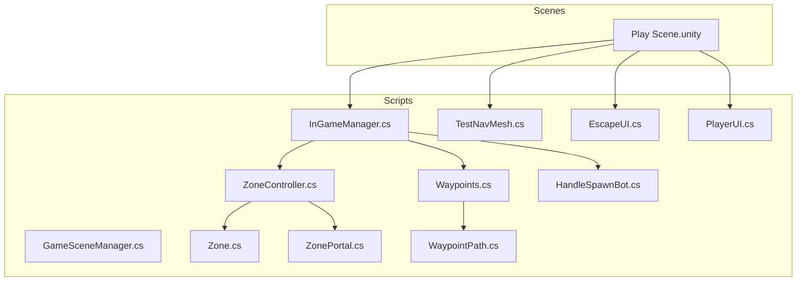
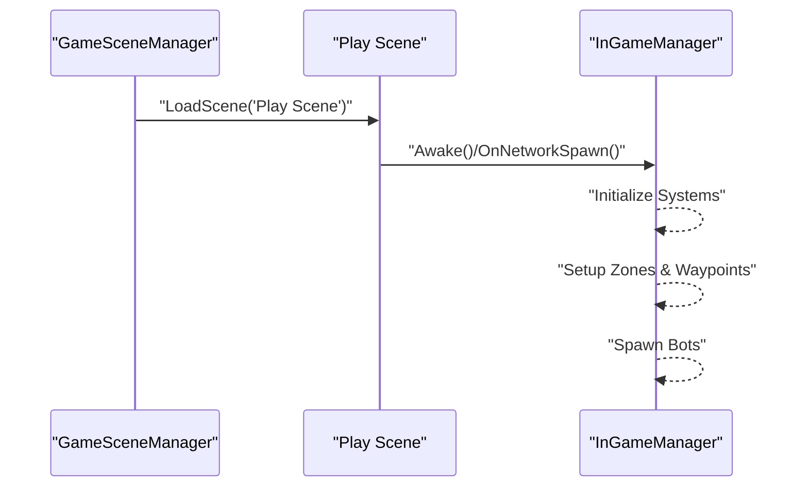
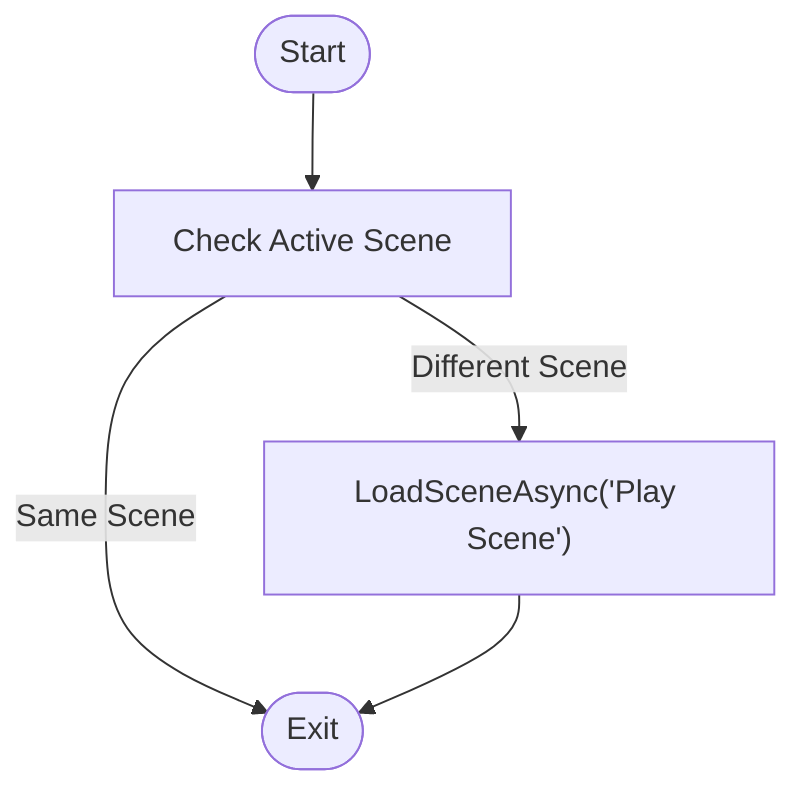
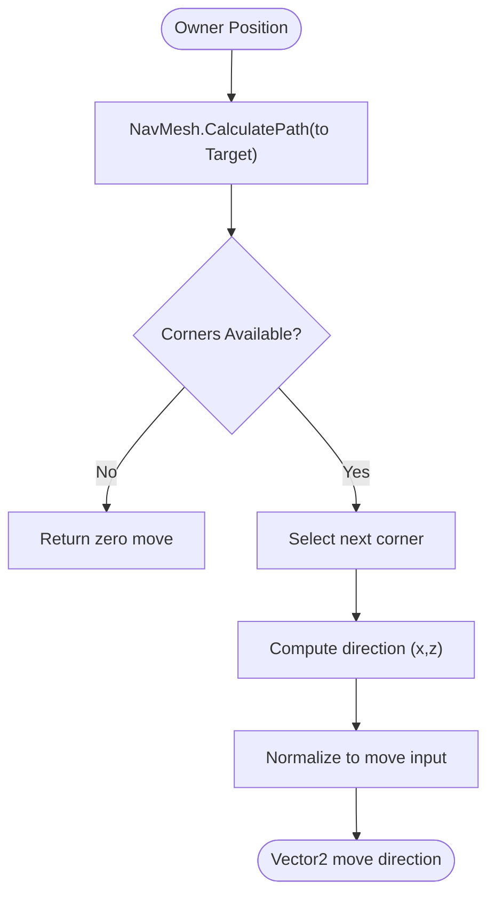
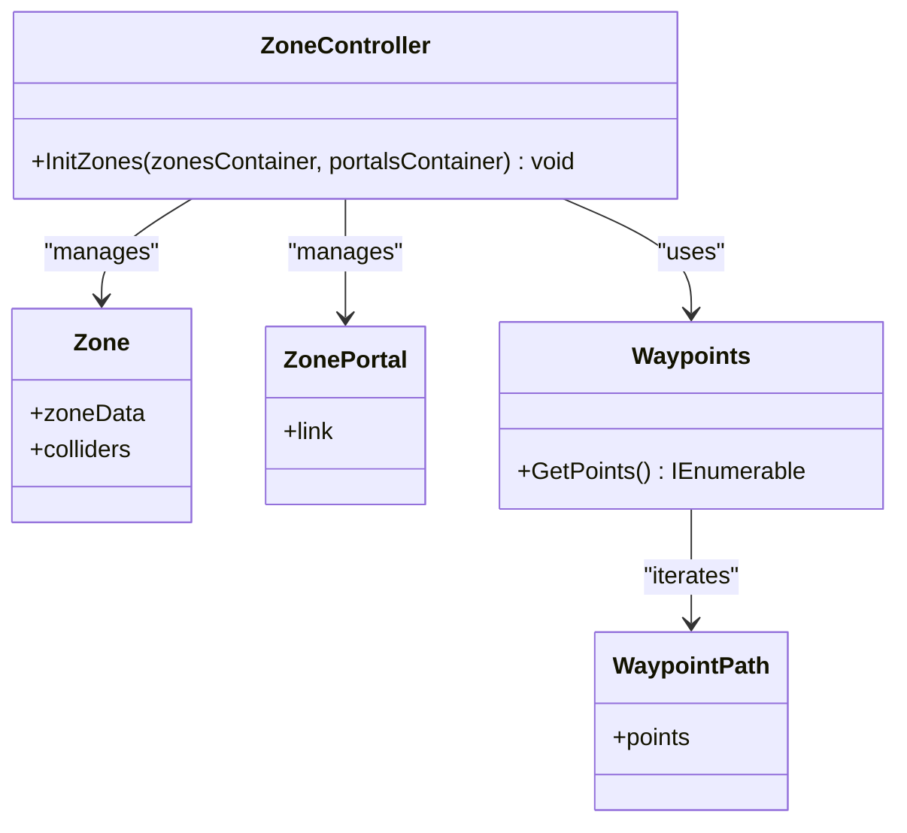
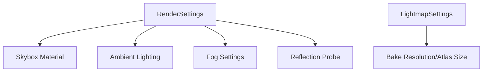
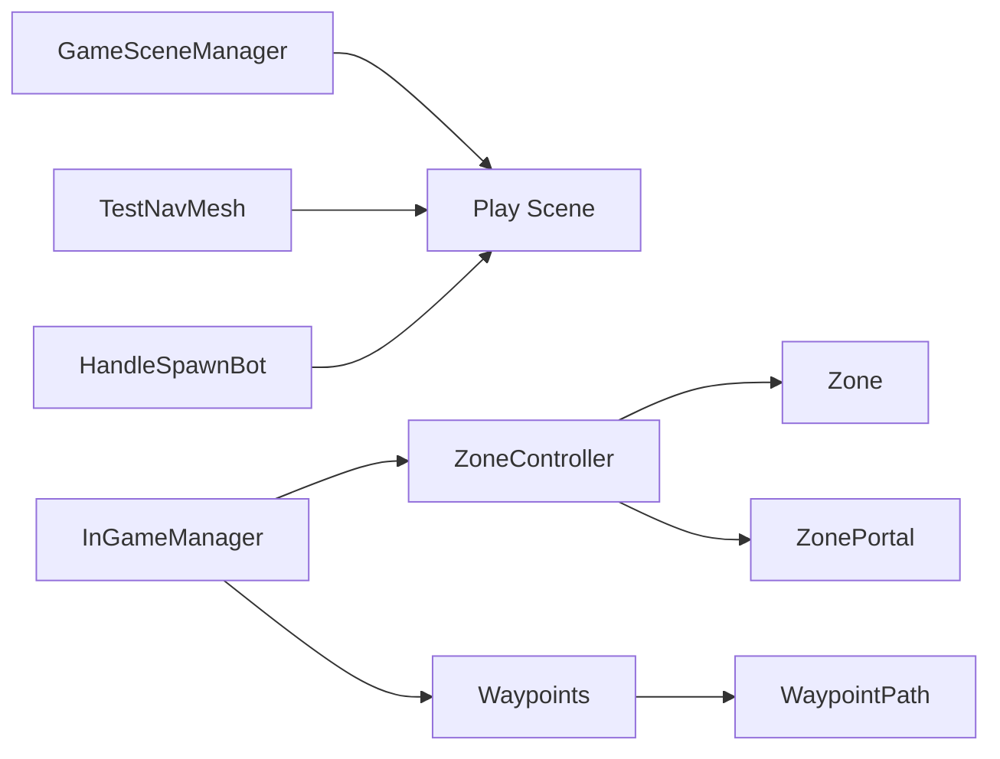

# Scenes & Environment

<cite>
**Referenced Files in This Document**
- [GameSceneManager.cs](file://Assets/FPS-Game/Scripts/GameSceneManager.cs)
- [InGameManager.cs](file://Assets/FPS-Game/Scripts/System/InGameManager.cs)
- [HandleSpawnBot.cs](file://Assets/FPS-Game/Scripts/System/HandleSpawnBot.cs)
- [EscapeUI.cs](file://Assets/FPS-Game/Scripts/Player/PlayerCanvas/EscapeUI.cs)
- [PlayerUI.cs](file://Assets/FPS-Game/Scripts/Player/PlayerUI.cs)
- [TestNavMesh.cs](file://Assets/FPS-Game/Scripts/TestNavMesh.cs)
- [Play Scene.unity](file://Assets/FPS-Game/Scenes/MainScenes/Play Scene.unity)
- [NavMesh Surface.asset](file://Assets/FPS-Game/Scenes/MainScenes/Play Scene/NavMesh-NavMesh Surface.asset)
- [NavMeshAreas.asset](file://ProjectSettings/NavMeshAreas.asset)
- [Zone.cs](file://Assets/FPS-Game/Scripts/System/Zone.cs)
- [ZoneController.cs](file://Assets/FPS-Game/Scripts/System/ZoneController.cs)
- [ZonePortal.cs](file://Assets/FPS-Game/Scripts/System/ZonePortal.cs)
- [Waypoints.cs](file://Assets/FPS-Game/Scripts/System/Waypoints.cs)
- [WaypointPath.cs](file://Assets/FPS-Game/Scripts/Bot/WaypointPath.cs)
</cite>

## Update Summary
**Changes Made**
- Updated project structure documentation to reflect simplified architecture with single Play scene
- Removed references to Sign In, Lobby List, and Lobby Room scenes
- Updated scene hierarchy to show consolidated Play scene structure
- Revised lobby management section to reflect removal of lobby system
- Updated architecture diagrams to remove lobby-related components
- Modified troubleshooting guide to remove lobby-specific issues

## Table of Contents
1. [Introduction](#introduction)
2. [Project Structure](#project-structure)
3. [Core Components](#core-components)
4. [Architecture Overview](#architecture-overview)
5. [Detailed Component Analysis](#detailed-component-analysis)
6. [Dependency Analysis](#dependency-analysis)
7. [Performance Considerations](#performance-considerations)
8. [Troubleshooting Guide](#troubleshooting-guide)
9. [Conclusion](#conclusion)
10. [Appendices](#appendices)

## Introduction
This document describes the scene management system and environment setup for the FPS project. It covers:
- Main scene: single Play scene for all platforms
- Environment assets from imported packages and authored content
- Navigation mesh configuration, pathfinding, and AI navigation
- Lighting, reflection probes, and post-processing
- Scene loading/unloading and transitions
- Optimization strategies (occlusion culling, LOD, and platform-specific tuning)
- Guidelines for creating custom levels, environment scripting, and dynamic interactions
- Serialization and build settings

## Project Structure
The scenes and scripts relevant to scene management and environment are organized under the FPS-Game package:
- Scenes: MainScenes (Play Scene only)
- Scripts: GameSceneManager (scene loader), InGameManager (runtime gameplay orchestration), TestNavMesh (navigation demo), System and TacticalAI modules for zones and waypoints

**Updated** Removed Sign In, Lobby List, and Lobby Room scenes. Consolidated to single Play scene for all platforms.

**Diagram sources**
- [Play Scene.unity](file://Assets/FPS-Game/Scenes/MainScenes/Play Scene.unity)
- [GameSceneManager.cs](file://Assets/FPS-Game/Scripts/GameSceneManager.cs)
- [InGameManager.cs](file://Assets/FPS-Game/Scripts/System/InGameManager.cs)
- [TestNavMesh.cs](file://Assets/FPS-Game/Scripts/TestNavMesh.cs)
- [ZoneController.cs](file://Assets/FPS-Game/Scripts/System/ZoneController.cs)
- [Zone.cs](file://Assets/FPS-Game/Scripts/System/Zone.cs)
- [ZonePortal.cs](file://Assets/FPS-Game/Scripts/System/ZonePortal.cs)
- [Waypoints.cs](file://Assets/FPS-Game/Scripts/System/Waypoints.cs)
- [WaypointPath.cs](file://Assets/FPS-Game/Scripts/Bot/WaypointPath.cs)
- [HandleSpawnBot.cs](file://Assets/FPS-Game/Scripts/System/HandleSpawnBot.cs)
- [EscapeUI.cs](file://Assets/FPS-Game/Scripts/Player/PlayerCanvas/EscapeUI.cs)
- [PlayerUI.cs](file://Assets/FPS-Game/Scripts/Player/PlayerUI.cs)

**Section sources**
- [GameSceneManager.cs:1-26](file://Assets/FPS-Game/Scripts/GameSceneManager.cs#L1-L26)
- [InGameManager.cs:66-139](file://Assets/FPS-Game/Scripts/System/InGameManager.cs#L66-L139)
- [Play Scene.unity:102-124](file://Assets/FPS-Game/Scenes/MainScenes/Play Scene.unity#L102-L124)

## Core Components
- Scene Loader: Loads scenes asynchronously and persists across scene changes.
- In-Game Manager: Orchestrates gameplay systems, exposes pathfinding, and coordinates zones and waypoints.
- Navigation Mesh: Built surfaces per agent type and configured via NavMeshAreas.
- Zones and Portals: Define navigable regions and transitions for tactical AI.
- Waypoints: Static navigation points for bots and movement logic.
- Bot Management: Handles bot spawning and AI behavior without lobby dependency.

**Updated** Removed lobby management components. Simplified to direct scene-to-gameplay flow.

**Section sources**
- [GameSceneManager.cs:1-26](file://Assets/FPS-Game/Scripts/GameSceneManager.cs#L1-L26)
- [InGameManager.cs:196-231](file://Assets/FPS-Game/Scripts/System/InGameManager.cs#L196-L231)
- [HandleSpawnBot.cs:27-41](file://Assets/FPS-Game/Scripts/System/HandleSpawnBot.cs#L27-L41)

## Architecture Overview
The runtime flow connects directly from scene load to gameplay systems, where gameplay systems coordinate navigation and AI without lobby intermediation.

**Updated** Removed lobby transition steps. Direct scene-to-gameplay flow.

**Diagram sources**
- [GameSceneManager.cs:20-25](file://Assets/FPS-Game/Scripts/GameSceneManager.cs#L20-L25)
- [InGameManager.cs:129-139](file://Assets/FPS-Game/Scripts/System/InGameManager.cs#L129-L139)

## Detailed Component Analysis

### Scene Management and Transitions
- Persistent scene loader ensures continuity within the Play scene.
- Direct scene loading without lobby mediation.
- Async scene loading prevents blocking the main thread.

**Diagram sources**
- [GameSceneManager.cs:20-25](file://Assets/FPS-Game/Scripts/GameSceneManager.cs#L20-L25)

**Section sources**
- [GameSceneManager.cs:1-26](file://Assets/FPS-Game/Scripts/GameSceneManager.cs#L1-L26)

### Navigation Mesh Setup and Pathfinding
- Play Scene defines NavMeshSettings and contains multiple NavMesh Surfaces for different agent types.
- InGameManager exposes a pathfinding method using Unity's NavMesh to compute movement direction.
- TestNavMesh demonstrates destination setting and corner-based movement with periodic repathing.

**Diagram sources**
- [InGameManager.cs:202-231](file://Assets/FPS-Game/Scripts/System/InGameManager.cs#L202-L231)
- [Play Scene.unity:102-124](file://Assets/FPS-Game/Scenes/MainScenes/Play Scene.unity#L102-L124)
- [NavMeshAreas.asset](file://ProjectSettings/NavMeshAreas.asset)
- [NavMesh Surface.asset](file://Assets/FPS-Game/Scenes/MainScenes/Play Scene/NavMesh-NavMesh Surface.asset)

**Section sources**
- [InGameManager.cs:196-231](file://Assets/FPS-Game/Scripts/System/InGameManager.cs#L196-L231)
- [TestNavMesh.cs:35-98](file://Assets/FPS-Game/Scripts/TestNavMesh.cs#L35-L98)
- [Play Scene.unity:102-124](file://Assets/FPS-Game/Scenes/MainScenes/Play Scene.unity#L102-L124)

### Zones, Portals, and Waypoints
- ZoneController initializes zones and portals from containers.
- Zones define navigable regions tagged for tactical AI.
- Waypoints and WaypointPath provide static navigation points for bots.

**Diagram sources**
- [ZoneController.cs](file://Assets/FPS-Game/Scripts/System/ZoneController.cs)
- [Zone.cs](file://Assets/FPS-Game/Scripts/System/Zone.cs)
- [ZonePortal.cs](file://Assets/FPS-Game/Scripts/System/ZonePortal.cs)
- [Waypoints.cs](file://Assets/FPS-Game/Scripts/System/Waypoints.cs)
- [WaypointPath.cs](file://Assets/FPS-Game/Scripts/Bot/WaypointPath.cs)

**Section sources**
- [ZoneController.cs](file://Assets/FPS-Game/Scripts/System/ZoneController.cs)
- [Zone.cs](file://Assets/FPS-Game/Scripts/System/Zone.cs)
- [ZonePortal.cs](file://Assets/FPS-Game/Scripts/System/ZonePortal.cs)
- [Waypoints.cs](file://Assets/FPS-Game/Scripts/System/Waypoints.cs)
- [WaypointPath.cs](file://Assets/FPS-Game/Scripts/Bot/WaypointPath.cs)

### Environment Assets and Lighting
- Play Scene includes baked lighting, lightmaps, ambient lighting, fog, skybox, and reflection probes.
- Lighting settings and bake parameters are defined in the scene's RenderSettings and LightmapSettings.
- Reflection intensity and mode are configured in the scene's RenderSettings.

**Diagram sources**
- [Play Scene.unity:14-100](file://Assets/FPS-Game/Scenes/MainScenes/Play Scene.unity#L14-L100)

**Section sources**
- [Play Scene.unity:14-100](file://Assets/FPS-Game/Scenes/MainScenes/Play Scene.unity#L14-L100)

### Bot Management and AI
- HandleSpawnBot manages bot spawning independently without lobby dependency.
- Default bot count of 4 bots spawned automatically.
- Bot AI operates directly within the Play scene environment.

**Updated** Removed lobby dependency from bot management. Simplified to direct bot spawning.

**Section sources**
- [HandleSpawnBot.cs:27-41](file://Assets/FPS-Game/Scripts/System/HandleSpawnBot.cs#L27-L41)

## Dependency Analysis
- GameSceneManager handles all scene transitions independently.
- InGameManager orchestrates gameplay systems and exposes pathfinding to AI logic.
- ZoneController depends on Zone, ZonePortal, and Waypoints for tactical navigation.
- TestNavMesh is a standalone demo using NavMeshAgent and NavMesh.CalculatePath.

**Updated** Removed lobby-related dependencies. Simplified to direct scene-to-gameplay flow.

**Diagram sources**
- [GameSceneManager.cs:20-25](file://Assets/FPS-Game/Scripts/GameSceneManager.cs#L20-L25)
- [InGameManager.cs:124-127](file://Assets/FPS-Game/Scripts/System/InGameManager.cs#L124-L127)
- [ZoneController.cs](file://Assets/FPS-Game/Scripts/System/ZoneController.cs)
- [Waypoints.cs](file://Assets/FPS-Game/Scripts/System/Waypoints.cs)
- [WaypointPath.cs](file://Assets/FPS-Game/Scripts/Bot/WaypointPath.cs)
- [TestNavMesh.cs:35-98](file://Assets/FPS-Game/Scripts/TestNavMesh.cs#L35-L98)

**Section sources**
- [GameSceneManager.cs:20-25](file://Assets/FPS-Game/Scripts/GameSceneManager.cs#L20-L25)
- [InGameManager.cs:124-127](file://Assets/FPS-Game/Scripts/System/InGameManager.cs#L124-L127)

## Performance Considerations
- Occlusion culling: Enabled in scenes; verify smallest occluder and hole thresholds for your geometry density.
- Lighting: Baked lightmaps reduce runtime cost; adjust resolution and padding for balance.
- NavMesh: Separate surfaces for different agent types improve pathfinding accuracy; keep tileSize and cellSize tuned for level size.
- Async scene loading: Use LoadSceneAsync to avoid frame drops during transitions.
- Reflection probes: Use fewer probes in smaller indoor spaces; increase resolution for outdoor scenes.

## Troubleshooting Guide
- Scene fails to load: Verify scene names and ensure they are included in Build Settings.
- Pathfinding returns zero: Confirm NavMesh is built and CalculatePath returns corners; check agent radius/height and area settings.
- Zones not recognized: Ensure Zone and ZonePortal components are attached and linked; verify colliders are set.
- Bot spawning issues: Check HandleSpawnBot configuration and ensure proper bot prefab setup.
- Exit game functionality: EscapeUI and PlayerUI handle direct application quitting without lobby dependency.

**Updated** Removed lobby-specific troubleshooting entries. Added bot management and direct exit functionality troubleshooting.

**Section sources**
- [InGameManager.cs:202-214](file://Assets/FPS-Game/Scripts/System/InGameManager.cs#L202-L214)
- [ZoneController.cs](file://Assets/FPS-Game/Scripts/System/ZoneController.cs)
- [HandleSpawnBot.cs:27-41](file://Assets/FPS-Game/Scripts/System/HandleSpawnBot.cs#L27-L41)

## Conclusion
The scene management system now features a streamlined architecture with a single Play scene that eliminates lobby complexity. The system integrates direct scene loading with robust gameplay systems featuring NavMesh surfaces, zones/portals, and waypoints. Lighting and reflection configurations are baked into scenes for performance. By leveraging async scene loading, structured pathfinding, and tactical zones, developers can efficiently create and optimize levels while maintaining smooth runtime performance without lobby dependencies.

## Appendices

### Creating Custom Levels and Environment Scripting
- Build NavMesh surfaces per agent type; adjust tileSize and cellSize for scale.
- Place Zone and ZonePortal components to define tactical regions and transitions.
- Add Waypoints and WaypointPath for scripted bot movement.
- Use TestNavMesh as a reference for integrating NavMeshAgent and path recalculation.

**Section sources**
- [Play Scene.unity:102-124](file://Assets/FPS-Game/Scenes/MainScenes/Play Scene.unity#L102-L124)
- [Zone.cs](file://Assets/FPS-Game/Scripts/System/Zone.cs)
- [ZonePortal.cs](file://Assets/FPS-Game/Scripts/System/ZonePortal.cs)
- [Waypoints.cs](file://Assets/FPS-Game/Scripts/System/Waypoints.cs)
- [WaypointPath.cs](file://Assets/FPS-Game/Scripts/Bot/WaypointPath.cs)
- [TestNavMesh.cs:35-98](file://Assets/FPS-Game/Scripts/TestNavMesh.cs#L35-L98)

### Dynamic Environment Interactions
- Use triggers and colliders to mark interactable volumes (e.g., health pickups).
- Employ ScriptableObjects for item definitions and managers for spawning and respawning.
- Keep environment assets static for lightmap baking; use separate dynamic props for interactive elements.

### Scene Serialization and Build Settings
- Ensure scenes are added to Build Settings for target platforms.
- Serialize NavMesh data per surface; verify NavMeshAreas asset contains required area costs.
- For platform-specific optimization, adjust quality settings and texture compression in Player Settings.

**Section sources**
- [NavMeshAreas.asset](file://ProjectSettings/NavMeshAreas.asset)