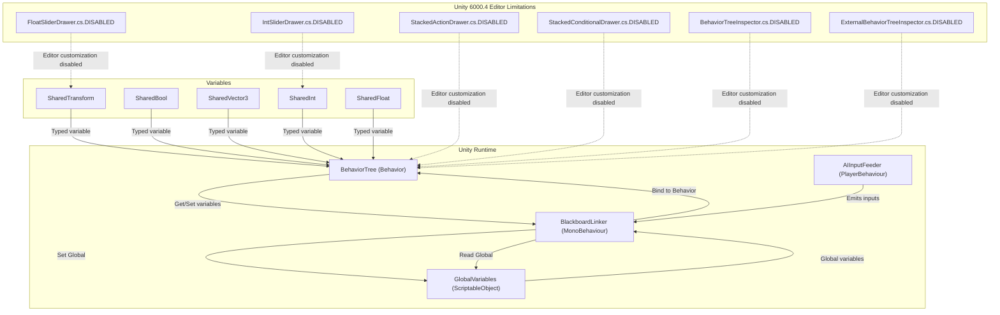
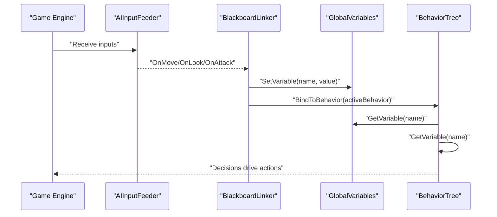
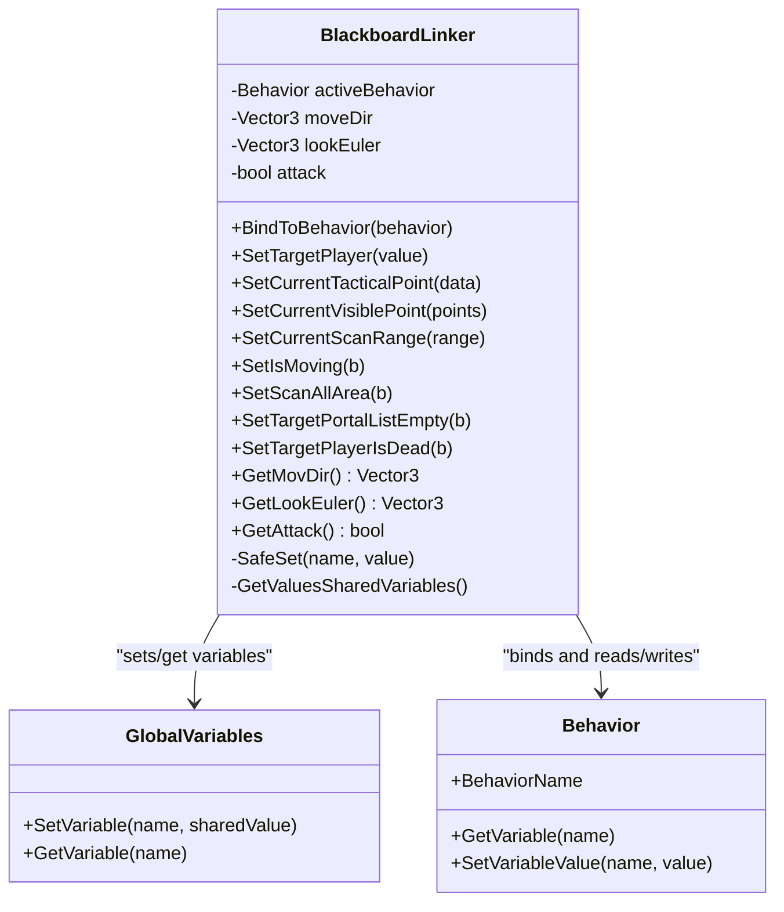
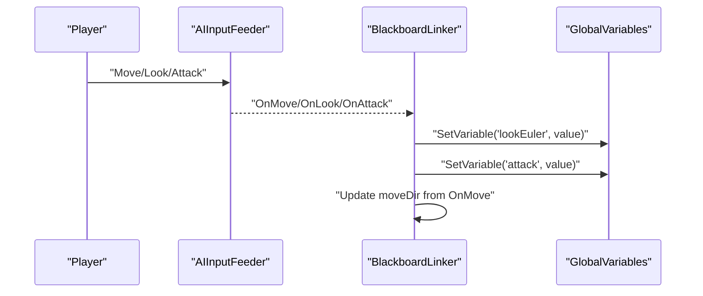
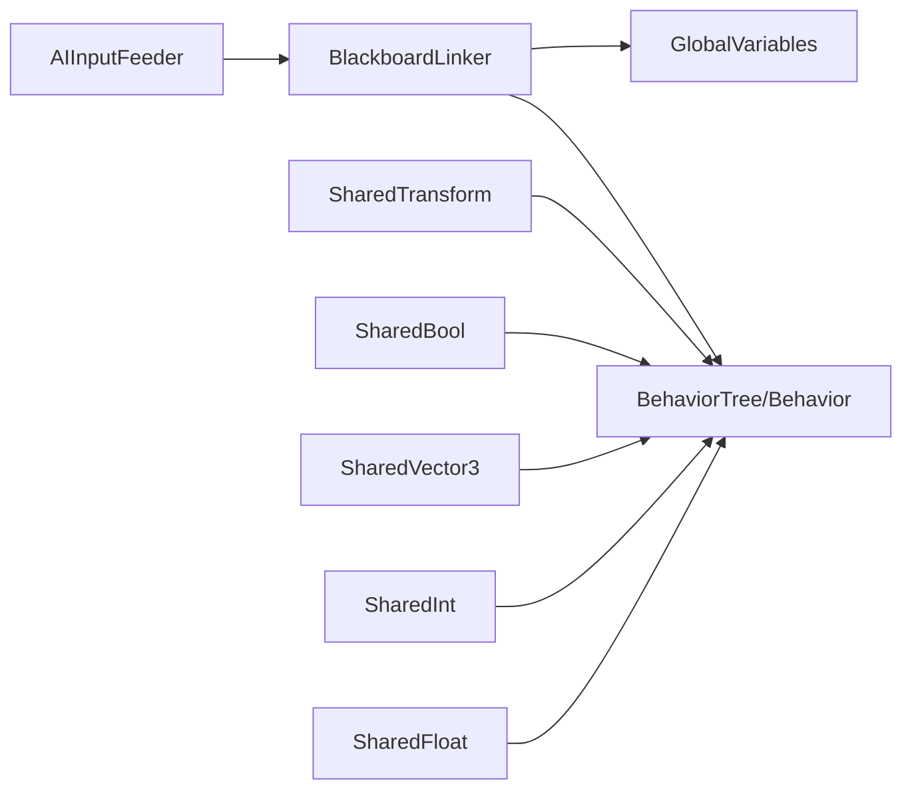

# Behavior Designer Variables

<cite>
**Referenced Files in This Document**
- [BehaviorDesignerGlobalVariables.asset](file://Assets/Behavior Designer/Resources/BehaviorDesignerGlobalVariables.asset)
- [BlackboardLinker.cs](file://Assets/FPS-Game/Scripts/Bot/BlackboardLinker.cs)
- [AIInputFeeder.cs](file://Assets/FPS-Game/Scripts/Bot/AIInputFeeder.cs)
- [SharedTransform.cs](file://Assets/Behavior Designer/Runtime/Variables/SharedTransform.cs)
- [SharedBool.cs](file://Assets/Behavior Designer/Runtime/Variables/SharedBool.cs)
- [SharedVector3.cs](file://Assets/Behavior Designer/Runtime/Variables/SharedVector3.cs)
- [SharedInt.cs](file://Assets/Behavior Designer/Runtime/Variables/SharedInt.cs)
- [SharedFloat.cs](file://Assets/Behavior Designer/Runtime/Variables/SharedFloat.cs)
- [BehaviorTree.cs](file://Assets/Behavior Designer/Runtime/BehaviorTree.cs)
- [FloatSliderDrawer.cs.DISABLED](file://Assets/Behavior Designer/Editor/Object Drawers/FloatSliderDrawer.cs.DISABLED)
- [IntSliderDrawer.cs.DISABLED](file://Assets/Behavior Designer/Editor/Object Drawers/IntSliderDrawer.cs.DISABLED)
- [StackedActionDrawer.cs.DISABLED](file://Assets/Behavior Designer/Editor/Object Drawers/StackedActionDrawer.cs.DISABLED)
- [StackedConditionalDrawer.cs.DISABLED](file://Assets/Behavior Designer/Editor/Object Drawers/StackedConditionalDrawer.cs.DISABLED)
- [BehaviorTreeInspector.cs.DISABLED](file://Assets/Behavior Designer/Editor/BehaviorTreeInspector.cs.DISABLED)
- [ExternalBehaviorTreeInspector.cs.DISABLED](file://Assets/Behavior Designer/Editor/ExternalBehaviorTreeInspector.cs.DISABLED)
</cite>

## Update Summary
**Changes Made**
- Added Unity 6000.4 compatibility notice explaining temporary editor wrapper script disabling
- Updated troubleshooting section to address editor capability limitations
- Clarified that core variable functionality remains fully operational despite editor restrictions

## Table of Contents
1. [Introduction](#introduction)
2. [Project Structure](#project-structure)
3. [Core Components](#core-components)
4. [Architecture Overview](#architecture-overview)
5. [Detailed Component Analysis](#detailed-component-analysis)
6. [Unity 6000.4 Compatibility and Editor Limitations](#unity-60004-compatibility-and-editor-limitations)
7. [Dependency Analysis](#dependency-analysis)
8. [Performance Considerations](#performance-considerations)
9. [Troubleshooting Guide](#troubleshooting-guide)
10. [Conclusion](#conclusion)
11. [Appendices](#appendices)

## Introduction
This document explains Behavior Designer variable management and AI data binding in the project. It covers:
- The GlobalVariables asset structure and its integration with Unity's ScriptableObject system
- The BlackboardLinker system that bridges C# runtime data with Behavior Designer tasks and conditions
- AI input feeding mechanisms for real-time data exchange between the game engine and behavior trees
- Practical examples of variable creation, data type mapping, and runtime updates
- Variable scope management, serialization of AI states, and performance optimization
- Best practices for organizing AI variables and maintaining clean data flow

**Updated** Added compatibility notice for Unity 6000.4 breaking changes affecting editor functionality.

## Project Structure
The variable management system spans two primary areas:
- Runtime variables: Strongly typed SharedVariable<T> wrappers for Behavior Designer
- Global state: A ScriptableObject asset that stores global variables serialized via JSON

Key files:
- Global variables asset: [BehaviorDesignerGlobalVariables.asset](file://Assets/Behavior Designer/Resources/BehaviorDesignerGlobalVariables.asset)
- Blackboard bridge: [BlackboardLinker.cs](file://Assets/FPS-Game/Scripts/Bot/BlackboardLinker.cs)
- AI input consumer: [AIInputFeeder.cs](file://Assets/FPS-Game/Scripts/Bot/AIInputFeeder.cs)
- Shared variable types: [SharedTransform.cs](file://Assets/Behavior Designer/Runtime/Variables/SharedTransform.cs), [SharedBool.cs](file://Assets/Behavior Designer/Runtime/Variables/SharedBool.cs), [SharedVector3.cs](file://Assets/Behavior Designer/Runtime/Variables/SharedVector3.cs), [SharedInt.cs](file://Assets/Behavior Designer/Runtime/Variables/SharedInt.cs), [SharedFloat.cs](file://Assets/Behavior Designer/Runtime/Variables/SharedFloat.cs)
- Behavior tree wrapper: [BehaviorTree.cs](file://Assets/Behavior Designer/Runtime/BehaviorTree.cs)

**Diagram sources**
- [BehaviorTree.cs:1-11](file://Assets/Behavior Designer/Runtime/BehaviorTree.cs#L1-L11)
- [BehaviorDesignerGlobalVariables.asset:1-27](file://Assets/Behavior Designer/Resources/BehaviorDesignerGlobalVariables.asset#L1-L27)
- [BlackboardLinker.cs:1-332](file://Assets/FPS-Game/Scripts/Bot/BlackboardLinker.cs#L1-L332)
- [AIInputFeeder.cs:1-29](file://Assets/FPS-Game/Scripts/Bot/AIInputFeeder.cs#L1-L29)
- [SharedTransform.cs:1-10](file://Assets/Behavior Designer/Runtime/Variables/SharedTransform.cs#L1-L10)
- [SharedBool.cs:1-8](file://Assets/Behavior Designer/Runtime/Variables/SharedBool.cs#L1-L8)
- [SharedVector3.cs:1-10](file://Assets/Behavior Designer/Runtime/Variables/SharedVector3.cs#L1-L10)
- [SharedInt.cs:1-8](file://Assets/Behavior Designer/Runtime/Variables/SharedInt.cs#L1-L8)
- [SharedFloat.cs:1-8](file://Assets/Behavior Designer/Runtime/Variables/SharedFloat.cs#L1-L8)
- [FloatSliderDrawer.cs.DISABLED](file://Assets/Behavior Designer/Editor/Object Drawers/FloatSliderDrawer.cs.DISABLED)
- [IntSliderDrawer.cs.DISABLED](file://Assets/Behavior Designer/Editor/Object Drawers/IntSliderDrawer.cs.DISABLED)
- [StackedActionDrawer.cs.DISABLED](file://Assets/Behavior Designer/Editor/Object Drawers/StackedActionDrawer.cs.DISABLED)
- [StackedConditionalDrawer.cs.DISABLED](file://Assets/Behavior Designer/Editor/Object Drawers/StackedConditionalDrawer.cs.DISABLED)
- [BehaviorTreeInspector.cs.DISABLED](file://Assets/Behavior Designer/Editor/BehaviorTreeInspector.cs.DISABLED)
- [ExternalBehaviorTreeInspector.cs.DISABLED](file://Assets/Behavior Designer/Editor/ExternalBehaviorTreeInspector.cs.DISABLED)

**Section sources**
- [BehaviorDesignerGlobalVariables.asset:1-27](file://Assets/Behavior Designer/Resources/BehaviorDesignerGlobalVariables.asset#L1-L27)
- [BlackboardLinker.cs:1-332](file://Assets/FPS-Game/Scripts/Bot/BlackboardLinker.cs#L1-L332)
- [AIInputFeeder.cs:1-29](file://Assets/FPS-Game/Scripts/Bot/AIInputFeeder.cs#L1-L29)
- [BehaviorTree.cs:1-11](file://Assets/Behavior Designer/Runtime/BehaviorTree.cs#L1-L11)

## Core Components
- GlobalVariables asset: Serialized JSON-backed storage for global variables, enabling cross-tree sharing and editor persistence. See [BehaviorDesignerGlobalVariables.asset:15-17](file://Assets/Behavior Designer/Resources/BehaviorDesignerGlobalVariables.asset#L15-L17).
- BlackboardLinker: A MonoBehaviour that binds C# runtime data to Behavior Designer variables, seeds initial values, and reads outputs back each frame. See [BlackboardLinker.cs:54-332](file://Assets/FPS-Game/Scripts/Bot/BlackboardLinker.cs#L54-L332).
- AIInputFeeder: Emits movement, look, and attack inputs consumed by the AI and forwarded to player actions. See [AIInputFeeder.cs:4-29](file://Assets/FPS-Game/Scripts/Bot/AIInputFeeder.cs#L4-L29).
- SharedVariable<T>: Strongly typed wrappers used by Behavior Designer tasks and conditions. Examples include [SharedTransform.cs:6-9](file://Assets/Behavior Designer/Runtime/Variables/SharedTransform.cs#L6-L9), [SharedBool.cs:4-7](file://Assets/Behavior Designer/Runtime/Variables/SharedBool.cs#L4-L7), [SharedVector3.cs:6-9](file://Assets/Behavior Designer/Runtime/Variables/SharedVector3.cs#L6-L9), [SharedInt.cs:4-7](file://Assets/Behavior Designer/Runtime/Variables/SharedInt.cs#L4-L7), [SharedFloat.cs:4-7](file://Assets/Behavior Designer/Runtime/Variables/SharedFloat.cs#L4-L7).

**Section sources**
- [BehaviorDesignerGlobalVariables.asset:15-17](file://Assets/Behavior Designer/Resources/BehaviorDesignerGlobalVariables.asset#L15-L17)
- [BlackboardLinker.cs:54-332](file://Assets/FPS-Game/Scripts/Bot/BlackboardLinker.cs#L54-L332)
- [AIInputFeeder.cs:4-29](file://Assets/FPS-Game/Scripts/Bot/AIInputFeeder.cs#L4-L29)
- [SharedTransform.cs:6-9](file://Assets/Behavior Designer/Runtime/Variables/SharedTransform.cs#L6-L9)
- [SharedBool.cs:4-7](file://Assets/Behavior Designer/Runtime/Variables/SharedBool.cs#L4-L7)
- [SharedVector3.cs:6-9](file://Assets/Behavior Designer/Runtime/Variables/SharedVector3.cs#L6-L9)
- [SharedInt.cs:4-7](file://Assets/Behavior Designer/Runtime/Variables/SharedInt.cs#L4-L7)
- [SharedFloat.cs:4-7](file://Assets/Behavior Designer/Runtime/Variables/SharedFloat.cs#L4-L7)

## Architecture Overview
The system connects C# runtime data to Behavior Designer variables through a two-way bridge:
- Outbound: C# code sets GlobalVariables or Behavior variables via BlackboardLinker
- Inbound: Behavior Designer tasks read GlobalVariables and Behavior variables to make decisions
- Inputs: AIInputFeeder translates external inputs into runtime state consumed by the AI

**Diagram sources**
- [AIInputFeeder.cs:4-29](file://Assets/FPS-Game/Scripts/Bot/AIInputFeeder.cs#L4-L29)
- [BlackboardLinker.cs:86-113](file://Assets/FPS-Game/Scripts/Bot/BlackboardLinker.cs#L86-L113)
- [BlackboardLinker.cs:190-221](file://Assets/FPS-Game/Scripts/Bot/BlackboardLinker.cs#L190-L221)
- [BehaviorDesignerGlobalVariables.asset:15-17](file://Assets/Behavior Designer/Resources/BehaviorDesignerGlobalVariables.asset#L15-L17)
- [BehaviorTree.cs:7](file://Assets/Behavior Designer/Runtime/BehaviorTree.cs#L7)

## Detailed Component Analysis

### GlobalVariables Asset and ScriptableObject Integration
- Storage: The asset serializes a JSON payload containing variable definitions and values. See [BehaviorDesignerGlobalVariables.asset:15-17](file://Assets/Behavior Designer/Resources/BehaviorDesignerGlobalVariables.asset#L15-L17).
- Scope: Variables marked as global are accessible across behavior trees and instances.
- Persistence: As a ScriptableObject under Resources, it loads automatically at runtime and persists across scenes.

Practical usage:
- Create a new variable: Add a new entry to the JSON array with Type, Name, IsShared, IsGlobal, and initial value fields.
- Data type mapping: Use the fully qualified SharedVariable<T> type name for Type (e.g., SharedTransform, SharedBool, SharedVector3).
- Runtime updates: Use GlobalVariables.Instance.SetVariable(name, sharedValue) to update values.

**Section sources**
- [BehaviorDesignerGlobalVariables.asset:15-17](file://Assets/Behavior Designer/Resources/BehaviorDesignerGlobalVariables.asset#L15-L17)

### BlackboardLinker: Bridging C# and Behavior Designer
Responsibilities:
- Bind to the active Behavior Designer Behavior and seed variables with current C# state
- Periodically read outputs from GlobalVariables and Behavior variables back into C#
- Provide helpers to set variables safely with type checks and minimal writes

Key methods and flows:
- BindToBehavior: Seeds initial values depending on the active behavior name. See [BlackboardLinker.cs:86-113](file://Assets/FPS-Game/Scripts/Bot/BlackboardLinker.cs#L86-L113).
- Setters: Methods like SetTargetPlayer, SetCurrentTacticalPoint, SetCurrentVisiblePoint, SetCurrentScanRange, SetIsMoving, SetScanAllArea, SetTargetPortalListEmpty, SetTargetPlayerIsDead call SafeSet. See [BlackboardLinker.cs:119-188](file://Assets/FPS-Game/Scripts/Bot/BlackboardLinker.cs#L119-L188).
- SafeSet: Performs type-specific checks and avoids redundant writes. Falls back to Behavior.SetVariableValue if needed. See [BlackboardLinker.cs:254-329](file://Assets/FPS-Game/Scripts/Bot/BlackboardLinker.cs#L254-L329).
- GetValuesSharedVariables: Reads outputs from GlobalVariables and Behavior variables each frame. See [BlackboardLinker.cs:195-221](file://Assets/FPS-Game/Scripts/Bot/BlackboardLinker.cs#L195-L221).

**Diagram sources**
- [BlackboardLinker.cs:54-332](file://Assets/FPS-Game/Scripts/Bot/BlackboardLinker.cs#L54-L332)
- [BehaviorDesignerGlobalVariables.asset:15-17](file://Assets/Behavior Designer/Resources/BehaviorDesignerGlobalVariables.asset#L15-L17)

**Section sources**
- [BlackboardLinker.cs:86-113](file://Assets/FPS-Game/Scripts/Bot/BlackboardLinker.cs#L86-L113)
- [BlackboardLinker.cs:119-188](file://Assets/FPS-Game/Scripts/Bot/BlackboardLinker.cs#L119-L188)
- [BlackboardLinker.cs:195-221](file://Assets/FPS-Game/Scripts/Bot/BlackboardLinker.cs#L195-L221)
- [BlackboardLinker.cs:254-329](file://Assets/FPS-Game/Scripts/Bot/BlackboardLinker.cs#L254-L329)

### AI Input Feeding Mechanism
- Purpose: Translate external inputs (movement, look, attack) into runtime state consumed by the AI.
- Implementation: AIInputFeeder exposes events OnMove, OnLook, OnAttack and forwards attack to player actions. See [AIInputFeeder.cs:4-29](file://Assets/FPS-Game/Scripts/Bot/AIInputFeeder.cs#L4-L29).
- Integration: BlackboardLinker subscribes to these events and updates GlobalVariables and Behavior variables accordingly.

**Diagram sources**
- [AIInputFeeder.cs:4-29](file://Assets/FPS-Game/Scripts/Bot/AIInputFeeder.cs#L4-L29)
- [BlackboardLinker.cs:190-221](file://Assets/FPS-Game/Scripts/Bot/BlackboardLinker.cs#L190-L221)

**Section sources**
- [AIInputFeeder.cs:4-29](file://Assets/FPS-Game/Scripts/Bot/AIInputFeeder.cs#L4-L29)
- [BlackboardLinker.cs:190-221](file://Assets/FPS-Game/Scripts/Bot/BlackboardLinker.cs#L190-L221)

### Variable Creation, Data Type Mapping, and Runtime Updates
- Creating a variable:
  - Add a new entry in the GlobalVariables JSON array with Type set to the fully qualified SharedVariable<T> class name and Name as the variable identifier.
  - Example types: SharedTransform, SharedBool, SharedVector3, SharedInt, SharedFloat.
- Data type mapping:
  - SharedTransform: Unity Transform
  - SharedBool: Boolean
  - SharedVector3: Vector3
  - SharedInt: Integer
  - SharedFloat: Floating-point number
- Runtime updates:
  - Use GlobalVariables.Instance.SetVariable(name, sharedValue) to update global variables.
  - Use SafeSet helpers in BlackboardLinker to update Behavior variables with type checks.

**Section sources**
- [BehaviorDesignerGlobalVariables.asset:15-17](file://Assets/Behavior Designer/Resources/BehaviorDesignerGlobalVariables.asset#L15-L17)
- [SharedTransform.cs:6-9](file://Assets/Behavior Designer/Runtime/Variables/SharedTransform.cs#L6-L9)
- [SharedBool.cs:4-7](file://Assets/Behavior Designer/Runtime/Variables/SharedBool.cs#L4-L7)
- [SharedVector3.cs:6-9](file://Assets/Behavior Designer/Runtime/Variables/SharedVector3.cs#L6-L9)
- [SharedInt.cs:4-7](file://Assets/Behavior Designer/Runtime/Variables/SharedInt.cs#L4-L7)
- [SharedFloat.cs:4-7](file://Assets/Behavior Designer/Runtime/Variables/SharedFloat.cs#L4-L7)
- [BlackboardLinker.cs:119-188](file://Assets/FPS-Game/Scripts/Bot/BlackboardLinker.cs#L119-L188)

### Variable Scope Management and Per-Bot Instance Data
- Global scope: Variables defined in the GlobalVariables asset are shared globally and accessed via GlobalVariables.Instance.
- Local scope: Behavior variables are owned by a specific Behavior instance and accessed via behavior.GetVariable(name).
- Per-bot separation: Each bot instance should bind BlackboardLinker to its own Behavior instance and manage local variables independently while sharing global state through GlobalVariables.

**Section sources**
- [BehaviorDesignerGlobalVariables.asset:15-17](file://Assets/Behavior Designer/Resources/BehaviorDesignerGlobalVariables.asset#L15-L17)
- [BlackboardLinker.cs:86-113](file://Assets/FPS-Game/Scripts/Bot/BlackboardLinker.cs#L86-L113)

### Serialization for AI States and Real-Time Exchange
- Global state serialization: JSON payload in GlobalVariables supports persistent state across sessions.
- Real-time exchange: BlackboardLinker reads/writes variables each frame, minimizing overhead by checking types and avoiding redundant writes.

**Section sources**
- [BehaviorDesignerGlobalVariables.asset:15-17](file://Assets/Behavior Designer/Resources/BehaviorDesignerGlobalVariables.asset#L15-L17)
- [BlackboardLinker.cs:190-221](file://Assets/FPS-Game/Scripts/Bot/BlackboardLinker.cs#L190-L221)

## Unity 6000.4 Compatibility and Editor Limitations

**Updated** The project has been updated to maintain compatibility with Unity 6000.4, which introduced breaking changes affecting editor functionality. While the core variable management system remains fully functional, several editor wrapper scripts have been temporarily disabled with `.DISABLED` suffixes.

### Current Status
- **Core functionality intact**: All runtime variable management, data binding, and AI state handling continues to work normally
- **Editor customization limited**: Several editor scripts have been disabled due to Unity 6000.4 breaking changes
- **Temporary solution**: These scripts will be re-enabled once compatibility is restored

### Disabled Editor Components
The following editor scripts are currently disabled:
- Object Drawer scripts: FloatSliderDrawer.cs.DISABLED, IntSliderDrawer.cs.DISABLED, StackedActionDrawer.cs.DISABLED, StackedConditionalDrawer.cs.DISABLED
- Inspector scripts: BehaviorTreeInspector.cs.DISABLED, ExternalBehaviorTreeInspector.cs.DISABLED

### Impact Assessment
- **Runtime performance**: Unaffected - all core systems operate normally
- **Development workflow**: Partially impacted - custom editor drawers and inspectors are not available
- **Variable functionality**: Fully operational - all variable types, scopes, and data bindings work as expected
- **AI behavior**: Unaffected - behavior trees continue to execute with full variable support

### Workarounds and Alternatives
- Use standard Unity inspector for basic variable editing
- Manual variable configuration through GlobalVariables asset
- Continue using runtime binding and data flow patterns established in the codebase
- Monitor Unity 6000.4 compatibility updates for re-enabling editor features

**Section sources**
- [FloatSliderDrawer.cs.DISABLED](file://Assets/Behavior Designer/Editor/Object Drawers/FloatSliderDrawer.cs.DISABLED)
- [IntSliderDrawer.cs.DISABLED](file://Assets/Behavior Designer/Editor/Object Drawers/IntSliderDrawer.cs.DISABLED)
- [StackedActionDrawer.cs.DISABLED](file://Assets/Behavior Designer/Editor/Object Drawers/StackedActionDrawer.cs.DISABLED)
- [StackedConditionalDrawer.cs.DISABLED](file://Assets/Behavior Designer/Editor/Object Drawers/StackedConditionalDrawer.cs.DISABLED)
- [BehaviorTreeInspector.cs.DISABLED](file://Assets/Behavior Designer/Editor/BehaviorTreeInspector.cs.DISABLED)
- [ExternalBehaviorTreeInspector.cs.DISABLED](file://Assets/Behavior Designer/Editor/ExternalBehaviorTreeInspector.cs.DISABLED)

## Dependency Analysis
- BlackboardLinker depends on:
  - GlobalVariables for global variable access
  - Behavior for local variable access and binding
  - SharedVariable<T> types for strongly-typed variable values
- AIInputFeeder depends on PlayerBehaviour and emits events consumed by BlackboardLinker
- BehaviorTree is a thin wrapper around Behavior, enabling Unity component menu integration

**Diagram sources**
- [AIInputFeeder.cs:4-29](file://Assets/FPS-Game/Scripts/Bot/AIInputFeeder.cs#L4-L29)
- [BlackboardLinker.cs:54-332](file://Assets/FPS-Game/Scripts/Bot/BlackboardLinker.cs#L54-L332)
- [BehaviorTree.cs:7](file://Assets/Behavior Designer/Runtime/BehaviorTree.cs#L7)
- [SharedTransform.cs:6-9](file://Assets/Behavior Designer/Runtime/Variables/SharedTransform.cs#L6-L9)
- [SharedBool.cs:4-7](file://Assets/Behavior Designer/Runtime/Variables/SharedBool.cs#L4-L7)
- [SharedVector3.cs:6-9](file://Assets/Behavior Designer/Runtime/Variables/SharedVector3.cs#L6-L9)
- [SharedInt.cs:4-7](file://Assets/Behavior Designer/Runtime/Variables/SharedInt.cs#L4-L7)
- [SharedFloat.cs:4-7](file://Assets/Behavior Designer/Runtime/Variables/SharedFloat.cs#L4-L7)

**Section sources**
- [BlackboardLinker.cs:54-332](file://Assets/FPS-Game/Scripts/Bot/BlackboardLinker.cs#L54-L332)
- [BehaviorTree.cs:7](file://Assets/Behavior Designer/Runtime/BehaviorTree.cs#L7)

## Performance Considerations
- Minimize redundant writes: SafeSet compares current values and only updates when changed.
- Avoid repeated reflection: Use explicit SharedVariable<T> setters for known types.
- Batch reads/writes: Consolidate variable updates per frame in BlackboardLinker.Update.
- Prefer lightweight types: Use Vector2/Vector3/float/int for frequent updates; reserve complex types for less frequent changes.
- Cache references: Keep references to active Behavior and frequently accessed variables.

[No sources needed since this section provides general guidance]

## Troubleshooting Guide
Common issues and resolutions:
- Variable synchronization problems:
  - Ensure BindToBehavior is called when switching behavior trees so initial values are seeded.
  - Verify variable names match between GlobalVariables and Behavior definitions.
- Type casting errors:
  - Confirm the SharedVariable<T> type matches the expected type in tasks/conditions.
  - Use SafeSet to enforce type checks before assignment.
- Memory leaks in AI data management:
  - Avoid retaining references to destroyed GameObjects or Transforms; pass null to SharedTransform when appropriate.
  - Unsubscribe event handlers if BlackboardLinker is disabled or destroyed.
- Missing variables:
  - Confirm the variable exists in the GlobalVariables JSON and is marked as shared/global.
- Frequent access overhead:
  - Cache SharedVariable<T> references and avoid repeated GetVariable calls in tight loops.
- Unity 6000.4 editor limitations:
  - Custom editor drawers and inspectors are temporarily disabled - use standard Unity inspector instead.
  - Variable functionality itself remains unaffected by these editor changes.

**Updated** Added troubleshooting guidance for Unity 6000.4 editor limitations.

**Section sources**
- [BlackboardLinker.cs:254-329](file://Assets/FPS-Game/Scripts/Bot/BlackboardLinker.cs#L254-L329)
- [BehaviorDesignerGlobalVariables.asset:15-17](file://Assets/Behavior Designer/Resources/BehaviorDesignerGlobalVariables.asset#L15-L17)

## Conclusion
The Behavior Designer variable management system combines a JSON-backed GlobalVariables asset with a BlackboardLinker bridge to enable seamless data exchange between C# runtime state and Behavior Designer tasks. By leveraging strongly typed SharedVariable<T> wrappers, careful scope management, and efficient update patterns, the system supports robust AI state handling with predictable performance and maintainable data flow.

**Updated** Despite Unity 6000.4 breaking changes affecting editor functionality, the core variable management system remains fully operational and unaffected.

## Appendices

### Best Practices for Organizing AI Variables
- Group variables by scope: Global for world/shared state, local for per-bot state.
- Use descriptive names and consistent casing to avoid mismatches.
- Document variable semantics alongside tasks/conditions that consume them.
- Keep global variables minimal and immutable where possible; use local variables for ephemeral state.
- Regularly validate variable existence and types during development builds.
- Monitor Unity compatibility updates for restoring editor customization capabilities.

[No sources needed since this section provides general guidance]