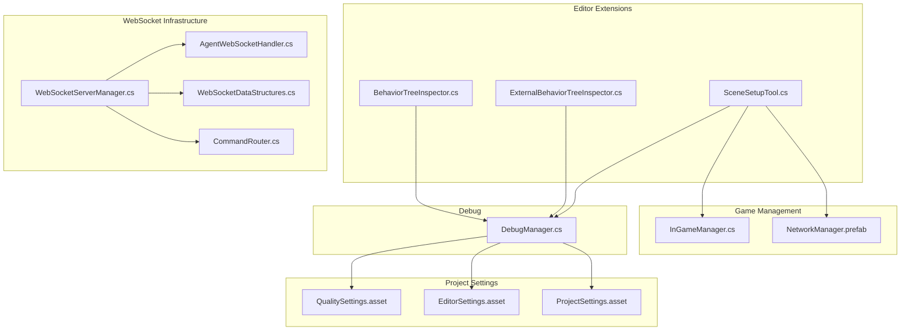
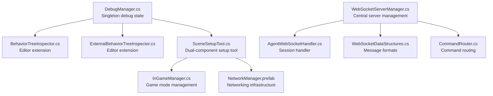
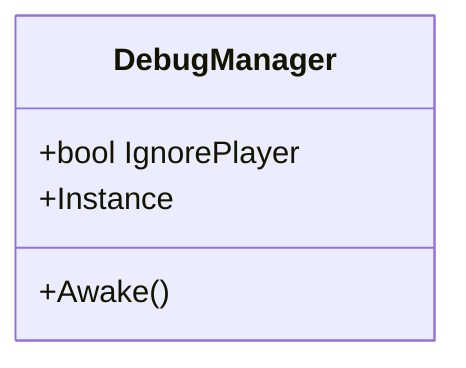
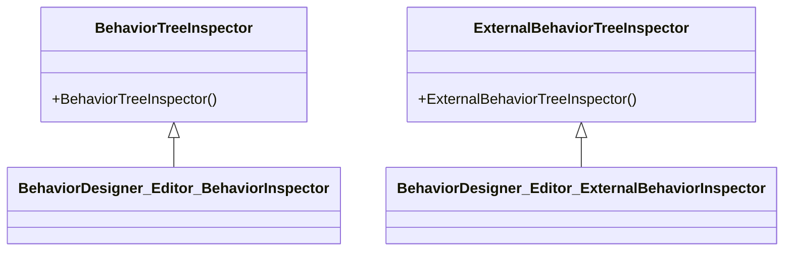
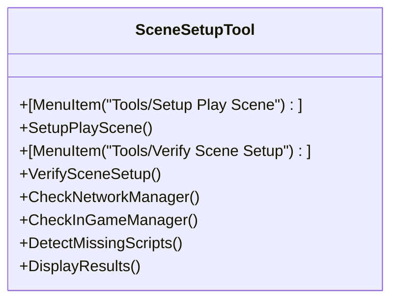
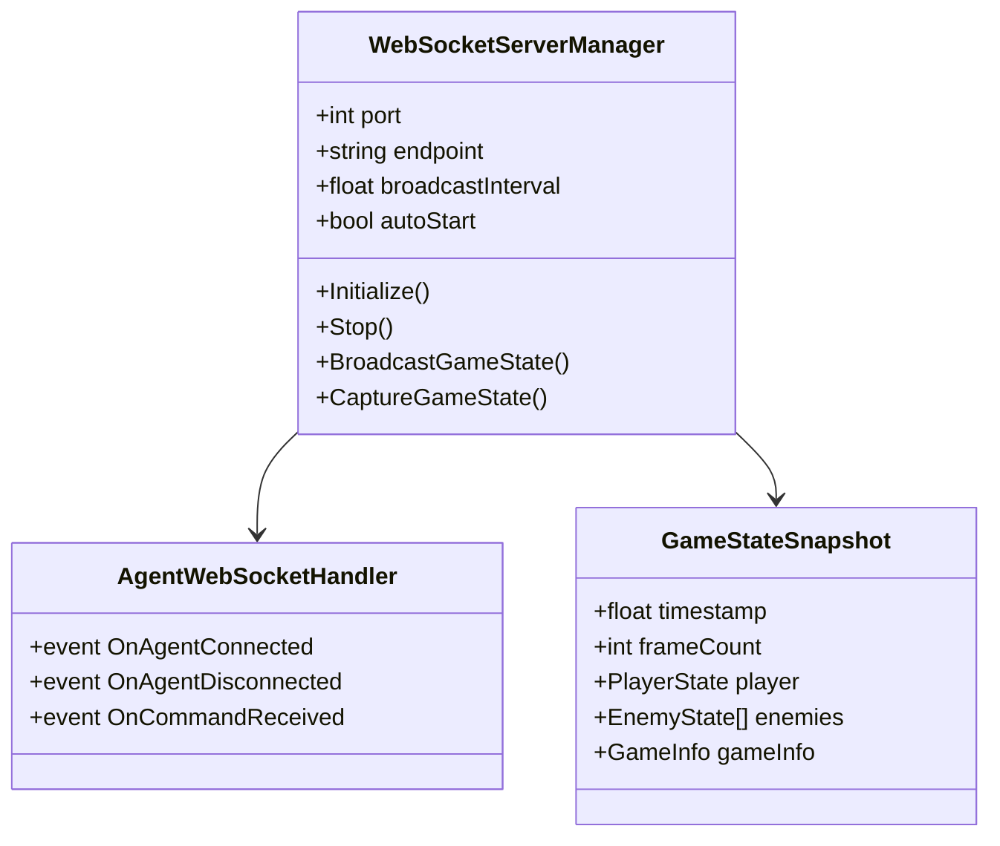
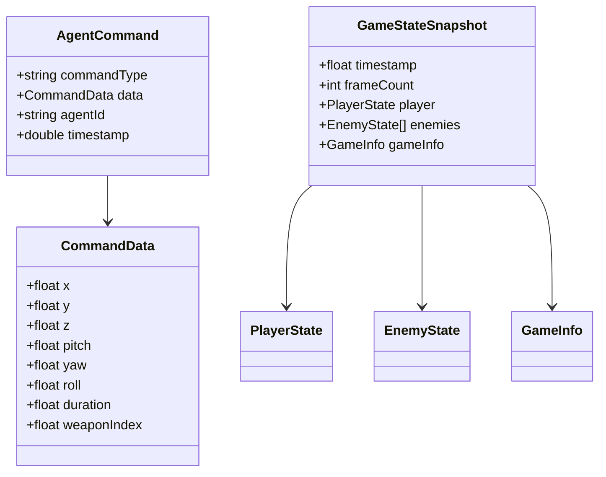
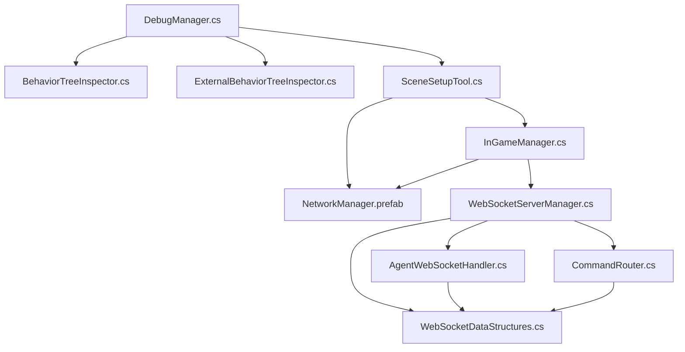

# Development Tools & Utilities

<cite>
**Referenced Files in This Document**
- [DebugManager.cs](file://Assets/FPS-Game/Scripts/Debug/DebugManager.cs)
- [BehaviorTreeInspector.cs](file://Assets/Behavior%20Designer/Editor/BehaviorTreeInspector.cs)
- [ExternalBehaviorTreeInspector.cs](file://Assets/Behavior%20Designer/Editor/ExternalBehaviorTreeInspector.cs)
- [WebSocketServerManager.cs](file://Assets/FPS-Game/Scripts/System/WebSocketServerManager.cs)
- [AgentWebSocketHandler.cs](file://Assets/FPS-Game/Scripts/System/AgentWebSocketHandler.cs)
- [WebSocketDataStructures.cs](file://Assets/FPS-Game/Scripts/System/WebSocketDataStructures.cs)
- [CommandRouter.cs](file://Assets/FPS-Game/Scripts/System/CommandRouter.cs)
- [SceneSetupTool.cs](file://Assets/Editor/SceneSetupTool.cs)
- [InGameManager.cs](file://Assets/FPS-Game/Scripts/System/InGameManager.cs)
- [InGameManager.prefab](file://Assets/FPS-Game/Prefabs/System/InGameManager.prefab)
- [NetworkManager.prefab](file://Assets/FPS-Game/Prefabs/System/NetworkManager.prefab)
- [README_WEBSOCKET_INSTALLATION.md](file://Assets/FPS-Game/Scripts/System/WebSocket/README_WEBSOCKET_INSTALLATION.md)
- [Test/README.md](file://Test/README.md)
- [Test/package.json](file://Test/package.json)
- [QualitySettings.asset](file://ProjectSettings/QualitySettings.asset)
- [EditorSettings.asset](file://ProjectSettings/EditorSettings.asset)
- [ProjectSettings.asset](file://ProjectSettings/ProjectSettings.asset)
- [README.md](file://README.md)
- [WIKI.md](file://WIKI.md)
</cite>

## Update Summary
**Changes Made**
- Enhanced SceneSetupTool documentation to reflect dual-component setup functionality
- Updated SceneSetupTool architecture to show NetworkManager and InGameManager integration
- Added comprehensive error handling and fallback prefab path documentation
- Documented enhanced verification system with missing script detection
- Updated user interface documentation with detailed results display
- Added NetworkManager integration details and configuration options

## Table of Contents
1. [Introduction](#introduction)
2. [Project Structure](#project-structure)
3. [Core Components](#core-components)
4. [Architecture Overview](#architecture-overview)
5. [Detailed Component Analysis](#detailed-component-analysis)
6. [Dependency Analysis](#dependency-analysis)
7. [Performance Considerations](#performance-considerations)
8. [Troubleshooting Guide](#troubleshooting-guide)
9. [Conclusion](#conclusion)
10. [Appendices](#appendices)

## Introduction
This document focuses on the development tools and utility systems that support debugging, testing, and development workflow in the project. It explains the debug system implementation, test components for input validation, editor extensions, and the new WebSocket-based agent integration system. It also documents debugging capabilities such as performance monitoring, network state visualization, and AI behavior inspection, along with concrete examples from the codebase, configuration options for debug levels and logging verbosity, and relationships with other systems for development and quality assurance. Guidance is included for both beginners and experienced developers to address common issues like debug performance impact, test automation, and development environment setup.

**Updated** Enhanced with comprehensive dual-component SceneSetupTool that handles both NetworkManager and InGameManager setup, improved error handling, and enhanced verification system.

## Project Structure
The development tools and utilities are primarily located under:
- Assets/FPS-Game/Scripts/Debug: Centralized debug utilities and managers
- Assets/Behavior Designer/Editor: Editor extensions for Behavior Designer trees
- Assets/FPS-Game/Scripts/System: System-level components including WebSocket infrastructure and game managers
- Assets/Editor: Automated scene setup tools and editor utilities
- ProjectSettings: Global configuration affecting build, editor, and quality behavior
- Test: TypeScript-based WebSocket client for agent testing

**Diagram sources**
- [DebugManager.cs:1-19](file://Assets/FPS-Game/Scripts/Debug/DebugManager.cs#L1-L19)
- [BehaviorTreeInspector.cs:1-11](file://Assets/Behavior%20Designer/Editor/BehaviorTreeInspector.cs#L1-L11)
- [ExternalBehaviorTreeInspector.cs:1-13](file://Assets/Behavior%20Designer/Editor/ExternalBehaviorTreeInspector.cs#L1-L13)
- [SceneSetupTool.cs:1-172](file://Assets/Editor/SceneSetupTool.cs#L1-L172)
- [InGameManager.cs:66-205](file://Assets/FPS-Game/Scripts/System/InGameManager.cs#L66-L205)
- [NetworkManager.prefab:1-100](file://Assets/FPS-Game/Prefabs/System/NetworkManager.prefab#L1-L100)
- [WebSocketServerManager.cs:1-370](file://Assets/FPS-Game/Scripts/System/WebSocketServerManager.cs#L1-L370)
- [AgentWebSocketHandler.cs:1-66](file://Assets/FPS-Game/Scripts/System/AgentWebSocketHandler.cs#L1-L66)
- [WebSocketDataStructures.cs:1-168](file://Assets/FPS-Game/Scripts/System/WebSocketDataStructures.cs#L1-L168)
- [CommandRouter.cs:1-200](file://Assets/FPS-Game/Scripts/System/CommandRouter.cs#L1-L200)
- [QualitySettings.asset:1-321](file://ProjectSettings/QualitySettings.asset#L1-L321)
- [EditorSettings.asset:1-31](file://ProjectSettings/EditorSettings.asset#L1-L31)
- [ProjectSettings.asset:85-132](file://ProjectSettings/ProjectSettings.asset#L85-L132)

**Section sources**
- [README.md:1-24](file://README.md#L1-L24)
- [WIKI.md:1-823](file://WIKI.md#L1-L823)

## Core Components
- DebugManager: A lightweight singleton responsible for debug-related toggles and global debug state. It exposes a flag to ignore player during debugging sessions.
- Behavior Designer Editor Extensions: Custom inspectors for Behavior Designer trees to improve visibility and editing in the Unity Editor.
- SceneSetupTool: Comprehensive automated scene setup utility providing 'Tools/Setup Play Scene' and 'Tools/Verify Scene Setup' commands to streamline development workflow with dual-component management for NetworkManager and InGameManager.
- WebSocketServerManager: Central server component managing WebSocket connections for OpenClaw agent integration with bi-directional communication.
- AgentWebSocketHandler: Individual session handler for managing agent connections and command processing.
- WebSocketDataStructures: Serializable data structures defining command and state message formats.
- CommandRouter: Routes incoming WebSocket commands to appropriate game controllers.
- InGameManager: Core game management system handling different game modes including SinglePlayer, Multiplayer, and WebSocketAgent modes.
- NetworkManager: Unity Netcode for GameObjects system providing networking infrastructure.

**Updated** Enhanced SceneSetupTool to handle dual-component setup with improved error handling and verification capabilities.

**Section sources**
- [DebugManager.cs:1-19](file://Assets/FPS-Game/Scripts/Debug/DebugManager.cs#L1-L19)
- [BehaviorTreeInspector.cs:1-11](file://Assets/Behavior%20Designer/Editor/BehaviorTreeInspector.cs#L1-L11)
- [ExternalBehaviorTreeInspector.cs:1-13](file://Assets/Behavior%20Designer/Editor/ExternalBehaviorTreeInspector.cs#L1-L13)
- [SceneSetupTool.cs:1-172](file://Assets/Editor/SceneSetupTool.cs#L1-L172)
- [InGameManager.cs:66-205](file://Assets/FPS-Game/Scripts/System/InGameManager.cs#L66-L205)
- [NetworkManager.prefab:1-100](file://Assets/FPS-Game/Prefabs/System/NetworkManager.prefab#L1-L100)
- [WebSocketServerManager.cs:1-370](file://Assets/FPS-Game/Scripts/System/WebSocketServerManager.cs#L1-L370)
- [AgentWebSocketHandler.cs:1-66](file://Assets/FPS-Game/Scripts/System/AgentWebSocketHandler.cs#L1-L66)
- [WebSocketDataStructures.cs:1-168](file://Assets/FPS-Game/Scripts/System/WebSocketDataStructures.cs#L1-L168)
- [CommandRouter.cs:1-200](file://Assets/FPS-Game/Scripts/System/CommandRouter.cs#L1-L200)

## Architecture Overview
The development tools integrate with Unity's runtime and editor subsystems. The DebugManager acts as a central toggle for debug behaviors. Behavior Designer editor extensions enhance authoring workflows for AI behaviors. The enhanced SceneSetupTool provides automated scene management through Unity's editor menu system, handling both NetworkManager and InGameManager setup with comprehensive error handling. The WebSocket infrastructure provides agent integration capabilities with .NET Standard 2.1 compatibility.

**Updated** Added dual-component architecture showing NetworkManager and InGameManager integration within SceneSetupTool.

**Diagram sources**
- [DebugManager.cs:1-19](file://Assets/FPS-Game/Scripts/Debug/DebugManager.cs#L1-L19)
- [BehaviorTreeInspector.cs:1-11](file://Assets/Behavior%20Designer/Editor/BehaviorTreeInspector.cs#L1-L11)
- [ExternalBehaviorTreeInspector.cs:1-13](file://Assets/Behavior%20Designer/Editor/ExternalBehaviorTreeInspector.cs#L1-L13)
- [SceneSetupTool.cs:10-172](file://Assets/Editor/SceneSetupTool.cs#L10-L172)
- [InGameManager.cs:66-205](file://Assets/FPS-Game/Scripts/System/InGameManager.cs#L66-L205)
- [NetworkManager.prefab:1-100](file://Assets/FPS-Game/Prefabs/System/NetworkManager.prefab#L1-L100)
- [WebSocketServerManager.cs:1-370](file://Assets/FPS-Game/Scripts/System/WebSocketServerManager.cs#L1-L370)
- [AgentWebSocketHandler.cs:1-66](file://Assets/FPS-Game/Scripts/System/AgentWebSocketHandler.cs#L1-L66)
- [WebSocketDataStructures.cs:1-168](file://Assets/FPS-Game/Scripts/System/WebSocketDataStructures.cs#L1-L168)
- [CommandRouter.cs:1-200](file://Assets/FPS-Game/Scripts/System/CommandRouter.cs#L1-L200)

## Detailed Component Analysis

### DebugManager
- Purpose: Provide a global debug toggle and singleton lifecycle to avoid duplication.
- Key behaviors:
  - Singleton pattern ensures a single debug manager instance.
  - Public flag to ignore player during debugging sessions.
- Integration points:
  - Consumed by editor extensions to alter behavior during development.

**Diagram sources**
- [DebugManager.cs:1-19](file://Assets/FPS-Game/Scripts/Debug/DebugManager.cs#L1-L19)

**Section sources**
- [DebugManager.cs:1-19](file://Assets/FPS-Game/Scripts/Debug/DebugManager.cs#L1-L19)

### Behavior Designer Editor Extensions
- Purpose: Improve authoring and inspection of Behavior Designer trees in the Unity Editor.
- Key behaviors:
  - Custom editors for BehaviorTree and ExternalBehaviorTree types.
  - Minimal overrides to preserve existing inspector behavior while integrating with the editor.
- Integration points:
  - Used by DebugManager to visualize AI decision-making during development.

**Diagram sources**
- [BehaviorTreeInspector.cs:1-11](file://Assets/Behavior%20Designer/Editor/BehaviorTreeInspector.cs#L1-L11)
- [ExternalBehaviorTreeInspector.cs:1-13](file://Assets/Behavior%20Designer/Editor/ExternalBehaviorTreeInspector.cs#L1-L13)

**Section sources**
- [BehaviorTreeInspector.cs:1-11](file://Assets/Behavior%20Designer/Editor/BehaviorTreeInspector.cs#L1-L11)
- [ExternalBehaviorTreeInspector.cs:1-13](file://Assets/Behavior%20Designer/Editor/ExternalBehaviorTreeInspector.cs#L1-L13)

### SceneSetupTool
- Purpose: Automate the setup of Play.unity scene with both NetworkManager and InGameManager prefabs to eliminate manual setup procedures.
- Key behaviors:
  - Provides 'Tools/Setup Play Scene' menu command to automatically add both NetworkManager and InGameManager to the scene.
  - Provides 'Tools/Verify Scene Setup' menu command to validate scene setup completion with enhanced verification.
  - Handles scene opening, prefab loading, instantiation, and verification processes for both components.
  - Includes comprehensive error handling for missing scenes, prefabs, and provides fallback prefab paths.
  - Enhanced verification system detects missing scripts on InGameManager components.
  - Updated user interface with detailed results display showing step-by-step setup progress.
- Integration points:
  - Works with Unity EditorSceneManager and AssetDatabase APIs.
  - Integrates with NetworkManager and InGameManager prefabs and existing game systems.

**Updated** Enhanced SceneSetupTool now handles dual-component setup with improved error handling, fallback paths, and verification system.

**Diagram sources**
- [SceneSetupTool.cs:12-172](file://Assets/Editor/SceneSetupTool.cs#L12-L172)

**Section sources**
- [SceneSetupTool.cs:1-172](file://Assets/Editor/SceneSetupTool.cs#L1-L172)

### InGameManager
- Purpose: Core game management system handling different game modes and coordinating game systems.
- Key behaviors:
  - Supports multiple game modes: SinglePlayer, Multiplayer, and WebSocketAgent.
  - Initializes networking components based on game mode selection.
  - Manages game phases, scoring, and player information.
  - Handles WebSocket server initialization for agent integration.
- Integration points:
  - Works with NetworkManager for networking functionality.
  - Integrates with WebSocketServerManager for agent communication.
  - Coordinates with various game systems like SpawnInGameManager, TimePhaseCounter, etc.

**Updated** InGameManager now supports WebSocketAgent mode for agent integration workflows.

**Section sources**
- [InGameManager.cs:66-205](file://Assets/FPS-Game/Scripts/System/InGameManager.cs#L66-L205)
- [InGameManager.cs:164-172](file://Assets/FPS-Game/Scripts/System/InGameManager.cs#L164-L172)

### NetworkManager
- Purpose: Unity Netcode for GameObjects system providing networking infrastructure.
- Key behaviors:
  - Manages network configuration and transport settings.
  - Handles player spawning and network object synchronization.
  - Provides connection management and scene management capabilities.
  - Configurable tick rates, connection timeouts, and logging levels.
- Integration points:
  - Used by InGameManager for networking functionality.
  - Integrated with SceneSetupTool for automated setup.

**Section sources**
- [NetworkManager.prefab:1-100](file://Assets/FPS-Game/Prefabs/System/NetworkManager.prefab#L1-L100)

### WebSocketServerManager
- Purpose: Central server component managing WebSocket connections for OpenClaw agent integration.
- Key behaviors:
  - Initializes and manages WebSocket server on configurable port and endpoint.
  - Handles bi-directional communication: receives commands, broadcasts game state.
  - Manages multiple agent sessions with connection tracking.
  - Implements fixed-interval game state broadcasting.
- Integration points:
  - Uses AgentWebSocketHandler for session management.
  - Leverages CommandRouter for command processing.
  - Serializes GameStateSnapshot for outbound communication.

**Updated** Added comprehensive WebSocket server documentation.

**Diagram sources**
- [WebSocketServerManager.cs:1-370](file://Assets/FPS-Game/Scripts/System/WebSocketServerManager.cs#L1-L370)
- [AgentWebSocketHandler.cs:1-66](file://Assets/FPS-Game/Scripts/System/AgentWebSocketHandler.cs#L1-L66)
- [WebSocketDataStructures.cs:78-105](file://Assets/FPS-Game/Scripts/System/WebSocketDataStructures.cs#L78-L105)

**Section sources**
- [WebSocketServerManager.cs:1-370](file://Assets/FPS-Game/Scripts/System/WebSocketServerManager.cs#L1-L370)
- [AgentWebSocketHandler.cs:1-66](file://Assets/FPS-Game/Scripts/System/AgentWebSocketHandler.cs#L1-L66)
- [WebSocketDataStructures.cs:1-168](file://Assets/FPS-Game/Scripts/System/WebSocketDataStructures.cs#L1-L168)

### WebSocketDataStructures
- Purpose: Define serializable data structures for WebSocket communication.
- Key structures:
  - AgentCommand: Inbound commands from agents to Unity.
  - GameStateSnapshot: Outbound game state to agents.
  - Supporting classes: PlayerState, EnemyState, GameInfo, ZoneInfo.
- Integration points:
  - Used by WebSocketServerManager for serialization/deserialization.
  - Consumed by TypeScript test client for state interpretation.

**Updated** Added WebSocket data structure documentation.

**Diagram sources**
- [WebSocketDataStructures.cs:12-72](file://Assets/FPS-Game/Scripts/System/WebSocketDataStructures.cs#L12-L72)
- [WebSocketDataStructures.cs:78-168](file://Assets/FPS-Game/Scripts/System/WebSocketDataStructures.cs#L78-L168)

**Section sources**
- [WebSocketDataStructures.cs:1-168](file://Assets/FPS-Game/Scripts/System/WebSocketDataStructures.cs#L1-L168)

## Dependency Analysis
- DebugManager depends on Unity's GameObject lifecycle and is consumed by editor extensions.
- Behavior Designer editor extensions depend on Unity Editor APIs and Behavior Designer runtime types.
- SceneSetupTool depends on Unity Editor APIs (EditorSceneManager, AssetDatabase) and Unity's asset management system, with enhanced dual-component handling for NetworkManager and InGameManager.
- InGameManager depends on NetworkManager for networking functionality and integrates with WebSocketServerManager for agent communication.
- WebSocketServerManager depends on websocket-sharp library and Unity's threading model.
- AgentWebSocketHandler depends on websocket-sharp WebSocketBehavior base class.
- WebSocketDataStructures provide serialization support for all WebSocket communications.
- CommandRouter processes inbound commands and routes them to appropriate game systems.

**Updated** Added dual-component dependencies and WebSocket integration relationships.

**Diagram sources**
- [DebugManager.cs:1-19](file://Assets/FPS-Game/Scripts/Debug/DebugManager.cs#L1-L19)
- [BehaviorTreeInspector.cs:1-11](file://Assets/Behavior%20Designer/Editor/BehaviorTreeInspector.cs#L1-L11)
- [ExternalBehaviorTreeInspector.cs:1-13](file://Assets/Behavior%20Designer/Editor/ExternalBehaviorTreeInspector.cs#L1-L13)
- [SceneSetupTool.cs:1-172](file://Assets/Editor/SceneSetupTool.cs#L1-L172)
- [InGameManager.cs:66-205](file://Assets/FPS-Game/Scripts/System/InGameManager.cs#L66-L205)
- [NetworkManager.prefab:1-100](file://Assets/FPS-Game/Prefabs/System/NetworkManager.prefab#L1-L100)
- [WebSocketServerManager.cs:1-370](file://Assets/FPS-Game/Scripts/System/WebSocketServerManager.cs#L1-L370)
- [AgentWebSocketHandler.cs:1-66](file://Assets/FPS-Game/Scripts/System/AgentWebSocketHandler.cs#L1-L66)
- [WebSocketDataStructures.cs:1-168](file://Assets/FPS-Game/Scripts/System/WebSocketDataStructures.cs#L1-L168)
- [CommandRouter.cs:1-200](file://Assets/FPS-Game/Scripts/System/CommandRouter.cs#L1-L200)

**Section sources**
- [DebugManager.cs:1-19](file://Assets/FPS-Game/Scripts/Debug/DebugManager.cs#L1-L19)
- [BehaviorTreeInspector.cs:1-11](file://Assets/Behavior%20Designer/Editor/BehaviorTreeInspector.cs#L1-L11)
- [ExternalBehaviorTreeInspector.cs:1-13](file://Assets/Behavior%20Designer/Editor/ExternalBehaviorTreeInspector.cs#L1-L13)
- [SceneSetupTool.cs:1-172](file://Assets/Editor/SceneSetupTool.cs#L1-L172)
- [InGameManager.cs:66-205](file://Assets/FPS-Game/Scripts/System/InGameManager.cs#L66-L205)
- [NetworkManager.prefab:1-100](file://Assets/FPS-Game/Prefabs/System/NetworkManager.prefab#L1-L100)
- [WebSocketServerManager.cs:1-370](file://Assets/FPS-Game/Scripts/System/WebSocketServerManager.cs#L1-L370)
- [AgentWebSocketHandler.cs:1-66](file://Assets/FPS-Game/Scripts/System/AgentWebSocketHandler.cs#L1-L66)
- [WebSocketDataStructures.cs:1-168](file://Assets/FPS-Game/Scripts/System/WebSocketDataStructures.cs#L1-L168)
- [CommandRouter.cs:1-200](file://Assets/FPS-Game/Scripts/System/CommandRouter.cs#L1-L200)

## Performance Considerations
- Quality settings: The project's quality presets influence rendering and runtime performance. Adjustments here can reduce overhead during debugging and testing.
- Editor settings: Texture streaming and async shader compilation can be enabled to improve editor responsiveness during iterative development.
- Project settings: Logging and analytics flags can be tuned to minimize overhead in development builds.
- SceneSetupTool performance: Enhanced automated scene setup runs in the Unity Editor and performs minimal asset loading operations with improved error handling.
- NetworkManager performance: Unity Netcode for GameObjects provides optimized networking with configurable tick rates and connection management.
- WebSocket performance: Unity 6000.4 uses .NET Standard 2.1 with improved threading support. WebSocket server runs on separate thread to prevent blocking main game loop.
- Broadcasting frequency: Configurable broadcast interval prevents excessive network traffic while maintaining agent responsiveness.
- .NET Core migration: Mono.CSharp removal requires updated package dependencies and .NET Standard 2.1 compatibility checks.

**Updated** Added NetworkManager performance considerations and enhanced SceneSetupTool performance details.

Practical tips:
- Use lower quality settings during heavy debugging sessions to maintain frame stability.
- Keep async shader compilation enabled to reduce editor stalls.
- Disable analytics and unnecessary logging in development builds to reduce noise and overhead.
- Use SceneSetupTool to automate repetitive setup tasks and reduce manual errors with enhanced error handling.
- Configure NetworkManager tick rates based on game complexity and performance requirements.
- Monitor NetworkManager connection performance in Unity Profiler.
- Configure WebSocket broadcast interval based on agent requirements (default 10 Hz).
- Monitor WebSocket server thread performance in Unity Profiler.
- Ensure websocket-sharp library compatibility with .NET Standard 2.1.

**Section sources**
- [QualitySettings.asset:1-321](file://ProjectSettings/QualitySettings.asset#L1-L321)
- [EditorSettings.asset:1-31](file://ProjectSettings/EditorSettings.asset#L1-L31)
- [ProjectSettings.asset:85-132](file://ProjectSettings/ProjectSettings.asset#L85-L132)
- [SceneSetupTool.cs:1-172](file://Assets/Editor/SceneSetupTool.cs#L1-L172)
- [NetworkManager.prefab:48-72](file://Assets/FPS-Game/Prefabs/System/NetworkManager.prefab#L48-L72)
- [WebSocketServerManager.cs:25-27](file://Assets/FPS-Game/Scripts/System/WebSocketServerManager.cs#L25-L27)
- [README_WEBSOCKET_INSTALLATION.md:51-54](file://Assets/FPS-Game/Scripts/System/WebSocket/README_WEBSOCKET_INSTALLATION.md#L51-L54)

## Troubleshooting Guide
Common issues and resolutions:
- Debug performance impact:
  - Reduce quality settings or disable expensive effects during debugging.
  - Use DebugManager.IgnorePlayer to skip heavy logic during tests.
- Development environment setup:
  - Ensure editor settings enable texture streaming and async shader compilation.
  - Verify Behavior Designer editor extensions are present to streamline AI authoring.
  - Use SceneSetupTool to automate Play.unity scene setup and avoid manual prefab placement errors with enhanced error handling.
- Scene setup verification:
  - Run 'Tools/Verify Scene Setup' to check if both NetworkManager and InGameManager are properly placed in the scene.
  - If verification fails, run 'Tools/Setup Play Scene' to automatically add both prefabs with fallback path support.
  - Check for missing scripts or asset references in the InGameManager component using enhanced verification system.
  - Verify NetworkManager prefab exists in either System or root Prefabs folder.
- NetworkManager configuration:
  - Ensure NetworkManager is properly configured with correct transport settings.
  - Verify player prefab and network prefabs are correctly assigned.
  - Check connection data and port settings for local development.
- InGameManager setup:
  - Set Game Mode to 'SinglePlayer' in InGameManager inspector after setup.
  - Verify all required game systems are properly initialized.
  - Check for missing script references that could cause setup failures.
- WebSocket server setup:
  - Install websocket-sharp library via Unity Package Manager or manual DLL import.
  - Verify Unity 6000.4 .NET Standard 2.1 compatibility.
  - Check firewall settings for port 8080 access.
  - Monitor Unity Console for WebSocket initialization errors.
- Agent integration issues:
  - Ensure WebSocketServerManager is active in scene and autoStart is enabled.
  - Verify player character exists for state capture.
  - Check CommandRouter accessibility and command processing logs.
- Mono.CSharp removal and package cleanup:
  - Remove deprecated Mono.CSharp references from project settings.
  - Update package dependencies to .NET Standard 2.1 compatible versions.
  - Clean and rebuild project after dependency changes.

**Updated** Added comprehensive troubleshooting for dual-component setup, NetworkManager configuration, and enhanced verification system.

**Section sources**
- [DebugManager.cs:1-19](file://Assets/FPS-Game/Scripts/Debug/DebugManager.cs#L1-L19)
- [EditorSettings.asset:1-31](file://ProjectSettings/EditorSettings.asset#L1-L31)
- [SceneSetupTool.cs:1-172](file://Assets/Editor/SceneSetupTool.cs#L1-L172)
- [NetworkManager.prefab:48-72](file://Assets/FPS-Game/Prefabs/System/NetworkManager.prefab#L48-L72)
- [InGameManager.cs:111-124](file://Assets/FPS-Game/Scripts/System/InGameManager.cs#L111-L124)
- [README.md:1-440](file://README.md#L1-L440)
- [WIKI.md:1-823](file://WIKI.md#L1-L823)
- [README_WEBSOCKET_INSTALLATION.md:1-55](file://Assets/FPS-Game/Scripts/System/WebSocket/README_WEBSOCKET_INSTALLATION.md#L1-L55)
- [Test/README.md:191-213](file://Test/README.md#L191-L213)

## Conclusion
The development tools and utilities in this project provide a comprehensive foundation for debugging, testing, authoring workflows, and agent integration. DebugManager centralizes debug state, and Behavior Designer editor extensions enhance AI authoring. The enhanced SceneSetupTool automates dual-component scene management for both NetworkManager and InGameManager, eliminating manual setup procedures with improved error handling and verification. The new WebSocket infrastructure enables OpenClaw agent integration with .NET Standard 2.1 compatibility. Together with project settings for quality, editor, and analytics, these components support efficient iteration, high-quality development practices, and modern .NET Core development workflows.

**Updated** Enhanced conclusion to include dual-component SceneSetupTool and comprehensive NetworkManager integration benefits.

## Appendices
- Configuration options overview:
  - Debug levels: Controlled via DebugManager.IgnorePlayer.
  - Logging verbosity: Adjust via Unity's player log and editor settings.
  - Scene setup workflow: Automated via SceneSetupTool menu commands with dual-component support.
  - NetworkManager settings: Tick rate, connection timeout, logging level configuration.
  - WebSocket settings: Port, endpoint, broadcast interval, auto-start configuration.
- Relationship with QA systems:
  - Behavior Designer editor extensions improve authoring reliability and reduce regression risk.
  - Enhanced SceneSetupTool reduces setup errors and speeds up development iteration with verification system.
  - WebSocket test client provides automated agent integration testing.
- .NET Core migration guidance:
  - Mono.CSharp removal requires updated package dependencies.
  - .NET Standard 2.1 compatibility ensures modern development practices.
  - Package dependency cleanup improves project maintainability.
- Dual-component setup benefits:
  - Automatic NetworkManager and InGameManager setup reduces manual configuration errors.
  - Enhanced error handling with fallback prefab paths improves setup reliability.
  - Verification system detects missing scripts and configuration issues early.
  - Detailed results display provides clear feedback on setup progress and status.

**Updated** Added comprehensive appendices covering dual-component setup benefits and enhanced configuration options.

**Section sources**
- [DebugManager.cs:1-19](file://Assets/FPS-Game/Scripts/Debug/DebugManager.cs#L1-L19)
- [SceneSetupTool.cs:1-172](file://Assets/Editor/SceneSetupTool.cs#L1-L172)
- [NetworkManager.prefab:48-72](file://Assets/FPS-Game/Prefabs/System/NetworkManager.prefab#L48-L72)
- [WebSocketServerManager.cs:21-27](file://Assets/FPS-Game/Scripts/System/WebSocketServerManager.cs#L21-L27)
- [QualitySettings.asset:1-321](file://ProjectSettings/QualitySettings.asset#L1-L321)
- [EditorSettings.asset:1-31](file://ProjectSettings/EditorSettings.asset#L1-L31)
- [ProjectSettings.asset:85-132](file://ProjectSettings/ProjectSettings.asset#L85-L132)
- [README_WEBSOCKET_INSTALLATION.md:1-55](file://Assets/FPS-Game/Scripts/System/WebSocket/README_WEBSOCKET_INSTALLATION.md#L1-L55)
- [Test/README.md:1-247](file://Test/README.md#L1-L247)
- [README.md:1-440](file://README.md#L1-L440)
- [WIKI.md:1-823](file://WIKI.md#L1-L823)