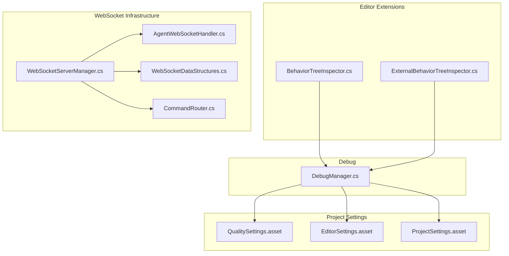
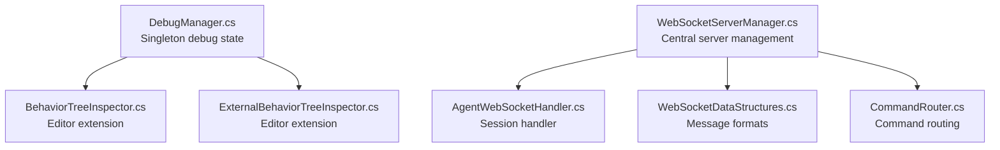
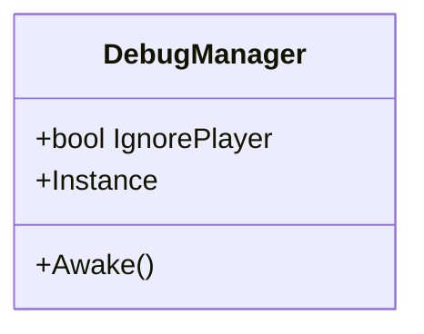
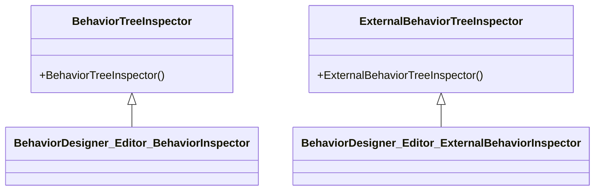
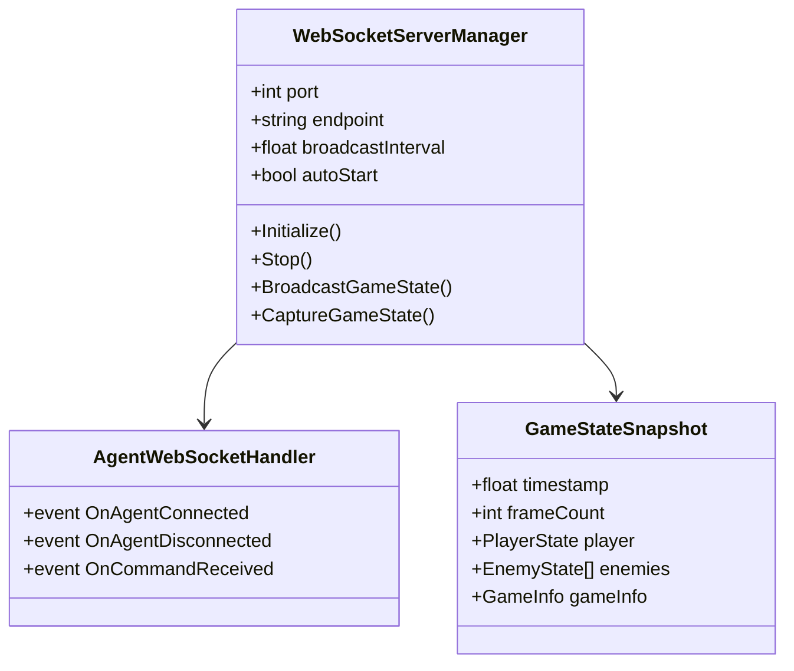
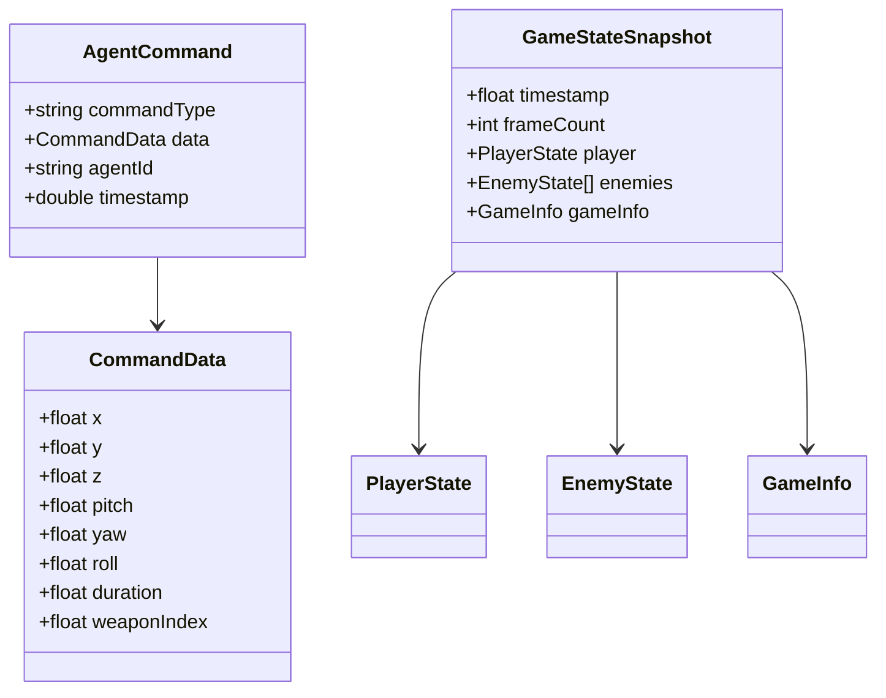
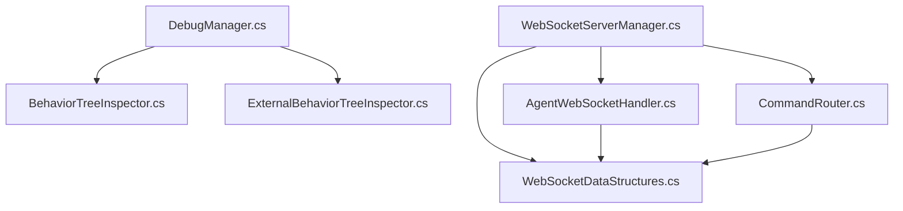

# Development Tools & Utilities

<cite>
**Referenced Files in This Document**
- [DebugManager.cs](file://Assets/FPS-Game/Scripts/Debug/DebugManager.cs)
- [BehaviorTreeInspector.cs](file://Assets/Behavior%20Designer/Editor/BehaviorTreeInspector.cs)
- [ExternalBehaviorTreeInspector.cs](file://Assets/Behavior%20Designer/Editor/ExternalBehaviorTreeInspector.cs)
- [WebSocketServerManager.cs](file://Assets/FPS-Game/Scripts/System/WebSocketServerManager.cs)
- [AgentWebSocketHandler.cs](file://Assets/FPS-Game/Scripts/System/AgentWebSocketHandler.cs)
- [WebSocketDataStructures.cs](file://Assets/FPS-Game/Scripts/System/WebSocketDataStructures.cs)
- [CommandRouter.cs](file://Assets/FPS-Game/Scripts/System/CommandRouter.cs)
- [README_WEBSOCKET_INSTALLATION.md](file://Assets/FPS-Game/Scripts/System/WebSocket/README_WEBSOCKET_INSTALLATION.md)
- [Test/README.md](file://Test/README.md)
- [Test/package.json](file://Test/package.json)
- [QualitySettings.asset](file://ProjectSettings/QualitySettings.asset)
- [EditorSettings.asset](file://ProjectSettings/EditorSettings.asset)
- [ProjectSettings.asset](file://ProjectSettings/ProjectSettings.asset)
- [README.md](file://README.md)
- [WIKI.md](file://WIKI.md)
</cite>

## Update Summary
**Changes Made**
- Added comprehensive WebSocket server infrastructure documentation with .NET Core migration notes
- Documented Mono.CSharp removal and package dependency cleanup guidance
- Enhanced troubleshooting section with WebSocket server setup and testing procedures
- Added new WebSocket-based development tools section covering agent integration
- Updated performance considerations to include WebSocket threading and .NET Standard 2.1 compatibility

## Table of Contents
1. [Introduction](#introduction)
2. [Project Structure](#project-structure)
3. [Core Components](#core-components)
4. [Architecture Overview](#architecture-overview)
5. [Detailed Component Analysis](#detailed-component-analysis)
6. [Dependency Analysis](#dependency-analysis)
7. [Performance Considerations](#performance-considerations)
8. [Troubleshooting Guide](#troubleshooting-guide)
9. [Conclusion](#conclusion)
10. [Appendices](#appendices)

## Introduction
This document focuses on the development tools and utility systems that support debugging, testing, and development workflow in the project. It explains the debug system implementation, test components for input validation, editor extensions, and the new WebSocket-based agent integration system. It also documents debugging capabilities such as performance monitoring, network state visualization, and AI behavior inspection, along with concrete examples from the codebase, configuration options for debug levels and logging verbosity, and relationships with other systems for development and quality assurance. Guidance is included for both beginners and experienced developers to address common issues like debug performance impact, test automation, and development environment setup.

**Updated** Enhanced with WebSocket server infrastructure for OpenClaw agent integration and .NET Core migration considerations.

## Project Structure
The development tools and utilities are primarily located under:
- Assets/FPS-Game/Scripts/Debug: Centralized debug utilities and managers
- Assets/Behavior Designer/Editor: Editor extensions for Behavior Designer trees
- Assets/FPS-Game/Scripts/System: System-level components including WebSocket infrastructure
- ProjectSettings: Global configuration affecting build, editor, and quality behavior
- Test: TypeScript-based WebSocket client for agent testing

**Diagram sources**
- [DebugManager.cs:1-19](file://Assets/FPS-Game/Scripts/Debug/DebugManager.cs#L1-L19)
- [BehaviorTreeInspector.cs:1-11](file://Assets/Behavior%20Designer/Editor/BehaviorTreeInspector.cs#L1-L11)
- [ExternalBehaviorTreeInspector.cs:1-13](file://Assets/Behavior%20Designer/Editor/ExternalBehaviorTreeInspector.cs#L1-L13)
- [WebSocketServerManager.cs:1-370](file://Assets/FPS-Game/Scripts/System/WebSocketServerManager.cs#L1-L370)
- [AgentWebSocketHandler.cs:1-66](file://Assets/FPS-Game/Scripts/System/AgentWebSocketHandler.cs#L1-L66)
- [WebSocketDataStructures.cs:1-168](file://Assets/FPS-Game/Scripts/System/WebSocketDataStructures.cs#L1-L168)
- [CommandRouter.cs:1-200](file://Assets/FPS-Game/Scripts/System/CommandRouter.cs#L1-L200)
- [QualitySettings.asset:1-321](file://ProjectSettings/QualitySettings.asset#L1-L321)
- [EditorSettings.asset:1-31](file://ProjectSettings/EditorSettings.asset#L1-L31)
- [ProjectSettings.asset:85-132](file://ProjectSettings/ProjectSettings.asset#L85-L132)

**Section sources**
- [README.md:1-24](file://README.md#L1-L24)
- [WIKI.md:1-823](file://WIKI.md#L1-L823)

## Core Components
- DebugManager: A lightweight singleton responsible for debug-related toggles and global debug state. It exposes a flag to ignore player during debugging sessions.
- Behavior Designer Editor Extensions: Custom inspectors for Behavior Designer trees to improve visibility and editing in the Unity Editor.
- WebSocketServerManager: Central server component managing WebSocket connections for OpenClaw agent integration with bi-directional communication.
- AgentWebSocketHandler: Individual session handler for managing agent connections and command processing.
- WebSocketDataStructures: Serializable data structures defining command and state message formats.
- CommandRouter: Routes incoming WebSocket commands to appropriate game controllers.

These components collectively support rapid iteration, debugging, validation, and agent-based development workflows.

**Updated** Added WebSocket infrastructure components for agent integration.

**Section sources**
- [DebugManager.cs:1-19](file://Assets/FPS-Game/Scripts/Debug/DebugManager.cs#L1-L19)
- [BehaviorTreeInspector.cs:1-11](file://Assets/Behavior%20Designer/Editor/BehaviorTreeInspector.cs#L1-L11)
- [ExternalBehaviorTreeInspector.cs:1-13](file://Assets/Behavior%20Designer/Editor/ExternalBehaviorTreeInspector.cs#L1-L13)
- [WebSocketServerManager.cs:1-370](file://Assets/FPS-Game/Scripts/System/WebSocketServerManager.cs#L1-L370)
- [AgentWebSocketHandler.cs:1-66](file://Assets/FPS-Game/Scripts/System/AgentWebSocketHandler.cs#L1-L66)
- [WebSocketDataStructures.cs:1-168](file://Assets/FPS-Game/Scripts/System/WebSocketDataStructures.cs#L1-L168)
- [CommandRouter.cs:1-200](file://Assets/FPS-Game/Scripts/System/CommandRouter.cs#L1-L200)

## Architecture Overview
The development tools integrate with Unity's runtime and editor subsystems. The DebugManager acts as a central toggle for debug behaviors. Behavior Designer editor extensions enhance authoring workflows for AI behaviors. The new WebSocket infrastructure provides agent integration capabilities with .NET Standard 2.1 compatibility.

**Updated** Added WebSocket architecture components.

**Diagram sources**
- [DebugManager.cs:1-19](file://Assets/FPS-Game/Scripts/Debug/DebugManager.cs#L1-L19)
- [BehaviorTreeInspector.cs:1-11](file://Assets/Behavior%20Designer/Editor/BehaviorTreeInspector.cs#L1-L11)
- [ExternalBehaviorTreeInspector.cs:1-13](file://Assets/Behavior%20Designer/Editor/ExternalBehaviorTreeInspector.cs#L1-L13)
- [WebSocketServerManager.cs:1-370](file://Assets/FPS-Game/Scripts/System/WebSocketServerManager.cs#L1-L370)
- [AgentWebSocketHandler.cs:1-66](file://Assets/FPS-Game/Scripts/System/AgentWebSocketHandler.cs#L1-L66)
- [WebSocketDataStructures.cs:1-168](file://Assets/FPS-Game/Scripts/System/WebSocketDataStructures.cs#L1-L168)
- [CommandRouter.cs:1-200](file://Assets/FPS-Game/Scripts/System/CommandRouter.cs#L1-L200)

## Detailed Component Analysis

### DebugManager
- Purpose: Provide a global debug toggle and singleton lifecycle to avoid duplication.
- Key behaviors:
  - Singleton pattern ensures a single debug manager instance.
  - Public flag to ignore player during debugging sessions.
- Integration points:
  - Consumed by editor extensions to alter behavior during development.

**Diagram sources**
- [DebugManager.cs:1-19](file://Assets/FPS-Game/Scripts/Debug/DebugManager.cs#L1-L19)

**Section sources**
- [DebugManager.cs:1-19](file://Assets/FPS-Game/Scripts/Debug/DebugManager.cs#L1-L19)

### Behavior Designer Editor Extensions
- Purpose: Improve authoring and inspection of Behavior Designer trees in the Unity Editor.
- Key behaviors:
  - Custom editors for BehaviorTree and ExternalBehaviorTree types.
  - Minimal overrides to preserve existing inspector behavior while integrating with the editor.
- Integration points:
  - Used by DebugManager to visualize AI decision-making during development.

**Diagram sources**
- [BehaviorTreeInspector.cs:1-11](file://Assets/Behavior%20Designer/Editor/BehaviorTreeInspector.cs#L1-L11)
- [ExternalBehaviorTreeInspector.cs:1-13](file://Assets/Behavior%20Designer/Editor/ExternalBehaviorTreeInspector.cs#L1-L13)

**Section sources**
- [BehaviorTreeInspector.cs:1-11](file://Assets/Behavior%20Designer/Editor/BehaviorTreeInspector.cs#L1-L11)
- [ExternalBehaviorTreeInspector.cs:1-13](file://Assets/Behavior%20Designer/Editor/ExternalBehaviorTreeInspector.cs#L1-L13)

### WebSocketServerManager
- Purpose: Central server component managing WebSocket connections for OpenClaw agent integration.
- Key behaviors:
  - Initializes and manages WebSocket server on configurable port and endpoint.
  - Handles bi-directional communication: receives commands, broadcasts game state.
  - Manages multiple agent sessions with connection tracking.
  - Implements fixed-interval game state broadcasting.
- Integration points:
  - Uses AgentWebSocketHandler for session management.
  - Leverages CommandRouter for command processing.
  - Serializes GameStateSnapshot for outbound communication.

**Updated** Added comprehensive WebSocket server documentation.

**Diagram sources**
- [WebSocketServerManager.cs:1-370](file://Assets/FPS-Game/Scripts/System/WebSocketServerManager.cs#L1-L370)
- [AgentWebSocketHandler.cs:1-66](file://Assets/FPS-Game/Scripts/System/AgentWebSocketHandler.cs#L1-L66)
- [WebSocketDataStructures.cs:78-105](file://Assets/FPS-Game/Scripts/System/WebSocketDataStructures.cs#L78-L105)

**Section sources**
- [WebSocketServerManager.cs:1-370](file://Assets/FPS-Game/Scripts/System/WebSocketServerManager.cs#L1-L370)
- [AgentWebSocketHandler.cs:1-66](file://Assets/FPS-Game/Scripts/System/AgentWebSocketHandler.cs#L1-L66)
- [WebSocketDataStructures.cs:1-168](file://Assets/FPS-Game/Scripts/System/WebSocketDataStructures.cs#L1-L168)

### WebSocketDataStructures
- Purpose: Define serializable data structures for WebSocket communication.
- Key structures:
  - AgentCommand: Inbound commands from agents to Unity.
  - GameStateSnapshot: Outbound game state to agents.
  - Supporting classes: PlayerState, EnemyState, GameInfo, ZoneInfo.
- Integration points:
  - Used by WebSocketServerManager for serialization/deserialization.
  - Consumed by TypeScript test client for state interpretation.

**Updated** Added WebSocket data structure documentation.

**Diagram sources**
- [WebSocketDataStructures.cs:12-72](file://Assets/FPS-Game/Scripts/System/WebSocketDataStructures.cs#L12-L72)
- [WebSocketDataStructures.cs:78-168](file://Assets/FPS-Game/Scripts/System/WebSocketDataStructures.cs#L78-L168)

**Section sources**
- [WebSocketDataStructures.cs:1-168](file://Assets/FPS-Game/Scripts/System/WebSocketDataStructures.cs#L1-L168)

## Dependency Analysis
- DebugManager depends on Unity's GameObject lifecycle and is consumed by editor extensions.
- Behavior Designer editor extensions depend on Unity Editor APIs and Behavior Designer runtime types.
- WebSocketServerManager depends on websocket-sharp library and Unity's threading model.
- AgentWebSocketHandler depends on websocket-sharp WebSocketBehavior base class.
- WebSocketDataStructures provide serialization support for all WebSocket communications.
- CommandRouter processes inbound commands and routes them to appropriate game systems.

**Updated** Added WebSocket dependency relationships.

**Diagram sources**
- [DebugManager.cs:1-19](file://Assets/FPS-Game/Scripts/Debug/DebugManager.cs#L1-L19)
- [BehaviorTreeInspector.cs:1-11](file://Assets/Behavior%20Designer/Editor/BehaviorTreeInspector.cs#L1-L11)
- [ExternalBehaviorTreeInspector.cs:1-13](file://Assets/Behavior%20Designer/Editor/ExternalBehaviorTreeInspector.cs#L1-L13)
- [WebSocketServerManager.cs:1-370](file://Assets/FPS-Game/Scripts/System/WebSocketServerManager.cs#L1-L370)
- [AgentWebSocketHandler.cs:1-66](file://Assets/FPS-Game/Scripts/System/AgentWebSocketHandler.cs#L1-L66)
- [WebSocketDataStructures.cs:1-168](file://Assets/FPS-Game/Scripts/System/WebSocketDataStructures.cs#L1-L168)
- [CommandRouter.cs:1-200](file://Assets/FPS-Game/Scripts/System/CommandRouter.cs#L1-L200)

**Section sources**
- [DebugManager.cs:1-19](file://Assets/FPS-Game/Scripts/Debug/DebugManager.cs#L1-L19)
- [BehaviorTreeInspector.cs:1-11](file://Assets/Behavior%20Designer/Editor/BehaviorTreeInspector.cs#L1-L11)
- [ExternalBehaviorTreeInspector.cs:1-13](file://Assets/Behavior%20Designer/Editor/ExternalBehaviorTreeInspector.cs#L1-L13)
- [WebSocketServerManager.cs:1-370](file://Assets/FPS-Game/Scripts/System/WebSocketServerManager.cs#L1-L370)
- [AgentWebSocketHandler.cs:1-66](file://Assets/FPS-Game/Scripts/System/AgentWebSocketHandler.cs#L1-L66)
- [WebSocketDataStructures.cs:1-168](file://Assets/FPS-Game/Scripts/System/WebSocketDataStructures.cs#L1-L168)
- [CommandRouter.cs:1-200](file://Assets/FPS-Game/Scripts/System/CommandRouter.cs#L1-L200)

## Performance Considerations
- Quality settings: The project's quality presets influence rendering and runtime performance. Adjustments here can reduce overhead during debugging and testing.
- Editor settings: Texture streaming and async shader compilation can be enabled to improve editor responsiveness during iterative development.
- Project settings: Logging and analytics flags can be tuned to minimize overhead in development builds.
- WebSocket performance: Unity 6000.4 uses .NET Standard 2.1 with improved threading support. WebSocket server runs on separate thread to prevent blocking main game loop.
- Broadcasting frequency: Configurable broadcast interval prevents excessive network traffic while maintaining agent responsiveness.
- .NET Core migration: Mono.CSharp removal requires updated package dependencies and .NET Standard 2.1 compatibility checks.

**Updated** Added WebSocket and .NET Core performance considerations.

Practical tips:
- Use lower quality settings during heavy debugging sessions to maintain frame stability.
- Keep async shader compilation enabled to reduce editor stalls.
- Disable analytics and unnecessary logging in development builds to reduce noise and overhead.
- Configure WebSocket broadcast interval based on agent requirements (default 10 Hz).
- Monitor WebSocket server thread performance in Unity Profiler.
- Ensure websocket-sharp library compatibility with .NET Standard 2.1.

**Section sources**
- [QualitySettings.asset:1-321](file://ProjectSettings/QualitySettings.asset#L1-L321)
- [EditorSettings.asset:1-31](file://ProjectSettings/EditorSettings.asset#L1-L31)
- [ProjectSettings.asset:85-132](file://ProjectSettings/ProjectSettings.asset#L85-L132)
- [WebSocketServerManager.cs:25-27](file://Assets/FPS-Game/Scripts/System/WebSocketServerManager.cs#L25-L27)
- [README_WEBSOCKET_INSTALLATION.md:51-54](file://Assets/FPS-Game/Scripts/System/WebSocket/README_WEBSOCKET_INSTALLATION.md#L51-L54)

## Troubleshooting Guide
Common issues and resolutions:
- Debug performance impact:
  - Reduce quality settings or disable expensive effects during debugging.
  - Use DebugManager.IgnorePlayer to skip heavy logic during tests.
- Development environment setup:
  - Ensure editor settings enable texture streaming and async shader compilation.
  - Verify Behavior Designer editor extensions are present to streamline AI authoring.
- WebSocket server setup:
  - Install websocket-sharp library via Unity Package Manager or manual DLL import.
  - Verify Unity 6000.4 .NET Standard 2.1 compatibility.
  - Check firewall settings for port 8080 access.
  - Monitor Unity Console for WebSocket initialization errors.
- Agent integration issues:
  - Ensure WebSocketServerManager is active in scene and autoStart is enabled.
  - Verify player character exists for state capture.
  - Check CommandRouter accessibility and command processing logs.
- Mono.CSharp removal and package cleanup:
  - Remove deprecated Mono.CSharp references from project settings.
  - Update package dependencies to .NET Standard 2.1 compatible versions.
  - Clean and rebuild project after dependency changes.

**Updated** Added comprehensive WebSocket troubleshooting and .NET Core migration guidance.

**Section sources**
- [DebugManager.cs:1-19](file://Assets/FPS-Game/Scripts/Debug/DebugManager.cs#L1-L19)
- [EditorSettings.asset:1-31](file://ProjectSettings/EditorSettings.asset#L1-L31)
- [README.md:1-440](file://README.md#L1-L440)
- [WIKI.md:1-823](file://WIKI.md#L1-L823)
- [README_WEBSOCKET_INSTALLATION.md:1-55](file://Assets/FPS-Game/Scripts/System/WebSocket/README_WEBSOCKET_INSTALLATION.md#L1-L55)
- [Test/README.md:191-213](file://Test/README.md#L191-L213)

## Conclusion
The development tools and utilities in this project provide a comprehensive foundation for debugging, testing, authoring workflows, and agent integration. DebugManager centralizes debug state, and Behavior Designer editor extensions enhance AI authoring. The new WebSocket infrastructure enables OpenClaw agent integration with .NET Standard 2.1 compatibility. Together with project settings for quality, editor, and analytics, these components support efficient iteration, high-quality development practices, and modern .NET Core development workflows.

**Updated** Enhanced conclusion to include WebSocket infrastructure and .NET Core migration benefits.

## Appendices
- Configuration options overview:
  - Debug levels: Controlled via DebugManager.IgnorePlayer.
  - Logging verbosity: Adjust via Unity's player log and editor settings.
  - WebSocket settings: Port, endpoint, broadcast interval, auto-start configuration.
- Relationship with QA systems:
  - Behavior Designer editor extensions improve authoring reliability and reduce regression risk.
  - WebSocket test client provides automated agent integration testing.
- .NET Core migration guidance:
  - Mono.CSharp removal requires updated package dependencies.
  - .NET Standard 2.1 compatibility ensures modern development practices.
  - Package dependency cleanup improves project maintainability.

**Updated** Added WebSocket configuration and .NET Core migration appendix.

**Section sources**
- [DebugManager.cs:1-19](file://Assets/FPS-Game/Scripts/Debug/DebugManager.cs#L1-L19)
- [WebSocketServerManager.cs:21-27](file://Assets/FPS-Game/Scripts/System/WebSocketServerManager.cs#L21-L27)
- [QualitySettings.asset:1-321](file://ProjectSettings/QualitySettings.asset#L1-L321)
- [EditorSettings.asset:1-31](file://ProjectSettings/EditorSettings.asset#L1-L31)
- [ProjectSettings.asset:85-132](file://ProjectSettings/ProjectSettings.asset#L85-L132)
- [README_WEBSOCKET_INSTALLATION.md:1-55](file://Assets/FPS-Game/Scripts/System/WebSocket/README_WEBSOCKET_INSTALLATION.md#L1-L55)
- [Test/README.md:1-247](file://Test/README.md#L1-L247)
- [README.md:1-440](file://README.md#L1-L440)
- [WIKI.md:1-823](file://WIKI.md#L1-L823)