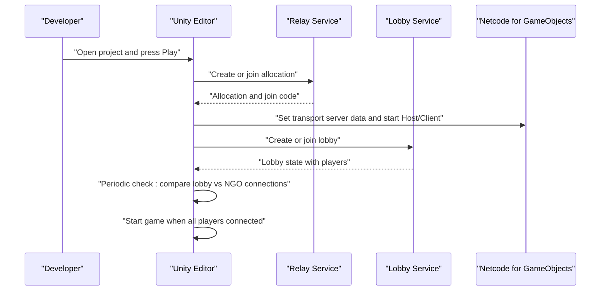

# Getting Started

<cite>
**Referenced Files in This Document**
- [README.md](file://README.md)
- [Test/README.md](file://Test/README.md)
- [Test/package.json](file://Test/package.json)
- [Test/src/UnityWebSocketClient.ts](file://Test/src/UnityWebSocketClient.ts)
- [Assets/FPS-Game/Scripts/System/WebSocketServerManager.cs](file://Assets/FPS-Game/Scripts/System/WebSocketServerManager.cs)
- [Assets/FPS-Game/Scripts/System/AgentWebSocketHandler.cs](file://Assets/FPS-Game/Scripts/System/AgentWebSocketHandler.cs)
- [Assets/FPS-Game/Scripts/System/WebSocketDataStructures.cs](file://Assets/FPS-Game/Scripts/System/WebSocketDataStructures.cs)
- [Assets/FPS-Game/Scripts/System/GameMode.cs](file://Assets/FPS-Game/Scripts/System/GameMode.cs)
- [Assets/FPS-Game/Scripts/System/WebSocket/SETUP_GUIDE.md](file://Assets/FPS-Game/Scripts/System/WebSocket/SETUP_GUIDE.md)
- [ProjectSettings/ProjectVersion.txt](file://ProjectSettings/ProjectVersion.txt)
- [Packages/manifest.json](file://Packages/manifest.json)
- [ProjectSettings/PackageManagerSettings.asset](file://ProjectSettings/PackageManagerSettings.asset)
- [ProjectSettings/NetcodeForGameObjects.asset](file://ProjectSettings/NetcodeForGameObjects.asset)
- [ProjectSettings/URPProjectSettings.asset](file://ProjectSettings/URPProjectSettings.asset)
- [ProjectSettings/UnityConnectSettings.asset](file://ProjectSettings/UnityConnectSettings.asset)
- [Assets/FPS-Game/Scripts/Lobby Script/Lobby/Scripts/Relay.cs](file://Assets/FPS-Game/Scripts/Lobby Script/Lobby/Scripts/Relay.cs)
- [Assets/FPS-Game/Scripts/System/LobbyRelayChecker.cs](file://Assets/FPS-Game/Scripts/System/LobbyRelayChecker.cs)
- [Assets/FPS-Game/Scripts/Player/PlayerNetwork.cs](file://Assets/FPS-Game/Scripts/Player/PlayerNetwork.cs)
</cite>

## Update Summary
**Changes Made**
- Updated Unity engine requirement from 2022.3.45f1 to Unity 6000.4.3f1
- Updated Unity Package Manager dependencies to reflect current package versions
- Enhanced WebSocket AI Agent Mode section with latest setup instructions and troubleshooting guidance
- Updated system requirements and recommended specifications for Unity 6000.4 LTS
- Revised installation requirements to match current package manifest

## Table of Contents
1. [Introduction](#introduction)
2. [Prerequisites](#prerequisites)
3. [Installation Requirements](#installation-requirements)
4. [Project Setup](#project-setup)
5. [Run Modes](#run-modes)
6. [Initial Configuration](#initial-configuration)
7. [First-Time Running](#first-time-running)
8. [Internet Connectivity Requirements](#internet-connectivity-requirements)
9. [WebSocket AI Agent Mode](#websocket-ai-agent-mode)
10. [Troubleshooting Guide](#troubleshooting-guide)
11. [Project Cleanup Procedures](#project-cleanup-procedures)
12. [Conclusion](#conclusion)

## Introduction
This guide helps you install, configure, and run the FPS game project locally. It covers Unity 6000.4 LTS version requirements, Unity Gaming Services setup (Relay, Lobby, Authentication), dependency installation via Unity Package Manager, and multiple run modes: Unity Editor development workflow, standalone build execution, and WebSocket AI Agent Mode for external AI agent control. It also includes troubleshooting tips, connectivity requirements for Unity Relay, and cleanup procedures.

## Prerequisites
- Unity 6000.4 LTS or later installed and licensed.
- Basic familiarity with Unity Editor and C# programming.
- Understanding of networking concepts (client-host topology).
- Access to Unity Services dashboard to enable Unity Relay, Unity Lobby, and Unity Authentication.
- **For WebSocket AI Agent Mode**: Node.js 18+ for TypeScript client development.

## Installation Requirements
- Unity version: 6000.4 LTS (Unity 6000.4.3f1).
- Unity Package Manager dependencies include:
  - Netcode for GameObjects (2.11.0)
  - Universal Render Pipeline (17.4.0)
  - Input System (1.19.0)
  - AI Navigation (2.0.12)
  - Cinemachine (2.12.0)
  - Unity Services packages for Relay and Lobby
  - **Optional**: websocket-sharp library for WebSocket AI Agent Mode

These dependencies are declared in the project's package manifest and are required for networking, rendering, and UI/text.

**Section sources**
- [ProjectSettings/ProjectVersion.txt:1-3](file://ProjectSettings/ProjectVersion.txt#L1-L3)
- [Packages/manifest.json:1-69](file://Packages/manifest.json#L1-L69)

## Project Setup
Follow these steps to prepare the project:

1. Open the project in Unity 6000.4 LTS.
2. Unity will automatically fetch and install packages listed in the manifest.
3. Verify that the following settings are present:
   - Netcode for GameObjects configured with default network prefabs.
   - Universal Render Pipeline settings applied.
   - Unity Package Manager scoped registry enabled (default Unity registry).
4. Confirm that Unity Services are enabled in the Unity Editor:
   - Unity Relay, Unity Lobby, and Unity Authentication must be active in the Services window.

Key configuration files:
- Netcode for GameObjects settings define the network prefabs path and generation behavior.
- URP settings control rendering pipeline parameters.
- Package Manager settings enable scoped registries and package dependencies.
- Unity Connect settings control analytics and service integrations.

**Section sources**
- [ProjectSettings/NetcodeForGameObjects.asset:1-18](file://ProjectSettings/NetcodeForGameObjects.asset#L1-L18)
- [ProjectSettings/URPProjectSettings.asset:1-16](file://ProjectSettings/URPProjectSettings.asset#L1-L16)
- [ProjectSettings/PackageManagerSettings.asset:1-36](file://ProjectSettings/PackageManagerSettings.asset#L1-L36)
- [ProjectSettings/UnityConnectSettings.asset:1-37](file://ProjectSettings/UnityConnectSettings.asset#L1-L37)

## Run Modes
The project supports three primary run modes:

- **Unity Editor development workflow**
  - Open the project in Unity 6000.4 LTS.
  - Install dependencies via Unity Package Manager.
  - Press Play to start the game in the editor.

- **Standalone build execution**
  - Ensure the project is linked to Unity Services (Relay + Authentication enabled).
  - Build the project via File > Build Settings.
  - Launch the generated executable.

- **WebSocket AI Agent Mode** *(New)*
  - Configure Unity for WebSocket communication.
  - Install websocket-sharp library dependency.
  - Set game mode to WebSocketAgent.
  - Run TypeScript test client for AI agent simulation.

Important note: Internet connectivity is required for Unity Relay to function properly.

**Section sources**
- [README.md:112-200](file://README.md#L112-L200)

## Initial Configuration
Before running, confirm the following:

- **Unity Services**
  - Unity Relay: Required for NAT-traversal and serverless connectivity.
  - Unity Lobby: Required for matchmaking and session management.
  - Unity Authentication: Required for player identity and lobby data mapping.

- **NGO and Relay integration**
  - The project uses NGO for authoritative gameplay and Relay for transport.
  - The Relay integration sets transport server data and starts host/client sessions.

- **Lobby and Relay checker**
  - The lobby checker periodically compares the number of players in the lobby versus the number connected via NGO to trigger the start of the game when ready.

- **Player network mapping**
  - Player names are mapped from lobby data to networked player instances for UI and scoring.



**Diagram sources**
- [Assets/FPS-Game/Scripts/Lobby Script/Lobby/Scripts/Relay.cs:26-71](file://Assets/FPS-Game/Scripts/Lobby Script/Lobby/Scripts/Relay.cs#L26-L71)
- [Assets/FPS-Game/Scripts/System/LobbyRelayChecker.cs:19-62](file://Assets/FPS-Game/Scripts/System/LobbyRelayChecker.cs#L19-L62)
- [Assets/FPS-Game/Scripts/Player/PlayerNetwork.cs:183-199](file://Assets/FPS-Game/Scripts/Player/PlayerNetwork.cs#L183-L199)

**Section sources**
- [Assets/FPS-Game/Scripts/Lobby Script/Lobby/Scripts/Relay.cs:10-71](file://Assets/FPS-Game/Scripts/Lobby Script/Lobby/Scripts/Relay.cs#L10-L71)
- [Assets/FPS-Game/Scripts/System/LobbyRelayChecker.cs:8-62](file://Assets/FPS-Game/Scripts/System/LobbyRelayChecker.cs#L8-L62)
- [Assets/FPS-Game/Scripts/Player/PlayerNetwork.cs:12-39](file://Assets/FPS-Game/Scripts/Player/PlayerNetwork.cs#L12-L39)

## First-Time Running
Follow these steps for a successful first run:

1. Open the project in Unity 6000.4 LTS.
2. Allow Unity to install packages from the manifest.
3. Ensure Unity Services are enabled (Relay, Lobby, Authentication).
4. Enter the Sign In scene and sign in to Unity Authentication.
5. Navigate to the Lobby List scene and create or join a lobby.
6. Start the game once all players are connected (checked by the lobby-relay checker).
7. Play the game in the Play Scene.

Notes:
- Internet connectivity is required for Unity Relay to allocate and join allocations.
- The lobby checker compares lobby player counts with NGO-connected clients to ensure readiness.

**Section sources**
- [README.md:132-157](file://README.md#L132-L157)
- [Assets/FPS-Game/Scripts/System/LobbyRelayChecker.cs:40-61](file://Assets/FPS-Game/Scripts/System/LobbyRelayChecker.cs#L40-L61)

## Internet Connectivity Requirements
- Unity Relay requires an active internet connection to:
  - Allocate relay resources for hosting.
  - Retrieve join codes for clients.
  - Establish transport server data for NGO.

Without internet, Relay operations will fail and the game cannot connect.

**Section sources**
- [README.md:25-40](file://README.md#L25-L40)

## WebSocket AI Agent Mode
*(New Section)*

The WebSocket AI Agent Mode enables external AI agents to control the Unity FPS game through a WebSocket interface. This mode operates independently of Unity's multiplayer services and provides a simplified development environment for AI agent testing.

### Unity Setup for WebSocket Mode

1. **Install websocket-sharp Library**
   - **Option A (Recommended)**: Unity Package Manager
     - Open Unity Editor → Window → Package Manager
     - Click "+" → "Add package from git URL..."
     - Enter: `https://github.com/sta/websocket-sharp.git`
     - Click "Add" and wait for import completion
   - **Option B**: Manual DLL Import
     - Download websocket-sharp from: https://github.com/sta/websocket-sharp/releases
     - Extract `websocket-sharp.dll` from the release
     - Copy to: `Assets/Plugins/`
     - Unity will automatically import it

2. **Configure Game Mode**
   - Open `Assets/FPS-Game/Scenes/MainScenes/Play Scene`
   - Find the `InGameManager` GameObject in the hierarchy
   - In the Inspector, locate `Game Mode Configuration`
   - Set **Game Mode** to: `WebSocketAgent`

3. **Add WebSocket Components**
   - In the same `InGameManager` GameObject, add these components:
     - `WebSocketServerManager` (Component > Scripts > WebSocketServerManager)
     - `CoroutineManager` (Component > Scripts > CoroutineManager)
   - Configure `WebSocketServerManager`:
     - **Port**: `8080` (default)
     - **Endpoint**: `/agent` (default)
     - **Broadcast Interval**: `0.1` (10 Hz)
     - **Auto Start**: ✓ (checked)

4. **Start the Game**
   - Press **Play** in Unity
   - Check Console for:
     ```
     [InGameManager] Initializing WebSocket Agent Mode
     [WebSocketServer] Server started on ws://0.0.0.0:8080/agent
     ```

### TypeScript Client Setup

1. **Install Node.js Dependencies**
   ```bash
   cd Test/
   npm install
   ```

2. **Run Basic Test**
   ```bash
   # Basic test - connect and receive game states
   npm run dev
   ```

3. **Test Commands**
   ```bash
   # Test movement
   npm run test-move
   
   # Test shooting
   npm run test-shoot
   
   # Test full scenario
   npm run test-full
   ```

### WebSocket Communication Protocol

**Command Format (Client → Unity)**
```json
{
  "commandType": "MOVE",
  "data": {
    "x": 0,
    "y": 0,
    "z": 1
  },
  "agentId": "test_client_01",
  "timestamp": 1234567890
}
```

**Game State Format (Unity → Client)**
```json
{
  "timestamp": 123.45,
  "frameCount": 7410,
  "player": {
    "position": { "x": 0, "y": 1, "z": 0 },
    "rotation": { "x": 0, "y": 0, "z": 0 },
    "health": 100,
    "maxHealth": 100,
    "currentAmmo": 30,
    "maxAmmo": 30,
    "movementState": "Running"
  },
  "enemies": [...],
  "gameInfo": {
    "matchTime": 120.5,
    "isGameActive": true
  }
}
```

**Available Commands**
- `MOVE`: Move player in direction `[x, y, z]` for specified duration
- `LOOK`: Rotate camera with pitch/yaw/roll (degrees)
- `SHOOT`: Fire weapon for specified duration
- `JUMP`: Execute jump action
- `RELOAD`: Reload weapon
- `STOP`: Stop all actions
- `SWITCH_WEAPON`: Change to specified weapon index

**Section sources**
- [README.md:158-200](file://README.md#L158-L200)
- [Test/README.md:10-70](file://Test/README.md#L10-L70)
- [Test/package.json:1-27](file://Test/package.json#L1-L27)
- [Assets/FPS-Game/Scripts/System/WebSocketServerManager.cs:17-96](file://Assets/FPS-Game/Scripts/System/WebSocketServerManager.cs#L17-L96)
- [Assets/FPS-Game/Scripts/System/AgentWebSocketHandler.cs:14-65](file://Assets/FPS-Game/Scripts/System/AgentWebSocketHandler.cs#L14-L65)
- [Assets/FPS-Game/Scripts/System/WebSocketDataStructures.cs:8-168](file://Assets/FPS-Game/Scripts/System/WebSocketDataStructures.cs#L8-L168)
- [Assets/FPS-Game/Scripts/System/GameMode.cs:4-20](file://Assets/FPS-Game/Scripts/System/GameMode.cs#L4-L20)

## Troubleshooting Guide
Common setup issues and resolutions:

- **Unity Services not enabled**
  - Symptom: Cannot create or join lobbies; Relay operations fail.
  - Resolution: Enable Unity Relay, Unity Lobby, and Unity Authentication in the Unity Editor Services window.

- **Missing or outdated packages**
  - Symptom: Compilation errors or missing types related to Relay, Lobby, or NGO.
  - Resolution: Reopen the project to trigger Unity Package Manager to fetch dependencies from the manifest.

- **NGO network prefab configuration**
  - Symptom: Runtime errors related to missing network prefabs.
  - Resolution: Verify NGO settings point to the default network prefabs asset.

- **URP rendering issues**
  - Symptom: Visual artifacts or missing materials.
  - Resolution: Confirm URP project settings are loaded and material versions are compatible.

- **Lobby vs NGO connection mismatch**
  - Symptom: Game does not start even though the lobby appears full.
  - Resolution: Wait for the lobby-relay checker to detect equal counts of lobby players and NGO-connected clients.

- **Authentication mapping failures**
  - Symptom: Player names not appearing in-game.
  - Resolution: Ensure Authentication is initialized and player IDs are available before mapping lobby data to networked player instances.

- **WebSocket Connection Issues** *(New)*
  - **Issue**: "Cannot find namespace 'WebSocketSharp'"
    - **Solution**: websocket-sharp library is not installed. Follow WebSocket setup instructions.
  - **Issue**: "Connection refused" in test client
    - **Solution**: Make sure Unity is in Play mode, WebSocket server started, and port 8080 is not in use.
  - **Issue**: Commands received but not executed
    - **Solution**: Check `PlayerRoot` exists in scene, `AIInputFeeder` is attached to player, and game mode is `WebSocketAgent`.
  - **Issue**: No game state updates
    - **Solution**: Verify `WebSocketServerManager` is active in scene, `BroadcastInterval` is set, and player is spawned in scene.

**Section sources**
- [ProjectSettings/PackageManagerSettings.asset:15-27](file://ProjectSettings/PackageManagerSettings.asset#L15-L27)
- [ProjectSettings/NetcodeForGameObjects.asset:15-17](file://ProjectSettings/NetcodeForGameObjects.asset#L15-L17)
- [ProjectSettings/URPProjectSettings.asset:10-16](file://ProjectSettings/URPProjectSettings.asset#L10-L16)
- [Assets/FPS-Game/Scripts/System/LobbyRelayChecker.cs:40-61](file://Assets/FPS-Game/Scripts/System/LobbyRelayChecker.cs#L40-L61)
- [Assets/FPS-Game/Scripts/Player/PlayerNetwork.cs:183-199](file://Assets/FPS-Game/Scripts/Player/PlayerNetwork.cs#L183-L199)
- [Test/README.md:191-213](file://Test/README.md#L191-L213)

## Project Cleanup Procedures
The project has been cleaned to remove unused assets, packages, and demo files. To replicate or verify cleanup:

- Remove unused third-party packages and meta files.
- Delete demo/test scenes and scripts.
- Keep only production-ready assets and required packages:
  - Behavior Designer (AI behavior trees)
  - TextMesh Pro (text rendering)
  - FPS-Game content (scripts, scenes, prefabs)
  - InputActions (Unity Input System)
  - DefaultNetworkPrefabs.asset (NGO configuration)
  - UniversalRenderPipelineGlobalSettings.asset (URP settings)

Verification checklist:
- All production scenes load correctly.
- Core systems (Networking, Player, AI Bot, Zone System, Game Session) remain functional.
- No compile errors and no missing references.

**Section sources**
- [README.md:106-131](file://README.md#L106-L131)
- [README.md:134-175](file://README.md#L134-L175)
- [README.md:214-233](file://README.md#L214-L233)

## Conclusion
You are now ready to run the FPS game project. Use Unity 6000.4 LTS, ensure Unity Services (Relay, Lobby, Authentication) are enabled, install dependencies via Unity Package Manager, and choose from three run modes: Unity Editor development workflow, standalone build execution, or WebSocket AI Agent Mode for external AI agent control. For reliable networking, keep an internet connection available. The WebSocket AI Agent Mode provides a powerful development environment for AI agent testing with TypeScript client support. If issues arise, consult the troubleshooting section and verify cleanup and configuration steps.