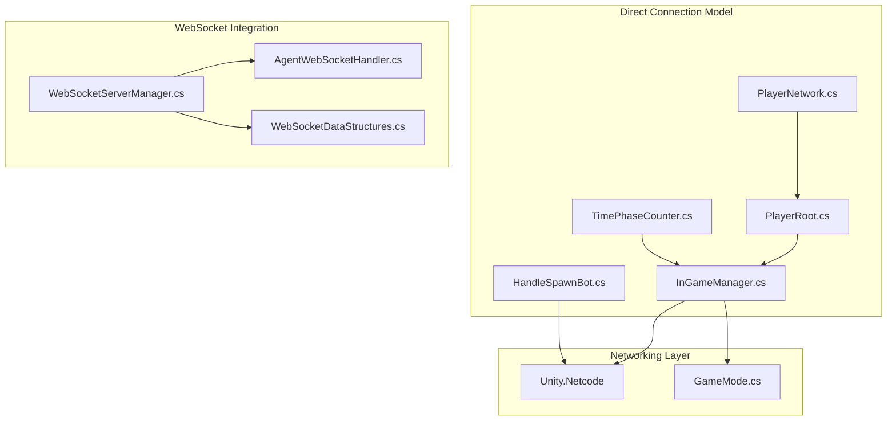
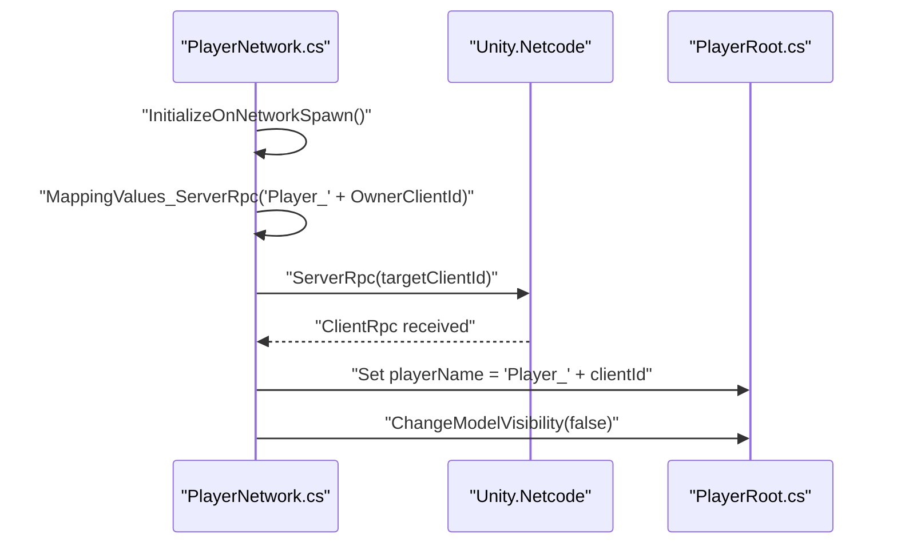
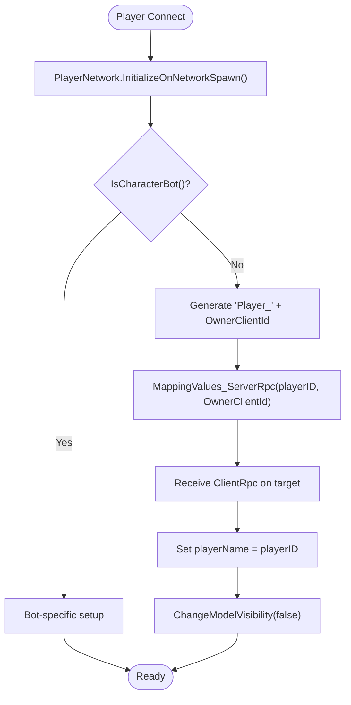
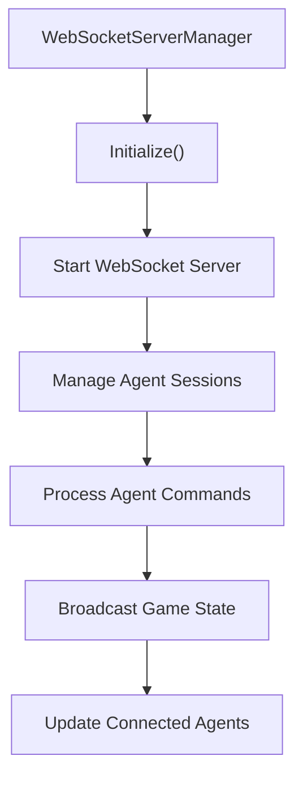
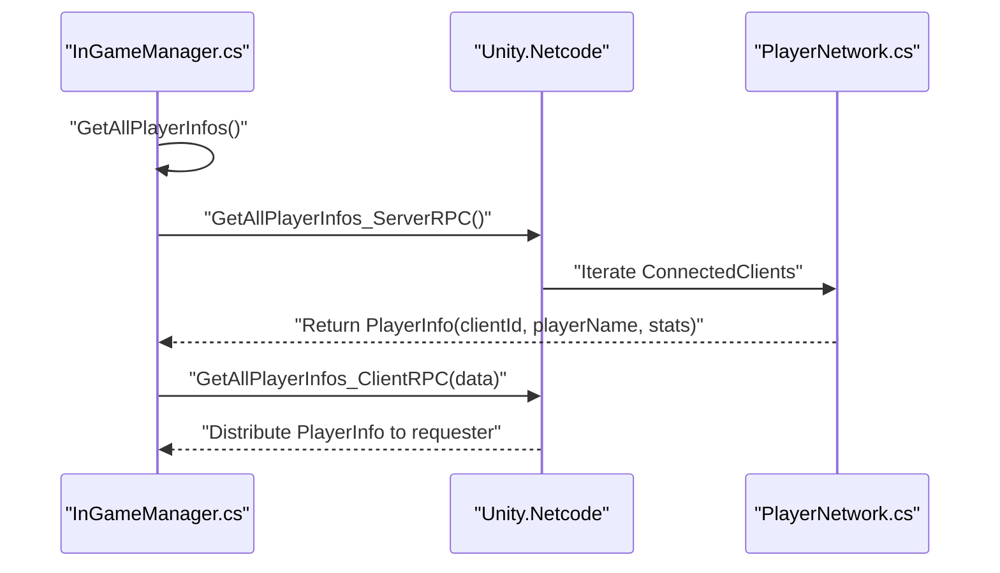
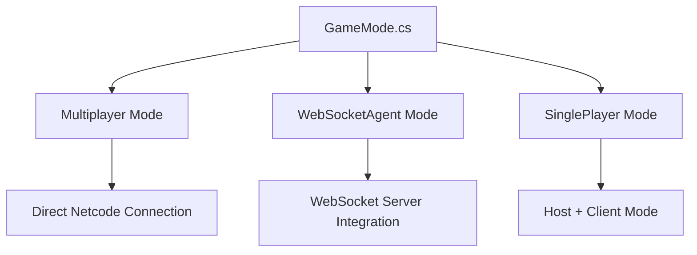
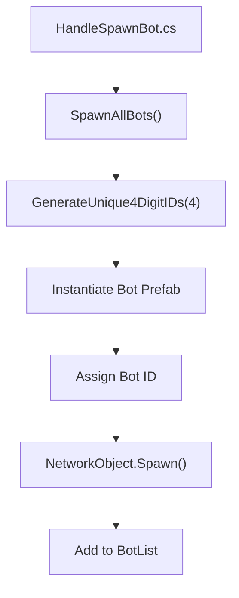
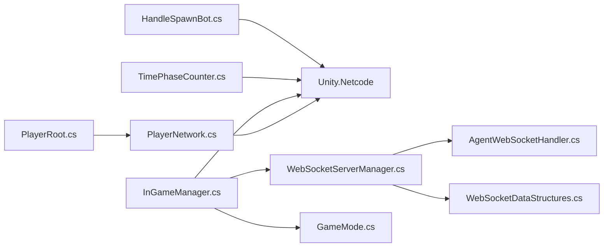

# Authentication System

<cite>
**Referenced Files in This Document**
- [PlayerNetwork.cs](file://Assets/FPS-Game/Scripts/Player/PlayerNetwork.cs)
- [PlayerRoot.cs](file://Assets/FPS-Game/Scripts/Player/PlayerRoot.cs)
- [InGameManager.cs](file://Assets/FPS-Game/Scripts/System/InGameManager.cs)
- [TimePhaseCounter.cs](file://Assets/FPS-Game/Scripts/System/TimePhaseCounter.cs)
- [WebSocketServerManager.cs](file://Assets/FPS-Game/Scripts/System/WebSocketServerManager.cs)
- [WebSocketDataStructures.cs](file://Assets/FPS-Game/Scripts/System/WebSocketDataStructures.cs)
- [AgentWebSocketHandler.cs](file://Assets/FPS-Game/Scripts/System/AgentWebSocketHandler.cs)
- [HandleSpawnBot.cs](file://Assets/FPS-Game/Scripts/System/HandleSpawnBot.cs)
- [GameMode.cs](file://Assets/FPS-Game/Scripts/System/GameMode.cs)
- [README.md](file://README.md)
</cite>

## Update Summary
**Changes Made**
- Complete removal of Unity Authentication Service dependencies and lobby management system
- Replacement of authentication-based player identification with direct client ID mapping
- Elimination of Unity Services Core dependencies in favor of pure Netcode networking
- Updated player profile initialization to use generated 'Player_{ClientId}' string format
- Removal of lobby management and Relay integration components
- Introduction of WebSocket agent mode for AI integration without authentication
- Implementation of GameMode enumeration supporting multiple operational modes

## Table of Contents
1. [Introduction](#introduction)
2. [Project Structure](#project-structure)
3. [Core Components](#core-components)
4. [Architecture Overview](#architecture-overview)
5. [Detailed Component Analysis](#detailed-component-analysis)
6. [Dependency Analysis](#dependency-analysis)
7. [Performance Considerations](#performance-considerations)
8. [Troubleshooting Guide](#troubleshooting-guide)
9. [Conclusion](#conclusion)

## Introduction
This document explains the authentication system evolution in the lobby management system. The system has been completely refactored to eliminate Unity Authentication Service dependencies and adopt a direct connection model. The new architecture uses generated 'Player_{ClientId}' string formats for player identification and leverages Unity Netcode for all networking operations without requiring Unity Services authentication or lobby management.

**Updated** The authentication system now operates independently of Unity Services, focusing purely on Netcode-based player identification with direct connection model using generated 'Player_{ClientId}' string formats. The system maintains player identity mapping through ServerRpc calls and eliminates all authentication dependencies.

## Project Structure
The authentication system now operates independently of Unity Services, focusing purely on Netcode-based player identification and networking. The system maintains player identity mapping through ServerRpc calls and eliminates all authentication dependencies.

**Diagram sources**
- [PlayerNetwork.cs:12-55](file://Assets/FPS-Game/Scripts/Player/PlayerNetwork.cs#L12-L55)
- [PlayerRoot.cs:160-218](file://Assets/FPS-Game/Scripts/Player/PlayerRoot.cs#L160-L218)
- [InGameManager.cs:66-159](file://Assets/FPS-Game/Scripts/System/InGameManager.cs#L66-L159)
- [WebSocketServerManager.cs:17-108](file://Assets/FPS-Game/Scripts/System/WebSocketServerManager.cs#L17-L108)
- [GameMode.cs:4-20](file://Assets/FPS-Game/Scripts/System/GameMode.cs#L4-L20)

**Section sources**
- [PlayerNetwork.cs:38-40](file://Assets/FPS-Game/Scripts/Player/PlayerNetwork.cs#L38-L40)
- [PlayerNetwork.cs:185-195](file://Assets/FPS-Game/Scripts/Player/PlayerNetwork.cs#L185-L195)
- [GameMode.cs:4-20](file://Assets/FPS-Game/Scripts/System/GameMode.cs#L4-L20)

## Core Components
- **Direct Player Identification**: Replaces Unity Authentication Service with direct client ID mapping using the format 'Player_{ClientId}'
- **ServerRpc-Based Mapping**: Uses MappingValues_ServerRpc to establish player identity across the network
- **Netcode-First Architecture**: Eliminates all Unity Services dependencies in favor of pure Unity Netcode operations
- **WebSocket Agent Integration**: Maintains AI agent connectivity through WebSocket server without authentication requirements
- **Simplified Player Management**: Player names are generated dynamically using client IDs instead of authenticated profiles
- **Multi-Mode Game Architecture**: Supports Multiplayer, WebSocketAgent, and SinglePlayer operational modes
- **Bot Management System**: Handles AI bot spawning and identification without authentication dependencies

**Section sources**
- [PlayerNetwork.cs:38-40](file://Assets/FPS-Game/Scripts/Player/PlayerNetwork.cs#L38-L40)
- [PlayerNetwork.cs:185-195](file://Assets/FPS-Game/Scripts/Player/PlayerNetwork.cs#L185-L195)
- [InGameManager.cs:111-124](file://Assets/FPS-Game/Scripts/System/InGameManager.cs#L111-L124)
- [GameMode.cs:4-20](file://Assets/FPS-Game/Scripts/System/GameMode.cs#L4-L20)

## Architecture Overview
The new authentication-free architecture operates entirely on Unity Netcode without external authentication services. Player identification flows directly through network connections using client IDs.

**Diagram sources**
- [PlayerNetwork.cs:22-55](file://Assets/FPS-Game/Scripts/Player/PlayerNetwork.cs#L22-L55)
- [PlayerNetwork.cs:185-195](file://Assets/FPS-Game/Scripts/Player/PlayerNetwork.cs#L185-L195)

## Detailed Component Analysis

### Direct Player Identification and Mapping
The system now generates player names using the 'Player_{ClientId}' format instead of relying on Unity Authentication Service. This approach eliminates authentication dependencies while maintaining unique player identification.

**Diagram sources**
- [PlayerNetwork.cs:22-55](file://Assets/FPS-Game/Scripts/Player/PlayerNetwork.cs#L22-L55)
- [PlayerNetwork.cs:185-195](file://Assets/FPS-Game/Scripts/Player/PlayerNetwork.cs#L185-L195)

**Section sources**
- [PlayerNetwork.cs:38-40](file://Assets/FPS-Game/Scripts/Player/PlayerNetwork.cs#L38-L40)
- [PlayerNetwork.cs:185-195](file://Assets/FPS-Game/Scripts/Player/PlayerNetwork.cs#L185-L195)

### WebSocket Agent Integration Without Authentication
The system maintains AI agent integration through WebSocket connections without requiring Unity Authentication Service. This enables autonomous agent control for testing and development scenarios.

**Diagram sources**
- [WebSocketServerManager.cs:71-96](file://Assets/FPS-Game/Scripts/System/WebSocketServerManager.cs#L71-L96)
- [WebSocketServerManager.cs:138-160](file://Assets/FPS-Game/Scripts/System/WebSocketServerManager.cs#L138-L160)

**Section sources**
- [WebSocketServerManager.cs:17-108](file://Assets/FPS-Game/Scripts/System/WebSocketServerManager.cs#L17-L108)
- [InGameManager.cs:164-172](file://Assets/FPS-Game/Scripts/System/InGameManager.cs#L164-L172)

### Netcode-Based Player Information Management
Player information is managed entirely through Unity Netcode RPC calls without external authentication dependencies. The system captures and distributes player data across the network.

**Diagram sources**
- [InGameManager.cs:204-257](file://Assets/FPS-Game/Scripts/System/InGameManager.cs#L204-L257)

**Section sources**
- [InGameManager.cs:204-257](file://Assets/FPS-Game/Scripts/System/InGameManager.cs#L204-L257)

### Multi-Mode Game Architecture
The system now supports multiple operational modes through the GameMode enumeration, eliminating the need for Unity Services in all scenarios.

**Diagram sources**
- [GameMode.cs:4-20](file://Assets/FPS-Game/Scripts/System/GameMode.cs#L4-L20)
- [InGameManager.cs:111-172](file://Assets/FPS-Game/Scripts/System/InGameManager.cs#L111-L172)

**Section sources**
- [GameMode.cs:4-20](file://Assets/FPS-Game/Scripts/System/GameMode.cs#L4-L20)
- [InGameManager.cs:111-172](file://Assets/FPS-Game/Scripts/System/InGameManager.cs#L111-L172)

### Bot Management System
The bot management system handles AI bot spawning and identification without authentication dependencies, using unique 4-digit IDs for bot identification.

**Diagram sources**
- [HandleSpawnBot.cs:27-55](file://Assets/FPS-Game/Scripts/System/HandleSpawnBot.cs#L27-L55)

**Section sources**
- [HandleSpawnBot.cs:27-55](file://Assets/FPS-Game/Scripts/System/HandleSpawnBot.cs#L27-L55)

## Dependency Analysis
The authentication system has been completely decoupled from Unity Services, creating a leaner dependency structure focused solely on Unity Netcode and WebSocket integration.

**Diagram sources**
- [PlayerNetwork.cs:1-10](file://Assets/FPS-Game/Scripts/Player/PlayerNetwork.cs#L1-L10)
- [InGameManager.cs:1-8](file://Assets/FPS-Game/Scripts/System/InGameManager.cs#L1-L8)
- [WebSocketServerManager.cs:1-8](file://Assets/FPS-Game/Scripts/System/WebSocketServerManager.cs#L1-L8)
- [GameMode.cs:1-8](file://Assets/FPS-Game/Scripts/System/GameMode.cs#L1-L8)

**Section sources**
- [PlayerNetwork.cs:1-10](file://Assets/FPS-Game/Scripts/Player/PlayerNetwork.cs#L1-L10)
- [InGameManager.cs:1-8](file://Assets/FPS-Game/Scripts/System/InGameManager.cs#L1-L8)

## Performance Considerations
- **Reduced Latency**: Elimination of authentication overhead improves connection speed
- **Simplified State Management**: Direct client ID mapping reduces complexity in player identification
- **WebSocket Efficiency**: Dedicated WebSocket server for AI agents without authentication overhead
- **Netcode Optimization**: Pure Netcode operations minimize external dependency performance impacts
- **Memory Efficiency**: Bot management uses compact 4-digit IDs instead of complex authentication tokens
- **Scalability**: Direct connection model scales better than Unity Services-based architectures

## Troubleshooting Guide
- **Connection Issues**: Verify Unity Netcode is properly configured without authentication requirements
- **Player Identification**: Ensure 'Player_{ClientId}' format is correctly applied during network initialization
- **WebSocket Integration**: Check WebSocket server initialization and agent connection status
- **RPC Communication**: Verify ServerRpc/ClientRpc patterns for player data synchronization
- **Bot Setup**: Confirm bot-specific initialization bypasses authentication-dependent logic
- **Game Mode Selection**: Verify correct GameMode setting for desired operational behavior
- **Multiplayer Connectivity**: Ensure both host and clients use the same GameMode setting

**Section sources**
- [README.md:91-96](file://README.md#L91-L96)
- [PlayerNetwork.cs:38-40](file://Assets/FPS-Game/Scripts/Player/PlayerNetwork.cs#L38-L40)
- [WebSocketServerManager.cs:71-96](file://Assets/FPS-Game/Scripts/System/WebSocketServerManager.cs#L71-L96)

## Conclusion
The authentication system has been completely restructured to operate independently of Unity Authentication Service and Unity Lobby services. The new direct connection model uses Unity Netcode for all networking operations, implementing player identification through generated 'Player_{ClientId}' strings. This architecture eliminates authentication dependencies while maintaining robust player management, WebSocket agent integration, and simplified network communication patterns. The introduction of GameMode enumeration provides flexibility for different operational scenarios, from traditional multiplayer to AI agent-controlled environments, all without requiring Unity Services authentication or lobby management.