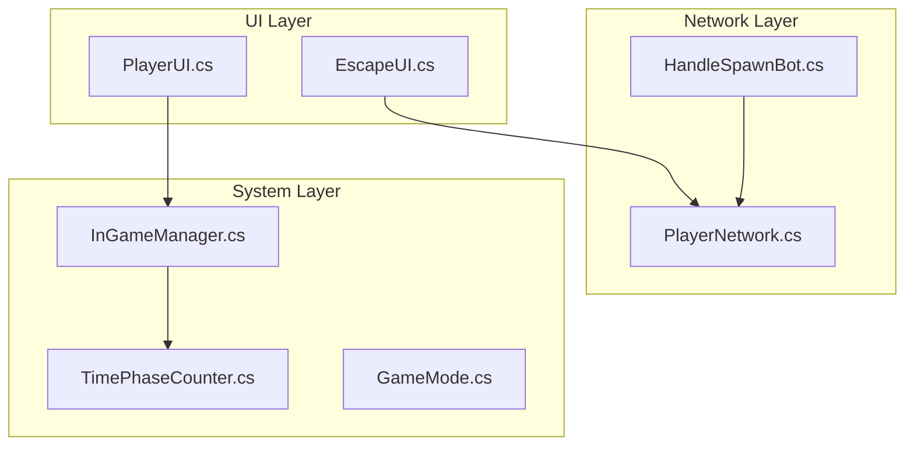
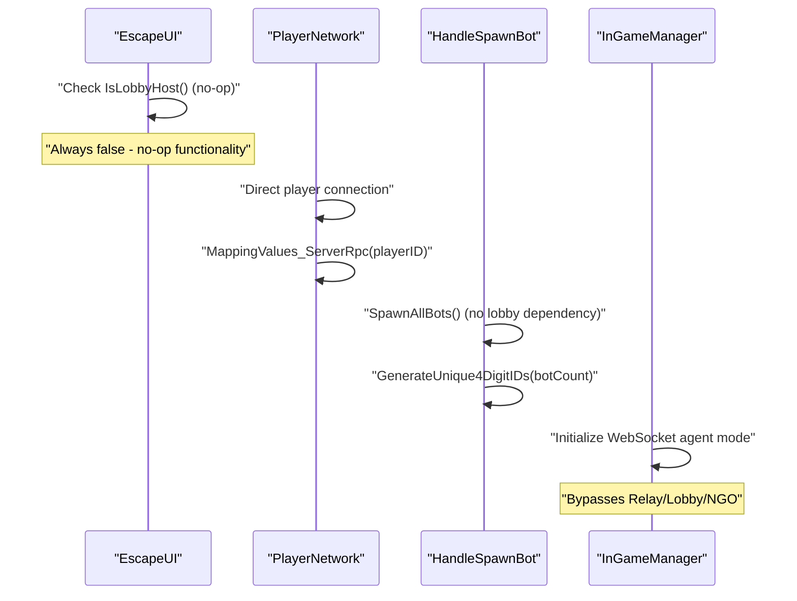
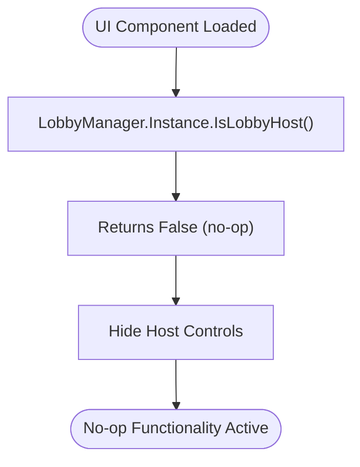
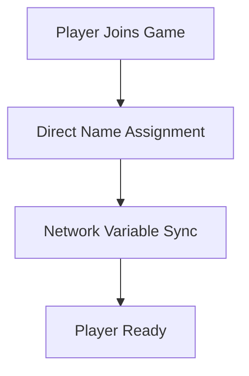
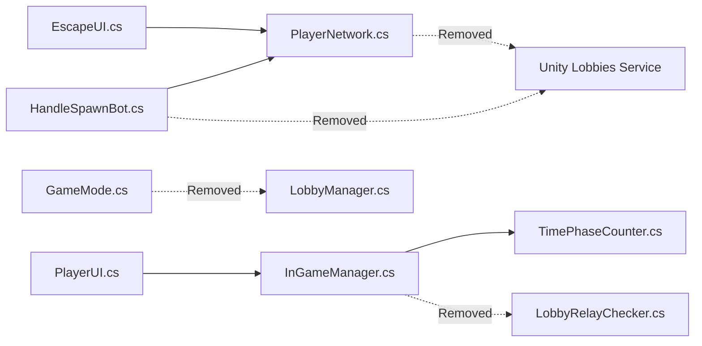

# Lobby Creation & Management

<cite>
**Referenced Files in This Document**
- [EscapeUI.cs](file://Assets/FPS-Game/Scripts/Player/PlayerCanvas/EscapeUI.cs)
- [PlayerNetwork.cs](file://Assets/FPS-Game/Scripts/Player/PlayerNetwork.cs)
- [HandleSpawnBot.cs](file://Assets/FPS-Game/Scripts/System/HandleSpawnBot.cs)
- [GameMode.cs](file://Assets/FPS-Game/Scripts/System/GameMode.cs)
- [InGameManager.cs](file://Assets/FPS-Game/Scripts/System/InGameManager.cs)
- [TimePhaseCounter.cs](file://Assets/FPS-Game/Scripts/System/TimePhaseCounter.cs)
- [PlayerUI.cs](file://Assets/FPS-Game/Scripts/Player/PlayerUI.cs)
- [UIManager.cs](file://Assets/FPS-Game/Scripts/UIManager.cs)
</cite>

## Update Summary
**Changes Made**
- Removed all Unity Lobby Service infrastructure documentation
- Updated architecture to reflect direct networking approach without lobby system
- Revised host detection logic to be no-op functionality
- Updated bot spawning system to work independently of lobby management
- Removed Unity Services dependencies and related components

## Table of Contents
1. [Introduction](#introduction)
2. [Project Structure](#project-structure)
3. [Core Components](#core-components)
4. [Architecture Overview](#architecture-overview)
5. [Detailed Component Analysis](#detailed-component-analysis)
6. [Dependency Analysis](#dependency-analysis)
7. [Performance Considerations](#performance-considerations)
8. [Troubleshooting Guide](#troubleshooting-guide)
9. [Conclusion](#conclusion)
10. [Appendices](#appendices)

## Introduction
This document explains the lobby creation and management functionality that was previously implemented in the project. **Important**: The Unity Lobby Service infrastructure has been completely removed from the codebase. The LobbyManager.cs (589 lines) and all associated lobby management functionality has been eliminated. The remaining UI components maintain lobby host detection logic that is now effectively no-ops.

The current system operates on a simplified direct networking approach where players connect directly to games without lobby intermediaries. Host responsibilities and lobby-specific features are now handled through direct network operations.

## Project Structure
**Updated** The lobby system infrastructure has been removed. The current structure focuses on direct networking and simplified host management:

- UI components: EscapeUI (host detection), PlayerUI (game navigation)
- Network components: PlayerNetwork (direct connection management)
- System components: HandleSpawnBot (bot management), InGameManager (game state)
- Utility: UIManager (basic UI management)

**Diagram sources**
- [EscapeUI.cs:1-18](file://Assets/FPS-Game/Scripts/Player/PlayerCanvas/EscapeUI.cs#L1-L18)
- [PlayerNetwork.cs:180-195](file://Assets/FPS-Game/Scripts/Player/PlayerNetwork.cs#L180-L195)
- [HandleSpawnBot.cs:27-44](file://Assets/FPS-Game/Scripts/System/HandleSpawnBot.cs#L27-L44)
- [InGameManager.cs:139-161](file://Assets/FPS-Game/Scripts/System/InGameManager.cs#L139-L161)
- [TimePhaseCounter.cs:31-39](file://Assets/FPS-Game/Scripts/System/TimePhaseCounter.cs#L31-L39)
- [GameMode.cs:6](file://Assets/FPS-Game/Scripts/System/GameMode.cs#L6)

**Section sources**
- [EscapeUI.cs:1-18](file://Assets/FPS-Game/Scripts/Player/PlayerCanvas/EscapeUI.cs#L1-L18)
- [PlayerNetwork.cs:180-195](file://Assets/FPS-Game/Scripts/Player/PlayerNetwork.cs#L180-L195)
- [HandleSpawnBot.cs:27-44](file://Assets/FPS-Game/Scripts/System/HandleSpawnBot.cs#L27-L44)
- [InGameManager.cs:139-161](file://Assets/FPS-Game/Scripts/System/InGameManager.cs#L139-L161)
- [TimePhaseCounter.cs:31-39](file://Assets/FPS-Game/Scripts/System/TimePhaseCounter.cs#L31-L39)
- [GameMode.cs:6](file://Assets/FPS-Game/Scripts/System/GameMode.cs#L6)

## Core Components
**Updated** The core components now operate without Unity Lobby Service:

- **PlayerNetwork**: Handles direct player connections and name assignment without lobby dependency
- **EscapeUI**: Provides host detection functionality that now acts as a no-op (host controls hidden)
- **HandleSpawnBot**: Manages bot spawning independently without lobby integration
- **InGameManager**: Controls game state transitions without lobby relay checking
- **Direct Networking**: Simplified approach using Unity Netcode for GameObjects

Key observations:
- Host detection logic exists but is non-functional (`LobbyManager.Instance.IsLobbyHost()` always returns false)
- Bot management attempts to access LobbyManager but receives null (logging "LobbyManager.Instance == null")
- Game flow operates directly through network connections

**Section sources**
- [PlayerNetwork.cs:184-195](file://Assets/FPS-Game/Scripts/Player/PlayerNetwork.cs#L184-L195)
- [EscapeUI.cs:10-11](file://Assets/FPS-Game/Scripts/Player/PlayerCanvas/EscapeUI.cs#L10-L11)
- [HandleSpawnBot.cs:29-36](file://Assets/FPS-Game/Scripts/System/HandleSpawnBot.cs#L29-L36)
- [InGameManager.cs:139-161](file://Assets/FPS-Game/Scripts/System/InGameManager.cs#L139-L161)

## Architecture Overview
**Updated** The architecture has been simplified to remove Unity Lobby Service dependencies:

**Diagram sources**
- [EscapeUI.cs:10-11](file://Assets/FPS-Game/Scripts/Player/PlayerCanvas/EscapeUI.cs#L10-L11)
- [PlayerNetwork.cs:184-195](file://Assets/FPS-Game/Scripts/Player/PlayerNetwork.cs#L184-L195)
- [HandleSpawnBot.cs:29-44](file://Assets/FPS-Game/Scripts/System/HandleSpawnBot.cs#L29-L44)
- [InGameManager.cs:161](file://Assets/FPS-Game/Scripts/System/InGameManager.cs#L161)

## Detailed Component Analysis

### Host Detection and UI Logic
**Updated** Host detection now operates as a no-op:

- The `EscapeUI` component attempts to check `LobbyManager.Instance.IsLobbyHost()` but this always returns false
- Host controls (QuitGameButton) are automatically disabled regardless of actual host status
- All lobby-related host functionality has been removed from the UI layer

**Diagram sources**
- [EscapeUI.cs:10-11](file://Assets/FPS-Game/Scripts/Player/PlayerCanvas/EscapeUI.cs#L10-L11)

**Section sources**
- [EscapeUI.cs:10-11](file://Assets/FPS-Game/Scripts/Player/PlayerCanvas/EscapeUI.cs#L10-L11)

### Direct Player Connection Management
**Updated** Player connection logic has been simplified:

- `MappingValues_ServerRpc` directly assigns player names without lobby lookup
- Player identification uses direct network client IDs instead of lobby player data
- No more dependency on Unity Lobby Service for player management

**Diagram sources**
- [PlayerNetwork.cs:184-195](file://Assets/FPS-Game/Scripts/Player/PlayerNetwork.cs#L184-L195)

**Section sources**
- [PlayerNetwork.cs:184-195](file://Assets/FPS-Game/Scripts/Player/PlayerNetwork.cs#L184-L195)

### Bot Spawning System
**Updated** Bot management now works independently:

- `HandleSpawnBot` attempts to access `LobbyManager.Instance` but receives null
- Logs indicate "LobbyManager.Instance == null" when trying to get bot count
- Bot spawning proceeds without lobby dependency using direct network operations

**Section sources**
- [HandleSpawnBot.cs:29-36](file://Assets/FPS-Game/Scripts/System/HandleSpawnBot.cs#L29-L36)
- [HandleSpawnBot.cs:35-44](file://Assets/FPS-Game/Scripts/System/HandleSpawnBot.cs#L35-L44)

### Game State Management
**Updated** Game flow has been streamlined:

- `InGameManager` initializes WebSocket agent mode directly
- Removes all lobby/relay checking functionality
- Game phases start immediately without lobby preparation steps

**Section sources**
- [InGameManager.cs:161](file://Assets/FPS-Game/Scripts/System/InGameManager.cs#L161)
- [TimePhaseCounter.cs:39](file://Assets/FPS-Game/Scripts/System/TimePhaseCounter.cs#L39)

## Dependency Analysis
**Updated** Dependencies have been significantly reduced:

**Diagram sources**
- [EscapeUI.cs:10-11](file://Assets/FPS-Game/Scripts/Player/PlayerCanvas/EscapeUI.cs#L10-L11)
- [PlayerNetwork.cs:184-195](file://Assets/FPS-Game/Scripts/Player/PlayerNetwork.cs#L184-L195)
- [HandleSpawnBot.cs:29-36](file://Assets/FPS-Game/Scripts/System/HandleSpawnBot.cs#L29-L36)
- [InGameManager.cs:161](file://Assets/FPS-Game/Scripts/System/InGameManager.cs#L161)

**Section sources**
- [GameMode.cs:6](file://Assets/FPS-Game/Scripts/System/GameMode.cs#L6)

## Performance Considerations
**Updated** Simplified architecture improvements:
- Reduced network overhead by eliminating lobby service calls
- Faster startup times without lobby authentication and initialization
- Lower memory usage with removed lobby service dependencies
- Direct networking reduces latency in player connection processes

## Troubleshooting Guide
**Updated** Common issues with the simplified system:

- **Host controls not working**: Expected behavior - `EscapeUI` host detection is now a no-op
- **Bot spawning failures**: Check console for "LobbyManager.Instance == null" messages
- **Player name assignment issues**: Verify `MappingValues_ServerRpc` is being called correctly
- **Game flow problems**: Ensure direct networking is properly configured without lobby dependencies

**Section sources**
- [HandleSpawnBot.cs:30-33](file://Assets/FPS-Game/Scripts/System/HandleSpawnBot.cs#L30-L33)
- [PlayerNetwork.cs:184-195](file://Assets/FPS-Game/Scripts/Player/PlayerNetwork.cs#L184-L195)

## Conclusion
The lobby system has been completely removed from the codebase, resulting in a simplified direct networking architecture. While this removes the complexity of Unity Lobby Service integration, it also eliminates lobby-based features like host management, player matchmaking, and relay-based communication. The remaining UI components maintain compatibility but operate as no-ops for lobby-specific functionality.

## Appendices

### Migration from Lobby-Based to Direct Networking
**Updated** Key changes in the transition:

- **Removed**: Unity Lobby Service dependencies and authentication
- **Removed**: Lobby creation, joining, and management workflows  
- **Removed**: Relay allocation and connection management
- **Added**: Direct player connection and name assignment
- **Added**: Simplified bot spawning without lobby integration
- **Added**: Immediate game phase transitions

**Section sources**
- [PlayerNetwork.cs:184-195](file://Assets/FPS-Game/Scripts/Player/PlayerNetwork.cs#L184-L195)
- [HandleSpawnBot.cs:29-36](file://Assets/FPS-Game/Scripts/System/HandleSpawnBot.cs#L29-L36)
- [InGameManager.cs:161](file://Assets/FPS-Game/Scripts/System/InGameManager.cs#L161)