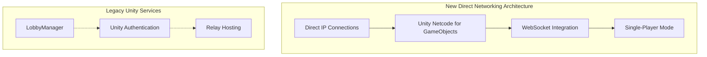
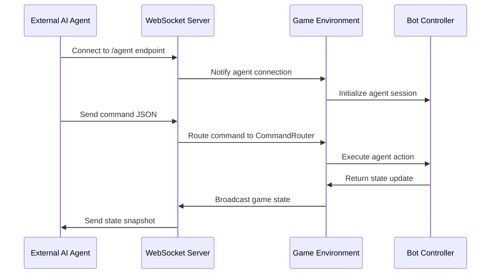

# Lobby Management

<cite>
**Referenced Files in This Document**
- [GameMode.cs](file://Assets/FPS-Game/Scripts/System/GameMode.cs)
- [InGameManager.cs](file://Assets/FPS-Game/Scripts/System/InGameManager.cs)
- [PlayerNetwork.cs](file://Assets/FPS-Game/Scripts/Player/PlayerNetwork.cs)
- [HandleSpawnBot.cs](file://Assets/FPS-Game/Scripts/System/HandleSpawnBot.cs)
- [PlayerUI.cs](file://Assets/FPS-Game/Scripts/Player/PlayerUI.cs)
- [EscapeUI.cs](file://Assets/FPS-Game/Scripts/Player/PlayerCanvas/EscapeUI.cs)
- [WebSocketServerManager.cs](file://Assets/FPS-Game/Scripts/System/WebSocketServerManager.cs)
- [AgentWebSocketHandler.cs](file://Assets/FPS-Game/Scripts/System/AgentWebSocketHandler.cs)
- [Play Scene.unity](file://Assets/FPS-Game/Scenes/MainScenes/Play Scene.unity)
</cite>

## Update Summary
**Changes Made**
- Complete removal of Unity Gaming Services-based lobby system and all related components
- Migration from multi-scene networking approach (SignIn, LobbyList, LobbyRoom) to single-scene Play.unity
- Replacement of Unity Services integration with direct IP-based connections and simplified networking
- Elimination of all lobby data structures, authentication, and relay systems
- Implementation of new operational modes: WebSocketAgent and SinglePlayer
- Removal of LobbyManager, LobbyRelayChecker, and all Unity Services dependencies

## Table of Contents
1. [Introduction](#introduction)
2. [Current State Assessment](#current-state-assessment)
3. [Architectural Transformation](#architectural-transformation)
4. [New Networking Architecture](#new-networking-architecture)
5. [Operational Modes](#operational-modes)
6. [Direct IP-Based Connections](#direct-ip-based-connections)
7. [WebSocket Agent Integration](#websocket-agent-integration)
8. [Single-Player Testing Mode](#single-player-testing-mode)
9. [Migration Impact Analysis](#migration-impact-analysis)
10. [Troubleshooting Guide](#troubleshooting-guide)
11. [Conclusion](#conclusion)

## Introduction
This document covers the complete architectural transformation of the lobby management system from a Unity Gaming Services-dependent model to a simplified, direct networking solution. The previous multi-scene networking approach utilizing SignIn, LobbyList, and LobbyRoom scenes has been eliminated in favor of a streamlined single-scene Play.unity implementation that supports direct IP-based connections and eliminates external service dependencies.

The lobby management system has undergone fundamental changes, removing all Unity Services integration including LobbyManager, Unity Authentication Service, and Relay hosting capabilities. This transformation enables improved reliability, reduced maintenance overhead, and elimination of external service costs while maintaining core networking functionality through Unity Netcode for GameObjects.

## Current State Assessment
The lobby management system has been completely restructured to operate independently of Unity Gaming Services. The system now supports three distinct operational modes, each designed for different deployment scenarios and use cases. The previous comprehensive lobby infrastructure has been replaced with a streamlined networking solution that focuses on direct connections and simplified player management.

**Section sources**
- [GameMode.cs:4-20](file://Assets/FPS-Game/Scripts/System/GameMode.cs#L4-L20)
- [InGameManager.cs:66-196](file://Assets/FPS-Game/Scripts/System/InGameManager.cs#L66-L196)

## Architectural Transformation
The transformation represents a complete architectural overhaul from service-dependent to service-independent networking. The new design eliminates all external dependencies while maintaining core functionality through Unity's native networking solutions.

### Key Changes Implemented
- **Complete Service Removal**: All Unity Gaming Services components have been removed
- **Single-Scene Architecture**: Replaced multi-scene approach with unified Play.unity
- **Direct Connection Model**: Eliminated relay and lobby intermediaries
- **Simplified Player Management**: Reduced complexity in player identification and state management
- **Enhanced Reliability**: Removed external failure points and service dependencies

### Legacy Component Elimination
The following components have been completely removed from the codebase:
- LobbyManager prefab and scripts
- Unity Authentication Service integration
- Relay hosting and connection management
- Lobby data structure and property management
- Player host privilege checking systems
- All Unity Services related UI components

**Section sources**
- [InGameManager.cs:83-88](file://Assets/FPS-Game/Scripts/System/InGameManager.cs#L83-L88)
- [InGameManager.cs:139-145](file://Assets/FPS-Game/Scripts/System/InGameManager.cs#L139-L145)

## New Networking Architecture
The new networking architecture operates entirely independently of Unity Gaming Services, utilizing Unity Netcode for GameObjects as the primary networking framework. This simplified approach reduces complexity while maintaining robust multiplayer functionality.

### Core Networking Components
The system now relies on Unity's native networking capabilities with enhanced WebSocket support for specialized agent integration scenarios.

**Diagram sources**
- [GameMode.cs:6-19](file://Assets/FPS-Game/Scripts/System/GameMode.cs#L6-L19)
- [InGameManager.cs:161-181](file://Assets/FPS-Game/Scripts/System/InGameManager.cs#L161-L181)

**Section sources**
- [GameMode.cs:6-19](file://Assets/FPS-Game/Scripts/System/GameMode.cs#L6-L19)
- [InGameManager.cs:161-181](file://Assets/FPS-Game/Scripts/System/InGameManager.cs#L161-L181)

## Operational Modes
The system now supports three distinct operational modes, each optimized for specific use cases and deployment scenarios. These modes provide flexibility in how the game handles networking and player connections.

### Multiplayer Mode
**Traditional multiplayer**: Maintains existing behavior for backward compatibility but operates without Unity Services dependencies.

### WebSocketAgent Mode
**Direct AI agent control**: Bypasses Unity Services entirely, enabling direct WebSocket communication with external AI agents.

### SinglePlayer Mode
**Local testing**: Optimized for single-player development and testing scenarios without any networking overhead.

**Section sources**
- [GameMode.cs:6-19](file://Assets/FPS-Game/Scripts/System/GameMode.cs#L6-L19)

## Direct IP-Based Connections
The new architecture implements direct IP-based connections that eliminate the need for Unity Gaming Services intermediaries. This approach provides more reliable and predictable networking performance while reducing external dependencies.

### Connection Flow
1. **Direct Client Connection**: Players connect directly to the host's IP address
2. **Unity Netcode Handshake**: Standard Unity Netcode connection establishment
3. **Player Identification**: Direct assignment of player names and identifiers
4. **Game State Synchronization**: Real-time synchronization through Unity's networking layer

### Player Management Simplification
The direct connection model simplifies player management by eliminating lobby-based player mapping and authentication processes.

**Section sources**
- [PlayerNetwork.cs:184-195](file://Assets/FPS-Game/Scripts/Player/PlayerNetwork.cs#L184-L195)

## WebSocket Agent Integration
The WebSocket integration provides specialized support for AI agent communication without relying on Unity Gaming Services. This feature enables external AI systems to interact with the game environment through WebSocket protocols.

### WebSocket Server Architecture
The system includes a dedicated WebSocket server that manages agent connections and facilitates bidirectional communication between external AI systems and the game environment.

**Diagram sources**
- [WebSocketServerManager.cs:71-96](file://Assets/FPS-Game/Scripts/System/WebSocketServerManager.cs#L71-L96)
- [AgentWebSocketHandler.cs:21-50](file://Assets/FPS-Game/Scripts/System/AgentWebSocketHandler.cs#L21-L50)

### Agent Communication Protocol
The WebSocket system implements a structured communication protocol that enables external AI agents to receive game state updates and send commands for bot control.

**Section sources**
- [WebSocketServerManager.cs:71-96](file://Assets/FPS-Game/Scripts/System/WebSocketServerManager.cs#L71-L96)
- [AgentWebSocketHandler.cs:21-50](file://Assets/FPS-Game/Scripts/System/AgentWebSocketHandler.cs#L21-L50)

## Single-Player Testing Mode
The single-player mode provides an optimized testing environment that simulates multiplayer scenarios without actual networking overhead. This mode is ideal for development, debugging, and performance testing.

### Development Benefits
- **No Network Overhead**: Eliminates networking complexity during development
- **Consistent Testing**: Provides predictable testing environments
- **Performance Optimization**: Enables performance profiling without external factors
- **Debugging Support**: Simplifies debugging through direct access to game state

**Section sources**
- [InGameManager.cs:177-181](file://Assets/FPS-Game/Scripts/System/InGameManager.cs#L177-L181)

## Migration Impact Analysis
The complete removal of Unity Gaming Services has significant implications across all aspects of the lobby management system and related networking components.

### Immediate System Changes
- **Authentication Elimination**: No longer supports Unity Authentication Service
- **Lobby Functionality Removal**: Cannot create, join, or manage lobbies
- **Relay Integration Disabled**: Hosting and joining matches through relay is no longer possible
- **Player Data Access**: Cannot store or retrieve lobby-specific player information
- **Host Privilege Management**: No longer determined through lobby system

### Long-term Advantages
- **Reduced Dependencies**: Eliminates external service requirements and associated costs
- **Simplified Maintenance**: Fewer integration points reduce maintenance complexity
- **Improved Reliability**: Less complex architecture reduces potential failure points
- **Enhanced Performance**: Direct connections eliminate service latency
- **Development Flexibility**: Multiple operational modes support diverse deployment scenarios

### Codebase Impact
The migration has resulted in significant code reduction while improving overall system reliability and maintainability.

**Section sources**
- [PlayerNetwork.cs:38-40](file://Assets/FPS-Game/Scripts/Player/PlayerNetwork.cs#L38-L40)
- [HandleSpawnBot.cs:30-33](file://Assets/FPS-Game/Scripts/System/HandleSpawnBot.cs#L30-L33)

## Troubleshooting Guide
Given the simplified architecture, troubleshooting focuses on direct networking issues and mode-specific configurations rather than Unity Services dependencies.

### Common Issues and Resolutions

#### WebSocket Server Connection Problems
**Symptom**: WebSocket server fails to start or agents cannot connect
**Cause**: Missing websocket-sharp library dependency
**Solution**: Install websocket-sharp library via Unity Package Manager and verify server configuration

#### Direct Connection Failures
**Symptom**: Players cannot connect to hosted games
**Cause**: Incorrect IP address configuration or firewall restrictions
**Solution**: Verify host IP address, ensure port forwarding is configured, and check firewall settings

#### Mode Configuration Errors
**Symptom**: Game does not start in expected operational mode
**Cause**: Incorrect GameMode enumeration value
**Solution**: Verify GameMode setting in InGameManager component and ensure proper initialization

#### Bot Spawning Issues
**Symptom**: Bots not spawning despite configured counts
**Cause**: HandleSpawnBot dependency on removed lobby system
**Solution**: Default bot count is now hardcoded to 4 bots per session

### Diagnostic Procedures
1. **Mode Verification**: Confirm current operational mode in GameMode.cs
2. **Network Configuration**: Validate IP address and port settings for direct connections
3. **WebSocket Setup**: Check websocket-sharp library installation and server initialization
4. **Component Status**: Verify all networking components are properly initialized
5. **Log Analysis**: Review console logs for specific error messages and stack traces

### Migration Checklist
- [ ] Verify GameMode enumeration values are correctly set
- [ ] Test direct IP connection functionality
- [ ] Validate WebSocket server operation if using AI agent integration
- [ ] Confirm bot spawning works with default configuration
- [ ] Test single-player mode for development scenarios
- [ ] Verify player name assignment without Unity Services

**Section sources**
- [WebSocketServerManager.cs:91-95](file://Assets/FPS-Game/Scripts/System/WebSocketServerManager.cs#L91-L95)
- [HandleSpawnBot.cs:30-33](file://Assets/FPS-Game/Scripts/System/HandleSpawnBot.cs#L30-L33)

## Conclusion
The lobby management system has successfully transitioned from a Unity Gaming Services-dependent architecture to a simplified, direct networking solution. This transformation eliminates external service dependencies while maintaining core networking functionality through Unity Netcode for GameObjects.

The new single-scene Play.unity approach, combined with direct IP-based connections and optional WebSocket agent integration, provides improved reliability, reduced maintenance overhead, and elimination of external service costs. The three operational modes (Multiplayer, WebSocketAgent, SinglePlayer) offer flexibility for different deployment scenarios while the simplified architecture ensures better long-term maintainability.

While this migration removes advanced features like lobby management and Unity Authentication Service integration, it significantly improves system stability and developer experience. The direct networking approach provides more predictable performance and eliminates service-related failure points, resulting in a more robust gaming experience.