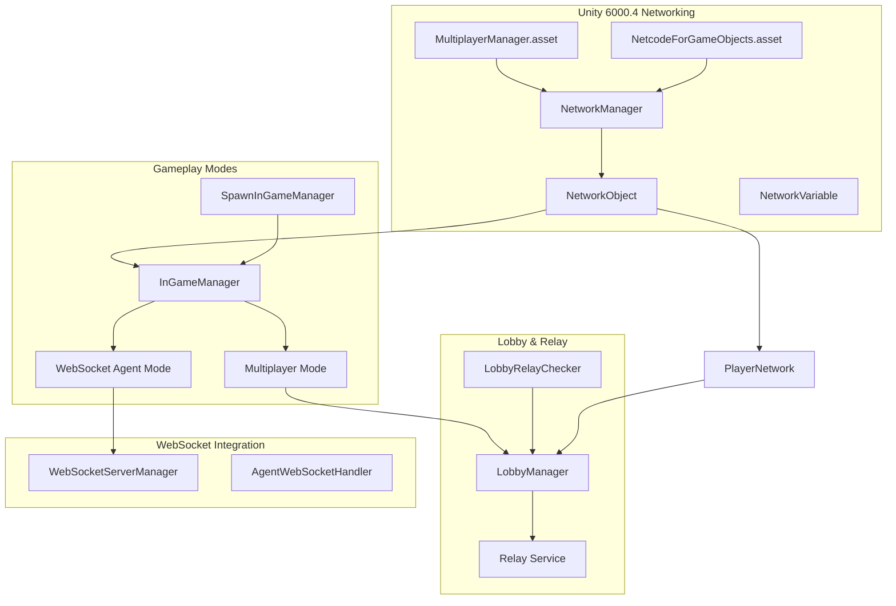
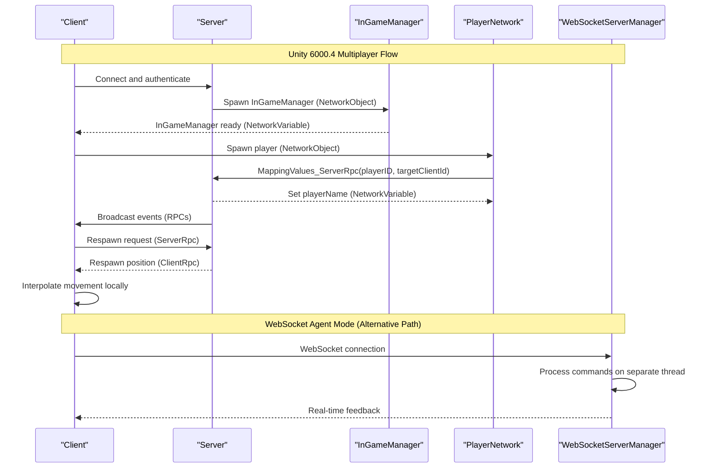
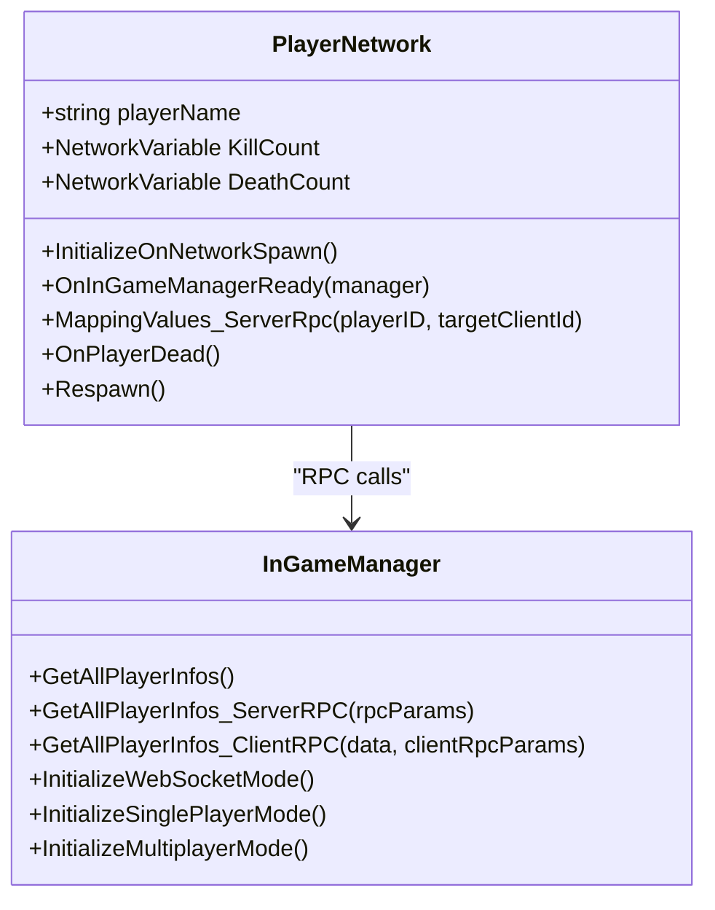
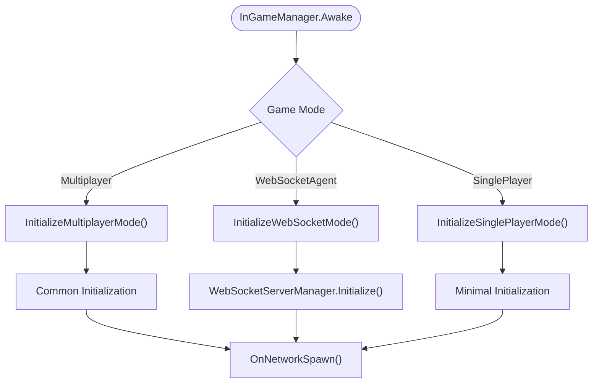
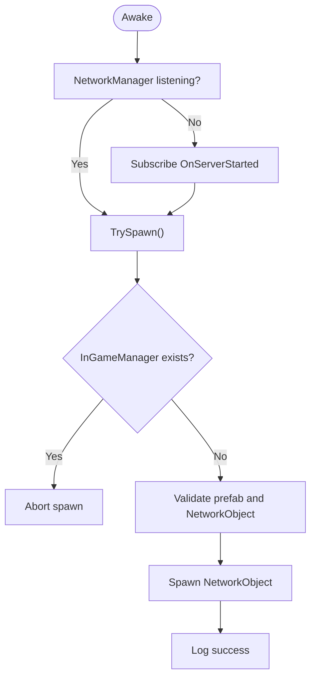
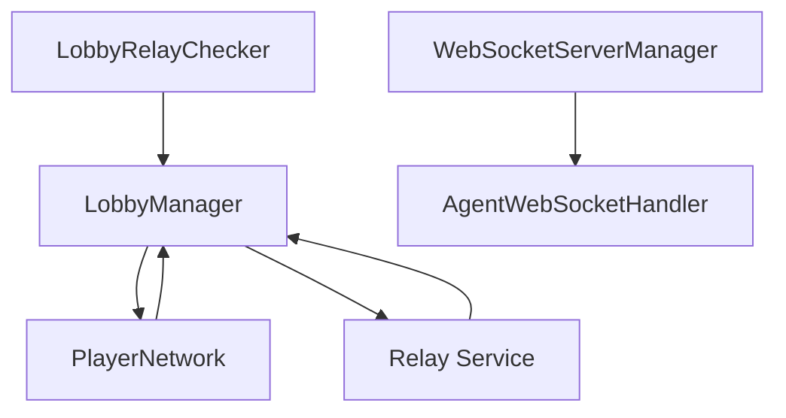
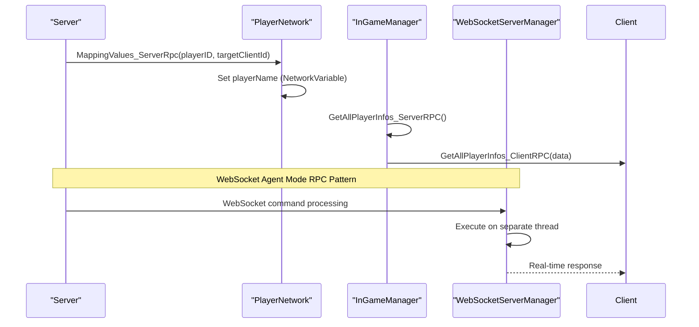
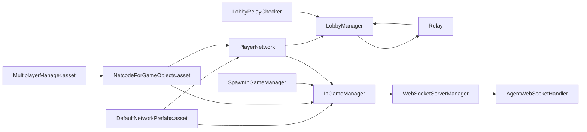

# Multiplayer System

<cite>
**Referenced Files in This Document**
- [MultiplayerManager.asset](file://ProjectSettings/MultiplayerManager.asset)
- [NetcodeForGameObjects.asset](file://ProjectSettings/NetcodeForGameObjects.asset)
- [DefaultNetworkPrefabs.asset](file://Assets/DefaultNetworkPrefabs.asset)
- [PlayerNetwork.cs](file://Assets/FPS-Game/Scripts/Player/PlayerNetwork.cs)
- [InGameManager.cs](file://Assets/FPS-Game/Scripts/System/InGameManager.cs)
- [SpawnInGameManager.cs](file://Assets/FPS-Game/Scripts/System/SpawnInGameManager.cs)
- [LobbyManager.cs](file://Assets/FPS-Game/Scripts/Lobby Script/Lobby/Scripts/LobbyManager.cs)
- [LobbyRelayChecker.cs](file://Assets/FPS-Game/Scripts/System/LobbyRelayChecker.cs)
- [Relay.cs](file://Assets/FPS-Game/Scripts/Lobby Script/Lobby/Scripts/Relay.cs)
- [PlayerInfo.cs](file://Assets/FPS-Game/Scripts/PlayerInfo.cs)
- [README_WEBSOCKET_INSTALLATION.md](file://Assets/FPS-Game/Scripts/System/WebSocket/README_WEBSOCKET_INSTALLATION.md)
- [README.md](file://README.md)
</cite>

## Update Summary
**Changes Made**
- Added documentation for Unity 6000.4 LTS compatibility and new networking features
- Updated networking architecture to include MultiplayerManager configuration
- Enhanced WebSocket integration documentation for Unity 6000.4
- Added new game mode support (WebSocket Agent mode) in InGameManager
- Updated networking configuration documentation with NetcodeForGameObjects.asset

## Table of Contents
1. [Introduction](#introduction)
2. [Project Structure](#project-structure)
3. [Core Components](#core-components)
4. [Architecture Overview](#architecture-overview)
5. [Detailed Component Analysis](#detailed-component-analysis)
6. [Unity 6000.4 LTS Enhancements](#unity-60004-lts-enhancements)
7. [Dependency Analysis](#dependency-analysis)
8. [Performance Considerations](#performance-considerations)
9. [Troubleshooting Guide](#troubleshooting-guide)
10. [Conclusion](#conclusion)
11. [Appendices](#appendices)

## Introduction
This document explains the multiplayer system built with Unity Netcode for GameObjects and Unity Gaming Services, now updated for Unity 6000.4 LTS. It focuses on a server-authoritative model, client-host topology, and the integration of Relay, Lobby, and Authentication. The system now supports multiple game modes including WebSocket Agent mode for advanced testing scenarios. It documents lobby management, player authentication, lobby creation/joining, matchmaking coordination, and server-authoritative gameplay with client interpolation and state synchronization patterns. Practical examples demonstrate networked object spawning, player synchronization, and event broadcasting across clients.

**Updated** Added Unity 6000.4 LTS compatibility features and new WebSocket Agent mode for enhanced development workflows.

## Project Structure
The multiplayer system spans several subsystems with enhanced Unity 6000.4 support:
- **Networking foundation**: Netcode for GameObjects with NetworkObject and NetworkVariable, configured through NetcodeForGameObjects.asset
- **Multiplayer Manager**: Unity 6000.4's MultiplayerManager.asset for role-based networking
- **In-game manager**: Central server-authoritative orchestration of gameplay state and RPCs with multiple game mode support
- **Player lifecycle**: Per-character state via NetworkVariable and server RPCs for synchronization
- **Lobby and Relay**: Unity Gaming Services integration for matchmaking and relay connectivity
- **WebSocket Integration**: Advanced testing capabilities with WebSocket Agent mode
- **Spawning**: Server-driven early spawn of the in-game manager and controlled player respawns

**Diagram sources**
- [MultiplayerManager.asset:1-10](file://ProjectSettings/MultiplayerManager.asset#L1-L10)
- [NetcodeForGameObjects.asset:1-18](file://ProjectSettings/NetcodeForGameObjects.asset#L1-L18)
- [PlayerNetwork.cs:12-220](file://Assets/FPS-Game/Scripts/Player/PlayerNetwork.cs#L12-L220)
- [InGameManager.cs:66-194](file://Assets/FPS-Game/Scripts/System/InGameManager.cs#L66-L194)
- [SpawnInGameManager.cs:5-70](file://Assets/FPS-Game/Scripts/System/SpawnInGameManager.cs#L5-L70)
- [LobbyManager.cs:1-200](file://Assets/FPS-Game/Scripts/Lobby Script/Lobby/Scripts/LobbyManager.cs#L1-L200)
- [Relay.cs:1-50](file://Assets/FPS-Game/Scripts/Lobby Script/Lobby/Scripts/Relay.cs#L1-50)

**Section sources**
- [MultiplayerManager.asset:1-10](file://ProjectSettings/MultiplayerManager.asset#L1-L10)
- [NetcodeForGameObjects.asset:1-18](file://ProjectSettings/NetcodeForGameObjects.asset#L1-L18)
- [DefaultNetworkPrefabs.asset:1-72](file://Assets/DefaultNetworkPrefabs.asset#L1-L72)
- [PlayerNetwork.cs:12-220](file://Assets/FPS-Game/Scripts/Player/PlayerNetwork.cs#L12-L220)
- [InGameManager.cs:66-194](file://Assets/FPS-Game/Scripts/System/InGameManager.cs#L66-L194)
- [SpawnInGameManager.cs:5-70](file://Assets/FPS-Game/Scripts/System/SpawnInGameManager.cs#L5-L70)
- [LobbyManager.cs:1-200](file://Assets/FPS-Game/Scripts/Lobby Script/Lobby/Scripts/LobbyManager.cs#L1-L200)
- [Relay.cs:1-50](file://Assets/FPS-Game/Scripts/Lobby Script/Lobby/Scripts/Relay.cs#L1-50)

## Core Components
- **PlayerNetwork**: Per-player state and behavior, server-authoritative synchronization, and client interpolation toggles during respawn
- **InGameManager**: Server-authoritative gameplay manager with multiple game modes (Multiplayer, WebSocket Agent, Single Player), RPCs for cross-client broadcasts, and shared state via NetworkVariable
- **SpawnInGameManager**: Server-side spawn of the in-game manager to ensure deterministic initialization
- **LobbyManager and LobbyRelayChecker**: Unity Gaming Services integration for lobby operations and relay connectivity checks
- **WebSocket Integration**: Advanced testing capabilities with WebSocketServerManager and AgentWebSocketHandler for WebSocket Agent mode
- **MultiplayerManager**: Unity 6000.4's networking configuration for role-based deployments
- **NetcodeForGameObjects**: Network prefab configuration and settings
- **DefaultNetworkPrefabs**: Netcode prefab registry for networked assets

Key patterns:
- **Server-authoritative**: Authoritative updates originate on the server and are propagated to clients via RPCs and NetworkVariable
- **Client-host**: Clients receive authoritative state and render interpolated movement locally
- **NetworkObject**: All networked objects derive from NetworkObject; NetworkVariable encapsulates replicated state
- **RPCs**: ServerRpc for authoritative commands and ClientRpc for targeted updates
- **Multiple Game Modes**: Support for traditional multiplayer, WebSocket Agent testing, and single-player modes

**Section sources**
- [PlayerNetwork.cs:12-220](file://Assets/FPS-Game/Scripts/Player/PlayerNetwork.cs#L12-L220)
- [InGameManager.cs:66-194](file://Assets/FPS-Game/Scripts/System/InGameManager.cs#L66-L194)
- [SpawnInGameManager.cs:5-70](file://Assets/FPS-Game/Scripts/System/SpawnInGameManager.cs#L5-L70)
- [LobbyManager.cs:1-200](file://Assets/FPS-Game/Scripts/Lobby Script/Lobby/Scripts/LobbyManager.cs#L1-L200)
- [LobbyRelayChecker.cs](file://Assets/FPS-Game/Scripts/System/LobbyRelayChecker.cs)
- [Relay.cs:1-50](file://Assets/FPS-Game/Scripts/Lobby Script/Lobby/Scripts/Relay.cs#L1-50)
- [MultiplayerManager.asset:1-10](file://ProjectSettings/MultiplayerManager.asset#L1-L10)
- [NetcodeForGameObjects.asset:1-18](file://ProjectSettings/NetcodeForGameObjects.asset#L1-L18)
- [DefaultNetworkPrefabs.asset:1-72](file://Assets/DefaultNetworkPrefabs.asset#L1-L72)

## Architecture Overview
The system follows a server-authoritative model with enhanced Unity 6000.4 support:
- **Server spawns the in-game manager early** and maintains authoritative state
- **Clients connect and receive initial state** via NetworkVariable and RPCs
- **Player actions are processed server-authoritatively**; clients interpolate movement locally
- **Unity Gaming Services handles authentication, lobby creation/joining, and relay connectivity**
- **WebSocket Agent mode provides advanced testing capabilities** with separate thread execution
- **MultiplayerManager enables role-based networking** for complex deployment scenarios

**Diagram sources**
- [InGameManager.cs:141-194](file://Assets/FPS-Game/Scripts/System/InGameManager.cs#L141-L194)
- [PlayerNetwork.cs:183-199](file://Assets/FPS-Game/Scripts/Player/PlayerNetwork.cs#L183-L199)
- [SpawnInGameManager.cs:41-70](file://Assets/FPS-Game/Scripts/System/SpawnInGameManager.cs#L41-L70)
- [InGameManager.cs:160-171](file://Assets/FPS-Game/Scripts/System/InGameManager.cs#L160-L171)

## Detailed Component Analysis

### PlayerNetwork: Server-Authoritative Player Lifecycle
PlayerNetwork encapsulates per-player state and behavior:
- NetworkVariable-based stats (kills, deaths) are synchronized automatically
- OnNetworkSpawn initializes ownership-specific behavior, enabling scripts and camera setup for the local player
- ServerRpc MappingValues_ServerRpc resolves player name from the joined lobby and applies it to the target client's player object
- Respawn logic triggers server-authoritative position updates via ClientRpc and toggles interpolation during transitions

**Diagram sources**
- [PlayerNetwork.cs:12-220](file://Assets/FPS-Game/Scripts/Player/PlayerNetwork.cs#L12-L220)
- [InGameManager.cs:141-194](file://Assets/FPS-Game/Scripts/System/InGameManager.cs#L141-L194)
- [InGameManager.cs:160-190](file://Assets/FPS-Game/Scripts/System/InGameManager.cs#L160-L190)

**Section sources**
- [PlayerNetwork.cs:12-220](file://Assets/FPS-Game/Scripts/Player/PlayerNetwork.cs#L12-L220)

### InGameManager: Multi-Mode Server-Authoritative Gameplay Manager
InGameManager is a NetworkBehaviour that orchestrates server-authoritative gameplay with multiple supported modes:
- **NetworkVariable** for shared state (e.g., IsTimeOut)
- **RPC pattern** for cross-client broadcasts:
  - GetAllPlayerInfos_ServerRPC aggregates player info from connected clients
  - GetAllPlayerInfos_ClientRPC parses and dispatches the aggregated data to listeners
- **Multiple Game Modes**:
  - **Multiplayer Mode**: Traditional Unity Netcode implementation
  - **WebSocket Agent Mode**: Bypasses Relay/Lobby/NGO for advanced testing
  - **Single Player Mode**: Testing without network services
- **Utility methods** for pathfinding and zone management

**Diagram sources**
- [InGameManager.cs:101-190](file://Assets/FPS-Game/Scripts/System/InGameManager.cs#L101-L190)
- [InGameManager.cs:160-190](file://Assets/FPS-Game/Scripts/System/InGameManager.cs#L160-L190)

**Section sources**
- [InGameManager.cs:66-139](file://Assets/FPS-Game/Scripts/System/InGameManager.cs#L66-L139)
- [InGameManager.cs:141-194](file://Assets/FPS-Game/Scripts/System/InGameManager.cs#L141-L194)
- [InGameManager.cs:160-190](file://Assets/FPS-Game/Scripts/System/InGameManager.cs#L160-L190)

### SpawnInGameManager: Early Server Spawn of InGameManager
Ensures the in-game manager exists before gameplay begins:
- Subscribes to NetworkManager.OnServerStarted
- Instantiates the InGameManager prefab and spawns it as a NetworkObject

**Diagram sources**
- [SpawnInGameManager.cs:20-70](file://Assets/FPS-Game/Scripts/System/SpawnInGameManager.cs#L20-L70)

**Section sources**
- [SpawnInGameManager.cs:5-70](file://Assets/FPS-Game/Scripts/System/SpawnInGameManager.cs#L5-L70)

### Lobby Management and Unity Gaming Services Integration
Lobby and Relay integration coordinates matchmaking and connectivity with Unity 6000.4 enhancements:
- **LobbyManager** manages lobby lifecycle and player lists with heartbeat monitoring
- **LobbyRelayChecker** monitors relay availability and readiness
- **Relay service** handles allocation and join code generation
- **PlayerNetwork** uses LobbyManager to resolve player names for synchronization
- **WebSocket Agent mode** provides alternative testing without Unity Gaming Services

**Diagram sources**
- [LobbyManager.cs:1-200](file://Assets/FPS-Game/Scripts/Lobby Script/Lobby/Scripts/LobbyManager.cs#L1-L200)
- [LobbyRelayChecker.cs](file://Assets/FPS-Game/Scripts/System/LobbyRelayChecker.cs)
- [PlayerNetwork.cs:183-199](file://Assets/FPS-Game/Scripts/Player/PlayerNetwork.cs#L183-L199)
- [Relay.cs:1-50](file://Assets/FPS-Game/Scripts/Lobby Script/Lobby/Scripts/Relay.cs#L1-50)
- [InGameManager.cs:160-171](file://Assets/FPS-Game/Scripts/System/InGameManager.cs#L160-L171)

**Section sources**
- [LobbyManager.cs:1-200](file://Assets/FPS-Game/Scripts/Lobby Script/Lobby/Scripts/LobbyManager.cs#L1-L200)
- [LobbyRelayChecker.cs](file://Assets/FPS-Game/Scripts/System/LobbyRelayChecker.cs)
- [PlayerNetwork.cs:183-199](file://Assets/FPS-Game/Scripts/Player/PlayerNetwork.cs#L183-L199)
- [Relay.cs:1-50](file://Assets/FPS-Game/Scripts/Lobby Script/Lobby/Scripts/Relay.cs#L1-50)

### Network Synchronization Patterns
- **NetworkVariable replication**: PlayerNetwork uses NetworkVariable for KillCount and DeathCount; changes propagate automatically to clients
- **ServerRpc for authoritative commands**: PlayerNetwork.MappingValues_ServerRpc sets player name from lobby data
- **ClientRpc for targeted updates**: InGameManager.GetAllPlayerInfos_ClientRPC delivers aggregated player info to the requester
- **Interpolation toggling**: During respawn, interpolation is disabled and re-enabled to smooth transitions
- **Multi-mode RPC handling**: Different game modes may use different RPC patterns

**Diagram sources**
- [PlayerNetwork.cs:183-199](file://Assets/FPS-Game/Scripts/Player/PlayerNetwork.cs#L183-L199)
- [InGameManager.cs:141-194](file://Assets/FPS-Game/Scripts/System/InGameManager.cs#L141-L194)
- [InGameManager.cs:160-171](file://Assets/FPS-Game/Scripts/System/InGameManager.cs#L160-L171)

**Section sources**
- [PlayerNetwork.cs:12-220](file://Assets/FPS-Game/Scripts/Player/PlayerNetwork.cs#L12-L220)
- [InGameManager.cs:141-194](file://Assets/FPS-Game/Scripts/System/InGameManager.cs#L141-L194)

## Unity 6000.4 LTS Enhancements

### MultiplayerManager Configuration
Unity 6000.4 introduces enhanced networking capabilities through MultiplayerManager.asset:
- **Role-based networking**: m_EnableMultiplayerRoles controls role-based deployment scenarios
- **Local deployment**: m_EnablePlayModeLocalDeployment enables local playtesting
- **Remote deployment**: m_EnablePlayModeRemoteDeployment supports remote testing environments
- **Stripping types**: m_StrippingTypes allows platform-specific optimizations

### NetcodeForGameObjects Configuration
Enhanced networking setup through NetcodeForGameObjects.asset:
- **NetworkPrefabsPath**: Points to DefaultNetworkPrefabs.asset for prefab registration
- **TempNetworkPrefabsPath**: Temporary prefab storage for development
- **GenerateDefaultNetworkPrefabs**: Automatic prefab generation for new projects

### WebSocket Integration Improvements
Unity 6000.4 enhances WebSocket capabilities:
- **Separate thread execution**: WebSocket server runs on dedicated thread for better performance
- **Improved threading support**: Better resource management and reduced blocking
- **Enhanced security**: Improved firewall compatibility and port management
- **.NET Standard 2.1**: Full compatibility with modern Unity networking stack

### New Game Mode Support
InGameManager now supports three distinct game modes optimized for Unity 6000.4:
- **Multiplayer Mode**: Traditional Unity Netcode implementation with full Unity Gaming Services integration
- **WebSocket Agent Mode**: Advanced testing mode that bypasses Relay/Lobby/NGO for real-time agent interaction
- **Single Player Mode**: Simplified testing environment without network dependencies

**Section sources**
- [MultiplayerManager.asset:1-10](file://ProjectSettings/MultiplayerManager.asset#L1-L10)
- [NetcodeForGameObjects.asset:1-18](file://ProjectSettings/NetcodeForGameObjects.asset#L1-L18)
- [InGameManager.cs:160-190](file://Assets/FPS-Game/Scripts/System/InGameManager.cs#L160-L190)
- [README_WEBSOCKET_INSTALLATION.md:49-55](file://Assets/FPS-Game/Scripts/System/WebSocket/README_WEBSOCKET_INSTALLATION.md#L49-L55)

## Dependency Analysis
- **PlayerNetwork** depends on InGameManager for RPCs and on LobbyManager for player name resolution
- **InGameManager** depends on NetworkManager for client enumeration and RPC routing, with optional WebSocketServerManager dependency
- **SpawnInGameManager** depends on NetworkManager and InGameManager prefab registration
- **LobbyManager** integrates with Unity Gaming Services for authentication and lobby operations
- **Relay** handles Unity Gaming Services Relay integration for NAT traversal
- **WebSocketServerManager** provides alternative testing infrastructure for WebSocket Agent mode
- **MultiplayerManager** configures Unity 6000.4 networking roles and deployment options
- **NetcodeForGameObjects** manages network prefab configuration and settings
- **DefaultNetworkPrefabs** defines the global set of networked prefabs used by Netcode

**Diagram sources**
- [DefaultNetworkPrefabs.asset:1-72](file://Assets/DefaultNetworkPrefabs.asset#L1-L72)
- [NetcodeForGameObjects.asset:1-18](file://ProjectSettings/NetcodeForGameObjects.asset#L1-L18)
- [MultiplayerManager.asset:1-10](file://ProjectSettings/MultiplayerManager.asset#L1-L10)
- [PlayerNetwork.cs:12-220](file://Assets/FPS-Game/Scripts/Player/PlayerNetwork.cs#L12-L220)
- [InGameManager.cs:66-194](file://Assets/FPS-Game/Scripts/System/InGameManager.cs#L66-L194)
- [SpawnInGameManager.cs:5-70](file://Assets/FPS-Game/Scripts/System/SpawnInGameManager.cs#L5-L70)
- [LobbyManager.cs:1-200](file://Assets/FPS-Game/Scripts/Lobby Script/Lobby/Scripts/LobbyManager.cs#L1-L200)
- [LobbyRelayChecker.cs](file://Assets/FPS-Game/Scripts/System/LobbyRelayChecker.cs)
- [Relay.cs:1-50](file://Assets/FPS-Game/Scripts/Lobby Script/Lobby/Scripts/Relay.cs#L1-50)

**Section sources**
- [DefaultNetworkPrefabs.asset:1-72](file://Assets/DefaultNetworkPrefabs.asset#L1-L72)
- [NetcodeForGameObjects.asset:1-18](file://ProjectSettings/NetcodeForGameObjects.asset#L1-L18)
- [MultiplayerManager.asset:1-10](file://ProjectSettings/MultiplayerManager.asset#L1-L10)
- [PlayerNetwork.cs:12-220](file://Assets/FPS-Game/Scripts/Player/PlayerNetwork.cs#L12-L220)
- [InGameManager.cs:66-194](file://Assets/FPS-Game/Scripts/System/InGameManager.cs#L66-L194)
- [SpawnInGameManager.cs:5-70](file://Assets/FPS-Game/Scripts/System/SpawnInGameManager.cs#L5-L70)
- [LobbyManager.cs:1-200](file://Assets/FPS-Game/Scripts/Lobby Script/Lobby/Scripts/LobbyManager.cs#L1-L200)
- [LobbyRelayChecker.cs](file://Assets/FPS-Game/Scripts/System/LobbyRelayChecker.cs)
- [Relay.cs:1-50](file://Assets/FPS-Game/Scripts/Lobby Script/Lobby/Scripts/Relay.cs#L1-50)

## Performance Considerations
- **Prefer NetworkVariable** for frequent small state updates to minimize RPC overhead
- **Batch client updates** when possible (e.g., aggregate player info in a single ClientRpc)
- **Disable interpolation** during abrupt state changes (e.g., respawn) and re-enable after stabilization
- **Use server-side spawn ordering** to avoid race conditions and redundant instantiation
- **Leverage Unity 6000.4 threading improvements** for better WebSocket performance
- **Optimize prefab loading** through NetcodeForGameObjects asset configuration
- **Configure MultiplayerManager roles** appropriately for deployment scenarios
- **Monitor WebSocket thread execution** for optimal real-time agent performance

## Troubleshooting Guide
Common issues and remedies:
- **Player name not synchronizing**: Verify MappingValues_ServerRpc is invoked with correct playerID and targetClientId, and that the joined lobby contains the expected player data
- **InGameManager not ready**: Ensure SpawnInGameManager runs on the server and subscribes to OnServerStarted; confirm the prefab has a NetworkObject
- **RPC not received**: Confirm ServerRpc RequireOwnership setting and ClientRpc targeting; ensure the requesting client is included in ClientRpcParams
- **Interpolation artifacts**: Temporarily disable interpolation around state transitions and re-enable after a short delay
- **WebSocket connection issues**: Verify port 8080 is not blocked and check Unity 6000.4 threading configuration
- **MultiplayerManager configuration errors**: Ensure proper role-based networking setup for deployment scenarios
- **NetcodeForGameObjects asset issues**: Verify prefab paths and automatic prefab generation settings
- **WebSocket Agent mode problems**: Check separate thread execution and firewall settings for port 8080

**Section sources**
- [PlayerNetwork.cs:183-199](file://Assets/FPS-Game/Scripts/Player/PlayerNetwork.cs#L183-L199)
- [SpawnInGameManager.cs:41-70](file://Assets/FPS-Game/Scripts/System/SpawnInGameManager.cs#L41-L70)
- [InGameManager.cs:141-194](file://Assets/FPS-Game/Scripts/System/InGameManager.cs#L141-L194)
- [MultiplayerManager.asset:1-10](file://ProjectSettings/MultiplayerManager.asset#L1-L10)
- [NetcodeForGameObjects.asset:1-18](file://ProjectSettings/NetcodeForGameObjects.asset#L1-L18)
- [README_WEBSOCKET_INSTALLATION.md:49-55](file://Assets/FPS-Game/Scripts/System/WebSocket/README_WEBSOCKET_INSTALLATION.md#L49-L55)

## Conclusion
The system implements a robust server-authoritative model with Unity 6000.4 LTS enhancements, featuring Unity Netcode for GameObjects and Unity Gaming Services. PlayerNetwork and InGameManager coordinate authoritative state and client interpolation, while LobbyManager and LobbyRelayChecker integrate matchmaking and relay connectivity. The new MultiplayerManager and NetcodeForGameObjects configurations provide enhanced networking capabilities, and the WebSocket Agent mode offers advanced testing scenarios. The provided patterns enable scalable, predictable multiplayer behavior suitable for competitive gameplay with full Unity 6000.4 compatibility.

## Appendices

### Practical Examples (by file reference)
- **Networked object spawning**:
  - Server spawns InGameManager early: [SpawnInGameManager.cs:41-70](file://Assets/FPS-Game/Scripts/System/SpawnInGameManager.cs#L41-L70)
- **Player synchronization**:
  - Server sets player name from lobby: [PlayerNetwork.cs:183-199](file://Assets/FPS-Game/Scripts/Player/PlayerNetwork.cs#L183-L199)
- **Event broadcasting across clients**:
  - Aggregate and broadcast player info: [InGameManager.cs:141-194](file://Assets/FPS-Game/Scripts/System/InGameManager.cs#L141-L194)
- **WebSocket Agent mode initialization**:
  - WebSocket server startup: [InGameManager.cs:160-171](file://Assets/FPS-Game/Scripts/System/InGameManager.cs#L160-L171)
- **Unity 6000.4 configuration**:
  - MultiplayerManager setup: [MultiplayerManager.asset:1-10](file://ProjectSettings/MultiplayerManager.asset#L1-L10)
  - NetcodeForGameObjects configuration: [NetcodeForGameObjects.asset:1-18](file://ProjectSettings/NetcodeForGameObjects.asset#L1-L18)