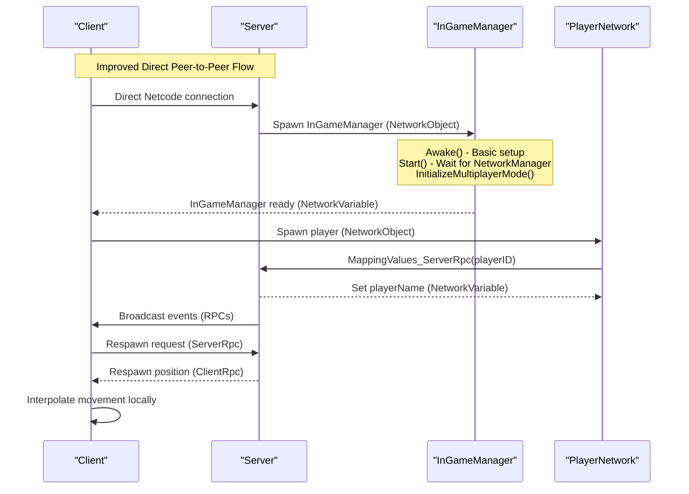
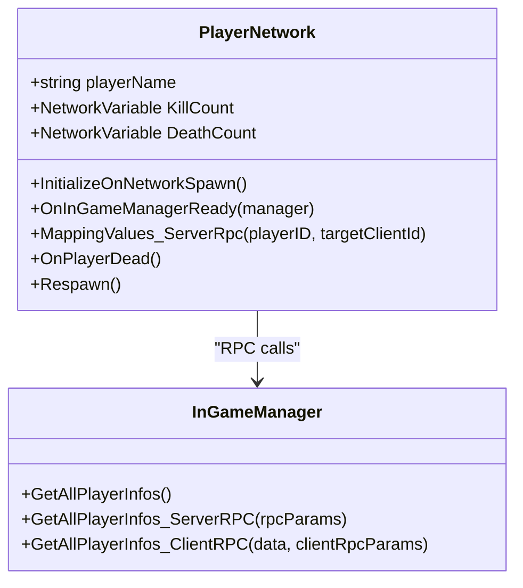
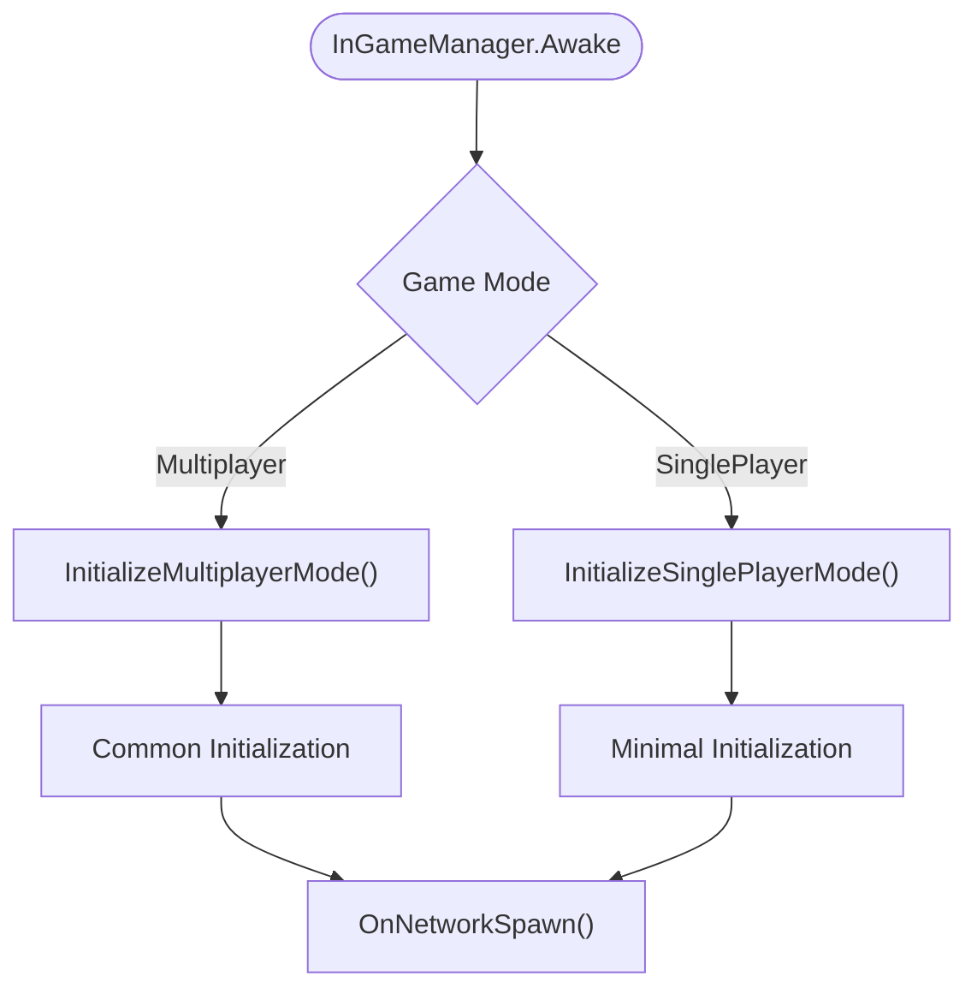
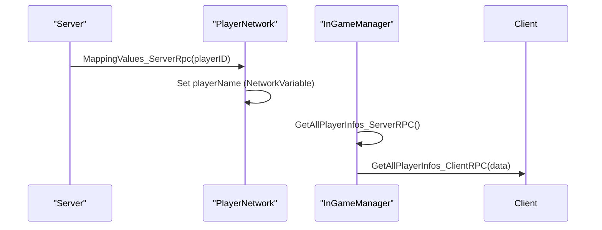
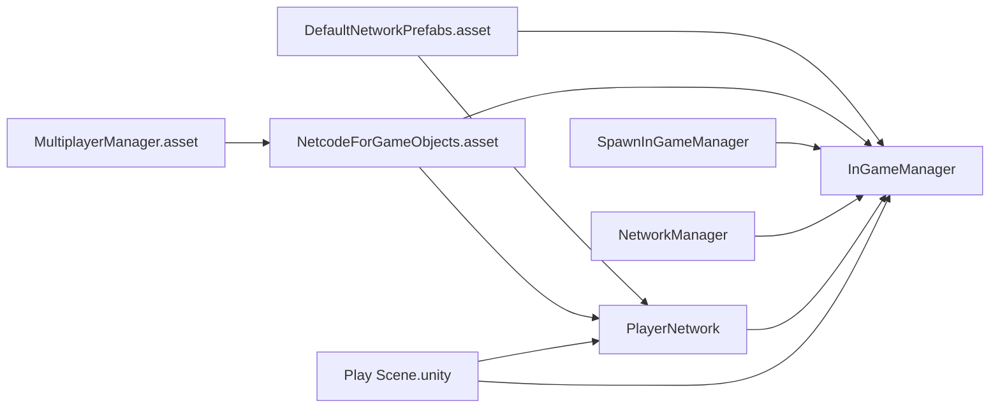

# Multiplayer System

<cite>
**Referenced Files in This Document**
- [MultiplayerManager.asset](file://ProjectSettings/MultiplayerManager.asset)
- [NetcodeForGameObjects.asset](file://ProjectSettings/NetcodeForGameObjects.asset)
- [DefaultNetworkPrefabs.asset](file://Assets/DefaultNetworkPrefabs.asset)
- [PlayerNetwork.cs](file://Assets/FPS-Game/Scripts/Player/PlayerNetwork.cs)
- [InGameManager.cs](file://Assets/FPS-Game/Scripts/System/InGameManager.cs)
- [SpawnInGameManager.cs](file://Assets/FPS-Game/Scripts/System/SpawnInGameManager.cs)
- [Play Scene.unity](file://Assets/FPS-Game/Scenes/MainScenes/Play Scene.unity)
- [NetworkManager.prefab](file://Assets/FPS-Game/Prefabs/System/NetworkManager.prefab)
- [README_WEBSOCKET_INSTALLATION.md](file://Assets/FPS-Game/Scripts/System/WebSocket/README_WEBSOCKET_INSTALLATION.md)
</cite>

## Update Summary
**Changes Made**
- Updated initialization sequence documentation to reflect the fix where InGameManager initialization moved from Awake() to Start() method
- Clarified the timing resolution for NetworkManager.Singleton availability
- Enhanced server-authoritative initialization patterns documentation
- Updated troubleshooting guidance for initialization timing issues

## Table of Contents
1. [Introduction](#introduction)
2. [Project Structure](#project-structure)
3. [Core Components](#core-components)
4. [Architecture Overview](#architecture-overview)
5. [Detailed Component Analysis](#detailed-component-analysis)
6. [Network Configuration](#network-configuration)
7. [Dependency Analysis](#dependency-analysis)
8. [Performance Considerations](#performance-considerations)
9. [Troubleshooting Guide](#troubleshooting-guide)
10. [Conclusion](#conclusion)
11. [Appendices](#appendices)

## Introduction
This document explains the multiplayer system built with Unity Netcode for GameObjects, now updated for a simplified direct peer-to-peer architecture with improved initialization timing. The system implements a server-authoritative model without Unity Gaming Services dependencies, focusing on streamlined setup procedures and direct networking through Unity Netcode. The system supports multiple game modes including traditional multiplayer and single-player testing scenarios. It documents server-authoritative gameplay with client interpolation and state synchronization patterns. The recent improvement addresses timing issues where NetworkManager.Awake() was executing after InGameManager.Awake(), causing NetworkManager.Singleton to be null during initialization. Now uses Start() method for game mode initialization to ensure proper NetworkManager availability.

**Updated** Improved initialization sequence in InGameManager.cs to resolve timing conflicts with NetworkManager singleton availability.

## Project Structure
The multiplayer system now operates with a simplified architecture focused on Unity Netcode for GameObjects:
- **Networking foundation**: Direct peer-to-peer connections through Unity Netcode with NetworkObject and NetworkVariable
- **Server-authoritative orchestration**: Centralized gameplay state management through InGameManager with proper initialization timing
- **Player lifecycle**: Per-character state via NetworkVariable and server RPCs for synchronization
- **Direct networking**: Elimination of Unity Gaming Services dependencies in favor of native Netcode networking
- **Single-scene approach**: Play.unity as the sole scene for simplified setup procedures
- **Early spawn system**: Server-side initialization of InGameManager for deterministic gameplay with proper timing

```mermaid
graph TB
subgraph "Direct Peer-to-Peer Networking"
NM["NetworkManager"]
NO["NetworkObject"]
NV["NetworkVariable"]
IG["InGameManager"]
PIN["PlayerNetwork"]
SPIN["SpawnInGameManager"]
END
subgraph "Improved Initialization Sequence"
AWAKE["Awake() - Basic Setup"]
START["Start() - Game Mode Init"]
INIT["InitializeMultiplayerMode()"]
END
NM --> NO
NO --> PIN
NO --> IG
IG --> PIN
SPIN --> IG
AWAKE --> START
START --> INIT
```

**Diagram sources**
- [PlayerNetwork.cs:12-216](file://Assets/FPS-Game/Scripts/Player/PlayerNetwork.cs#L12-L216)
- [InGameManager.cs:66-295](file://Assets/FPS-Game/Scripts/System/InGameManager.cs#L66-L295)
- [SpawnInGameManager.cs:5-69](file://Assets/FPS-Game/Scripts/System/SpawnInGameManager.cs#L5-L69)
- [Play Scene.unity:1-800](file://Assets/FPS-Game/Scenes/MainScenes/Play Scene.unity#L1-L800)

**Section sources**
- [PlayerNetwork.cs:12-216](file://Assets/FPS-Game/Scripts/Player/PlayerNetwork.cs#L12-L216)
- [InGameManager.cs:66-295](file://Assets/FPS-Game/Scripts/System/InGameManager.cs#L66-L295)
- [SpawnInGameManager.cs:5-69](file://Assets/FPS-Game/Scripts/System/SpawnInGameManager.cs#L5-L69)
- [Play Scene.unity:1-800](file://Assets/FPS-Game/Scenes/MainScenes/Play Scene.unity#L1-L800)

## Core Components
- **PlayerNetwork**: Per-player state and behavior with server-authoritative synchronization using NetworkVariable
- **InGameManager**: Server-authoritative gameplay manager with NetworkVariable-based shared state and RPC patterns, now with improved initialization timing
- **SpawnInGameManager**: Server-side spawn of InGameManager for deterministic initialization with proper NetworkManager availability
- **Direct peer-to-peer networking**: Native Unity Netcode implementation without Unity Gaming Services
- **Single-scene architecture**: Play.unity as the central scene eliminating complex scene management
- **NetworkVariable replication**: Automatic state synchronization for kills, deaths, and game state

Key patterns:
- **Server-authoritative**: Authoritative updates originate on the server and are propagated to clients via RPCs and NetworkVariable
- **Direct peer-to-peer**: Clients connect directly through Unity Netcode without external relay services
- **NetworkObject**: All networked objects derive from NetworkObject; NetworkVariable encapsulates replicated state
- **RPC patterns**: ServerRpc for authoritative commands and ClientRpc for targeted updates
- **Simplified setup**: Single scene approach eliminates complex lobby and relay configurations
- **Improved initialization timing**: InGameManager now properly waits for NetworkManager availability

**Section sources**
- [PlayerNetwork.cs:12-216](file://Assets/FPS-Game/Scripts/Player/PlayerNetwork.cs#L12-L216)
- [InGameManager.cs:66-295](file://Assets/FPS-Game/Scripts/System/InGameManager.cs#L66-L295)
- [SpawnInGameManager.cs:5-69](file://Assets/FPS-Game/Scripts/System/SpawnInGameManager.cs#L5-L69)

## Architecture Overview
The system follows a streamlined server-authoritative model with direct peer-to-peer connections and improved initialization timing:
- **Server spawns InGameManager early** and maintains authoritative state with proper NetworkManager availability
- **Clients connect directly** through Unity Netcode without Unity Gaming Services
- **Player actions are processed server-authoritatively**; clients interpolate movement locally
- **Single scene architecture** simplifies deployment and reduces complexity
- **Direct networking eliminates** external service dependencies and relay configurations
- **Improved initialization timing** ensures NetworkManager.Singleton is available during InGameManager startup



**Diagram sources**
- [InGameManager.cs:101-163](file://Assets/FPS-Game/Scripts/System/InGameManager.cs#L101-L163)
- [PlayerNetwork.cs:184-195](file://Assets/FPS-Game/Scripts/Player/PlayerNetwork.cs#L184-L195)
- [SpawnInGameManager.cs:40-69](file://Assets/FPS-Game/Scripts/System/SpawnInGameManager.cs#L40-L69)

## Detailed Component Analysis

### PlayerNetwork: Server-Authoritative Player Lifecycle
PlayerNetwork encapsulates per-player state and behavior with simplified direct networking:
- NetworkVariable-based stats (kills, deaths) are synchronized automatically
- OnNetworkSpawn initializes ownership-specific behavior with direct player naming
- ServerRpc MappingValues_ServerRpc resolves player name directly without Unity Gaming Services
- Respawn logic triggers server-authoritative position updates via ClientRpc



**Diagram sources**
- [PlayerNetwork.cs:12-216](file://Assets/FPS-Game/Scripts/Player/PlayerNetwork.cs#L12-L216)
- [InGameManager.cs:204-257](file://Assets/FPS-Game/Scripts/System/InGameManager.cs#L204-L257)

**Section sources**
- [PlayerNetwork.cs:12-216](file://Assets/FPS-Game/Scripts/Player/PlayerNetwork.cs#L12-L216)

### InGameManager: Server-Authoritative Gameplay Manager with Improved Timing
InGameManager is a NetworkBehaviour that orchestrates server-authoritative gameplay with improved initialization timing:
- **NetworkVariable** for shared state (e.g., IsTimeOut)
- **RPC pattern** for cross-client broadcasts:
  - GetAllPlayerInfos_ServerRPC aggregates player info from connected clients
  - GetAllPlayerInfos_ClientRPC parses and dispatches the aggregated data to listeners
- **Improved initialization**: Moved game mode initialization from Awake() to Start() method to ensure NetworkManager.Singleton is available
- **Simplified initialization**: Direct server-side spawn without Unity Gaming Services dependencies
- **Utility methods** for pathfinding and zone management



**Updated** The initialization sequence now properly handles NetworkManager availability timing.

**Diagram sources**
- [InGameManager.cs:101-163](file://Assets/FPS-Game/Scripts/System/InGameManager.cs#L101-L163)

**Section sources**
- [InGameManager.cs:66-295](file://Assets/FPS-Game/Scripts/System/InGameManager.cs#L66-L295)

### SpawnInGameManager: Early Server Spawn of InGameManager
Ensures the in-game manager exists before gameplay begins with proper NetworkManager handling:
- Subscribes to NetworkManager.OnServerStarted
- Instantiates the InGameManager prefab and spawns it as a NetworkObject
- Handles cases where NetworkManager may not be fully initialized yet
- Eliminates Unity Gaming Services dependencies for simplified setup


**Diagram sources**
- [SpawnInGameManager.cs:20-69](file://Assets/FPS-Game/Scripts/System/SpawnInGameManager.cs#L20-L69)

**Section sources**
- [SpawnInGameManager.cs:5-69](file://Assets/FPS-Game/Scripts/System/SpawnInGameManager.cs#L5-L69)

### Network Synchronization Patterns
- **NetworkVariable replication**: PlayerNetwork uses NetworkVariable for KillCount and DeathCount; changes propagate automatically to clients
- **ServerRpc for authoritative commands**: PlayerNetwork.MappingValues_ServerRpc sets player name directly
- **ClientRpc for targeted updates**: InGameManager.GetAllPlayerInfos_ClientRPC delivers aggregated player info to the requester
- **Direct peer-to-peer**: Elimination of Unity Gaming Services relay and authentication dependencies
- **Improved timing**: NetworkManager availability is guaranteed before InGameManager initialization



**Diagram sources**
- [PlayerNetwork.cs:184-195](file://Assets/FPS-Game/Scripts/Player/PlayerNetwork.cs#L184-L195)
- [InGameManager.cs:209-235](file://Assets/FPS-Game/Scripts/System/InGameManager.cs#L209-L235)

**Section sources**
- [PlayerNetwork.cs:12-216](file://Assets/FPS-Game/Scripts/Player/PlayerNetwork.cs#L12-L216)
- [InGameManager.cs:204-257](file://Assets/FPS-Game/Scripts/System/InGameManager.cs#L204-L257)

## Network Configuration

### MultiplayerManager Configuration
Simplified networking configuration through MultiplayerManager.asset:
- **Role-based networking**: m_EnableMultiplayerRoles controls role-based deployment scenarios
- **Local deployment**: m_EnablePlayModeLocalDeployment enables local playtesting
- **Remote deployment**: m_EnablePlayModeRemoteDeployment supports remote testing environments
- **Stripping types**: m_StrippingTypes allows platform-specific optimizations

### NetcodeForGameObjects Configuration
Enhanced networking setup through NetcodeForGameObjects.asset:
- **NetworkPrefabsPath**: Points to DefaultNetworkPrefabs.asset for prefab registration
- **TempNetworkPrefabsPath**: Temporary prefab storage for development
- **GenerateDefaultNetworkPrefabs**: Automatic prefab generation for new projects

### DefaultNetworkPrefabs Configuration
Direct prefab registration for simplified networking:
- **Network prefab registry**: Comprehensive list of networked prefabs for the game
- **Automatic generation**: GenerateDefaultNetworkPrefabs enabled for streamlined setup
- **Prefab validation**: Ensures all networked objects have proper NetworkObject components

**Section sources**
- [MultiplayerManager.asset:1-10](file://ProjectSettings/MultiplayerManager.asset#L1-L10)
- [NetcodeForGameObjects.asset:1-18](file://ProjectSettings/NetcodeForGameObjects.asset#L1-L18)
- [DefaultNetworkPrefabs.asset:1-72](file://Assets/DefaultNetworkPrefabs.asset#L1-L72)

## Dependency Analysis
- **PlayerNetwork** depends on InGameManager for RPCs and direct player naming
- **InGameManager** depends on NetworkManager for client enumeration and RPC routing, with improved timing guarantees
- **SpawnInGameManager** depends on NetworkManager and InGameManager prefab registration
- **Direct peer-to-peer**: Elimination of Unity Gaming Services dependencies
- **Single scene architecture**: Play.unity as the central scene for simplified deployment
- **MultiplayerManager** configures Unity networking roles and deployment options
- **NetcodeForGameObjects** manages network prefab configuration and settings
- **DefaultNetworkPrefabs** defines the global set of networked prefabs used by Netcode



**Diagram sources**
- [DefaultNetworkPrefabs.asset:1-72](file://Assets/DefaultNetworkPrefabs.asset#L1-L72)
- [NetcodeForGameObjects.asset:1-18](file://ProjectSettings/NetcodeForGameObjects.asset#L1-L18)
- [MultiplayerManager.asset:1-10](file://ProjectSettings/MultiplayerManager.asset#L1-L10)
- [PlayerNetwork.cs:12-216](file://Assets/FPS-Game/Scripts/Player/PlayerNetwork.cs#L12-L216)
- [InGameManager.cs:66-295](file://Assets/FPS-Game/Scripts/System/InGameManager.cs#L66-L295)
- [SpawnInGameManager.cs:5-69](file://Assets/FPS-Game/Scripts/System/SpawnInGameManager.cs#L5-L69)
- [Play Scene.unity:1-800](file://Assets/FPS-Game/Scenes/MainScenes/Play Scene.unity#L1-L800)

**Section sources**
- [DefaultNetworkPrefabs.asset:1-72](file://Assets/DefaultNetworkPrefabs.asset#L1-L72)
- [NetcodeForGameObjects.asset:1-18](file://ProjectSettings/NetcodeForGameObjects.asset#L1-L18)
- [MultiplayerManager.asset:1-10](file://ProjectSettings/MultiplayerManager.asset#L1-L10)
- [PlayerNetwork.cs:12-216](file://Assets/FPS-Game/Scripts/Player/PlayerNetwork.cs#L12-L216)
- [InGameManager.cs:66-295](file://Assets/FPS-Game/Scripts/System/InGameManager.cs#L66-L295)
- [SpawnInGameManager.cs:5-69](file://Assets/FPS-Game/Scripts/System/SpawnInGameManager.cs#L5-L69)
- [Play Scene.unity:1-800](file://Assets/FPS-Game/Scenes/MainScenes/Play Scene.unity#L1-L800)

## Performance Considerations
- **Prefer NetworkVariable** for frequent small state updates to minimize RPC overhead
- **Batch client updates** when possible (e.g., aggregate player info in a single ClientRpc)
- **Use server-side spawn ordering** to avoid race conditions and redundant instantiation
- **Eliminate external dependencies** for improved networking performance and reliability
- **Single scene architecture** reduces memory overhead and improves loading times
- **Direct peer-to-peer connections** eliminate relay latency and improve responsiveness
- **Optimize prefab loading** through NetcodeForGameObjects asset configuration
- **Configure MultiplayerManager roles** appropriately for deployment scenarios
- **Improved initialization timing** prevents runtime errors and reduces debugging overhead

## Troubleshooting Guide
Common issues and remedies:
- **Player name not synchronizing**: Verify MappingValues_ServerRpc is invoked with correct playerID and that the player object has NetworkObject component
- **InGameManager not ready**: Ensure SpawnInGameManager runs on the server and subscribes to OnServerStarted; confirm the prefab has a NetworkObject; verify NetworkManager availability timing
- **RPC not received**: Confirm ServerRpc RequireOwnership setting and ClientRpc targeting; ensure the requesting client is included in ClientRpcParams
- **Direct peer-to-peer connection issues**: Verify NetworkManager is properly configured and clients can establish direct connections
- **Single scene deployment problems**: Ensure Play Scene.unity is set as the active scene and contains all necessary networking components
- **MultiplayerManager configuration errors**: Ensure proper role-based networking setup for deployment scenarios
- **NetcodeForGameObjects asset issues**: Verify prefab paths and automatic prefab generation settings
- **DefaultNetworkPrefabs errors**: Check that all networked objects have proper NetworkObject components registered
- **Initialization timing issues**: Verify that InGameManager.Start() method runs after NetworkManager is fully initialized; check for proper Awake() vs Start() execution order

**Updated** Added troubleshooting guidance for initialization timing issues and NetworkManager availability.

**Section sources**
- [PlayerNetwork.cs:184-195](file://Assets/FPS-Game/Scripts/Player/PlayerNetwork.cs#L184-L195)
- [SpawnInGameManager.cs:40-69](file://Assets/FPS-Game/Scripts/System/SpawnInGameManager.cs#L40-L69)
- [InGameManager.cs:145-163](file://Assets/FPS-Game/Scripts/System/InGameManager.cs#L145-L163)
- [MultiplayerManager.asset:1-10](file://ProjectSettings/MultiplayerManager.asset#L1-L10)
- [NetcodeForGameObjects.asset:1-18](file://ProjectSettings/NetcodeForGameObjects.asset#L1-L18)
- [DefaultNetworkPrefabs.asset:1-72](file://Assets/DefaultNetworkPrefabs.asset#L1-L72)

## Conclusion
The system implements a streamlined server-authoritative model with direct peer-to-peer connections through Unity Netcode for GameObjects. PlayerNetwork and InGameManager coordinate authoritative state and client interpolation without Unity Gaming Services dependencies. The recent improvement addresses timing issues where NetworkManager.Awake() was executing after InGameManager.Awake(), causing NetworkManager.Singleton to be null during initialization. By moving game mode initialization from Awake() to Start() method, the system now properly ensures NetworkManager availability. The simplified architecture eliminates complex lobby and relay configurations in favor of direct networking through Play Scene.unity. The provided patterns enable scalable, predictable multiplayer behavior with improved performance and simplified deployment procedures.

## Appendices

### Practical Examples (by file reference)
- **Networked object spawning**:
  - Server spawns InGameManager early: [SpawnInGameManager.cs:40-69](file://Assets/FPS-Game/Scripts/System/SpawnInGameManager.cs#L40-L69)
- **Player synchronization**:
  - Direct player name assignment: [PlayerNetwork.cs:184-195](file://Assets/FPS-Game/Scripts/Player/PlayerNetwork.cs#L184-L195)
- **Event broadcasting across clients**:
  - Aggregate and broadcast player info: [InGameManager.cs:209-235](file://Assets/FPS-Game/Scripts/System/InGameManager.cs#L209-L235)
- **Direct peer-to-peer connection**:
  - Unity Netcode direct connection: [InGameManager.cs:192-295](file://Assets/FPS-Game/Scripts/System/InGameManager.cs#L192-L295)
- **Improved initialization timing**:
  - NetworkManager availability check: [InGameManager.cs:145-163](file://Assets/FPS-Game/Scripts/System/InGameManager.cs#L145-L163)
- **Simplified configuration**:
  - MultiplayerManager setup: [MultiplayerManager.asset:1-10](file://ProjectSettings/MultiplayerManager.asset#L1-L10)
  - NetcodeForGameObjects configuration: [NetcodeForGameObjects.asset:1-18](file://ProjectSettings/NetcodeForGameObjects.asset#L1-L18)