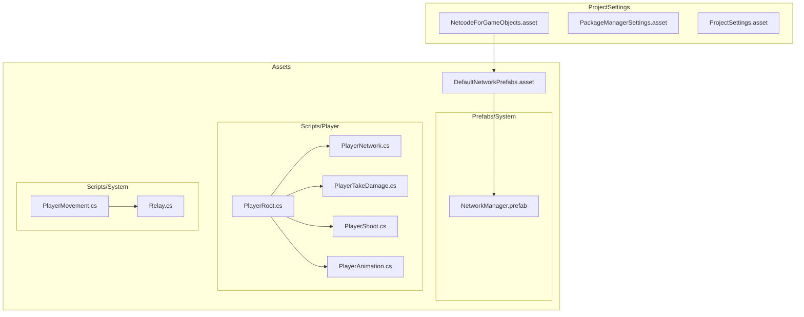
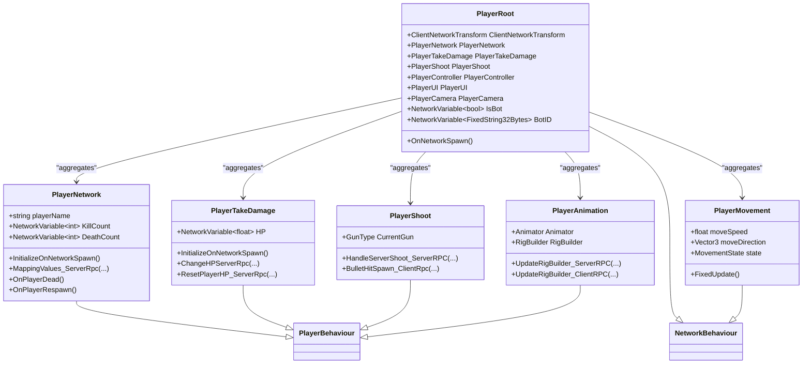
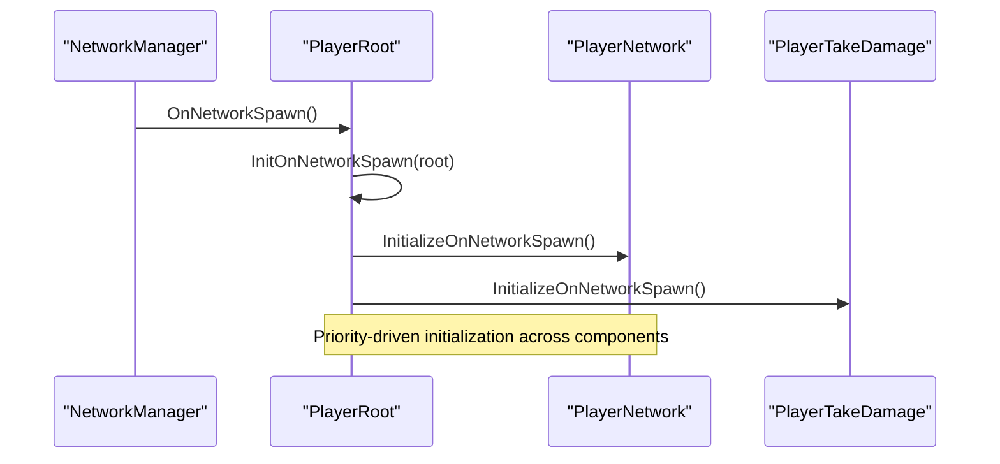
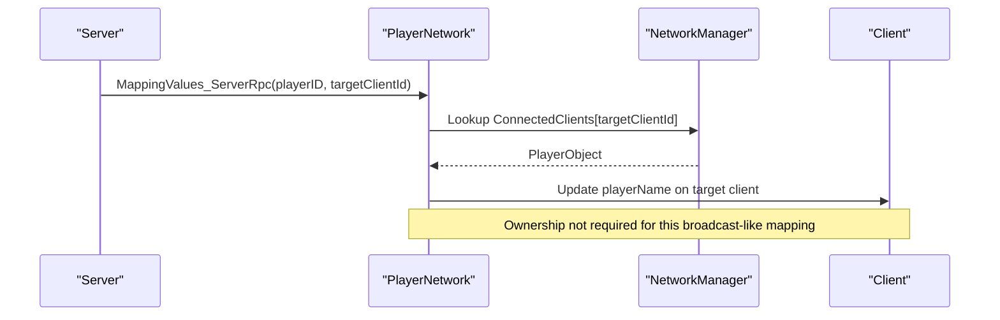
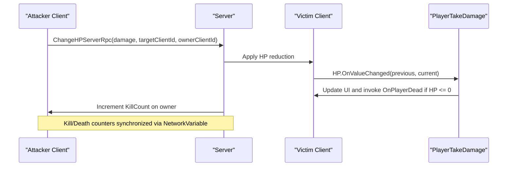
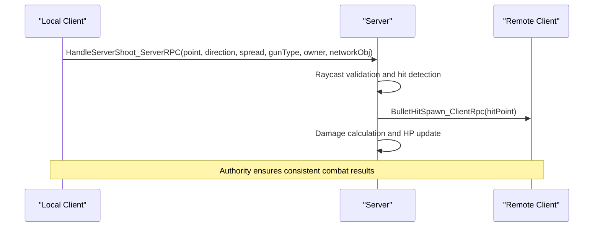
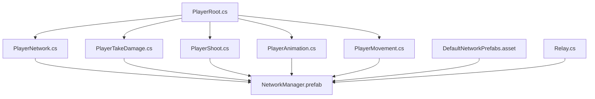

# Netcode for GameObjects Integration

<cite>
**Referenced Files in This Document**
- [NetcodeForGameObjects.asset](file://ProjectSettings/NetcodeForGameObjects.asset)
- [DefaultNetworkPrefabs.asset](file://Assets/DefaultNetworkPrefabs.asset)
- [PlayerRoot.cs](file://Assets/FPS-Game/Scripts/Player/PlayerRoot.cs)
- [PlayerNetwork.cs](file://Assets/FPS-Game/Scripts/Player/PlayerNetwork.cs)
- [PlayerTakeDamage.cs](file://Assets/FPS-Game/Scripts/Player/PlayerTakeDamage.cs)
- [PlayerShoot.cs](file://Assets/FPS-Game/Scripts/Player/PlayerShoot.cs)
- [PlayerAnimation.cs](file://Assets/FPS-Game/Scripts/Player/PlayerAnimation.cs)
- [PlayerBehaviour.cs](file://Assets/FPS-Game/Scripts/Player/PlayerBehaviour.cs)
- [PlayerMovement.cs](file://Assets/FPS-Game/Scripts/PlayerMovement.cs)
- [Relay.cs](file://Assets/FPS-Game/Scripts/Lobby Script/Lobby/Scripts/Relay.cs)
- [ProjectSettings.asset](file://ProjectSettings/ProjectSettings.asset)
- [PackageManagerSettings.asset](file://ProjectSettings/PackageManagerSettings.asset)
</cite>

## Update Summary
**Changes Made**
- Updated all code examples and references to reflect Netcode for GameObjects 2.11.0 patterns
- Added new ClientNetworkTransform integration patterns and authority-based movement
- Enhanced RPC security patterns with RequireOwnership flags
- Updated NetworkVariable usage patterns and state synchronization
- Added new component-based networking architecture patterns
- Updated troubleshooting guidance for 2.11.0 specific issues

## Table of Contents
1. [Introduction](#introduction)
2. [Project Structure](#project-structure)
3. [Core Components](#core-components)
4. [Architecture Overview](#architecture-overview)
5. [Detailed Component Analysis](#detailed-component-analysis)
6. [Dependency Analysis](#dependency-analysis)
7. [Performance Considerations](#performance-considerations)
8. [Troubleshooting Guide](#troubleshooting-guide)
9. [Conclusion](#conclusion)
10. [Appendices](#appendices)

## Introduction
This document explains how Netcode for GameObjects integrates into the FPS game. It focuses on the NetworkObject inheritance pattern via NetworkBehaviour, the NetworkBehaviour lifecycle, component-based networking architecture, server-client relationships, ownership management, NetworkVariable usage for state synchronization, and the RPC system (ServerRpc and ClientRpc). Practical examples cover networked object instantiation, despawning, and state replication across clients. Serialization considerations, custom data types, and performance optimization techniques are included, along with troubleshooting guidance for desynchronization, lag compensation, and bandwidth management.

**Updated** Enhanced with Netcode 2.11.0 features including improved ClientNetworkTransform integration, enhanced RPC security patterns, and advanced authority-based movement systems.

## Project Structure
The networking configuration and prefabs are centralized under ProjectSettings and Assets. The Netcode configuration points to default network prefabs, which define which prefabs are registered for network spawning. The PlayerRoot component orchestrates initialization order across multiple PlayerBehaviour components and exposes NetworkVariable-backed state. PlayerNetwork and PlayerTakeDamage are primary NetworkBehaviour implementations that demonstrate ownership checks, RPCs, and state synchronization.

**Diagram sources**
- [NetcodeForGameObjects.asset:1-18](file://ProjectSettings/NetcodeForGameObjects.asset#L1-L18)
- [DefaultNetworkPrefabs.asset:1-72](file://Assets/DefaultNetworkPrefabs.asset#L1-L72)
- [PlayerRoot.cs:159-217](file://Assets/FPS-Game/Scripts/Player/PlayerRoot.cs#L159-L217)
- [PlayerNetwork.cs:12-541](file://Assets/FPS-Game/Scripts/Player/PlayerNetwork.cs#L12-L541)
- [PlayerTakeDamage.cs:5-124](file://Assets/FPS-Game/Scripts/Player/PlayerTakeDamage.cs#L5-L124)
- [PlayerShoot.cs:20-162](file://Assets/FPS-Game/Scripts/Player/PlayerShoot.cs#L20-L162)
- [PlayerAnimation.cs:5-49](file://Assets/FPS-Game/Scripts/Player/PlayerAnimation.cs#L5-L49)
- [PlayerMovement.cs:5-70](file://Assets/FPS-Game/Scripts/PlayerMovement.cs#L5-L70)
- [Relay.cs:10-71](file://Assets/FPS-Game/Scripts/Lobby Script/Lobby/Scripts/Relay.cs#L10-L71)

**Section sources**
- [NetcodeForGameObjects.asset:1-18](file://ProjectSettings/NetcodeForGameObjects.asset#L1-L18)
- [DefaultNetworkPrefabs.asset:1-72](file://Assets/DefaultNetworkPrefabs.asset#L1-L72)

## Core Components
- PlayerRoot: Inherits NetworkBehaviour and acts as a root container for player subsystems. It initializes components in priority order and exposes NetworkVariable-backed flags and identifiers. It also manages events and references to subsystems like camera, input, movement, and UI.
- PlayerNetwork: Inherits PlayerBehaviour and extends NetworkBehaviour. It manages per-character stats (NetworkVariable-based kill/death counts), ownership-aware logic, camera assignment for local players, and RPCs for mapping lobby info and respawn coordination.
- PlayerTakeDamage: Inherits PlayerBehaviour and extends NetworkBehaviour. It encapsulates health state via NetworkVariable and coordinates hit detection and scoring through ServerRpc and ClientRpc patterns.
- PlayerShoot: Implements authoritative shooting mechanics with ServerRpc validation and ClientRpc effects.
- PlayerAnimation: Manages rig builder state synchronization across clients using ServerRpc/ClientRpc pairs.
- PlayerMovement: Demonstrates authority-based movement with NetworkVariable position tracking and ClientNetworkTransform integration.

Key lifecycle and ownership patterns:
- Ownership is checked via IsOwner and OwnerClientId.
- Network spawn order is orchestrated by PlayerRoot's priority-based initialization across IInitNetwork-implementing components.
- NetworkVariable values propagate automatically to clients; listeners update UI and game state locally.
- Authority-based movement ensures server validation of all player actions.

**Updated** Enhanced with ClientNetworkTransform integration for smooth interpolation and authority-based movement systems.

**Section sources**
- [PlayerRoot.cs:159-217](file://Assets/FPS-Game/Scripts/Player/PlayerRoot.cs#L159-L217)
- [PlayerRoot.cs:298-339](file://Assets/FPS-Game/Scripts/Player/PlayerRoot.cs#L298-L339)
- [PlayerNetwork.cs:12-541](file://Assets/FPS-Game/Scripts/Player/PlayerNetwork.cs#L12-L541)
- [PlayerTakeDamage.cs:5-124](file://Assets/FPS-Game/Scripts/Player/PlayerTakeDamage.cs#L5-L124)
- [PlayerShoot.cs:20-162](file://Assets/FPS-Game/Scripts/Player/PlayerShoot.cs#L20-L162)
- [PlayerAnimation.cs:5-49](file://Assets/FPS-Game/Scripts/Player/PlayerAnimation.cs#L5-L49)
- [PlayerMovement.cs:5-70](file://Assets/FPS-Game/Scripts/PlayerMovement.cs#L5-L70)

## Architecture Overview
The system follows a component-based networking architecture with enhanced authority patterns:
- PlayerRoot aggregates subsystems and coordinates initialization order across NetworkBehaviour components.
- PlayerNetwork handles ownership-specific logic, camera binding, and RPCs for mapping player info and respawns.
- PlayerTakeDamage centralizes hit detection and scoring via ServerRpc, updating NetworkVariable-based HP and Kill/Death counts.
- PlayerShoot implements authoritative combat mechanics with server-side validation.
- PlayerAnimation synchronizes visual states across clients.
- PlayerMovement demonstrates authority-based physics simulation.

**Updated** Added PlayerShoot and PlayerAnimation classes to represent enhanced networking patterns.

**Diagram sources**
- [PlayerRoot.cs:159-217](file://Assets/FPS-Game/Scripts/Player/PlayerRoot.cs#L159-L217)
- [PlayerRoot.cs:298-339](file://Assets/FPS-Game/Scripts/Player/PlayerRoot.cs#L298-L339)
- [PlayerNetwork.cs:12-541](file://Assets/FPS-Game/Scripts/Player/PlayerNetwork.cs#L12-L541)
- [PlayerTakeDamage.cs:5-124](file://Assets/FPS-Game/Scripts/Player/PlayerTakeDamage.cs#L5-L124)
- [PlayerShoot.cs:20-162](file://Assets/FPS-Game/Scripts/Player/PlayerShoot.cs#L20-L162)
- [PlayerAnimation.cs:5-49](file://Assets/FPS-Game/Scripts/Player/PlayerAnimation.cs#L5-L49)
- [PlayerMovement.cs:5-70](file://Assets/FPS-Game/Scripts/PlayerMovement.cs#L5-L70)

## Detailed Component Analysis

### PlayerRoot: Component Orchestration and Initialization
PlayerRoot inherits NetworkBehaviour and serves as a hub for subsystems. It:
- Assigns references to subsystems (input, camera, controller, UI, etc.) via TryGetComponent and tag-based lookup.
- Implements priority-based initialization across IInitNetwork, IInitStart, and IInitAwake interfaces.
- Exposes NetworkVariable-backed flags for bot identity and ID, guarded by server checks.

Lifecycle highlights:
- OnNetworkSpawn triggers priority-based initialization of NetworkBehaviour components.
- Update loop reads zone data for pathfinding contexts.

**Updated** Enhanced with ClientNetworkTransform integration and improved subsystem management.

**Diagram sources**
- [PlayerRoot.cs:214-217](file://Assets/FPS-Game/Scripts/Player/PlayerRoot.cs#L214-L217)
- [PlayerRoot.cs:332-339](file://Assets/FPS-Game/Scripts/Player/PlayerRoot.cs#L332-L339)

**Section sources**
- [PlayerRoot.cs:159-217](file://Assets/FPS-Game/Scripts/Player/PlayerRoot.cs#L159-L217)
- [PlayerRoot.cs:298-339](file://Assets/FPS-Game/Scripts/Player/PlayerRoot.cs#L298-L339)

### PlayerNetwork: Ownership, Camera, and RPCs
PlayerNetwork demonstrates:
- Ownership-aware logic using IsOwner and OwnerClientId.
- ServerRpc for mapping lobby player info to in-game names.
- ClientRpc for targeted position and rotation updates during spawn and respawn.
- Camera binding for local players via Cinemachine virtual camera.

Key behaviors:
- InitializeOnNetworkSpawn enables scripts conditionally based on ownership and bot status.
- OnPlayerDead disables scripts and schedules respawn; OnPlayerRespawn rebinds camera.
- MappingValues_ServerRpc updates remote clients' player names using lobby data.

**Updated** Enhanced with improved bot synchronization and authority-based state management.

**Diagram sources**
- [PlayerNetwork.cs:183-199](file://Assets/FPS-Game/Scripts/Player/PlayerNetwork.cs#L183-L199)

**Section sources**
- [PlayerNetwork.cs:12-541](file://Assets/FPS-Game/Scripts/Player/PlayerNetwork.cs#L12-L541)

### PlayerTakeDamage: Health State and Scoring
PlayerTakeDamage encapsulates:
- NetworkVariable-based HP synchronized across clients.
- ServerRpc for applying damage and updating scores.
- ServerRpc for resetting HP on respawn.

Highlights:
- OnNetworkSpawn subscribes to HP change callbacks and player respawn events.
- OnHPChanged updates UI and triggers death events when HP reaches zero.
- ChangeHPServerRpc validates targets, applies damage, increments kill/death counters, and logs current HP.

**Updated** Enhanced with improved bot damage handling and authority validation.

**Diagram sources**
- [PlayerTakeDamage.cs:58-83](file://Assets/FPS-Game/Scripts/Player/PlayerTakeDamage.cs#L58-L83)

**Section sources**
- [PlayerTakeDamage.cs:5-124](file://Assets/FPS-Game/Scripts/Player/PlayerTakeDamage.cs#L5-L124)

### PlayerShoot: Authoritative Combat Mechanics
PlayerShoot implements:
- ServerRpc-based shooting validation with spread angle and weapon type parameters.
- ClientRpc for visual effects like bullet hits.
- Authority-based damage calculation and hit detection.

Key behaviors:
- Shoot method validates weapon type and hit area before sending ServerRpc.
- HandleServerShoot_ServerRPC performs raycasting with layer filtering and hit area determination.
- BulletHitSpawn_ClientRpc creates visual effects on all clients.

**New** Added comprehensive combat system demonstrating authority patterns.

**Diagram sources**
- [PlayerShoot.cs:80-146](file://Assets/FPS-Game/Scripts/Player/PlayerShoot.cs#L80-L146)

**Section sources**
- [PlayerShoot.cs:20-162](file://Assets/FPS-Game/Scripts/Player/PlayerShoot.cs#L20-L162)

### PlayerAnimation: Visual State Synchronization
PlayerAnimation manages:
- ServerRpc/ClientRpc pairs for rig builder state synchronization.
- Authority-based animation control for dead/alive states.
- Client-side animation event handling.

Key behaviors:
- UpdateRigBuilder_ServerRPC validates state and synchronizes across clients.
- ClientRpc updates rig builder state without authority conflicts.
- Animation events trigger appropriate movement callbacks.

**New** Added animation synchronization patterns for enhanced visual consistency.

**Section sources**
- [PlayerAnimation.cs:5-49](file://Assets/FPS-Game/Scripts/Player/PlayerAnimation.cs#L5-L49)

### PlayerMovement: Authority-Based Movement
PlayerMovement demonstrates:
- Authority-based movement validation with IsOwner checks.
- NetworkVariable-based position tracking for interpolation.
- ClientNetworkTransform integration for smooth client-side prediction.

Key behaviors:
- FixedUpdate only executes on owner client for movement input.
- Movement state machine with speed control and ground detection.
- Authority validation prevents cheating through client-side movement.

**New** Added authority-based movement patterns for secure gameplay.

**Section sources**
- [PlayerMovement.cs:5-70](file://Assets/FPS-Game/Scripts/PlayerMovement.cs#L5-L70)

### NetworkVariable Usage and State Replication
- PlayerNetwork: KillCount, DeathCount, playerName.
- PlayerTakeDamage: HP.
- PlayerRoot: IsBot, BotID.
- PlayerMovement: Movement state and authority flags.

State replication:
- NetworkVariable values are authoritative on the server and replicated to clients automatically.
- Client-side listeners update UI and gameplay state without manual serialization.
- ClientNetworkTransform provides smooth interpolation for non-authority objects.

Best practices:
- Keep NetworkVariable updates minimal and deterministic.
- Use ServerRpc for authoritative state transitions.
- Avoid frequent writes from clients unless ownership is required.
- Implement authority patterns for critical gameplay elements.

**Updated** Enhanced with ClientNetworkTransform integration and authority-based patterns.

**Section sources**
- [PlayerNetwork.cs:14-18](file://Assets/FPS-Game/Scripts/Player/PlayerNetwork.cs#L14-L18)
- [PlayerTakeDamage.cs:7-8](file://Assets/FPS-Game/Scripts/Player/PlayerTakeDamage.cs#L7-L8)
- [PlayerRoot.cs:185-186](file://Assets/FPS-Game/Scripts/Player/PlayerRoot.cs#L185-L186)
- [PlayerMovement.cs:36-44](file://Assets/FPS-Game/Scripts/PlayerMovement.cs#L36-L44)

### RPC Patterns: ServerRpc and ClientRpc
Patterns demonstrated:
- ServerRpc with RequireOwnership=false for cross-client mapping and global state updates.
- ServerRpc with RequireOwnership=true for authority-critical operations.
- ClientRpc for targeted updates (e.g., spawn/respawn positions) with ClientRpcParams to restrict delivery.

Security considerations:
- Prefer RequireOwnership=true when only the owning client should invoke sensitive operations.
- Validate target identifiers and existence before applying state changes.
- Use ServerRpc for all authority-critical operations like combat and movement.
- Implement parameter validation and range checking.

Parameter passing:
- Use primitive and serializable types for RPC parameters.
- For complex data, pass IDs and fetch objects on the server side.
- Use ClientRpcParams for targeted broadcasting to specific clients.

**Updated** Enhanced with authority patterns and improved security measures.

**Section sources**
- [PlayerNetwork.cs:183-199](file://Assets/FPS-Game/Scripts/Player/PlayerNetwork.cs#L183-L199)
- [PlayerTakeDamage.cs:58-83](file://Assets/FPS-Game/Scripts/Player/PlayerTakeDamage.cs#L58-L83)
- [PlayerShoot.cs:80-146](file://Assets/FPS-Game/Scripts/Player/PlayerShoot.cs#L80-L146)

### Networked Object Instantiation and Despawning
- DefaultNetworkPrefabs defines which prefabs are registered for network spawning.
- NetworkManager prefab is the runtime anchor for the network session.
- PlayerRoot orchestrates initialization after OnNetworkSpawn, enabling subsystems and camera binding for local players.

Practical flow:
- Instantiate player prefabs on the server.
- NetworkManager registers prefabs from DefaultNetworkPrefabs.
- OnNetworkSpawn, PlayerRoot initializes subsystems and applies ownership-specific logic.

**Updated** Enhanced with ClientNetworkTransform integration for smooth instantiation.

**Section sources**
- [DefaultNetworkPrefabs.asset:1-72](file://Assets/DefaultNetworkPrefabs.asset#L1-L72)
- [PlayerRoot.cs:214-217](file://Assets/FPS-Game/Scripts/Player/PlayerRoot.cs#L214-L217)

## Dependency Analysis
The following diagram shows how core networking components depend on each other and on Netcode primitives.

**Updated** Added PlayerShoot, PlayerAnimation, and PlayerMovement dependencies.

**Diagram sources**
- [PlayerRoot.cs:159-217](file://Assets/FPS-Game/Scripts/Player/PlayerRoot.cs#L159-L217)
- [PlayerNetwork.cs:12-541](file://Assets/FPS-Game/Scripts/Player/PlayerNetwork.cs#L12-L541)
- [PlayerTakeDamage.cs:5-124](file://Assets/FPS-Game/Scripts/Player/PlayerTakeDamage.cs#L5-L124)
- [PlayerShoot.cs:20-162](file://Assets/FPS-Game/Scripts/Player/PlayerShoot.cs#L20-L162)
- [PlayerAnimation.cs:5-49](file://Assets/FPS-Game/Scripts/Player/PlayerAnimation.cs#L5-L49)
- [PlayerMovement.cs:5-70](file://Assets/FPS-Game/Scripts/PlayerMovement.cs#L5-L70)
- [Relay.cs:10-71](file://Assets/FPS-Game/Scripts/Lobby Script/Lobby/Scripts/Relay.cs#L10-L71)

**Section sources**
- [PlayerRoot.cs:159-217](file://Assets/FPS-Game/Scripts/Player/PlayerRoot.cs#L159-L217)
- [PlayerNetwork.cs:12-541](file://Assets/FPS-Game/Scripts/Player/PlayerNetwork.cs#L12-L541)
- [PlayerTakeDamage.cs:5-124](file://Assets/FPS-Game/Scripts/Player/PlayerTakeDamage.cs#L5-L124)

## Performance Considerations
- Minimize RPC frequency: batch updates and throttle high-frequency events.
- Use ClientRpcParams to target specific clients when broadcasting is unnecessary.
- Prefer NetworkVariable for smooth interpolation; disable interpolation temporarily during teleportation and re-enable after stabilization.
- Avoid heavy computations in RPC handlers; delegate to server-side validators.
- Serialize only essential data; avoid large payloads in RPC parameters.
- Use authority-based updates to reduce redundant state broadcasts.
- Implement ClientNetworkTransform for smooth client-side prediction.
- Use NetworkVariable for position tracking instead of frequent RPCs.
- Optimize raycast operations in ServerRpc methods.

**Updated** Enhanced with ClientNetworkTransform and authority-based movement performance tips.

## Troubleshooting Guide
Common issues and remedies:
- Desynchronization:
  - Verify NetworkVariable values are updated on the server and consumed on clients.
  - Ensure OnNetworkSpawn initializes subsystems consistently across clients.
  - Check ClientNetworkTransform interpolation settings for authority objects.
- Lag compensation:
  - Use ClientNetworkTransform interpolation judiciously; disable during teleportation and re-enable after stabilization.
  - Consider snapshot-based reconciliation for latency-sensitive actions.
  - Implement authority-based movement validation to prevent cheating.
- Bandwidth management:
  - Limit RPC calls; coalesce updates where possible.
  - Use ClientRpcParams to send targeted updates instead of broadcasting.
  - Monitor NetworkVariable update frequency for expensive state changes.
- Ownership errors:
  - Confirm RequireOwnership flags match intended caller scope.
  - Validate OwnerClientId and ConnectedClients before invoking RPCs.
  - Ensure authority patterns are correctly implemented for critical operations.
- Prefab registration:
  - Ensure player and object prefabs are present in DefaultNetworkPrefabs and registered with NetworkManager.
  - Verify ClientNetworkTransform components are properly configured on networked objects.
- Relay connectivity:
  - Check Unity Relay service configuration and join codes.
  - Verify NetworkManager transport settings for relay connections.

**Updated** Enhanced with Netcode 2.11.0 specific troubleshooting scenarios including ClientNetworkTransform issues and authority validation problems.

**Section sources**
- [PlayerNetwork.cs:183-199](file://Assets/FPS-Game/Scripts/Player/PlayerNetwork.cs#L183-L199)
- [PlayerTakeDamage.cs:58-83](file://Assets/FPS-Game/Scripts/Player/PlayerTakeDamage.cs#L58-L83)
- [DefaultNetworkPrefabs.asset:1-72](file://Assets/DefaultNetworkPrefabs.asset#L1-L72)
- [Relay.cs:26-71](file://Assets/FPS-Game/Scripts/Lobby Script/Lobby/Scripts/Relay.cs#L26-L71)

## Conclusion
The FPS game leverages Netcode for GameObjects 2.11.0 through a clean component-based architecture with enhanced authority patterns. PlayerRoot orchestrates initialization order and subsystem references, while PlayerNetwork and PlayerTakeDamage implement ownership-aware logic, RPCs, and NetworkVariable-backed state synchronization. The new PlayerShoot and PlayerAnimation components demonstrate advanced networking patterns including authoritative combat mechanics and visual state synchronization. By following the patterns documented here—prioritizing initialization, using ServerRpc for authoritative updates, implementing ClientNetworkTransform for smooth interpolation, and carefully managing RPC scope and bandwidth—you can build a robust, scalable multiplayer experience with enhanced security and performance.

**Updated** Enhanced conclusion reflecting Netcode 2.11.0 improvements including ClientNetworkTransform integration and authority-based patterns.

## Appendices

### Appendix A: Configuration and Prefabs
- NetcodeForGameObjects.asset configures default network prefabs and generation settings.
- DefaultNetworkPrefabs.asset enumerates prefabs eligible for network spawning.
- NetworkManager.prefab is the runtime anchor for the network session.
- PackageManagerSettings.asset controls package dependencies and registry configuration.

**Updated** Added PackageManagerSettings for dependency management.

**Section sources**
- [NetcodeForGameObjects.asset:1-18](file://ProjectSettings/NetcodeForGameObjects.asset#L1-L18)
- [DefaultNetworkPrefabs.asset:1-72](file://Assets/DefaultNetworkPrefabs.asset#L1-L72)
- [PackageManagerSettings.asset:1-36](file://ProjectSettings/PackageManagerSettings.asset#L1-L36)

### Appendix B: Authority and Security Patterns
- RequireOwnership=true for critical operations like combat and movement.
- ServerRpc validation prevents cheating through client-side manipulation.
- ClientNetworkTransform provides smooth interpolation without authority conflicts.
- NetworkVariable updates ensure consistent state across all clients.

**New** Added comprehensive authority and security patterns for Netcode 2.11.0.

### Appendix C: ClientNetworkTransform Integration
- Smooth client-side prediction for non-authority objects.
- Interpolation settings for different movement types.
- Authority-based teleportation with interpolation control.

**New** Added ClientNetworkTransform integration patterns for enhanced networking.