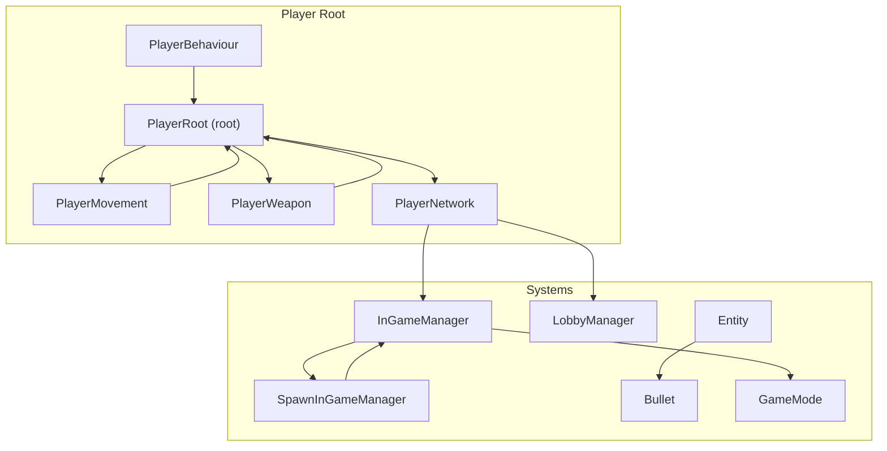
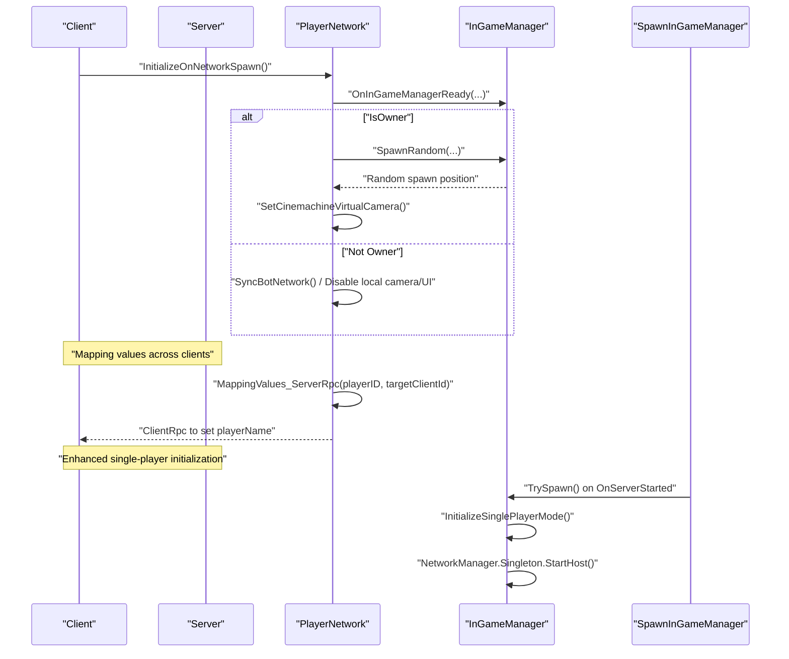
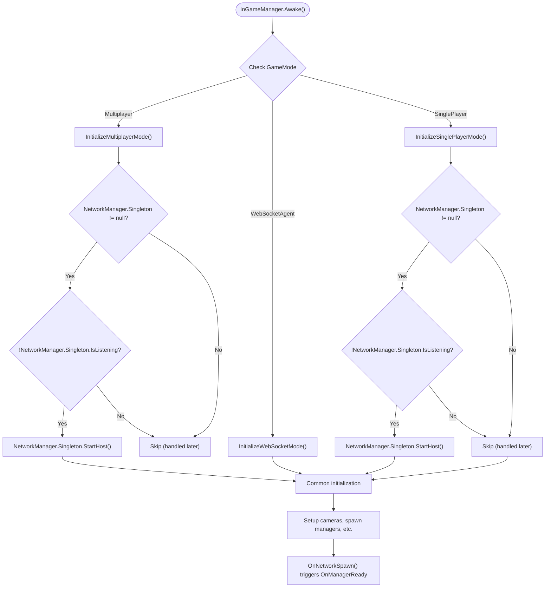
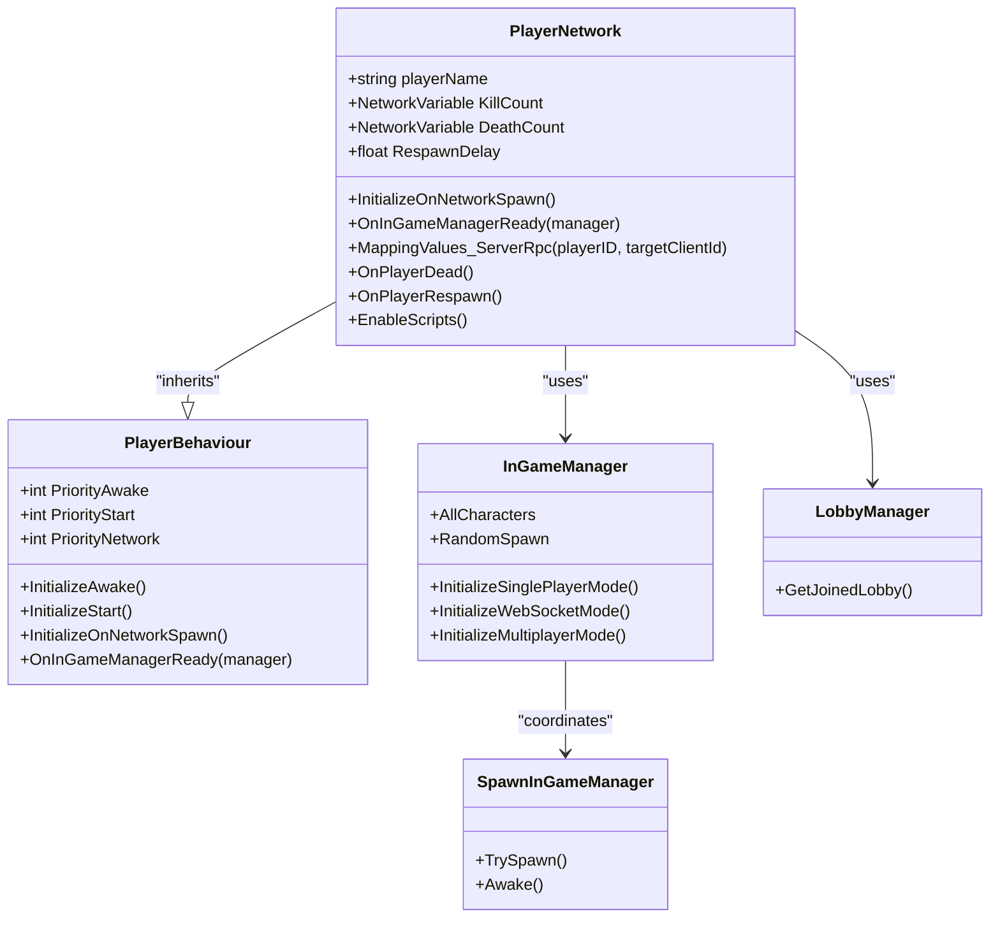
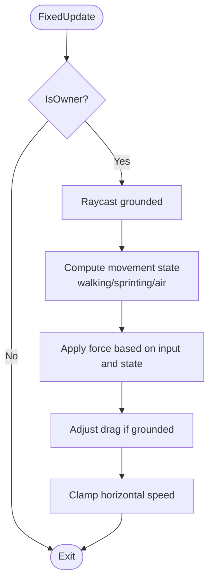
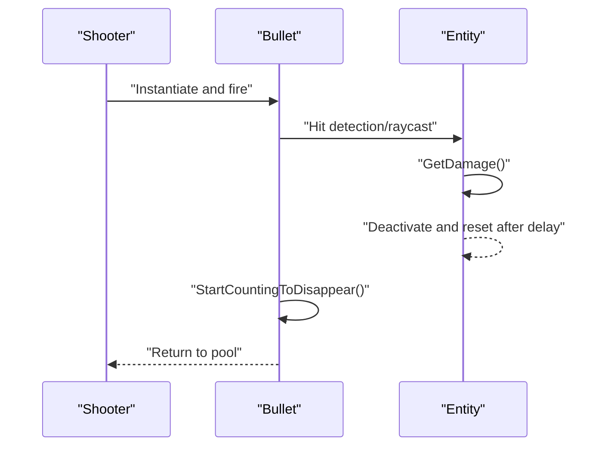
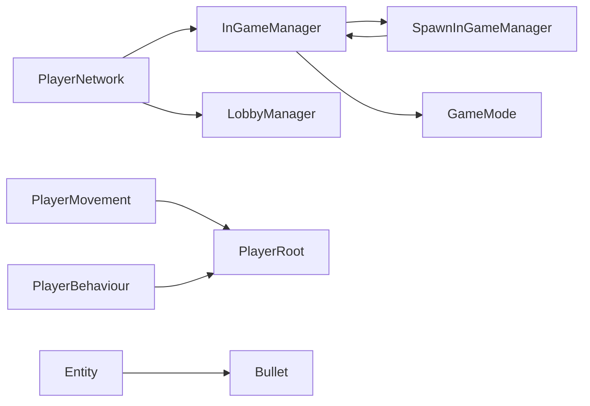

# Networking Architecture

<cite>
**Referenced Files in This Document**
- [PlayerNetwork.cs](file://Assets/FPS-Game/Scripts/Player/PlayerNetwork.cs)
- [PlayerMovement.cs](file://Assets/FPS-Game/Scripts/PlayerMovement.cs)
- [PlayerWeapon.cs](file://Assets/FPS-Game/Scripts/PlayerWeapon.cs)
- [PlayerBehaviour.cs](file://Assets/FPS-Game/Scripts/Player/PlayerBehaviour.cs)
- [Entity.cs](file://Assets/FPS-Game/Scripts/Entity.cs)
- [Bullet.cs](file://Assets/FPS-Game/Scripts/Bullet.cs)
- [InGameManager.cs](file://Assets/FPS-Game/Scripts/System/InGameManager.cs)
- [LobbyManager.cs](file://Assets/FPS-Game/Scripts/Lobby Script/Lobby/Scripts/LobbyManager.cs)
- [SpawnInGameManager.cs](file://Assets/FPS-Game/Scripts/System/SpawnInGameManager.cs)
- [GameMode.cs](file://Assets/FPS-Game/Scripts/System/GameMode.cs)
</cite>

## Update Summary
**Changes Made**
- Updated documentation to reflect the critical multiplayer initialization fix with NetworkManager.StartHost() calls
- Enhanced InGameManager documentation with proper NetworkManager startup logic for both multiplayer and single-player modes
- Updated troubleshooting section with specific guidance for initialization sequence issues
- Added new section on NetworkManager initialization best practices

## Table of Contents
1. [Introduction](#introduction)
2. [Project Structure](#project-structure)
3. [Core Components](#core-components)
4. [Architecture Overview](#architecture-overview)
5. [Game Modes and Initialization](#game-modes-and-initialization)
6. [Detailed Component Analysis](#detailed-component-analysis)
7. [Dependency Analysis](#dependency-analysis)
8. [Performance Considerations](#performance-considerations)
9. [Troubleshooting Guide](#troubleshooting-guide)
10. [Conclusion](#conclusion)

## Introduction
This document explains the networking architecture of the project with a focus on server-authoritative gameplay using Unity Netcode for GameObjects. It covers the client-host topology, NetworkObject synchronization patterns, and NetworkVariable usage for state management. It also documents server-authoritative mechanics for player movement, weapon state, and health/damage processing, along with client-side interpolation, prediction, and rollback considerations. The architecture now supports multiple game modes including single-player testing, traditional multiplayer, and WebSocket agent modes. Practical examples illustrate networked object spawning, cross-client player synchronization, and event broadcasting with improved initialization timing. Finally, it provides guidance on optimization, bandwidth management, latency compensation, debugging, disconnection handling, and reliable messaging.

## Project Structure
The networking layer centers around a player-rooted hierarchy with a dedicated PlayerRoot component that aggregates subsystems (movement, camera, input, UI, weapon, etc.). PlayerBehaviour is the base NetworkBehaviour for player-related scripts. PlayerNetwork orchestrates spawn, respawn, and cross-client state mapping. PlayerMovement handles authoritative movement logic. PlayerWeapon encapsulates weapon collections. Entity and Bullet manage hit detection and projectile lifecycle. The system now supports multiple initialization modes through the GameMode enum.

**Diagram sources**
- [PlayerNetwork.cs:12-220](file://Assets/FPS-Game/Scripts/Player/PlayerNetwork.cs#L12-L220)
- [PlayerMovement.cs:5-158](file://Assets/FPS-Game/Scripts/PlayerMovement.cs#L5-L158)
- [PlayerWeapon.cs:5-25](file://Assets/FPS-Game/Scripts/PlayerWeapon.cs#L5-L25)
- [PlayerBehaviour.cs:4-31](file://Assets/FPS-Game/Scripts/Player/PlayerBehaviour.cs#L4-L31)
- [Entity.cs:5-76](file://Assets/FPS-Game/Scripts/Entity.cs#L5-L76)
- [Bullet.cs:5-23](file://Assets/FPS-Game/Scripts/Bullet.cs#L5-L23)
- [InGameManager.cs](file://Assets/FPS-Game/Scripts/System/InGameManager.cs)
- [LobbyManager.cs](file://Assets/FPS-Game/Scripts/Lobby Script/Lobby/Scripts/LobbyManager.cs)
- [SpawnInGameManager.cs](file://Assets/FPS-Game/Scripts/System/SpawnInGameManager.cs)
- [GameMode.cs](file://Assets/FPS-Game/Scripts/System/GameMode.cs)

**Section sources**
- [PlayerNetwork.cs:12-220](file://Assets/FPS-Game/Scripts/Player/PlayerNetwork.cs#L12-L220)
- [PlayerMovement.cs:5-158](file://Assets/FPS-Game/Scripts/PlayerMovement.cs#L5-L158)
- [PlayerWeapon.cs:5-25](file://Assets/FPS-Game/Scripts/PlayerWeapon.cs#L5-L25)
- [PlayerBehaviour.cs:4-31](file://Assets/FPS-Game/Scripts/Player/PlayerBehaviour.cs#L4-L31)
- [Entity.cs:5-76](file://Assets/FPS-Game/Scripts/Entity.cs#L5-L76)
- [Bullet.cs:5-23](file://Assets/FPS-Game/Scripts/Bullet.cs#L5-L23)
- [InGameManager.cs](file://Assets/FPS-Game/Scripts/System/InGameManager.cs)
- [LobbyManager.cs](file://Assets/FPS-Game/Scripts/Lobby Script/Lobby/Scripts/LobbyManager.cs)
- [SpawnInGameManager.cs](file://Assets/FPS-Game/Scripts/System/SpawnInGameManager.cs)
- [GameMode.cs](file://Assets/FPS-Game/Scripts/System/GameMode.cs)

## Core Components
- PlayerBehaviour: Base NetworkBehaviour that injects PlayerRoot into player scripts and coordinates initialization order across awake/start/network/in-game-manager-ready phases.
- PlayerNetwork: Server-authoritative orchestration of spawn/respawn, cross-client identity mapping, and camera/camera-follow setup. Uses NetworkVariables for kill/death counts and ServerRpc/ClientRpc for deterministic state updates.
- PlayerMovement: Authoritative movement controlled by the owner; applies forces in FixedUpdate and clamps speed; grounded checks and drag adjustments occur locally.
- PlayerWeapon: Holds player weapons collection; can be extended to synchronize weapon state via NetworkVariable or RPCs.
- Entity: Health/damage system for static props; demonstrates hit effects and color transitions.
- Bullet: Projectile lifecycle management with automatic cleanup after TTL.
- **Updated** InGameManager: Central game manager with mode-specific initialization support including single-player mode with NetworkManager host startup and improved spawn timing coordination.
- **Updated** SpawnInGameManager: Enhanced spawn timing system with event-driven initialization that subscribes to NetworkManager.OnServerStarted for proper spawn sequencing.
- **New** GameMode: Enum defining operational modes (Multiplayer, WebSocketAgent, SinglePlayer) for flexible game configuration.

**Section sources**
- [PlayerBehaviour.cs:4-31](file://Assets/FPS-Game/Scripts/Player/PlayerBehaviour.cs#L4-L31)
- [PlayerNetwork.cs:12-220](file://Assets/FPS-Game/Scripts/Player/PlayerNetwork.cs#L12-L220)
- [PlayerMovement.cs:5-158](file://Assets/FPS-Game/Scripts/PlayerMovement.cs#L5-L158)
- [PlayerWeapon.cs:5-25](file://Assets/FPS-Game/Scripts/PlayerWeapon.cs#L5-L25)
- [Entity.cs:5-76](file://Assets/FPS-Game/Scripts/Entity.cs#L5-L76)
- [Bullet.cs:5-23](file://Assets/FPS-Game/Scripts/Bullet.cs#L5-L23)
- [InGameManager.cs](file://Assets/FPS-Game/Scripts/System/InGameManager.cs)
- [SpawnInGameManager.cs](file://Assets/FPS-Game/Scripts/System/SpawnInGameManager.cs)
- [GameMode.cs](file://Assets/FPS-Game/Scripts/System/GameMode.cs)

## Architecture Overview
The architecture follows a client-host model with server authority and supports multiple operational modes:
- Ownership: Only the object owner updates its authoritative state (movement, actions).
- Server authority: Server validates and finalizes state changes (health, scoring, spawn/respawn).
- Client interpolation: Non-owners interpolate positions/rotations received from the server.
- RPCs: ServerRpc/ClientRpc coordinate cross-client deterministic events (mapping identities, respawns).
- **Updated** Game modes: Multiplayer (traditional), WebSocketAgent (direct AI control), and SinglePlayer (local testing with host mode).

**Diagram sources**
- [PlayerNetwork.cs:20-77](file://Assets/FPS-Game/Scripts/Player/PlayerNetwork.cs#L20-L77)
- [PlayerNetwork.cs:183-199](file://Assets/FPS-Game/Scripts/Player/PlayerNetwork.cs#L183-L199)
- [InGameManager.cs](file://Assets/FPS-Game/Scripts/System/InGameManager.cs)
- [SpawnInGameManager.cs](file://Assets/FPS-Game/Scripts/System/SpawnInGameManager.cs)

## Game Modes and Initialization

### Game Mode Configuration
The system now supports three distinct operational modes defined by the GameMode enum:

**Multiplayer Mode**: Traditional networking with authentication, lobby, relay, and Netcode for GameObjects integration. Includes full lobby system and relay checker initialization.

**WebSocketAgent Mode**: Direct AI agent control without networking services. Bypasses Relay/Lobby/NGO systems and initializes WebSocket server directly.

**SinglePlayer Mode**: Local testing mode that starts NetworkManager as host (server + client). Designed for development and testing scenarios.

### Enhanced Single-Player Mode Initialization
The InGameManager now includes specialized initialization logic for both single-player and multiplayer modes:

**Critical Fix**: Both `InitializeSinglePlayerMode()` and `InitializeMultiplayerMode()` now include proper NetworkManager startup logic:

**Diagram sources**
- [InGameManager.cs:110-205](file://Assets/FPS-Game/Scripts/System/InGameManager.cs#L110-L205)

### Improved Spawn Timing System
The SpawnInGameManager now implements event-driven initialization for better spawn timing:

**Updated** The spawn system now properly coordinates with NetworkManager initialization through event subscriptions:

- **Immediate Spawn**: If NetworkManager is already listening, spawns immediately
- **Event Subscription**: If NetworkManager exists but not listening, subscribes to OnServerStarted event
- **Deferred Spawn**: If NetworkManager not yet initialized, waits for InGameManager to handle initialization

**Section sources**
- [InGameManager.cs:110-205](file://Assets/FPS-Game/Scripts/System/InGameManager.cs#L110-L205)
- [SpawnInGameManager.cs:20-69](file://Assets/FPS-Game/Scripts/System/SpawnInGameManager.cs#L20-L69)
- [GameMode.cs:4-21](file://Assets/FPS-Game/Scripts/System/GameMode.cs#L4-L21)

## Detailed Component Analysis

### PlayerNetwork: Server-Authoritative Orchestration
Responsibilities:
- Initializes player-specific behavior on spawn, enabling/disabling scripts per ownership and bot status.
- Coordinates spawn/respawn with deterministic positioning and camera setup.
- Maps remote player names across clients via ServerRpc/ClientRpc.
- Manages death/respawn events and toggles character state.

Key patterns:
- NetworkVariables for kill/death counts.
- ServerRpc to broadcast identity mapping to a specific client.
- ClientRpc to apply deterministic state updates (position/rotation) with interpolation disabled during teleportation and re-enabled afterward.

**Diagram sources**
- [PlayerBehaviour.cs:4-31](file://Assets/FPS-Game/Scripts/Player/PlayerBehaviour.cs#L4-L31)
- [PlayerNetwork.cs:12-220](file://Assets/FPS-Game/Scripts/Player/PlayerNetwork.cs#L12-L220)
- [InGameManager.cs](file://Assets/FPS-Game/Scripts/System/InGameManager.cs)
- [SpawnInGameManager.cs](file://Assets/FPS-Game/Scripts/System/SpawnInGameManager.cs)
- [LobbyManager.cs](file://Assets/FPS-Game/Scripts/Lobby Script/Lobby/Scripts/LobbyManager.cs)

**Section sources**
- [PlayerNetwork.cs:12-220](file://Assets/FPS-Game/Scripts/Player/PlayerNetwork.cs#L12-L220)

### PlayerMovement: Authoritative Movement
Responsibilities:
- Applies forces in FixedUpdate only when IsOwner is true.
- Determines grounded state via raycast and adjusts drag accordingly.
- Clamps horizontal speed to configured limits.
- Handles jumping with impulse force.

**Diagram sources**
- [PlayerMovement.cs:65-145](file://Assets/FPS-Game/Scripts/PlayerMovement.cs#L65-L145)

**Section sources**
- [PlayerMovement.cs:5-158](file://Assets/FPS-Game/Scripts/PlayerMovement.cs#L5-L158)

### PlayerWeapon: Weapon State Representation
Responsibilities:
- Stores the list of player weapons.
- Can be extended to synchronize weapon selection, ammo, and state via NetworkVariable or RPCs.

**Section sources**
- [PlayerWeapon.cs:5-25](file://Assets/FPS-Game/Scripts/PlayerWeapon.cs#L5-L25)

### Entity and Bullet: Health/Damage and Projectile Lifecycle
Responsibilities:
- Entity: Tracks health, applies damage, toggles active state, and updates material color to reflect damage stages.
- Bullet: Applies a short TTL and returns itself to a pool after expiration.

**Diagram sources**
- [Entity.cs:34-76](file://Assets/FPS-Game/Scripts/Entity.cs#L34-L76)
- [Bullet.cs:7-23](file://Assets/FPS-Game/Scripts/Bullet.cs#L7-L23)

**Section sources**
- [Entity.cs:5-76](file://Assets/FPS-Game/Scripts/Entity.cs#L5-L76)
- [Bullet.cs:5-23](file://Assets/FPS-Game/Scripts/Bullet.cs#L5-L23)

## Dependency Analysis
- PlayerNetwork depends on InGameManager for spawn positions and camera setup; uses LobbyManager to map remote player names.
- PlayerMovement depends on PlayerAssetsInputs and Rigidbody for physics-driven movement.
- PlayerBehaviour injects PlayerRoot into derived components to avoid tight coupling.
- Entity and Bullet form a reusable projectile-target interaction pattern.
- **Updated** InGameManager coordinates with SpawnInGameManager for proper initialization timing and supports multiple game modes with proper NetworkManager startup logic.
- **Updated** SpawnInGameManager handles event-driven spawn timing and coordinates with NetworkManager initialization.

**Diagram sources**
- [PlayerNetwork.cs:12-220](file://Assets/FPS-Game/Scripts/Player/PlayerNetwork.cs#L12-L220)
- [PlayerMovement.cs:5-158](file://Assets/FPS-Game/Scripts/PlayerMovement.cs#L5-L158)
- [PlayerBehaviour.cs:4-31](file://Assets/FPS-Game/Scripts/Player/PlayerBehaviour.cs#L4-L31)
- [Entity.cs:5-76](file://Assets/FPS-Game/Scripts/Entity.cs#L5-L76)
- [Bullet.cs:5-23](file://Assets/FPS-Game/Scripts/Bullet.cs#L5-L23)
- [InGameManager.cs](file://Assets/FPS-Game/Scripts/System/InGameManager.cs)
- [LobbyManager.cs](file://Assets/FPS-Game/Scripts/Lobby Script/Lobby/Scripts/LobbyManager.cs)
- [SpawnInGameManager.cs](file://Assets/FPS-Game/Scripts/System/SpawnInGameManager.cs)
- [GameMode.cs](file://Assets/FPS-Game/Scripts/System/GameMode.cs)

**Section sources**
- [PlayerNetwork.cs:12-220](file://Assets/FPS-Game/Scripts/Player/PlayerNetwork.cs#L12-L220)
- [PlayerMovement.cs:5-158](file://Assets/FPS-Game/Scripts/PlayerMovement.cs#L5-L158)
- [PlayerBehaviour.cs:4-31](file://Assets/FPS-Game/Scripts/Player/PlayerBehaviour.cs#L4-L31)
- [Entity.cs:5-76](file://Assets/FPS-Game/Scripts/Entity.cs#L5-L76)
- [Bullet.cs:5-23](file://Assets/FPS-Game/Scripts/Bullet.cs#L5-L23)
- [InGameManager.cs](file://Assets/FPS-Game/Scripts/System/InGameManager.cs)
- [LobbyManager.cs](file://Assets/FPS-Game/Scripts/Lobby Script/Lobby/Scripts/LobbyManager.cs)
- [SpawnInGameManager.cs](file://Assets/FPS-Game/Scripts/System/SpawnInGameManager.cs)
- [GameMode.cs](file://Assets/FPS-Game/Scripts/System/GameMode.cs)

## Performance Considerations
- Minimize RPC frequency: Batch state updates and use NetworkVariables for frequent counters (kill/death).
- Use interpolation judiciously: Disable interpolation during teleportation and re-enable after applying position/rotation updates deterministically.
- Optimize spawn/respawn: Teleport immediately on the server and re-enable interpolation after a small delay to avoid jitter.
- Reduce unnecessary updates: Only the owner writes movement; non-owners interpolate.
- Bandwidth management: Prefer compact serialization for positions/quaternions; avoid sending redundant state.
- Latency compensation: Apply client-side prediction for movement and weapon actions, then reconcile with server authoritative results.
- **Updated** Single-player mode optimization: NetworkManager host mode eliminates lobby overhead for testing scenarios.
- **Updated** Event-driven initialization: SpawnInGameManager reduces initialization race conditions through proper event sequencing.
- **Updated** NetworkManager startup optimization: Proper initialization prevents redundant startup attempts and improves reliability.

## Troubleshooting Guide
Common issues and remedies:
- Desync after respawn: Ensure deterministic spawn positions and disable interpolation before teleporting; re-enable after applying state.
- Name mismatch across clients: Verify MappingValues_ServerRpc resolves the correct client and applies the mapped name via ClientRpc.
- Movement desync: Confirm FixedUpdate runs only on owners and that grounded checks and drag adjustments are applied consistently.
- Projectile lifecycle: Ensure bullets return to the pool after TTL to prevent memory leaks and excessive object count.
- Camera follow: Validate that the virtual camera's Follow target is set to the correct child transform and cleared on death.
- **Updated** Single-player mode issues: Verify GameMode is set to SinglePlayer and NetworkManager.StartHost() is called appropriately in InitializeSinglePlayerMode().
- **Updated** Multiplayer mode initialization failures: Ensure NetworkManager.StartHost() is called in InitializeMultiplayerMode() when NetworkManager.Singleton.IsListening is false.
- **Updated** Spawn timing problems: Check that SpawnInGameManager subscribes to NetworkManager.OnServerStarted event and TrySpawn() executes correctly.
- **Updated** Initialization sequence errors: Ensure InGameManager.Awake() runs before SpawnInGameManager.Awake() in the proper initialization order.
- **Updated** NetworkManager startup issues: Verify that NetworkManager.Singleton.StartHost() is only called when NetworkManager.Singleton != null and !NetworkManager.Singleton.IsListening.

**Section sources**
- [PlayerNetwork.cs:183-199](file://Assets/FPS-Game/Scripts/Player/PlayerNetwork.cs#L183-L199)
- [PlayerNetwork.cs:120-139](file://Assets/FPS-Game/Scripts/Player/PlayerNetwork.cs#L120-L139)
- [PlayerMovement.cs:65-145](file://Assets/FPS-Game/Scripts/PlayerMovement.cs#L65-L145)
- [Bullet.cs:7-23](file://Assets/FPS-Game/Scripts/Bullet.cs#L7-L23)
- [InGameManager.cs:177-205](file://Assets/FPS-Game/Scripts/System/InGameManager.cs#L177-L205)
- [SpawnInGameManager.cs:20-69](file://Assets/FPS-Game/Scripts/System/SpawnInGameManager.cs#L20-L69)

## Conclusion
The project implements a robust server-authoritative networking model using Unity Netcode with enhanced flexibility through multiple game modes. PlayerNetwork centralizes deterministic spawn/respawn and cross-client identity mapping, while PlayerMovement ensures authoritative movement logic. NetworkVariables track essential state, and RPCs coordinate cross-client updates. Client interpolation smooths rendering, and predictable spawn/teleport sequences minimize jitter. The enhanced single-player mode provides seamless development and testing capabilities through proper NetworkManager host initialization. Improved spawn timing through event-driven coordination ensures reliable initialization sequences. 

**Critical Fix**: The addition of NetworkManager.Singleton.StartHost() calls in both InitializeSinglePlayerMode() and InitializeMultiplayerMode() methods resolves critical multiplayer initialization issues when running in Unity Editor with multiplayer mode enabled. This ensures proper networking initialization regardless of the selected game mode, preventing common initialization failures and improving the overall reliability of the networking system.

Extending weapon state and health systems follows similar patterns for scalability and maintainability across all operational modes.