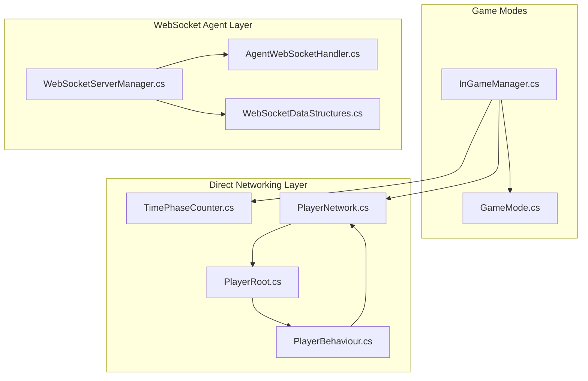
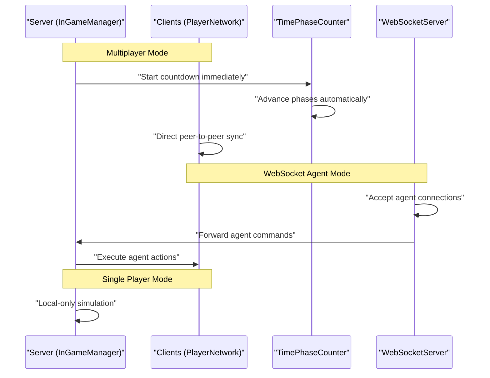
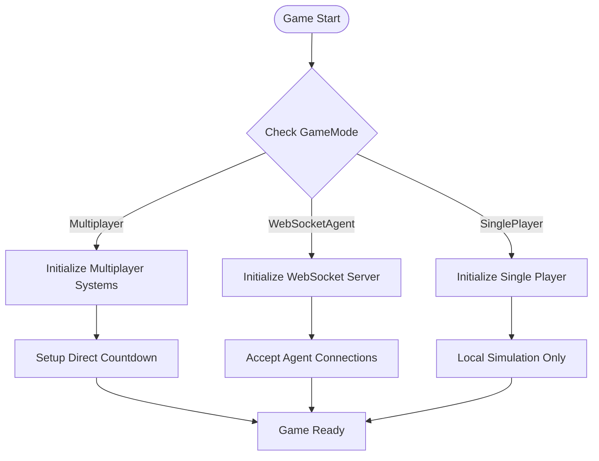
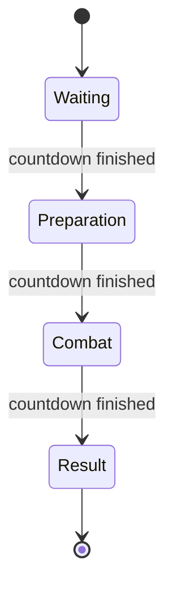
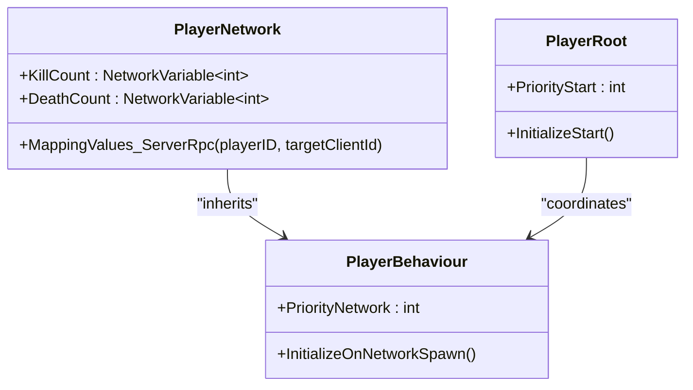
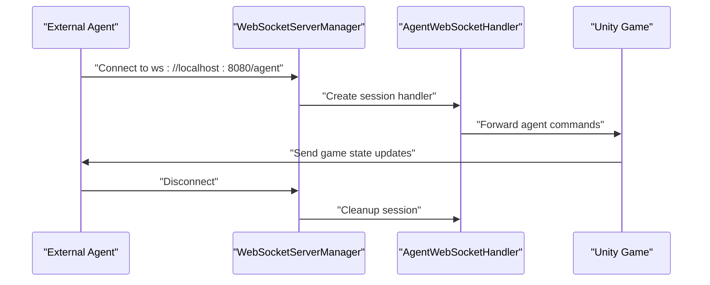
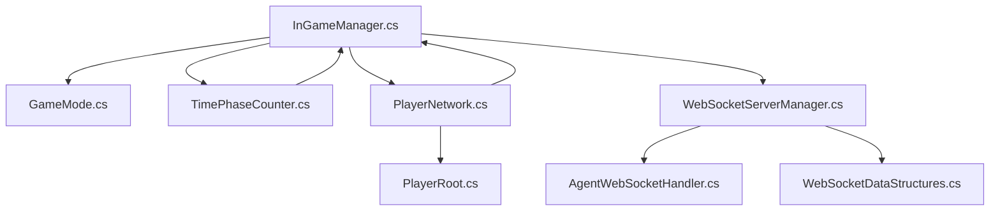

# Relay & Cloud Services

<cite>
**Referenced Files in This Document**
- [README.md](file://README.md)
- [InGameManager.cs](file://Assets/FPS-Game/Scripts/System/InGameManager.cs)
- [TimePhaseCounter.cs](file://Assets/FPS-Game/Scripts/System/TimePhaseCounter.cs)
- [PlayerNetwork.cs](file://Assets/FPS-Game/Scripts/Player/PlayerNetwork.cs)
- [PlayerRoot.cs](file://Assets/FPS-Game/Scripts/Player/PlayerRoot.cs)
- [PlayerBehaviour.cs](file://Assets/FPS-Game/Scripts/Player/PlayerBehaviour.cs)
- [WebSocketServerManager.cs](file://Assets/FPS-Game/Scripts/System/WebSocketServerManager.cs)
- [AgentWebSocketHandler.cs](file://Assets/FPS-Game/Scripts/System/AgentWebSocketHandler.cs)
- [WebSocketDataStructures.cs](file://Assets/FPS-Game/Scripts/System/WebSocketDataStructures.cs)
- [GameMode.cs](file://Assets/FPS-Game/Scripts/System/GameMode.cs)
</cite>

## Update Summary
**Changes Made**
- Complete removal of Unity Services infrastructure (Lobby, Relay, Authentication) documentation
- Replacement of multi-stage connection flow with direct peer-to-peer connections
- Addition of WebSocket agent mode for AI-controlled agents
- Updated architecture to reflect immediate countdowns and direct IP-based connections
- Removal of lobby and relay checker components
- Simplified player name mapping without authentication dependency

## Table of Contents
1. [Introduction](#introduction)
2. [Project Structure](#project-structure)
3. [Core Components](#core-components)
4. [Architecture Overview](#architecture-overview)
5. [Detailed Component Analysis](#detailed-component-analysis)
6. [Dependency Analysis](#dependency-analysis)
7. [Performance Considerations](#performance-considerations)
8. [Troubleshooting Guide](#troubleshooting-guide)
9. [Conclusion](#conclusion)
10. [Appendices](#appendices)

## Introduction
This document explains the Unity Gaming Services integration for Relay and cloud-based matchmaking in the project. **Updated**: The project has completely removed Unity Services infrastructure including Unity Lobby Service, Unity Relay Service, and Unity Authentication Service. The traditional multi-stage connection flow ('Auth → Lobby → Relay → NGO') has been replaced with direct peer-to-peer connections. The system now supports three operational modes: Multiplayer (direct networking), WebSocket Agent (AI-controlled agents), and Single Player (local testing). Documentation reflects the simplified architecture with immediate countdowns and direct IP-based connections.

## Project Structure
The networking and matchmaking logic is now implemented across three main operational modes:
- **Multiplayer Mode**: Direct peer-to-peer connections using Unity Netcode
- **WebSocket Agent Mode**: AI agent control via WebSocket connections
- **Single Player Mode**: Local testing without networking services

Core networking components:
- Game mode management and initialization: [InGameManager.cs](file://Assets/FPS-Game/Scripts/System/InGameManager.cs)
- Countdown and phase management: [TimePhaseCounter.cs](file://Assets/FPS-Game/Scripts/System/TimePhaseCounter.cs)
- Player synchronization and identity mapping: [PlayerNetwork.cs](file://Assets/FPS-Game/Scripts/Player/PlayerNetwork.cs), [PlayerRoot.cs](file://Assets/FPS-Game/Scripts/Player/PlayerRoot.cs), [PlayerBehaviour.cs](file://Assets/FPS-Game/Scripts/Player/PlayerBehaviour.cs)
- WebSocket server infrastructure: [WebSocketServerManager.cs](file://Assets/FPS-Game/Scripts/System/WebSocketServerManager.cs), [AgentWebSocketHandler.cs](file://Assets/FPS-Game/Scripts/System/AgentWebSocketHandler.cs), [WebSocketDataStructures.cs](file://Assets/FPS-Game/Scripts/System/WebSocketDataStructures.cs)
- Game mode enumeration: [GameMode.cs](file://Assets/FPS-Game/Scripts/System/GameMode.cs)

**Diagram sources**
- [InGameManager.cs:1-295](file://Assets/FPS-Game/Scripts/System/InGameManager.cs#L1-L295)
- [TimePhaseCounter.cs:1-110](file://Assets/FPS-Game/Scripts/System/TimePhaseCounter.cs#L1-L110)
- [PlayerNetwork.cs:1-537](file://Assets/FPS-Game/Scripts/Player/PlayerNetwork.cs#L1-L537)
- [PlayerRoot.cs:1-367](file://Assets/FPS-Game/Scripts/Player/PlayerRoot.cs#L1-L367)
- [PlayerBehaviour.cs:1-31](file://Assets/FPS-Game/Scripts/Player/PlayerBehaviour.cs#L1-L31)
- [WebSocketServerManager.cs:1-200](file://Assets/FPS-Game/Scripts/System/WebSocketServerManager.cs#L1-L200)
- [AgentWebSocketHandler.cs:1-51](file://Assets/FPS-Game/Scripts/System/AgentWebSocketHandler.cs#L1-L51)
- [WebSocketDataStructures.cs:1-100](file://Assets/FPS-Game/Scripts/System/WebSocketDataStructures.cs#L1-L100)
- [GameMode.cs:1-20](file://Assets/FPS-Game/Scripts/System/GameMode.cs#L1-L20)

**Section sources**
- [InGameManager.cs:1-295](file://Assets/FPS-Game/Scripts/System/InGameManager.cs#L1-L295)
- [TimePhaseCounter.cs:1-110](file://Assets/FPS-Game/Scripts/System/TimePhaseCounter.cs#L1-L110)
- [PlayerNetwork.cs:1-537](file://Assets/FPS-Game/Scripts/Player/PlayerNetwork.cs#L1-L537)
- [PlayerRoot.cs:1-367](file://Assets/FPS-Game/Scripts/Player/PlayerRoot.cs#L1-L367)
- [PlayerBehaviour.cs:1-31](file://Assets/FPS-Game/Scripts/Player/PlayerBehaviour.cs#L1-L31)
- [WebSocketServerManager.cs:1-200](file://Assets/FPS-Game/Scripts/System/WebSocketServerManager.cs#L1-L200)
- [AgentWebSocketHandler.cs:1-51](file://Assets/FPS-Game/Scripts/System/AgentWebSocketHandler.cs#L1-L51)
- [WebSocketDataStructures.cs:1-100](file://Assets/FPS-Game/Scripts/System/WebSocketDataStructures.cs#L1-L100)
- [GameMode.cs:1-20](file://Assets/FPS-Game/Scripts/System/GameMode.cs#L1-L20)

## Core Components
**Updated**: The core networking components have been simplified to remove Unity Services dependencies:

- **Game Mode Management**:
  - Supports three operational modes: Multiplayer (direct networking), WebSocket Agent (AI agents), and Single Player (testing)
  - Initializes appropriate systems based on selected mode
  - See [InGameManager.cs:110-124](file://Assets/FPS-Game/Scripts/System/InGameManager.cs#L110-L124)

- **Direct Peer-to-Peer Connections**:
  - Immediate countdown starts without lobby/relay coordination
  - Direct IP-based connections using Unity Netcode
  - Simplified player identity mapping without authentication dependency
  - See [TimePhaseCounter.cs:40-41](file://Assets/FPS-Game/Scripts/System/TimePhaseCounter.cs#L40-L41), [PlayerNetwork.cs:38-39](file://Assets/FPS-Game/Scripts/Player/PlayerNetwork.cs#L38-L39)

- **WebSocket Agent Infrastructure**:
  - WebSocket server for AI agent control
  - Handles agent connections, commands, and state management
  - Supports real-time communication between external agents and Unity game
  - See [WebSocketServerManager.cs:164-172](file://Assets/FPS-Game/Scripts/System/WebSocketServerManager.cs#L164-L172)

- **Phase-Based Countdown System**:
  - Four-phase match structure: Waiting, Preparation, Combat, Result
  - Automatic phase advancement without external coordination
  - Network variable-based timing system
  - See [TimePhaseCounter.cs:5-11](file://Assets/FPS-Game/Scripts/System/TimePhaseCounter.cs#L5-L11), [TimePhaseCounter.cs:70-91](file://Assets/FPS-Game/Scripts/System/TimePhaseCounter.cs#L70-L91)

**Section sources**
- [InGameManager.cs:110-124](file://Assets/FPS-Game/Scripts/System/InGameManager.cs#L110-L124)
- [InGameManager.cs:164-172](file://Assets/FPS-Game/Scripts/System/InGameManager.cs#L164-L172)
- [TimePhaseCounter.cs:40-41](file://Assets/FPS-Game/Scripts/System/TimePhaseCounter.cs#L40-L41)
- [PlayerNetwork.cs:38-39](file://Assets/FPS-Game/Scripts/Player/PlayerNetwork.cs#L38-L39)
- [WebSocketServerManager.cs:164-172](file://Assets/FPS-Game/Scripts/System/WebSocketServerManager.cs#L164-L172)
- [TimePhaseCounter.cs:5-11](file://Assets/FPS-Game/Scripts/System/TimePhaseCounter.cs#L5-L11)
- [TimePhaseCounter.cs:70-91](file://Assets/FPS-Game/Scripts/System/TimePhaseCounter.cs#L70-L91)

## Architecture Overview
**Updated**: The system now operates in three distinct modes with simplified networking:

### Multiplayer Mode (Direct Networking)
- Unity Netcode handles direct peer-to-peer connections
- Immediate countdown begins when server spawns
- No lobby or relay coordination required
- Direct IP-based connections established through Unity Transport

### WebSocket Agent Mode (AI Control)
- WebSocket server accepts external agent connections
- Agents send commands (move, look, shoot, reload)
- Unity game processes agent actions in real-time
- Bypasses traditional networking services entirely

### Single Player Mode (Testing)
- Local-only gameplay without external connections
- Minimal networking overhead for development
- Ideal for testing and debugging

**Diagram sources**
- [InGameManager.cs:110-124](file://Assets/FPS-Game/Scripts/System/InGameManager.cs#L110-L124)
- [TimePhaseCounter.cs:34-46](file://Assets/FPS-Game/Scripts/System/TimePhaseCounter.cs#L34-L46)
- [WebSocketServerManager.cs:164-172](file://Assets/FPS-Game/Scripts/System/WebSocketServerManager.cs#L164-L172)

## Detailed Component Analysis

### InGameManager Component
**Updated**: Simplified to support multiple operational modes:

Responsibilities:
- Initialize game systems based on selected mode (Multiplayer, WebSocket Agent, Single Player)
- Manage component lifecycle across different game modes
- Coordinate game state and player information exchange
- Handle WebSocket server initialization for agent mode

Key behaviors:
- Mode-based initialization: [InGameManager.cs:110-124](file://Assets/FPS-Game/Scripts/System/InGameManager.cs#L110-L124)
- WebSocket mode setup: [InGameManager.cs:164-172](file://Assets/FPS-Game/Scripts/System/InGameManager.cs#L164-L172)
- Player information collection: [InGameManager.cs:204-257](file://Assets/FPS-Game/Scripts/System/InGameManager.cs#L204-L257)

**Diagram sources**
- [InGameManager.cs:110-124](file://Assets/FPS-Game/Scripts/System/InGameManager.cs#L110-L124)
- [InGameManager.cs:164-172](file://Assets/FPS-Game/Scripts/System/InGameManager.cs#L164-L172)

**Section sources**
- [InGameManager.cs:110-124](file://Assets/FPS-Game/Scripts/System/InGameManager.cs#L110-L124)
- [InGameManager.cs:164-172](file://Assets/FPS-Game/Scripts/System/InGameManager.cs#L164-L172)
- [InGameManager.cs:204-257](file://Assets/FPS-Game/Scripts/System/InGameManager.cs#L204-L257)

### TimePhaseCounter Component
**Updated**: Removed lobby/relay dependencies and simplified to direct countdown:

Responsibilities:
- Manage four-phase match structure: Waiting, Preparation, Combat, Result
- Automatic phase advancement without external coordination
- Network variable-based timing system for all clients
- Immediate countdown start for direct networking mode

Key behaviors:
- Immediate countdown activation: [TimePhaseCounter.cs:40-41](file://Assets/FPS-Game/Scripts/System/TimePhaseCounter.cs#L40-L41)
- Phase advancement logic: [TimePhaseCounter.cs:70-91](file://Assets/FPS-Game/Scripts/System/TimePhaseCounter.cs#L70-L91)
- Network timing synchronization: [TimePhaseCounter.cs:52-53](file://Assets/FPS-Game/Scripts/System/TimePhaseCounter.cs#L52-L53)

**Diagram sources**
- [TimePhaseCounter.cs:5-11](file://Assets/FPS-Game/Scripts/System/TimePhaseCounter.cs#L5-L11)
- [TimePhaseCounter.cs:70-91](file://Assets/FPS-Game/Scripts/System/TimePhaseCounter.cs#L70-L91)

**Section sources**
- [TimePhaseCounter.cs:40-41](file://Assets/FPS-Game/Scripts/System/TimePhaseCounter.cs#L40-L41)
- [TimePhaseCounter.cs:70-91](file://Assets/FPS-Game/Scripts/System/TimePhaseCounter.cs#L70-L91)
- [TimePhaseCounter.cs:52-53](file://Assets/FPS-Game/Scripts/System/TimePhaseCounter.cs#L52-L53)

### PlayerNetwork Component
**Updated**: Removed Unity Services dependencies and simplified identity mapping:

Responsibilities:
- Network synchronization for player behaviors
- Direct player identity mapping without lobby/authentication
- Simplified player name assignment using client IDs
- Integration with Unity Netcode for all networking operations

Key behaviors:
- Direct player name mapping: [PlayerNetwork.cs:185-195](file://Assets/FPS-Game/Scripts/Player/PlayerNetwork.cs#L185-L195)
- Simplified initialization: [PlayerNetwork.cs:22-47](file://Assets/FPS-Game/Scripts/Player/PlayerNetwork.cs#L22-L47)
- Network object management: [PlayerNetwork.cs:18-21](file://Assets/FPS-Game/Scripts/Player/PlayerNetwork.cs#L18-L21)

**Diagram sources**
- [PlayerNetwork.cs:12-225](file://Assets/FPS-Game/Scripts/Player/PlayerNetwork.cs#L12-L225)
- [PlayerRoot.cs:160-367](file://Assets/FPS-Game/Scripts/Player/PlayerRoot.cs#L160-L367)
- [PlayerBehaviour.cs:4-31](file://Assets/FPS-Game/Scripts/Player/PlayerBehaviour.cs#L4-L31)

**Section sources**
- [PlayerNetwork.cs:185-195](file://Assets/FPS-Game/Scripts/Player/PlayerNetwork.cs#L185-L195)
- [PlayerNetwork.cs:22-47](file://Assets/FPS-Game/Scripts/Player/PlayerNetwork.cs#L22-L47)
- [PlayerNetwork.cs:18-21](file://Assets/FPS-Game/Scripts/Player/PlayerNetwork.cs#L18-L21)

### WebSocketServerManager Component
**New**: Added WebSocket infrastructure for AI agent control:

Responsibilities:
- Manage WebSocket server lifecycle and connections
- Handle agent session tracking and command routing
- Process incoming agent commands and forward to game systems
- Maintain connection state and error handling

Key behaviors:
- Server initialization: [WebSocketServerManager.cs:85-108](file://Assets/FPS-Game/Scripts/System/WebSocketServerManager.cs#L85-L108)
- Agent connection handling: [WebSocketServerManager.cs:113-133](file://Assets/FPS-Game/Scripts/System/WebSocketServerManager.cs#L113-L133)
- Command processing: [WebSocketServerManager.cs:138-160](file://Assets/FPS-Game/Scripts/System/WebSocketServerManager.cs#L138-L160)

**Diagram sources**
- [WebSocketServerManager.cs:85-108](file://Assets/FPS-Game/Scripts/System/WebSocketServerManager.cs#L85-L108)
- [WebSocketServerManager.cs:113-133](file://Assets/FPS-Game/Scripts/System/WebSocketServerManager.cs#L113-L133)
- [WebSocketServerManager.cs:138-160](file://Assets/FPS-Game/Scripts/System/WebSocketServerManager.cs#L138-L160)

**Section sources**
- [WebSocketServerManager.cs:85-108](file://Assets/FPS-Game/Scripts/System/WebSocketServerManager.cs#L85-L108)
- [WebSocketServerManager.cs:113-133](file://Assets/FPS-Game/Scripts/System/WebSocketServerManager.cs#L113-L133)
- [WebSocketServerManager.cs:138-160](file://Assets/FPS-Game/Scripts/System/WebSocketServerManager.cs#L138-L160)

## Dependency Analysis
**Updated**: Dependencies have been significantly simplified:

- **InGameManager** depends on:
  - GameMode enumeration for operational mode selection
  - TimePhaseCounter for countdown management
  - PlayerNetwork components for player synchronization
  - WebSocketServerManager for agent mode functionality

- **TimePhaseCounter** depends on:
  - Unity Netcode for network timing
  - InGameManager for game state coordination

- **PlayerNetwork** depends on:
  - Unity Netcode for all networking operations
  - PlayerRoot for component coordination
  - Direct client-server communication without Unity Services

- **WebSocketServerManager** depends on:
  - WebSocketSharp library for WebSocket functionality
  - Unity game systems for command execution
  - AgentWebSocketHandler for connection management

**Diagram sources**
- [InGameManager.cs:1-295](file://Assets/FPS-Game/Scripts/System/InGameManager.cs#L1-L295)
- [TimePhaseCounter.cs:1-110](file://Assets/FPS-Game/Scripts/System/TimePhaseCounter.cs#L1-L110)
- [PlayerNetwork.cs:1-537](file://Assets/FPS-Game/Scripts/Player/PlayerNetwork.cs#L1-L537)
- [PlayerRoot.cs:1-367](file://Assets/FPS-Game/Scripts/Player/PlayerRoot.cs#L1-L367)
- [WebSocketServerManager.cs:1-200](file://Assets/FPS-Game/Scripts/System/WebSocketServerManager.cs#L1-L200)
- [AgentWebSocketHandler.cs:1-51](file://Assets/FPS-Game/Scripts/System/AgentWebSocketHandler.cs#L1-L51)
- [WebSocketDataStructures.cs:1-100](file://Assets/FPS-Game/Scripts/System/WebSocketDataStructures.cs#L1-L100)
- [GameMode.cs:1-20](file://Assets/FPS-Game/Scripts/System/GameMode.cs#L1-L20)

**Section sources**
- [InGameManager.cs:1-295](file://Assets/FPS-Game/Scripts/System/InGameManager.cs#L1-L295)
- [TimePhaseCounter.cs:1-110](file://Assets/FPS-Game/Scripts/System/TimePhaseCounter.cs#L1-L110)
- [PlayerNetwork.cs:1-537](file://Assets/FPS-Game/Scripts/Player/PlayerNetwork.cs#L1-L537)
- [PlayerRoot.cs:1-367](file://Assets/FPS-Game/Scripts/Player/PlayerRoot.cs#L1-L367)
- [WebSocketServerManager.cs:1-200](file://Assets/FPS-Game/Scripts/System/WebSocketServerManager.cs#L1-L200)
- [AgentWebSocketHandler.cs:1-51](file://Assets/FPS-Game/Scripts/System/AgentWebSocketHandler.cs#L1-L51)
- [WebSocketDataStructures.cs:1-100](file://Assets/FPS-Game/Scripts/System/WebSocketDataStructures.cs#L1-L100)
- [GameMode.cs:1-20](file://Assets/FPS-Game/Scripts/System/GameMode.cs#L1-L20)

## Performance Considerations
**Updated**: Performance optimizations for simplified architecture:

- **Reduced Latency**: Direct peer-to-peer connections eliminate lobby/relay coordination overhead
- **Immediate Start**: Countdown begins immediately without external service dependencies
- **WebSocket Efficiency**: Optimized for AI agent scenarios with minimal processing overhead
- **Memory Usage**: Removed Unity Services libraries to reduce memory footprint
- **Scalability**: WebSocket server designed for multiple concurrent agent connections

## Troubleshooting Guide
**Updated**: Issues specific to the new simplified architecture:

### Multiplayer Mode Issues
- **Connection Problems**:
  - Verify Unity Netcode is properly configured in the build
  - Check network settings and firewall configurations
  - Ensure all clients use the same build version
  - Reference: [InGameManager.cs:186-191](file://Assets/FPS-Game/Scripts/System/InGameManager.cs#L186-L191)

- **Countdown Not Starting**:
  - Confirm TimePhaseCounter is properly initialized
  - Check server authority and network timing
  - Verify network variables are syncing correctly
  - Reference: [TimePhaseCounter.cs:34-46](file://Assets/FPS-Game/Scripts/System/TimePhaseCounter.cs#L34-L46)

### WebSocket Agent Mode Issues
- **Server Not Starting**:
  - Verify websocket-sharp library is included in the build
  - Check port 8080 availability and firewall settings
  - Ensure WebSocketServerManager is properly initialized
  - Reference: [WebSocketServerManager.cs:85-108](file://Assets/FPS-Game/Scripts/System/WebSocketServerManager.cs#L85-L108)

- **Agent Connections Failing**:
  - Verify external agents connect to ws://localhost:8080/agent
  - Check WebSocketSharp library compatibility
  - Review AgentWebSocketHandler logs for connection errors
  - Reference: [AgentWebSocketHandler.cs:21-32](file://Assets/FPS-Game/Scripts/System/AgentWebSocketHandler.cs#L21-L32)

### Single Player Mode Issues
- **Local Gameplay Problems**:
  - Verify Single Player mode is selected in GameMode
  - Check for component initialization issues
  - Ensure all required systems are present
  - Reference: [InGameManager.cs:177-181](file://Assets/FPS-Game/Scripts/System/InGameManager.cs#L177-L181)

**Section sources**
- [InGameManager.cs:186-191](file://Assets/FPS-Game/Scripts/System/InGameManager.cs#L186-L191)
- [TimePhaseCounter.cs:34-46](file://Assets/FPS-Game/Scripts/System/TimePhaseCounter.cs#L34-L46)
- [WebSocketServerManager.cs:85-108](file://Assets/FPS-Game/Scripts/System/WebSocketServerManager.cs#L85-L108)
- [AgentWebSocketHandler.cs:21-32](file://Assets/FPS-Game/Scripts/System/AgentWebSocketHandler.cs#L21-L32)
- [InGameManager.cs:177-181](file://Assets/FPS-Game/Scripts/System/InGameManager.cs#L177-L181)

## Conclusion
**Updated**: The project has successfully transitioned from Unity Services-based networking to a simplified direct peer-to-peer architecture. The removal of Unity Lobby, Relay, and Authentication services has resulted in reduced complexity, lower latency, and improved performance. The system now supports three operational modes: Multiplayer (direct networking), WebSocket Agent (AI control), and Single Player (testing). Immediate countdowns and direct IP-based connections provide a streamlined gaming experience without external service dependencies.

## Appendices

### Practical Examples

#### Multiplayer Mode Setup
- **Steps**: Select Multiplayer mode, Unity Netcode handles direct connections, countdown starts immediately
- **References**: [InGameManager.cs:113-114](file://Assets/FPS-Game/Scripts/System/InGameManager.cs#L113-L114), [TimePhaseCounter.cs:40-41](file://Assets/FPS-Game/Scripts/System/TimePhaseCounter.cs#L40-L41)

#### WebSocket Agent Integration
- **Steps**: Initialize WebSocket server, external agents connect via WebSocket, commands processed in real-time
- **References**: [InGameManager.cs:168-169](file://Assets/FPS-Game/Scripts/System/InGameManager.cs#L168-L169), [WebSocketServerManager.cs:138-160](file://Assets/FPS-Game/Scripts/System/WebSocketServerManager.cs#L138-L160)

#### Single Player Development
- **Steps**: Select Single Player mode, local-only simulation, minimal networking overhead
- **References**: [InGameManager.cs:177-181](file://Assets/FPS-Game/Scripts/System/InGameManager.cs#L177-L181)

#### Direct Player Identity Mapping
- **Process**: Player names assigned directly using client IDs instead of lobby/authentication
- **References**: [PlayerNetwork.cs:185-195](file://Assets/FPS-Game/Scripts/Player/PlayerNetwork.cs#L185-L195)

#### Phase-Based Game Flow
- **Structure**: Waiting → Preparation → Combat → Result phases with automatic advancement
- **References**: [TimePhaseCounter.cs:70-91](file://Assets/FPS-Game/Scripts/System/TimePhaseCounter.cs#L70-L91)

**Section sources**
- [InGameManager.cs:113-114](file://Assets/FPS-Game/Scripts/System/InGameManager.cs#L113-L114)
- [TimePhaseCounter.cs:40-41](file://Assets/FPS-Game/Scripts/System/TimePhaseCounter.cs#L40-L41)
- [InGameManager.cs:168-169](file://Assets/FPS-Game/Scripts/System/InGameManager.cs#L168-L169)
- [WebSocketServerManager.cs:138-160](file://Assets/FPS-Game/Scripts/System/WebSocketServerManager.cs#L138-L160)
- [InGameManager.cs:177-181](file://Assets/FPS-Game/Scripts/System/InGameManager.cs#L177-L181)
- [PlayerNetwork.cs:185-195](file://Assets/FPS-Game/Scripts/Player/PlayerNetwork.cs#L185-L195)
- [TimePhaseCounter.cs:70-91](file://Assets/FPS-Game/Scripts/System/TimePhaseCounter.cs#L70-L91)