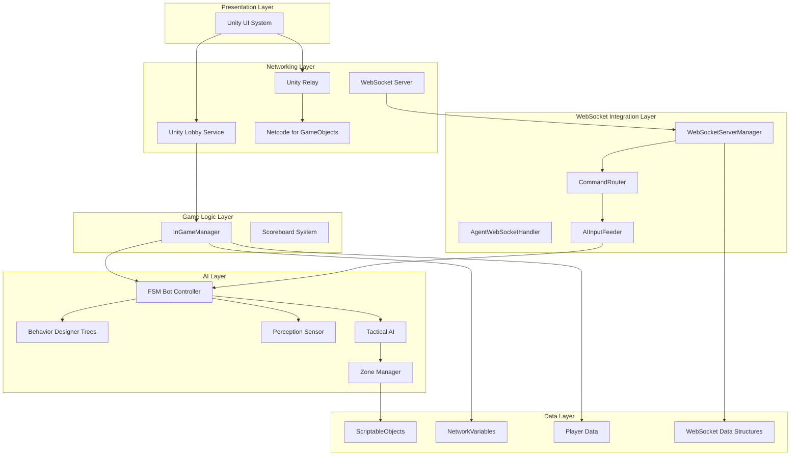
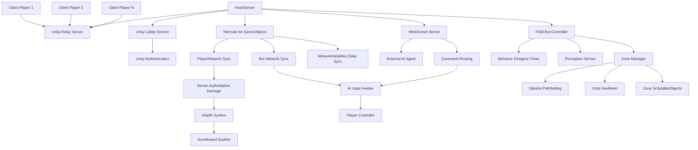
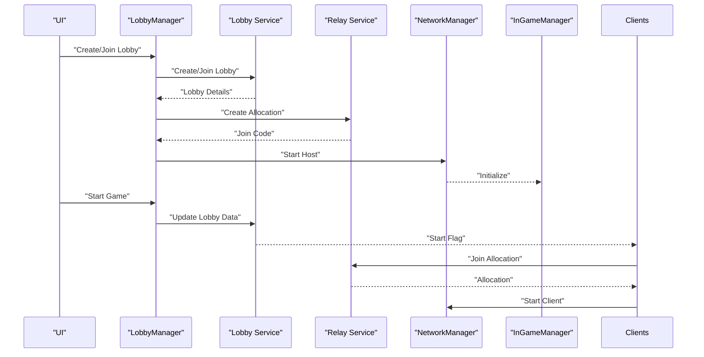
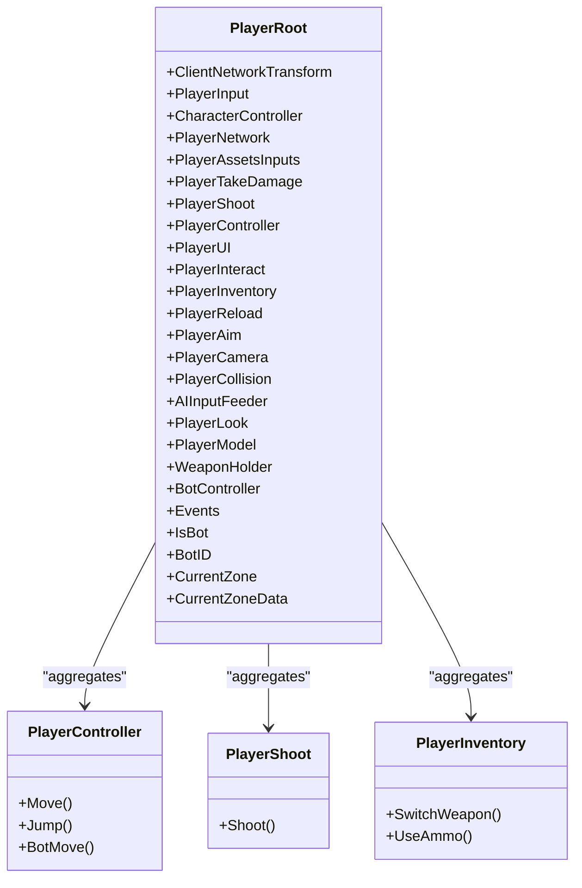
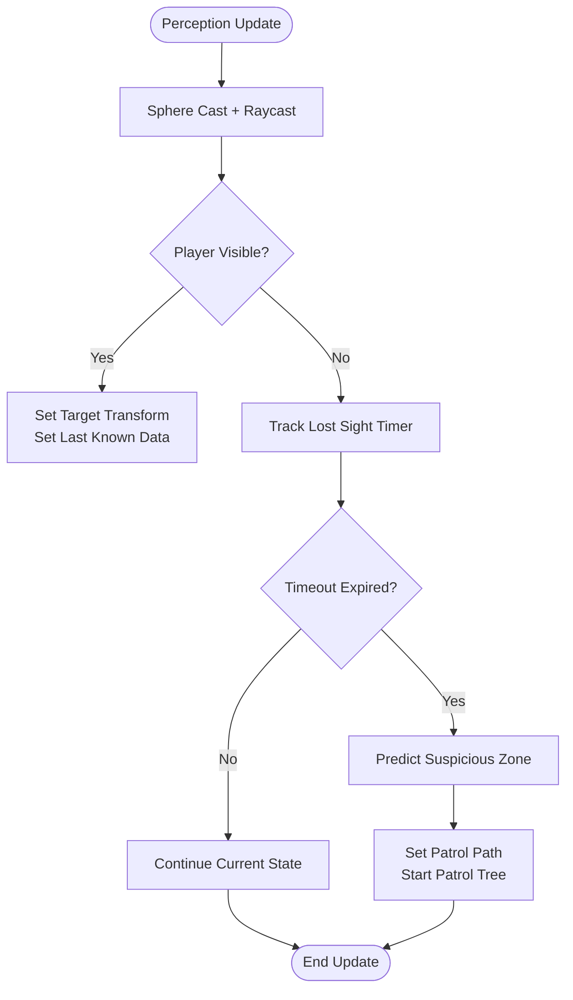
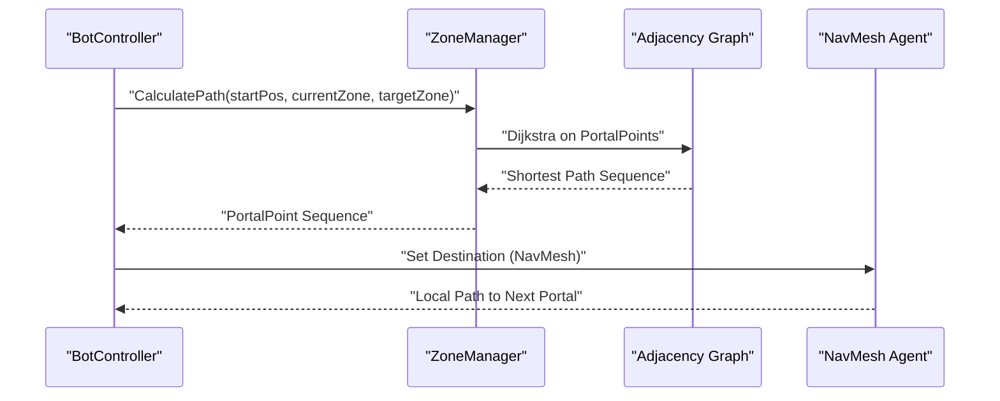
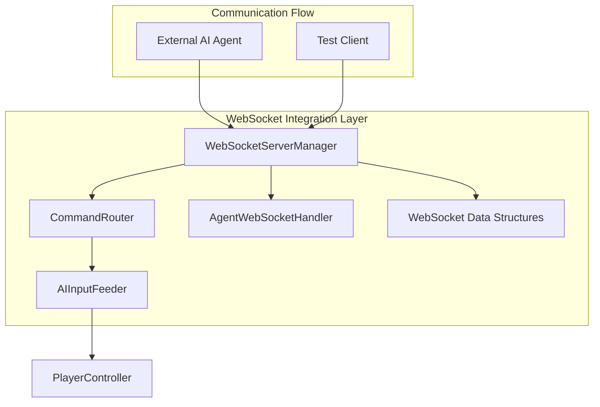
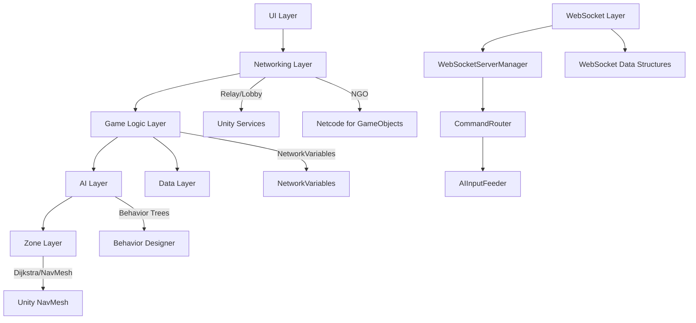

# System Architecture Overview

<cite>
**Referenced Files in This Document**
- [README.md](file://README.md)
- [WIKI.md](file://WIKI.md)
- [InGameManager.cs](file://Assets/FPS-Game/Scripts/System/InGameManager.cs)
- [LobbyManager.cs](file://Assets/FPS-Game/Scripts/Lobby Script/Lobby/Scripts/LobbyManager.cs)
- [PlayerNetwork.cs](file://Assets/FPS-Game/Scripts/Player/PlayerNetwork.cs)
- [PlayerRoot.cs](file://Assets/FPS-Game/Scripts/Player/PlayerRoot.cs)
- [BotController.cs](file://Assets/FPS-Game/Scripts/Bot/BotController.cs)
- [PerceptionSensor.cs](file://Assets/FPS-Game/Scripts/Bot/PerceptionSensor.cs)
- [BlackboardLinker.cs](file://Assets/FPS-Game/Scripts/Bot/BlackboardLinker.cs)
- [ZoneController.cs](file://Assets/FPS-Game/Scripts/System/ZoneController.cs)
- [Zone.cs](file://Assets/FPS-Game/Scripts/System/Zone.cs)
- [WebSocketServerManager.cs](file://Assets/FPS-Game/Scripts/System/WebSocketServerManager.cs)
- [CommandRouter.cs](file://Assets/FPS-Game/Scripts/System/CommandRouter.cs)
- [AgentWebSocketHandler.cs](file://Assets/FPS-Game/Scripts/System/AgentWebSocketHandler.cs)
- [WebSocketDataStructures.cs](file://Assets/FPS-Game/Scripts/System/WebSocketDataStructures.cs)
- [GameMode.cs](file://Assets/FPS-Game/Scripts/System/GameMode.cs)
</cite>

## Update Summary
**Changes Made**
- Added WebSocket AI Agent Integration as a core architectural component
- Updated system architecture diagrams to include WebSocket server infrastructure
- Enhanced networking layer documentation to include WebSocket communication
- Added WebSocket-specific data structures and command routing mechanisms
- Updated game mode configuration to support WebSocket agent mode
- Expanded integration patterns to include external AI agent communication

## Table of Contents
1. [Introduction](#introduction)
2. [Project Structure](#project-structure)
3. [Core Components](#core-components)
4. [Architecture Overview](#architecture-overview)
5. [Detailed Component Analysis](#detailed-component-analysis)
6. [WebSocket AI Agent Integration](#websocket-ai-agent-integration)
7. [Dependency Analysis](#dependency-analysis)
8. [Performance Considerations](#performance-considerations)
9. [Troubleshooting Guide](#troubleshooting-guide)
10. [Conclusion](#conclusion)

## Introduction
This document presents the system architecture overview for a server-authoritative, client-hosted multiplayer FPS built with Unity and Unity Gaming Services. The architecture follows a layered design with clear separation of concerns across presentation, networking, game logic, AI, and data layers. It integrates Unity Relay and Netcode for GameObjects (NGO) for connectivity and synchronization, and employs a hybrid finite-state machine (FSM) and behavior tree (BT) architecture for AI decision-making. The system also implements a zone-based spatial reasoning system with hierarchical pathfinding combining graph-based Dijkstra computation and Unity NavMesh for local movement.

**Updated** Enhanced with WebSocket AI Agent Integration as a core architectural component alongside existing networking and AI systems, enabling external AI agents to control game characters through WebSocket communication.

## Project Structure
The project is organized into a layered architecture with six primary layers:
- Presentation Layer: Unity UI for sign-in, lobby, HUD, and scoreboard
- Networking Layer: Unity Relay + Lobby + NGO for connectivity and synchronization, plus WebSocket server for AI agent communication
- Game Logic Layer: Server-authoritative session management and scoring
- AI Layer: Hybrid FSM-BT with perception, tactics, and zone-aware pathfinding
- WebSocket Integration Layer: AI agent communication infrastructure
- Data Layer: ScriptableObjects, NetworkVariables, and player data



**Diagram sources**
- [WIKI.md:66-96](file://WIKI.md#L66-L96)
- [LobbyManager.cs:1-589](file://Assets/FPS-Game/Scripts/Lobby Script/Lobby/Scripts/LobbyManager.cs#L1-L589)
- [InGameManager.cs:66-232](file://Assets/FPS-Game/Scripts/System/InGameManager.cs#L66-L232)
- [BotController.cs:62-485](file://Assets/FPS-Game/Scripts/Bot/BotController.cs#L62-L485)
- [PerceptionSensor.cs:10-407](file://Assets/FPS-Game/Scripts/Bot/PerceptionSensor.cs#L10-L407)
- [BlackboardLinker.cs:54-332](file://Assets/FPS-Game/Scripts/Bot/BlackboardLinker.cs#L54-L332)
- [ZoneController.cs:8-163](file://Assets/FPS-Game/Scripts/System/ZoneController.cs#L8-L163)
- [Zone.cs:15-249](file://Assets/FPS-Game/Scripts/System/Zone.cs#L15-L249)
- [WebSocketServerManager.cs:17-370](file://Assets/FPS-Game/Scripts/System/WebSocketServerManager.cs#L17-L370)
- [CommandRouter.cs:9-251](file://Assets/FPS-Game/Scripts/System/CommandRouter.cs#L9-L251)
- [AgentWebSocketHandler.cs:14-65](file://Assets/FPS-Game/Scripts/System/AgentWebSocketHandler.cs#L14-L65)
- [WebSocketDataStructures.cs:1-168](file://Assets/FPS-Game/Scripts/System/WebSocketDataStructures.cs#L1-L168)

**Section sources**
- [WIKI.md:31-96](file://WIKI.md#L31-L96)
- [README.md:26-60](file://README.md#L26-L60)

## Core Components
This section outlines the core subsystems and their responsibilities within the layered architecture.

- Networking & Multiplayer System
  - LobbyManager: Creates, joins, and manages lobbies; coordinates game start and lobby updates
  - Relay Manager: Allocates Relay servers, generates join codes, and configures transport
  - PlayerNetwork: Synchronizes player identity, statistics, and bot-specific network state
  - InGameManager: Central coordinator for game lifecycle, scoring, and NavMesh pathfinding

- **Updated** WebSocket AI Agent Integration
  - WebSocketServerManager: Manages WebSocket server for AI agent communication, handles bidirectional communication
  - CommandRouter: Routes incoming WebSocket commands to appropriate game controllers, translates high-level commands into PlayerController input
  - AgentWebSocketHandler: Manages individual agent connections, handles command processing and session management
  - WebSocket Data Structures: Defines JSON message formats for commands and game state snapshots

- Player System
  - PlayerRoot: Aggregates all player subsystems and orchestrates initialization order
  - PlayerController: Movement, jumping, camera rotation, and dual-mode operation for human and AI
  - PlayerShoot: Server-authoritative shooting and hit detection
  - PlayerInventory: Weapon management and switching

- AI Bot System
  - BotController (FSM): Manages Idle, Patrol, and Combat states with Behavior Designer trees
  - PerceptionSensor: Detects players via sphere casts and raycasts; triggers state transitions
  - BlackboardLinker: Bridges C# blackboard data to Behavior Designer SharedVariables
  - BotTactics: Zone scanning, InfoPoint visibility, and suspicious zone prediction

- Zone & Spatial Reasoning System
  - ZoneController: Initializes zones and builds zone graph
  - Zone: Zone data structure with InfoPoints, TacticalPoints, and PortalPoints
  - ZoneManager: Implements Dijkstra pathfinding and adjacency graph for inter-zone travel

- Game Session Management
  - TimePhaseCounter: Match timer and phases
  - KillCountChecker: Victory condition monitoring
  - HandleSpawnBot: Bot spawning on host
  - Scoreboard: Displays end-of-match statistics

**Section sources**
- [WIKI.md:100-549](file://WIKI.md#L100-L549)
- [LobbyManager.cs:13-589](file://Assets/FPS-Game/Scripts/Lobby Script/Lobby/Scripts/LobbyManager.cs#L13-L589)
- [InGameManager.cs:66-232](file://Assets/FPS-Game/Scripts/System/InGameManager.cs#L66-L232)
- [PlayerNetwork.cs:12-310](file://Assets/FPS-Game/Scripts/Player/PlayerNetwork.cs#L12-L310)
- [PlayerRoot.cs:159-366](file://Assets/FPS-Game/Scripts/Player/PlayerRoot.cs#L159-L366)
- [BotController.cs:62-485](file://Assets/FPS-Game/Scripts/Bot/BotController.cs#L62-L485)
- [PerceptionSensor.cs:10-407](file://Assets/FPS-Game/Scripts/Bot/PerceptionSensor.cs#L10-L407)
- [BlackboardLinker.cs:54-332](file://Assets/FPS-Game/Scripts/Bot/BlackboardLinker.cs#L54-L332)
- [ZoneController.cs:8-163](file://Assets/FPS-Game/Scripts/System/ZoneController.cs#L8-L163)
- [Zone.cs:15-249](file://Assets/FPS-Game/Scripts/System/Zone.cs#L15-L249)
- [WebSocketServerManager.cs:17-370](file://Assets/FPS-Game/Scripts/System/WebSocketServerManager.cs#L17-L370)
- [CommandRouter.cs:9-251](file://Assets/FPS-Game/Scripts/System/CommandRouter.cs#L9-L251)
- [AgentWebSocketHandler.cs:14-65](file://Assets/FPS-Game/Scripts/System/AgentWebSocketHandler.cs#L14-L65)
- [WebSocketDataStructures.cs:1-168](file://Assets/FPS-Game/Scripts/System/WebSocketDataStructures.cs#L1-L168)

## Architecture Overview
The system employs a client-host topology with Unity Relay for serverless connectivity and NGO for real-time synchronization. The host maintains server-authoritative control over game state, including damage calculation and scoring, while clients observe and render synchronized state. The AI layer operates on the host, with bot decisions propagated to clients via NGO-transform synchronization and state variables.

**Updated** The architecture now includes WebSocket AI Agent Integration as a core component, enabling external AI agents to communicate with the Unity game through WebSocket protocol. The WebSocket server operates independently of the multiplayer networking, providing a separate communication channel for AI agents while maintaining compatibility with existing networking systems.



**Diagram sources**
- [WIKI.md:66-96](file://WIKI.md#L66-L96)
- [README.md:26-60](file://README.md#L26-L60)
- [WebSocketServerManager.cs:71-96](file://Assets/FPS-Game/Scripts/System/WebSocketServerManager.cs#L71-L96)
- [CommandRouter.cs:14-66](file://Assets/FPS-Game/Scripts/System/CommandRouter.cs#L14-L66)

**Section sources**
- [WIKI.md:1282-1390](file://WIKI.md#L1282-L1390)
- [README.md:26-60](file://README.md#L26-L60)

## Detailed Component Analysis

### Networking & Multiplayer System
- LobbyManager
  - Responsibilities: Create/join lobbies, manage lobby heartbeat/polling, coordinate game start, and handle lobby events
  - Data flow: UI events → LobbyManager → Unity Lobby API → lobby state updates → UI refresh
  - Integration: Uses Unity Services for authentication and lobby management

- Relay Manager
  - Responsibilities: Create Relay allocations, generate join codes, configure transport, and establish DTLS connections
  - Network flow: Host creates allocation and join code; clients join allocation and start client

- PlayerNetwork
  - Responsibilities: Synchronize player identity and statistics, manage NetworkVariables, handle bot-specific network state
  - Network Synchronization: KillCount, DeathCount, and player name are NetworkVariables

- InGameManager
  - Responsibilities: Central coordinator for game lifecycle, NavMesh pathfinding for AI, and end-of-match aggregation
  - Subsystem References: TimePhaseCounter, KillCountChecker, HandleSpawnBot, RandomSpawn, ZoneController



**Diagram sources**
- [WIKI.md:592-677](file://WIKI.md#L592-L677)
- [LobbyManager.cs:264-569](file://Assets/FPS-Game/Scripts/Lobby Script/Lobby/Scripts/LobbyManager.cs#L264-L569)

**Section sources**
- [WIKI.md:102-174](file://WIKI.md#L102-L174)
- [LobbyManager.cs:13-589](file://Assets/FPS-Game/Scripts/Lobby Script/Lobby/Scripts/LobbyManager.cs#L13-L589)
- [PlayerNetwork.cs:12-310](file://Assets/FPS-Game/Scripts/Player/PlayerNetwork.cs#L12-L310)
- [InGameManager.cs:66-232](file://Assets/FPS-Game/Scripts/System/InGameManager.cs#L66-L232)

### Player System
- PlayerRoot
  - Role: Aggregates all player subsystems and orchestrates initialization order via priority interfaces
  - Component Aggregation: PlayerController, PlayerShoot, PlayerInventory, PlayerUI, PlayerCamera, PlayerModel, PlayerNetwork, AIInputFeeder

- PlayerController
  - Responsibilities: Movement, gravity, camera rotation, and dual-mode operation for human and AI
  - Dual Mode Operation: Reads input for human players; delegates to AIInputFeeder for bots

- PlayerShoot
  - Responsibilities: Shooting input, raycasting for hit detection, server-authoritative damage calculation, and visual effects

- PlayerInventory
  - Responsibilities: Manage weapon loadout, switching logic, and ammo tracking



**Diagram sources**
- [PlayerRoot.cs:159-366](file://Assets/FPS-Game/Scripts/Player/PlayerRoot.cs#L159-L366)

**Section sources**
- [WIKI.md:176-260](file://WIKI.md#L176-L260)
- [PlayerRoot.cs:159-366](file://Assets/FPS-Game/Scripts/Player/PlayerRoot.cs#L159-L366)

### AI Bot System
- BotController (FSM)
  - Architecture: Three states (Idle, Patrol, Combat) with Behavior Designer trees
  - State Behaviors: Idle uses Idle tree; Patrol uses Patrol tree; Combat uses Combat tree
  - Behavior Designer Integration: Starts/stops behaviors and binds SharedVariables via BlackboardLinker

- PerceptionSensor
  - Responsibilities: Detect players within range, perform line-of-sight checks, track last-known positions, and trigger state transitions
  - Detection Logic: Sphere cast to find nearby players; raycast to check line-of-sight

- BlackboardLinker
  - Purpose: Bridge between C# blackboard data and Behavior Designer SharedVariables
  - Data Synchronization: Sets target transforms, visibility flags, movement vectors, and look angles

- BotTactics
  - Responsibilities: Zone scanning management, InfoPoint visibility calculation, tactical positioning, and suspicious zone prediction



**Diagram sources**
- [PerceptionSensor.cs:129-178](file://Assets/FPS-Game/Scripts/Bot/PerceptionSensor.cs#L129-L178)
- [BotController.cs:448-482](file://Assets/FPS-Game/Scripts/Bot/BotController.cs#L448-L482)

**Section sources**
- [WIKI.md:262-427](file://WIKI.md#L262-L427)
- [BotController.cs:62-485](file://Assets/FPS-Game/Scripts/Bot/BotController.cs#L62-L485)
- [PerceptionSensor.cs:10-407](file://Assets/FPS-Game/Scripts/Bot/PerceptionSensor.cs#L10-L407)
- [BlackboardLinker.cs:54-332](file://Assets/FPS-Game/Scripts/Bot/BlackboardLinker.cs#L54-L332)

### Zone & Spatial Reasoning System
- ZoneController
  - Responsibilities: Initialize zones, load ZoneData ScriptableObjects, and build zone graph for pathfinding
  - Data Structures: Maintains lists of zones and portals; builds adjacency graph

- Zone
  - Data Structure: ZoneData with InfoPoints, TacticalPoints, and PortalPoints; supports zone weighting and scanning state
  - Zone Scanning: Calculates visible InfoPoints from current position; moves to each InfoPoint to scan area

- ZoneManager
  - Responsibilities: Graph-based pathfinding using Dijkstra on PortalPoints; calculates shortest path between zones
  - Path Calculation: Returns sequence of PortalPoints to traverse; bots follow path using NavMesh local navigation



**Diagram sources**
- [WIKI.md:444-473](file://WIKI.md#L444-L473)
- [BotController.cs:331-354](file://Assets/FPS-Game/Scripts/Bot/BotController.cs#L331-L354)
- [ZoneController.cs:8-163](file://Assets/FPS-Game/Scripts/System/ZoneController.cs#L8-L163)
- [Zone.cs:15-249](file://Assets/FPS-Game/Scripts/System/Zone.cs#L15-L249)

**Section sources**
- [WIKI.md:429-505](file://WIKI.md#L429-L505)
- [ZoneController.cs:8-163](file://Assets/FPS-Game/Scripts/System/ZoneController.cs#L8-L163)
- [Zone.cs:15-249](file://Assets/FPS-Game/Scripts/System/Zone.cs#L15-L249)

### Dataflow Architecture
- Client → Server Input Flow
  - Player input (keyboard/mouse) → PlayerInput → AIInputFeeder (bots) → PlayerController → ClientNetworkTransform (client-authoritative) → ServerRPC (shoot actions)

- Server → Client State Sync
  - Server writes NetworkVariables (KillCount, DeathCount, Health) → NGO auto-syncs to clients → UI updates

- Bot Synchronization
  - Host runs BotController and Behavior Trees → AIInputFeeder feeds PlayerController → NavMesh Agent pathfinding → ClientNetworkTransform sync to clients

- Damage Dataflow (Server-Authoritative)
  - Client shoots → Client prediction → ServerRPC → Server raycast → Hit detected? → Update target Health NetworkVariable → Auto-sync to clients

**Updated** WebSocket AI Agent Dataflow
- External AI Agent → WebSocket Server
  - AI agent connects via WebSocket → Server broadcasts game state snapshots → Agent processes state with LLM → Agent generates command JSON → Agent sends commands to server
  - Server validates commands → CommandRouter executes commands → AIInputFeeder injects inputs → PlayerController processes inputs → Game state updates and broadcasts

```mermaid
sequenceDiagram
participant Client as "Client Player"
participant NPC as "PlayerNetwork"
participant Server as "Server"
participant NV as "NetworkVariables"
participant UI as "Client UI"
Client->>NPC : "Shoot Input"
NPC->>Server : "ServerRPC : RequestShoot"
Server->>Server : "Authoritative Raycast"
Server->>NV : "Update Health"
NV-->>UI : "Auto-synced State"
UI-->>Client : "Health Bar Update"
sequence WebSocket AI Agent Flow
participant Agent as "External AI Agent"
participant WS as "WebSocket Server"
participant CR as "CommandRouter"
participant AI as "AIInputFeeder"
Agent->>WS : "Connect via WebSocket"
WS->>Agent : "Broadcast Game State"
Agent->>WS : "Send Commands JSON"
WS->>CR : "Parse & Validate Command"
CR->>AI : "Route to PlayerController"
AI->>Client : "Inject Inputs"
```

**Diagram sources**
- [WIKI.md:800-857](file://WIKI.md#L800-L857)
- [WIKI.md:1014-1071](file://WIKI.md#L1014-L1071)
- [WebSocketServerManager.cs:165-184](file://Assets/FPS-Game/Scripts/System/WebSocketServerManager.cs#L165-L184)
- [CommandRouter.cs:14-66](file://Assets/FPS-Game/Scripts/System/CommandRouter.cs#L14-L66)

**Section sources**
- [WIKI.md:752-1071](file://WIKI.md#L752-L1071)

## WebSocket AI Agent Integration

### Architecture Overview
The WebSocket AI Agent Integration adds a new communication layer that enables external AI agents to control Unity game characters through WebSocket protocol. This component operates independently of the traditional multiplayer networking while sharing the same game state and control mechanisms.



**Diagram sources**
- [WebSocketServerManager.cs:17-370](file://Assets/FPS-Game/Scripts/System/WebSocketServerManager.cs#L17-L370)
- [CommandRouter.cs:9-251](file://Assets/FPS-Game/Scripts/System/CommandRouter.cs#L9-L251)
- [AgentWebSocketHandler.cs:14-65](file://Assets/FPS-Game/Scripts/System/AgentWebSocketHandler.cs#L14-L65)
- [WebSocketDataStructures.cs:1-168](file://Assets/FPS-Game/Scripts/System/WebSocketDataStructures.cs#L1-L168)

### Core Components
- **WebSocketServerManager**: Central server component that manages WebSocket connections, broadcasts game state snapshots, and handles command reception
- **CommandRouter**: Validates and routes incoming commands to appropriate player controller methods, handling timing validation and parameter sanitization
- **AgentWebSocketHandler**: Individual connection handler that manages session lifecycle, command forwarding, and error handling
- **WebSocket Data Structures**: Defines JSON schemas for bidirectional communication between Unity and external AI agents

### Communication Protocol
The system implements a real-time bidirectional communication protocol:
- **Outbound**: Game state snapshots broadcast at 10 Hz containing player position, health, ammo, enemy positions, and game information
- **Inbound**: Command JSON objects with validated parameters for movement, look, shooting, jumping, reloading, stopping, and weapon switching

### Integration Flow
1. Unity initializes WebSocket server on port 8080
2. AI agent establishes WebSocket connection
3. Server broadcasts game state snapshots at 10 Hz
4. AI agent processes state with LLM and generates commands
5. AI agent sends command JSON to server
6. Server validates and routes command to player controller
7. Command executed via AIInputFeeder injection
8. Game state updates and broadcasts continue

**Section sources**
- [WIKI.md:654-764](file://WIKI.md#L654-L764)
- [WebSocketServerManager.cs:17-370](file://Assets/FPS-Game/Scripts/System/WebSocketServerManager.cs#L17-L370)
- [CommandRouter.cs:9-251](file://Assets/FPS-Game/Scripts/System/CommandRouter.cs#L9-L251)
- [AgentWebSocketHandler.cs:14-65](file://Assets/FPS-Game/Scripts/System/AgentWebSocketHandler.cs#L14-L65)
- [WebSocketDataStructures.cs:1-168](file://Assets/FPS-Game/Scripts/System/WebSocketDataStructures.cs#L1-L168)
- [GameMode.cs:4-21](file://Assets/FPS-Game/Scripts/System/GameMode.cs#L4-L21)

## Dependency Analysis
The system exhibits clear layering with low coupling between layers and cohesive subsystems within layers. Key dependencies include:
- Presentation Layer depends on Networking Layer for lobby and relay flows
- Networking Layer depends on Unity Services and NGO for connectivity and synchronization
- Game Logic Layer depends on Networking Layer for authoritative state and on AI Layer for bot control
- **Updated** WebSocket Integration Layer depends on WebSocketServerManager for server infrastructure and CommandRouter for command processing
- AI Layer depends on Zone Layer for spatial reasoning and pathfinding
- Data Layer provides persistent configuration via ScriptableObjects and runtime state via NetworkVariables



**Diagram sources**
- [WIKI.md:31-96](file://WIKI.md#L31-L96)
- [InGameManager.cs:66-232](file://Assets/FPS-Game/Scripts/System/InGameManager.cs#L66-L232)
- [BotController.cs:62-485](file://Assets/FPS-Game/Scripts/Bot/BotController.cs#L62-L485)
- [ZoneController.cs:8-163](file://Assets/FPS-Game/Scripts/System/ZoneController.cs#L8-L163)
- [WebSocketServerManager.cs:17-370](file://Assets/FPS-Game/Scripts/System/WebSocketServerManager.cs#L17-L370)
- [CommandRouter.cs:9-251](file://Assets/FPS-Game/Scripts/System/CommandRouter.cs#L9-L251)

**Section sources**
- [WIKI.md:31-96](file://WIKI.md#L31-L96)

## Performance Considerations
- Server-Authoritative Damage: Prevents cheating and ensures consistent state, reducing client-side prediction overhead
- NGO Interpolation: Smooths client-side movement for reduced perceived latency
- Hybrid FSM-BT: Balances structured state control with flexible behavior execution, minimizing unnecessary computations
- Hierarchical Pathfinding: Uses Dijkstra for strategic zone-level routing and NavMesh for local navigation, optimizing CPU and memory usage
- Singleton Pattern: Provides global access points for managers and coordinators, reducing lookup costs
- Observer Pattern: Decouples communication between systems via events, improving maintainability and reducing tight coupling
- **Updated** WebSocket Performance: 10 Hz broadcast rate optimized for real-time AI decision-making while minimizing bandwidth usage; command validation prevents resource exhaustion; session management tracks agent activity and performance metrics

## Troubleshooting Guide
- Lobby and Relay Issues
  - Verify Unity Services initialization and authentication
  - Ensure lobby heartbeat and polling timers are functioning
  - Confirm join codes are correctly generated and distributed

- Networking Problems
  - Check Relay allocation creation and join code generation
  - Validate NGO transport configuration and client startup
  - Review NetworkVariables synchronization and RPC invocation

- **Updated** WebSocket Integration Issues
  - Verify websocket-sharp library installation and compatibility with Unity 6000.4 LTS
  - Check WebSocket server initialization and port availability (default: 8080)
  - Ensure GameMode is set to WebSocketAgent in InGameManager
  - Validate command JSON format and parameter ranges
  - Monitor agent session connections and command processing logs

- AI Behavior Anomalies
  - Inspect PerceptionSensor detection logic and line-of-sight checks
  - Verify BlackboardLinker binding to Behavior Designer trees
  - Confirm BotController state transitions and portal navigation

- Zone and Pathfinding Errors
  - Validate ZoneData ScriptableObject serialization and loading
  - Ensure adjacency graph construction and Dijkstra path computation
  - Confirm NavMesh agent pathfinding and waypoint handling

**Section sources**
- [WIKI.md:1282-1390](file://WIKI.md#L1282-L1390)
- [LobbyManager.cs:13-589](file://Assets/FPS-Game/Scripts/Lobby Script/Lobby/Scripts/LobbyManager.cs#L13-L589)
- [PerceptionSensor.cs:10-407](file://Assets/FPS-Game/Scripts/Bot/PerceptionSensor.cs#L10-L407)
- [BlackboardLinker.cs:54-332](file://Assets/FPS-Game/Scripts/Bot/BlackboardLinker.cs#L54-L332)
- [ZoneController.cs:8-163](file://Assets/FPS-Game/Scripts/System/ZoneController.cs#L8-L163)
- [WebSocketServerManager.cs:71-96](file://Assets/FPS-Game/Scripts/System/WebSocketServerManager.cs#L71-L96)
- [CommandRouter.cs:71-110](file://Assets/FPS-Game/Scripts/System/CommandRouter.cs#L71-L110)

## Conclusion
The system architecture combines a layered design with a client-host topology to deliver a scalable, server-authoritative multiplayer FPS. The integration of Unity Gaming Services and NGO ensures robust connectivity and synchronization, while the hybrid FSM-BT AI architecture balances structured control with flexible behavior execution. The zone-based spatial reasoning system with hierarchical pathfinding provides efficient navigation across complex environments.

**Updated** The enhanced architecture now includes WebSocket AI Agent Integration as a core component, enabling external AI agents to control game characters through standardized JSON protocols. This addition maintains compatibility with existing networking systems while providing a foundation for advanced AI research and deployment scenarios. The WebSocket layer operates independently of traditional multiplayer networking, offering developers flexibility in choosing between human players, AI bots, or external AI agents for character control.

The documented design patterns and integration points facilitate maintainability, performance, and future extensibility, supporting both traditional multiplayer gameplay and cutting-edge AI agent integration scenarios.