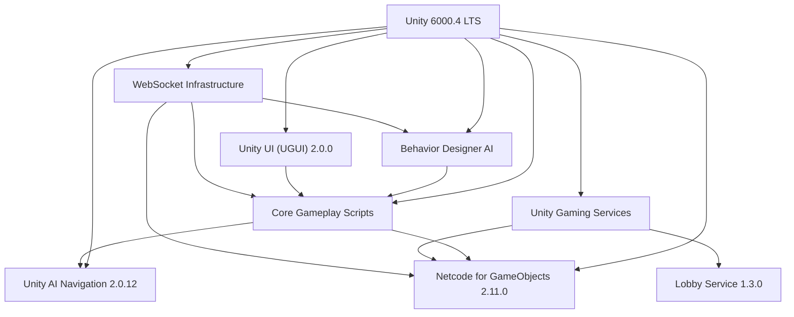
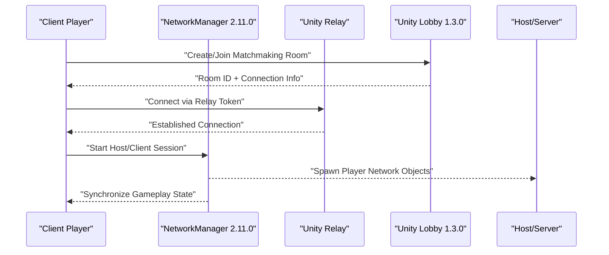
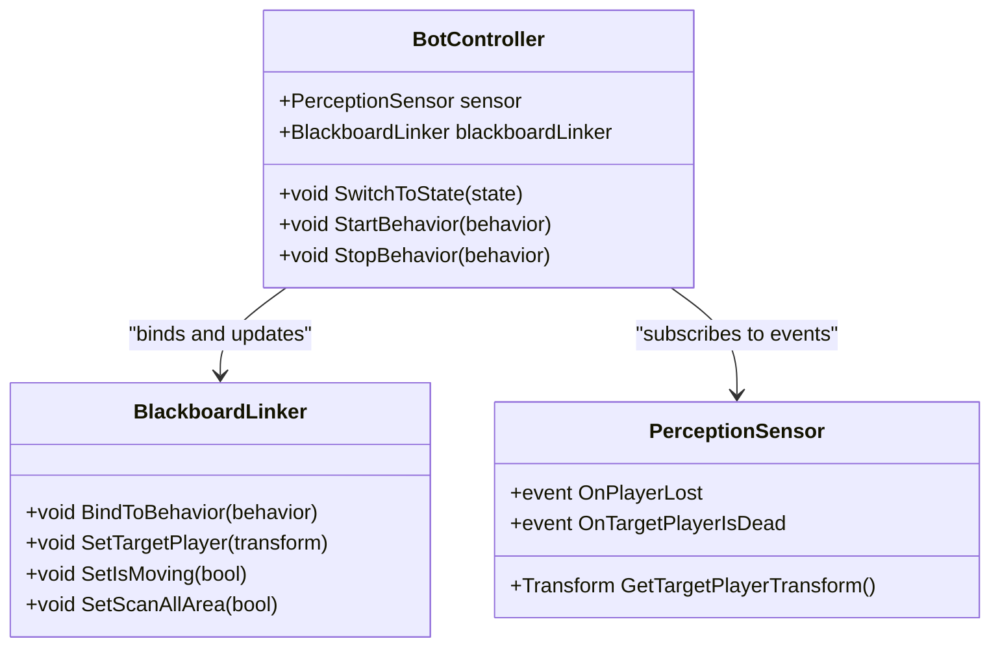
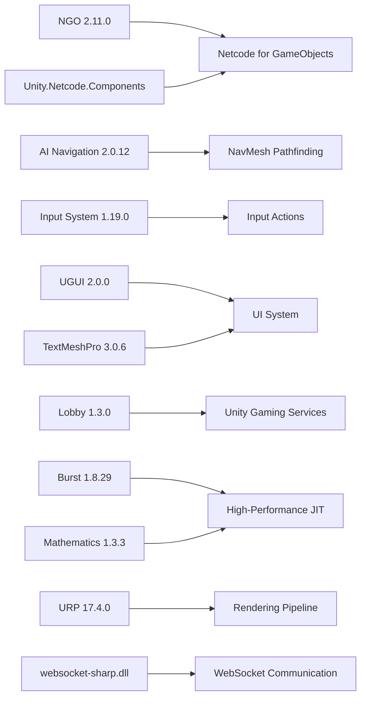
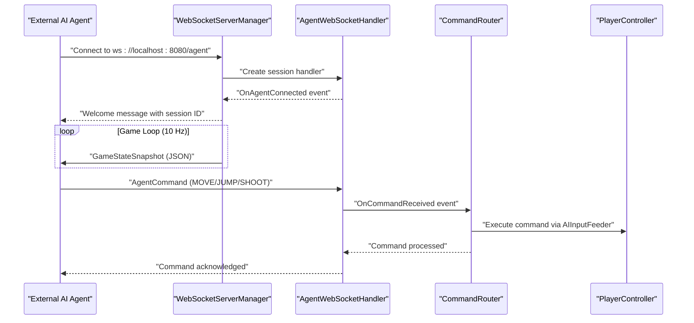
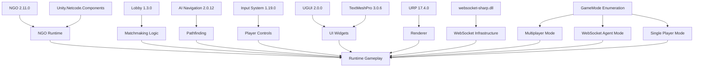

# Technology Stack

<cite>
**Referenced Files in This Document**
- [ProjectVersion.txt](file://ProjectSettings/ProjectVersion.txt)
- [NetcodeForGameObjects.asset](file://ProjectSettings/NetcodeForGameObjects.asset)
- [DefaultNetworkPrefabs.asset](file://Assets/DefaultNetworkPrefabs.asset)
- [manifest.json](file://Packages/manifest.json)
- [BotController.cs](file://Assets/FPS-Game/Scripts/Bot/BotController.cs)
- [PlayerMovement.cs](file://Assets/FPS-Game/Scripts/PlayerMovement.cs)
- [NetworkManager.prefab](file://Assets/FPS-Game/Prefabs/System/NetworkManager.prefab)
- [LobbyManager.prefab](file://Assets/FPS-Game/Prefabs/System/LobbyManager.prefab)
- [LobbyManager.cs](file://Assets/FPS-Game/Scripts/Lobby Script/Lobby/Scripts/LobbyManager.cs)
- [websocket-sharp.dll](file://Assets/Plugins/websocket-sharp.dll)
- [WebSocketServerManager.cs](file://Assets/FPS-Game/Scripts/System/WebSocketServerManager.cs)
- [AgentWebSocketHandler.cs](file://Assets/FPS-Game/Scripts/System/AgentWebSocketHandler.cs)
- [WebSocketDataStructures.cs](file://Assets/FPS-Game/Scripts/System/WebSocketDataStructures.cs)
- [CommandRouter.cs](file://Assets/FPS-Game/Scripts/System/CommandRouter.cs)
- [GameMode.cs](file://Assets/FPS-Game/Scripts/System/GameMode.cs)
- [README_WEBSOCKET_INSTALLATION.md](file://Assets/FPS-Game/Scripts/System/WebSocket/README_WEBSOCKET_INSTALLATION.md)
- [SETUP_GUIDE.md](file://Assets/FPS-Game/Scripts/System/WebSocket/SETUP_GUIDE.md)
- [PlayerNetwork.cs](file://Assets/FPS-Game/Scripts/Player/PlayerNetwork.cs)
- [PlayerBehaviour.cs](file://Assets/FPS-Game/Scripts/Player/PlayerBehaviour.cs)
- [PlayerTakeDamage.cs](file://Assets/FPS-Game/Scripts/Player/PlayerTakeDamage.cs)
- [Grenade.prefab](file://Assets/FPS-Game/Prefabs/Weapon/Grenade.prefab)
</cite>

## Update Summary
**Changes Made**
- Enhanced Technology Stack documentation with Unity 6000.4 migration details
- Added comprehensive WebSocket infrastructure requirements for AI agent integration
- Updated package dependencies including websocket-sharp.dll and Unity.Netcode.Components
- Integrated new WebSocket-based AI agent control system with bi-directional communication
- Documented new GameMode enumeration supporting WebSocketAgent operational mode
- Added WebSocket server management, command routing, and data structures documentation

## Table of Contents
1. [Introduction](#introduction)
2. [Project Structure](#project-structure)
3. [Core Components](#core-components)
4. [Architecture Overview](#architecture-overview)
5. [Detailed Component Analysis](#detailed-component-analysis)
6. [WebSocket Infrastructure](#websocket-infrastructure)
7. [Dependency Analysis](#dependency-analysis)
8. [Performance Considerations](#performance-considerations)
9. [Troubleshooting Guide](#troubleshooting-guide)
10. [Conclusion](#conclusion)

## Introduction
This document presents the technology stack powering the multiplayer FPS game. It covers the core engine and language, networking, AI and pathfinding, UI systems, third-party integrations, and configuration. It also outlines version compatibility, licensing considerations, rationale for technology selection, development environment requirements, build pipeline considerations, and deployment targets.

**Updated** The project has been upgraded to Unity 6000.4.3f1 LTS, representing a major engine version update that brings enhanced performance, improved networking capabilities, and modernized development tooling. This upgrade includes new WebSocket infrastructure for AI agent integration and enhanced Netcode v2 compatibility.

## Project Structure
The project is a Unity 6000.4.x application configured for both traditional multiplayer and AI agent control scenarios. The repository includes:
- Core gameplay assets, prefabs, scenes, and scripts under Assets/FPS-Game
- Third-party assets and packages integrated via Unity Package Manager
- Networking configuration and default network prefabs
- AI and bot behavior components
- UI and lobby systems
- **New**: WebSocket infrastructure for AI agent integration
- **New**: Game mode configuration supporting multiple operational modes



**Section sources**
- [ProjectVersion.txt:1-3](file://ProjectSettings/ProjectVersion.txt#L1-L3)
- [manifest.json:1-69](file://Packages/manifest.json#L1-L69)

## Core Components
- Unity Engine 6000.4.3f1 (LTS): Provides the core runtime, rendering, physics, animation, input system, and networking stack.
- C# Programming Language: Used extensively for gameplay logic, networking, AI, UI systems, and WebSocket integration.
- .NET Framework/.NET Runtime: Supported by Unity's .NET 4.x equivalent in 6000.4.x, enabling modern C# features and async/await patterns.
- **New**: WebSocket Infrastructure: Provides bidirectional communication between Unity and external AI agents for advanced AI control scenarios.

Why Unity 6000.4 LTS was chosen:
- Latest long-term support with enhanced networking and rendering capabilities
- Improved Netcode for GameObjects (NGO) 2.11.0 with better performance and reliability
- Enhanced Universal Render Pipeline (URP) 17.4.0 for modern graphics
- Strong asset pipeline and cross-platform build targets with improved optimization
- **New**: Native WebSocket support for AI agent integration

**Updated** The upgrade to Unity 6000.4 LTS brings significant improvements in networking performance, rendering capabilities, and development tooling, along with native WebSocket infrastructure for AI agent control.

**Section sources**
- [ProjectVersion.txt:1-3](file://ProjectSettings/ProjectVersion.txt#L1-L3)

## Architecture Overview
The game architecture centers around multiple operational modes:
- Client-authoritative gameplay with server reconciliation via NGO 2.11.0
- Behavior Designer-driven AI with shared blackboard integration
- Unity UI 2.0.0 for menus, HUD, and lobby interfaces
- Unity AI Navigation 2.0.12 for pathfinding
- Unity Gaming Services 1.3.0 for matchmaking (Lobby) and relay connectivity
- **New**: WebSocket-based AI agent control for external AI integration

```mermaid
graph TB
subgraph "Client Modes"
PM["PlayerMovement (NetworkBehaviour)"]
UI["Unity UI 2.0.0"]
AI["BotController<br/>Behavior Designer"]
NAV["Unity AI Navigation 2.0.12"]
END
subgraph "Networking"
NGO["Netcode for GameObjects 2.11.0"]
RELAY["Unity Relay (Serverless)"]
LOBBY["Unity Lobby 1.3.0 (Matchmaking)"]
END
subgraph "WebSocket Mode"
WSM["WebSocketServerManager"]
AWH["AgentWebSocketHandler"]
CR["CommandRouter"]
DATA["WebSocketDataStructures"]
END
subgraph "Services"
UGS["Unity Gaming Services 1.3.0"]
END
PM --> NGO
AI --> NAV
UI --> PM
NGO --> RELAY
LOBBY --> PM
UGS --> LOBBY
UGS --> RELAY
WSM --> AWH
WSM --> CR
WSM --> DATA
CR --> PM
```

**Diagram sources**
- [PlayerMovement.cs:5-158](file://Assets/FPS-Game/Scripts/PlayerMovement.cs#L5-L158)
- [BotController.cs:62-485](file://Assets/FPS-Game/Scripts/Bot/BotController.cs#L62-L485)
- [WebSocketServerManager.cs:17-370](file://Assets/FPS-Game/Scripts/System/WebSocketServerManager.cs#L17-L370)
- [AgentWebSocketHandler.cs:14-66](file://Assets/FPS-Game/Scripts/System/AgentWebSocketHandler.cs#L14-L66)
- [CommandRouter.cs:9-251](file://Assets/FPS-Game/Scripts/System/CommandRouter.cs#L9-L251)
- [manifest.json:19-25](file://Packages/manifest.json#L19-L25)

## Detailed Component Analysis

### Networking Stack: Netcode for GameObjects (NGO), Relay, and Lobby
- Netcode for GameObjects (NGO) 2.11.0 is enabled and configured with default network prefabs. The project includes a DefaultNetworkPrefabs asset and a NetworkManager prefab for runtime instantiation.
- Unity Relay provides serverless connectivity for NAT traversal and low-latency connections.
- Unity Lobby 1.3.0 enables matchmaking and room management with enhanced reliability.

**Updated** The networking stack has been upgraded to NGO 2.11.0, which offers improved performance, better connection handling, and enhanced debugging capabilities compared to the previous version.



**Diagram sources**
- [NetcodeForGameObjects.asset:1-18](file://ProjectSettings/NetcodeForGameObjects.asset#L1-L18)
- [DefaultNetworkPrefabs.asset:1-72](file://Assets/DefaultNetworkPrefabs.asset#L1-L72)
- [NetworkManager.prefab](file://Assets/FPS-Game/Prefabs/System/NetworkManager.prefab)
- [manifest.json:19-25](file://Packages/manifest.json#L19-L25)

**Section sources**
- [NetcodeForGameObjects.asset:1-18](file://ProjectSettings/NetcodeForGameObjects.asset#L1-L18)
- [DefaultNetworkPrefabs.asset:1-72](file://Assets/DefaultNetworkPrefabs.asset#L1-L72)
- [manifest.json:19-25](file://Packages/manifest.json#L19-L25)

### AI System: Behavior Designer, Blackboard Linker, NavMesh
- Behavior Designer integrates with runtime behaviors and a C# blackboard adapter (BlackboardLinker) to synchronize state between C# logic and BD SharedVariables.
- Unity AI Navigation 2.0.12 supports pathfinding for bots and tactical movement, including patrol routing and scanning zones.

**Updated** The AI system now utilizes Unity AI Navigation 2.0.12, which provides enhanced pathfinding algorithms, improved performance, and better integration with the latest Unity features.



**Diagram sources**
- [BotController.cs:62-485](file://Assets/FPS-Game/Scripts/Bot/BotController.cs#L62-L485)

**Section sources**
- [BotController.cs:62-485](file://Assets/FPS-Game/Scripts/Bot/BotController.cs#L62-L485)

### Unity UI System
- The UI system (Unity UI 2.0.0) is used for menus, HUD, chat, and lobby screens. It integrates with gameplay scripts to show scores, health, and controls.

**Updated** The UI system has been upgraded to Unity UI 2.0.0, which provides enhanced performance, better accessibility features, and improved component integration with the latest Unity features.

### Third-Party Integrations and Package Dependencies
- Unity AI Navigation 2.0.12: Enables NavMesh baking and pathfinding with enhanced performance.
- Unity Input System 1.19.0: Handles input actions and device abstraction.
- Unity UI (UGUI) 2.0.0: Core UI framework with improved performance.
- Unity TextMeshPro 3.0.6: Rich text rendering for UI.
- Unity Gaming Services 1.3.0: Includes Lobby 1.3.0 and related services with enhanced reliability.
- Burst 1.8.29 and Mathematics 1.3.3: Performance and math libraries with improved optimization.
- Cinemachine 2.12.0: Cinematic camera orchestration.
- Shader Graph and Universal Render Pipeline (URP) 17.4.0: Rendering pipeline and shader authoring with enhanced graphics capabilities.
- **New**: websocket-sharp.dll: WebSocket server implementation for AI agent communication.
- **New**: Unity.Netcode.Components: Enhanced networking components for transform synchronization.

**Updated** All package dependencies have been upgraded to versions compatible with Unity 6000.4 LTS, providing improved performance, reliability, and feature support. The addition of WebSocket infrastructure enables advanced AI agent integration.



**Diagram sources**
- [manifest.json:5-30](file://Packages/manifest.json#L5-L30)

**Section sources**
- [manifest.json:1-69](file://Packages/manifest.json#L1-L69)

### Development Environment Requirements
- Unity Hub and Unity Editor 6000.4.3f1 (LTS)
- Visual Studio or Rider for C# development
- Git for version control
- Optional: Visual Studio Code with Unity extensions

**Updated** The development environment now requires Unity 6000.4.3f1 LTS, which provides enhanced development tools, improved debugging capabilities, and better performance profiling compared to the previous version.

### Build Pipeline Considerations
- Configure URP 17.4.0 settings and platform-specific build targets (Windows, macOS, Linux, Android, iOS)
- Enable IL2CPP scripting backend for mobile and console builds
- Configure Netcode 2.11.0 build settings and define networking symbols
- Package and deploy with Unity Cloud Build or local CI/CD
- **New**: Include websocket-sharp.dll in build for WebSocket functionality

**Updated** The build pipeline has been updated to work with Unity 6000.4 LTS and the new package versions, including WebSocket infrastructure support for different deployment scenarios.

### Deployment Targets
- Desktop: Windows, macOS, Linux
- Mobile: Android, iOS
- Console: PlayStation, Xbox, Nintendo Switch (via Unity's platform support)

**Updated** Deployment targets remain the same, but the Unity 6000.4 LTS provides enhanced platform support and improved optimization for all target platforms.

## WebSocket Infrastructure

### Overview
The WebSocket infrastructure enables bidirectional communication between Unity and external AI agents, allowing for advanced AI control scenarios beyond traditional multiplayer. This system supports real-time game state streaming and command execution from external agents.

### Key Components

#### WebSocketServerManager
- Manages the WebSocket server lifecycle and connection handling
- Configurable port (default: 8080) and endpoint (/agent)
- Automatic game state broadcasting at configurable intervals
- Session management for multiple connected agents

#### AgentWebSocketHandler
- Handles individual agent connections and disconnections
- Processes incoming command messages from agents
- Forwards commands to the CommandRouter for execution
- Manages agent-specific session tracking

#### CommandRouter
- Validates and routes incoming commands to appropriate game systems
- Supports multiple command types: MOVE, LOOK, SHOOT, JUMP, RELOAD, STOP, SWITCH_WEAPON
- Implements command validation and safety checks
- Integrates with PlayerController and AIInputFeeder systems

#### Data Structures
- AgentCommand: Defines command structure with type, data, and metadata
- GameStateSnapshot: Comprehensive game state representation for streaming
- PlayerState, EnemyState, GameInfo: Structured data for agent consumption



**Diagram sources**
- [WebSocketServerManager.cs:71-184](file://Assets/FPS-Game/Scripts/System/WebSocketServerManager.cs#L71-L184)
- [AgentWebSocketHandler.cs:21-59](file://Assets/FPS-Game/Scripts/System/AgentWebSocketHandler.cs#L21-L59)
- [CommandRouter.cs:14-66](file://Assets/FPS-Game/Scripts/System/CommandRouter.cs#L14-L66)

### Game Mode Configuration
The system supports multiple operational modes through the GameMode enumeration:
- Multiplayer: Traditional networking with Unity Gaming Services
- WebSocketAgent: Direct AI agent control via WebSocket
- SinglePlayer: Local single-player testing mode

**Section sources**
- [WebSocketServerManager.cs:17-370](file://Assets/FPS-Game/Scripts/System/WebSocketServerManager.cs#L17-L370)
- [AgentWebSocketHandler.cs:14-66](file://Assets/FPS-Game/Scripts/System/AgentWebSocketHandler.cs#L14-L66)
- [WebSocketDataStructures.cs:12-168](file://Assets/FPS-Game/Scripts/System/WebSocketDataStructures.cs#L12-L168)
- [CommandRouter.cs:9-251](file://Assets/FPS-Game/Scripts/System/CommandRouter.cs#L9-L251)
- [GameMode.cs:4-21](file://Assets/FPS-Game/Scripts/System/GameMode.cs#L4-L21)

## Dependency Analysis
The project exhibits clear separation of concerns with updated dependencies:
- Networking depends on NGO 2.11.0 and Unity Gaming Services 1.3.0
- AI depends on Behavior Designer and NavMesh 2.0.12
- UI depends on UGUI 2.0.0 and TextMeshPro
- Input depends on Input System 1.19.0
- Rendering depends on URP 17.4.0
- **New**: WebSocket infrastructure depends on websocket-sharp.dll and Unity.Netcode.Components
- **New**: Game mode configuration supports multiple operational modes

**Updated** All dependencies have been upgraded to versions compatible with Unity 6000.4 LTS, providing improved performance and reliability across the entire technology stack, including new WebSocket infrastructure.



**Diagram sources**
- [manifest.json:5-30](file://Packages/manifest.json#L5-L30)

**Section sources**
- [manifest.json:1-69](file://Packages/manifest.json#L1-L69)

## Performance Considerations
- Use Burst 1.8.29 and Mathematics 1.3.3 libraries for compute-intensive tasks
- Optimize NavMesh 2.0.12 baking and agent settings
- Minimize network serialization overhead with NGO 2.11.0
- Prefer URP 17.4.0's GPU instancing and batching
- Profile input latency and frame timing
- **New**: Optimize WebSocket broadcast intervals and connection handling
- **New**: Monitor WebSocket server performance and memory usage

**Updated** Performance considerations have been updated to leverage the improved libraries and rendering pipeline available in Unity 6000.4 LTS, including enhanced Burst compilation, URP optimizations, and WebSocket infrastructure performance monitoring.

## Troubleshooting Guide
- Networking
  - Verify NGO 2.11.0 is enabled and DefaultNetworkPrefabs is present
  - Confirm NetworkManager 2.11.0 prefab is instantiated at runtime
- AI
  - Ensure Behavior Designer behaviors are assigned and bound via BlackboardLinker
  - Validate NavMesh 2.0.12 is baked and agents have valid destinations
- UI
  - Confirm UGUI 2.0.0 canvas and event system are initialized
  - Check TextMeshPro fonts and materials are included
- Services
  - Validate Unity Gaming Services 1.3.0 credentials and service activation
- **New**: WebSocket Infrastructure
  - Verify websocket-sharp.dll is properly imported to Assets/Plugins/
  - Check Unity Console for WebSocket server startup messages
  - Ensure port 8080 is available and not blocked by firewall
  - Validate GameMode is set to WebSocketAgent in InGameManager
  - Confirm CommandRouter can find PlayerRoot instances

**Updated** Troubleshooting guidance has been updated to reflect the new versions of all components, including specific references to the upgraded package versions and new WebSocket infrastructure requirements.

**Section sources**
- [NetcodeForGameObjects.asset:1-18](file://ProjectSettings/NetcodeForGameObjects.asset#L1-L18)
- [DefaultNetworkPrefabs.asset:1-72](file://Assets/DefaultNetworkPrefabs.asset#L1-L72)
- [BotController.cs:62-485](file://Assets/FPS-Game/Scripts/Bot/BotController.cs#L62-L485)
- [README_WEBSOCKET_INSTALLATION.md:1-55](file://Assets/FPS-Game/Scripts/System/WebSocket/README_WEBSOCKET_INSTALLATION.md#L1-L55)

## Conclusion
The technology stack leverages Unity 6000.4 LTS with Netcode for GameObjects 2.11.0, Behavior Designer, Unity AI Navigation 2.0.12, and Unity Gaming Services 1.3.0 to deliver a robust multiplayer FPS experience. The major engine upgrade provides enhanced performance, improved networking capabilities, and modernized development tooling. The modular architecture, combined with URP 17.4.0 and UGUI 2.0.0, ensures maintainability, performance, and cross-platform readiness.

**New** The addition of WebSocket infrastructure enables advanced AI agent integration with bidirectional communication, supporting external AI control scenarios beyond traditional multiplayer. The system includes comprehensive command routing, game state streaming, and session management for seamless AI agent interaction.

Adhering to the outlined environment, build, and deployment practices will streamline development and release cycles with the benefits of the latest Unity LTS version, while the new WebSocket capabilities open possibilities for advanced AI research and integration scenarios.