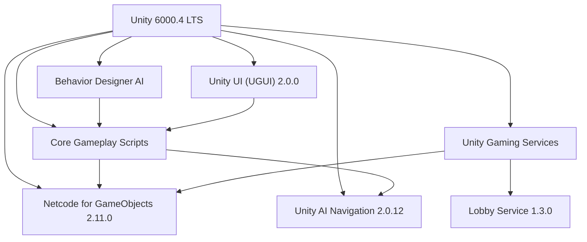
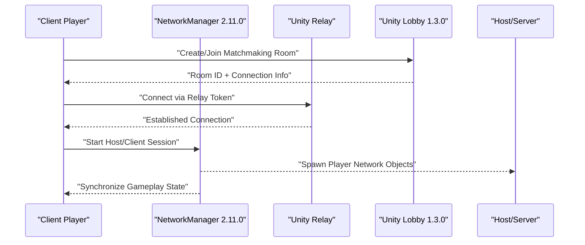
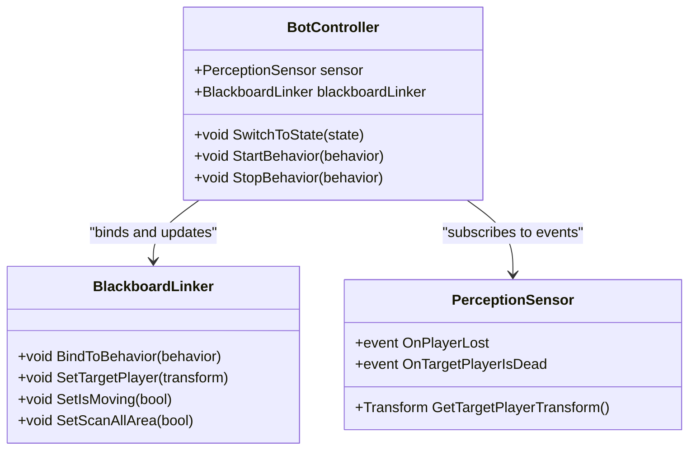
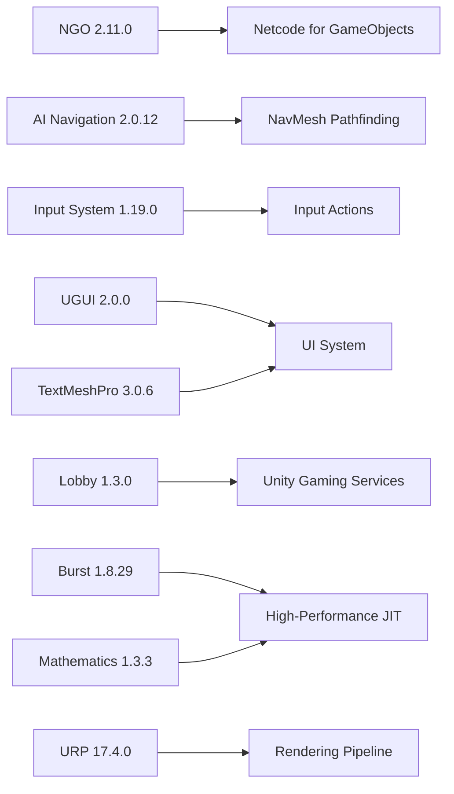
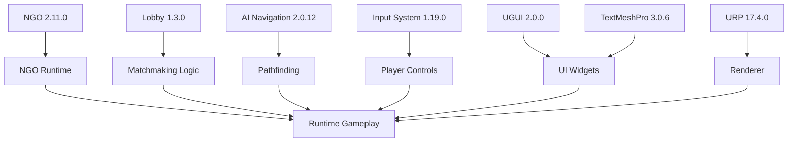

# Technology Stack

<cite>
**Referenced Files in This Document**
- [ProjectVersion.txt](file://ProjectSettings/ProjectVersion.txt)
- [NetcodeForGameObjects.asset](file://ProjectSettings/NetcodeForGameObjects.asset)
- [DefaultNetworkPrefabs.asset](file://Assets/DefaultNetworkPrefabs.asset)
- [manifest.json](file://Packages/manifest.json)
- [BotController.cs](file://Assets/FPS-Game/Scripts/Bot/BotController.cs)
- [PlayerMovement.cs](file://Assets/FPS-Game/Scripts/PlayerMovement.cs)
- [NetworkManager.prefab](file://Assets/FPS-Game/Prefabs/System/NetworkManager.prefab)
- [LobbyManager.prefab](file://Assets/FPS-Game/Prefabs/System/LobbyManager.prefab)
- [LobbyManager.cs](file://Assets/FPS-Game/Scripts/Lobby Script/Lobby/Scripts/LobbyManager.cs)
</cite>

## Update Summary
**Changes Made**
- Updated Unity Engine version from 2022.3.45f1 to 6000.4.3f1 (Unity LTS 6000.4)
- Updated package dependencies to align with Unity 6000.4 LTS baseline
- Revised networking stack versions (Netcode for GameObjects 2.11.0, URP 17.4.0)
- Updated AI navigation to version 2.0.12 and Universal Render Pipeline to 17.4.0
- Enhanced Burst and Mathematics libraries to versions 1.8.29 and 1.3.3 respectively

## Table of Contents
1. [Introduction](#introduction)
2. [Project Structure](#project-structure)
3. [Core Components](#core-components)
4. [Architecture Overview](#architecture-overview)
5. [Detailed Component Analysis](#detailed-component-analysis)
6. [Dependency Analysis](#dependency-analysis)
7. [Performance Considerations](#performance-considerations)
8. [Troubleshooting Guide](#troubleshooting-guide)
9. [Conclusion](#conclusion)

## Introduction
This document presents the technology stack powering the multiplayer FPS game. It covers the core engine and language, networking, AI and pathfinding, UI systems, third-party integrations, and configuration. It also outlines version compatibility, licensing considerations, rationale for technology selection, development environment requirements, build pipeline considerations, and deployment targets.

**Updated** The project has been upgraded to Unity 6000.4.3f1 LTS, representing a major engine version update that brings enhanced performance, improved networking capabilities, and modernized development tooling.

## Project Structure
The project is a Unity 6000.4.x application configured for a multiplayer FPS experience. The repository includes:
- Core gameplay assets, prefabs, scenes, and scripts under Assets/FPS-Game
- Third-party assets and packages integrated via Unity Package Manager
- Networking configuration and default network prefabs
- AI and bot behavior components
- UI and lobby systems



**Section sources**
- [ProjectVersion.txt:1-3](file://ProjectSettings/ProjectVersion.txt#L1-L3)
- [manifest.json:1-69](file://Packages/manifest.json#L1-L69)

## Core Components
- Unity Engine 6000.4.3f1 (LTS): Provides the core runtime, rendering, physics, animation, input system, and networking stack.
- C# Programming Language: Used extensively for gameplay logic, networking, AI, and UI systems.
- .NET Framework/.NET Runtime: Supported by Unity's .NET 4.x equivalent in 6000.4.x, enabling modern C# features and async/await patterns.

Why Unity 6000.4 LTS was chosen:
- Latest long-term support with enhanced networking and rendering capabilities
- Improved Netcode for GameObjects (NGO) 2.11.0 with better performance and reliability
- Enhanced Universal Render Pipeline (URP) 17.4.0 for modern graphics
- Strong asset pipeline and cross-platform build targets with improved optimization

**Updated** The upgrade to Unity 6000.4 LTS brings significant improvements in networking performance, rendering capabilities, and development tooling compared to the previous 2022.3.x version.

**Section sources**
- [ProjectVersion.txt:1-3](file://ProjectSettings/ProjectVersion.txt#L1-L3)

## Architecture Overview
The game architecture centers around:
- Client-authoritative gameplay with server reconciliation via NGO 2.11.0
- Behavior Designer-driven AI with shared blackboard integration
- Unity UI 2.0.0 for menus, HUD, and lobby interfaces
- Unity AI Navigation 2.0.12 for pathfinding
- Unity Gaming Services 1.3.0 for matchmaking (Lobby) and relay connectivity

```mermaid
graph TB
subgraph "Client"
PM["PlayerMovement (NetworkBehaviour)"]
UI["Unity UI 2.0.0"]
AI["BotController<br/>Behavior Designer"]
NAV["Unity AI Navigation 2.0.12"]
END
subgraph "Networking"
NGO["Netcode for GameObjects 2.11.0"]
RELAY["Unity Relay (Serverless)"]
LOBBY["Unity Lobby 1.3.0 (Matchmaking)"]
END
subgraph "Services"
UGS["Unity Gaming Services 1.3.0"]
END
PM --> NGO
AI --> NAV
UI --> PM
NGO --> RELAY
LOBBY --> PM
UGS --> LOBBY
UGS --> RELAY
```

**Diagram sources**
- [PlayerMovement.cs:5-158](file://Assets/FPS-Game/Scripts/PlayerMovement.cs#L5-L158)
- [BotController.cs:62-485](file://Assets/FPS-Game/Scripts/Bot/BotController.cs#L62-L485)
- [manifest.json:19-25](file://Packages/manifest.json#L19-L25)

## Detailed Component Analysis

### Networking Stack: Netcode for GameObjects (NGO), Relay, and Lobby
- Netcode for GameObjects (NGO) 2.11.0 is enabled and configured with default network prefabs. The project includes a DefaultNetworkPrefabs asset and a NetworkManager prefab for runtime instantiation.
- Unity Relay provides serverless connectivity for NAT traversal and low-latency connections.
- Unity Lobby 1.3.0 enables matchmaking and room management with enhanced reliability.

**Updated** The networking stack has been upgraded to NGO 2.11.0, which offers improved performance, better connection handling, and enhanced debugging capabilities compared to the previous version.



**Diagram sources**
- [NetcodeForGameObjects.asset:1-18](file://ProjectSettings/NetcodeForGameObjects.asset#L1-L18)
- [DefaultNetworkPrefabs.asset:1-72](file://Assets/DefaultNetworkPrefabs.asset#L1-L72)
- [NetworkManager.prefab](file://Assets/FPS-Game/Prefabs/System/NetworkManager.prefab)
- [manifest.json:19-25](file://Packages/manifest.json#L19-L25)

**Section sources**
- [NetcodeForGameObjects.asset:1-18](file://ProjectSettings/NetcodeForGameObjects.asset#L1-L18)
- [DefaultNetworkPrefabs.asset:1-72](file://Assets/DefaultNetworkPrefabs.asset#L1-L72)
- [manifest.json:19-25](file://Packages/manifest.json#L19-L25)

### AI System: Behavior Designer, Blackboard Linker, NavMesh
- Behavior Designer integrates with runtime behaviors and a C# blackboard adapter (BlackboardLinker) to synchronize state between C# logic and BD SharedVariables.
- Unity AI Navigation 2.0.12 supports pathfinding for bots and tactical movement, including patrol routing and scanning zones.

**Updated** The AI system now utilizes Unity AI Navigation 2.0.12, which provides enhanced pathfinding algorithms, improved performance, and better integration with the latest Unity features.



**Diagram sources**
- [BotController.cs:62-485](file://Assets/FPS-Game/Scripts/Bot/BotController.cs#L62-L485)

**Section sources**
- [BotController.cs:62-485](file://Assets/FPS-Game/Scripts/Bot/BotController.cs#L62-L485)

### Unity UI System
- The UI system (Unity UI 2.0.0) is used for menus, HUD, chat, and lobby screens. It integrates with gameplay scripts to show scores, health, and controls.

**Updated** The UI system has been upgraded to Unity UI 2.0.0, which provides enhanced performance, better accessibility features, and improved component integration with the latest Unity features.

### Third-Party Integrations and Package Dependencies
- Unity AI Navigation 2.0.12: Enables NavMesh baking and pathfinding with enhanced performance.
- Unity Input System 1.19.0: Handles input actions and device abstraction.
- Unity UI (UGUI) 2.0.0: Core UI framework with improved performance.
- Unity TextMeshPro 3.0.6: Rich text rendering for UI.
- Unity Gaming Services 1.3.0: Includes Lobby 1.3.0 and related services with enhanced reliability.
- Burst 1.8.29 and Mathematics 1.3.3: Performance and math libraries with improved optimization.
- Cinemachine 2.12.0: Cinematic camera orchestration.
- Shader Graph and Universal Render Pipeline (URP) 17.4.0: Rendering pipeline and shader authoring with enhanced graphics capabilities.

**Updated** All package dependencies have been upgraded to versions compatible with Unity 6000.4 LTS, providing improved performance, reliability, and feature support.



**Diagram sources**
- [manifest.json:5-30](file://Packages/manifest.json#L5-L30)

**Section sources**
- [manifest.json:1-69](file://Packages/manifest.json#L1-L69)

### Development Environment Requirements
- Unity Hub and Unity Editor 6000.4.3f1 (LTS)
- Visual Studio or Rider for C# development
- Git for version control
- Optional: Visual Studio Code with Unity extensions

**Updated** The development environment now requires Unity 6000.4.3f1 LTS, which provides enhanced development tools, improved debugging capabilities, and better performance profiling compared to the previous version.

### Build Pipeline Considerations
- Configure URP 17.4.0 settings and platform-specific build targets (Windows, macOS, Linux, Android, iOS)
- Enable IL2CPP scripting backend for mobile and console builds
- Configure Netcode 2.11.0 build settings and define networking symbols
- Package and deploy with Unity Cloud Build or local CI/CD

**Updated** The build pipeline has been updated to work with Unity 6000.4 LTS and the new package versions, providing improved build performance and better optimization for different platforms.

### Deployment Targets
- Desktop: Windows, macOS, Linux
- Mobile: Android, iOS
- Console: PlayStation, Xbox, Nintendo Switch (via Unity's platform support)

**Updated** Deployment targets remain the same, but the Unity 6000.4 LTS provides enhanced platform support and improved optimization for all target platforms.

## Dependency Analysis
The project exhibits clear separation of concerns with updated dependencies:
- Networking depends on NGO 2.11.0 and Unity Gaming Services 1.3.0
- AI depends on Behavior Designer and NavMesh 2.0.12
- UI depends on UGUI 2.0.0 and TextMeshPro
- Input depends on Input System 1.19.0
- Rendering depends on URP 17.4.0

**Updated** All dependencies have been upgraded to versions compatible with Unity 6000.4 LTS, providing improved performance and reliability across the entire technology stack.



**Diagram sources**
- [manifest.json:5-30](file://Packages/manifest.json#L5-L30)

**Section sources**
- [manifest.json:1-69](file://Packages/manifest.json#L1-L69)

## Performance Considerations
- Use Burst 1.8.29 and Mathematics 1.3.3 libraries for compute-intensive tasks
- Optimize NavMesh 2.0.12 baking and agent settings
- Minimize network serialization overhead with NGO 2.11.0
- Prefer URP 17.4.0's GPU instancing and batching
- Profile input latency and frame timing

**Updated** Performance considerations have been updated to leverage the improved libraries and rendering pipeline available in Unity 6000.4 LTS, including enhanced Burst compilation and URP optimizations.

## Troubleshooting Guide
- Networking
  - Verify NGO 2.11.0 is enabled and DefaultNetworkPrefabs is present
  - Confirm NetworkManager 2.11.0 prefab is instantiated at runtime
- AI
  - Ensure Behavior Designer behaviors are assigned and bound via BlackboardLinker
  - Validate NavMesh 2.0.12 is baked and agents have valid destinations
- UI
  - Confirm UGUI 2.0.0 canvas and event system are initialized
  - Check TextMeshPro fonts and materials are included
- Services
  - Validate Unity Gaming Services 1.3.0 credentials and service activation

**Updated** Troubleshooting guidance has been updated to reflect the new versions of all components, including specific references to the upgraded package versions.

**Section sources**
- [NetcodeForGameObjects.asset:1-18](file://ProjectSettings/NetcodeForGameObjects.asset#L1-L18)
- [DefaultNetworkPrefabs.asset:1-72](file://Assets/DefaultNetworkPrefabs.asset#L1-L72)
- [BotController.cs:62-485](file://Assets/FPS-Game/Scripts/Bot/BotController.cs#L62-L485)

## Conclusion
The technology stack leverages Unity 6000.4 LTS with Netcode for GameObjects 2.11.0, Behavior Designer, Unity AI Navigation 2.0.12, and Unity Gaming Services 1.3.0 to deliver a robust multiplayer FPS experience. The major engine upgrade provides enhanced performance, improved networking capabilities, and modernized development tooling. The modular architecture, combined with URP 17.4.0 and UGUI 2.0.0, ensures maintainability, performance, and cross-platform readiness. Adhering to the outlined environment, build, and deployment practices will streamline development and release cycles with the benefits of the latest Unity LTS version.