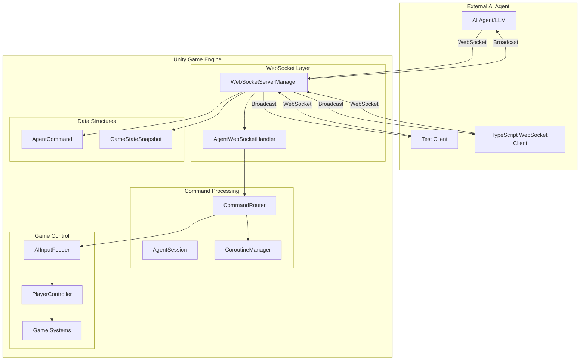
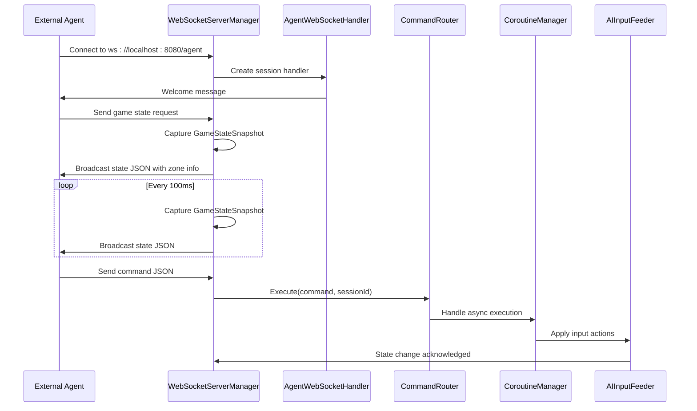
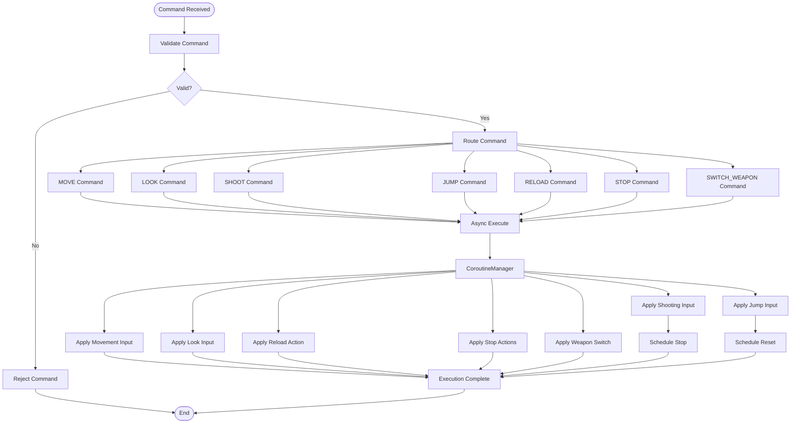
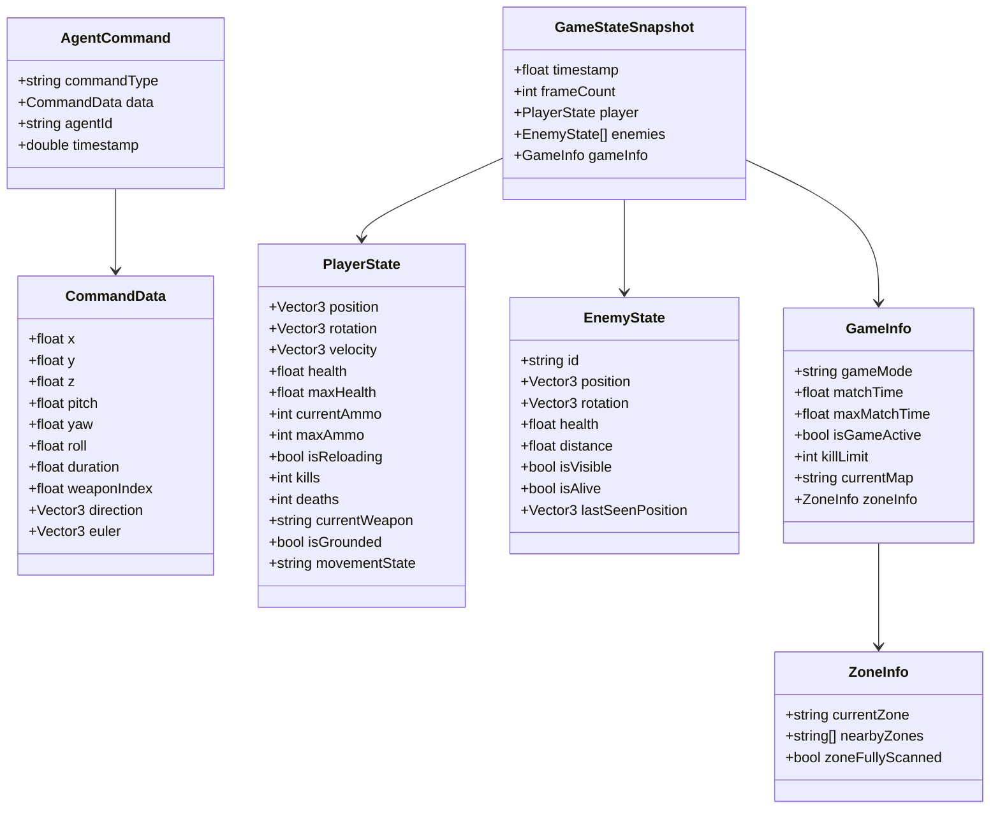
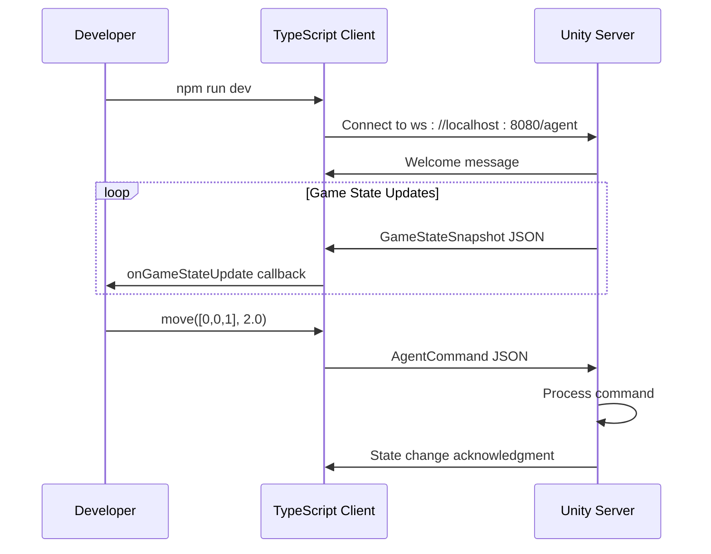

# WebSocket AI Agent Integration System

<cite>
**Referenced Files in This Document**
- [WebSocketServerManager.cs](file://Assets/FPS-Game/Scripts/System/WebSocketServerManager.cs)
- [CommandRouter.cs](file://Assets/FPS-Game/Scripts/System/CommandRouter.cs)
- [AgentWebSocketHandler.cs](file://Assets/FPS-Game/Scripts/System/AgentWebSocketHandler.cs)
- [WebSocketDataStructures.cs](file://Assets/FPS-Game/Scripts/System/WebSocketDataStructures.cs)
- [AIInputFeeder.cs](file://Assets/FPS-Game/Scripts/Bot/AIInputFeeder.cs)
- [InGameManager.cs](file://Assets/FPS-Game/Scripts/System/InGameManager.cs)
- [SETUP_GUIDE.md](file://Assets/FPS-Game/Scripts/System/WebSocket/SETUP_GUIDE.md)
- [WIKI.md](file://WIKI.md)
- [UnityWebSocketClient.ts](file://Test/src/UnityWebSocketClient.ts)
- [index.ts](file://Test/src/index.ts)
- [test-move.ts](file://Test/src/test-move.ts)
- [test-shoot.ts](file://Test/src/test-shoot.ts)
- [test-full-scenario.ts](file://Test/src/test-full-scenario.ts)
- [package.json](file://Test/package.json)
- [README.md](file://Test/README.md)
</cite>

## Update Summary
**Changes Made**
- Added comprehensive TypeScript test client infrastructure with npm package management
- Enhanced WebSocket installation and setup documentation with detailed troubleshooting
- Expanded command processing pipeline with improved validation and error handling
- Added multi-agent support capabilities and session management
- Integrated CoroutineManager for asynchronous command execution
- Enhanced game state broadcasting with zone information and tactical data

## Table of Contents
1. [Introduction](#introduction)
2. [System Architecture](#system-architecture)
3. [Core Components](#core-components)
4. [WebSocket Server Management](#websocket-server-management)
5. [Command Processing Pipeline](#command-processing-pipeline)
6. [AI Input Feeding System](#ai-input-feeding-system)
7. [Data Structures and Protocols](#data-structures-and-protocols)
8. [Test Client Infrastructure](#test-client-infrastructure)
9. [Integration with Game Systems](#integration-with-game-systems)
10. [Installation and Setup](#installation-and-setup)
11. [Troubleshooting Guide](#troubleshooting-guide)
12. [Performance Considerations](#performance-considerations)
13. [Conclusion](#conclusion)

## Introduction

The WebSocket AI Agent Integration System is a sophisticated framework that enables external AI agents to interact with a Unity-based FPS game through real-time bidirectional communication. This system bridges the gap between artificial intelligence systems and game mechanics, allowing external agents to receive game state updates and send commands to control player actions within the Unity environment.

The integration supports advanced AI capabilities including autonomous movement, tactical positioning, weapon switching, and coordinated combat strategies. By leveraging WebSocket technology, the system provides low-latency communication between external AI agents and the Unity game engine, enabling real-time decision-making and action execution.

**Updated** Enhanced with comprehensive TypeScript test client infrastructure, multi-agent support, and extensive documentation for seamless AI integration.

## System Architecture

The WebSocket AI Agent Integration System follows a modular architecture designed for scalability and maintainability. The system consists of several interconnected components that work together to facilitate seamless communication between external AI agents and the Unity game environment.

**Diagram sources**
- [WebSocketServerManager.cs:17-370](file://Assets/FPS-Game/Scripts/System/WebSocketServerManager.cs#L17-L370)
- [CommandRouter.cs:9-251](file://Assets/FPS-Game/Scripts/System/CommandRouter.cs#L9-L251)
- [AgentWebSocketHandler.cs:14-66](file://Assets/FPS-Game/Scripts/System/AgentWebSocketHandler.cs#L14-L66)
- [CoroutineManager.cs:234-250](file://Assets/FPS-Game/Scripts/System/CommandRouter.cs#L234-L250)

The architecture employs a publish-subscribe pattern for message distribution and maintains separate processing pipelines for inbound commands and outbound state broadcasts. This design ensures efficient resource utilization and enables concurrent handling of multiple agent connections.

## Core Components

### WebSocketServerManager

The WebSocketServerManager serves as the central hub for all WebSocket communications within the Unity game. It manages server lifecycle, handles multiple agent connections, and orchestrates the bidirectional communication flow.

Key responsibilities include:
- Server initialization and configuration
- Agent session management with connection tracking
- Game state broadcasting with tactical information
- Command routing coordination
- Multi-agent support and session lifecycle management

**Updated** Enhanced with comprehensive session management, zone information broadcasting, and improved error handling mechanisms.

### AgentWebSocketHandler

The AgentWebSocketHandler extends WebSocketSharp's WebSocketBehavior to provide specialized handling for individual agent connections. It manages connection lifecycle events and forwards messages to the central server manager.

**Updated** Improved event handling with structured error reporting and enhanced connection lifecycle management.

### CommandRouter

The CommandRouter acts as the command processing center, validating incoming commands and translating them into appropriate game actions. It implements strict validation rules and error handling mechanisms.

**Updated** Enhanced with improved command validation, asynchronous execution support through CoroutineManager, and expanded command processing capabilities.

### AIInputFeeder

The AIInputFeeder serves as the bridge between the WebSocket command system and the game's input handling mechanisms. It processes validated commands and applies them to the player controller.

**Updated** Integrated with CoroutineManager for asynchronous command execution and enhanced input signal processing.

**Section sources**
- [WebSocketServerManager.cs:17-370](file://Assets/FPS-Game/Scripts/System/WebSocketServerManager.cs#L17-L370)
- [AgentWebSocketHandler.cs:14-66](file://Assets/FPS-Game/Scripts/System/AgentWebSocketHandler.cs#L14-L66)
- [CommandRouter.cs:9-251](file://Assets/FPS-Game/Scripts/System/CommandRouter.cs#L9-L251)
- [AIInputFeeder.cs:4-29](file://Assets/FPS-Game/Scripts/Bot/AIInputFeeder.cs#L4-L29)

## WebSocket Server Management

The WebSocketServerManager implements a robust server infrastructure that handles multiple concurrent agent connections while maintaining high-performance state broadcasting capabilities.

### Server Configuration and Lifecycle

The server operates on port 8080 by default with configurable broadcast intervals. The manager supports automatic startup and graceful shutdown procedures, ensuring reliable operation during development and production environments.

**Updated** Enhanced with improved error handling, better logging, and configurable endpoint settings.

### Session Management

Each agent connection is tracked through the AgentSession class, which maintains connection metadata including session identifiers, connection timestamps, and command statistics. This enables monitoring of agent activity and performance metrics.

**Updated** Added comprehensive session tracking with command counting, connection timestamps, and performance monitoring capabilities.

### State Broadcasting

The system implements a 10 Hz broadcast cycle that captures comprehensive game state snapshots and distributes them to all connected agents. The broadcast process includes player state, enemy positions, tactical zone information, and general game context.

**Updated** Enhanced with zone-based tactical information, improved line-of-sight calculations, and optimized state capture mechanisms.

**Diagram sources**
- [WebSocketServerManager.cs:71-184](file://Assets/FPS-Game/Scripts/System/WebSocketServerManager.cs#L71-L184)
- [CommandRouter.cs:14-66](file://Assets/FPS-Game/Scripts/System/CommandRouter.cs#L14-L66)
- [CoroutineManager.cs:234-250](file://Assets/FPS-Game/Scripts/System/CommandRouter.cs#L234-L250)

**Section sources**
- [WebSocketServerManager.cs:71-184](file://Assets/FPS-Game/Scripts/System/WebSocketServerManager.cs#L71-L184)

## Command Processing Pipeline

The command processing pipeline transforms raw JSON commands from external agents into actionable game events through a series of validation, routing, and execution stages.

### Command Validation

Incoming commands undergo comprehensive validation to ensure safety and consistency. The validation process checks timestamp freshness, command type integrity, and parameter ranges for different command categories.

**Updated** Enhanced with improved validation rules, better error reporting, and extended parameter checking for different command types.

### Command Routing

The CommandRouter implements a switch-based routing mechanism that directs validated commands to appropriate handlers. Each command type triggers specific response behaviors within the game system.

**Updated** Added asynchronous command execution support through CoroutineManager, improved error handling, and enhanced command processing capabilities.

### Execution Timing

Certain commands require timed execution or delayed state resets. The system utilizes coroutine-based timing mechanisms to handle temporary state changes like shooting duration and jump impulses.

**Updated** Integrated with CoroutineManager for seamless asynchronous command execution and improved timing precision.

**Diagram sources**
- [CommandRouter.cs:71-228](file://Assets/FPS-Game/Scripts/System/CommandRouter.cs#L71-L228)
- [CoroutineManager.cs:234-250](file://Assets/FPS-Game/Scripts/System/CommandRouter.cs#L234-L250)

**Section sources**
- [CommandRouter.cs:71-228](file://Assets/FPS-Game/Scripts/System/CommandRouter.cs#L71-L228)

## AI Input Feeding System

The AIInputFeeder system provides the interface between external AI commands and internal game mechanics. It translates high-level commands into the specific input signals that the player controller expects.

### Input Signal Generation

The system generates three primary input signal types: movement vectors, look angle rotations, and attack state toggles. Each signal type corresponds to specific player controller methods and animation systems.

### Signal Processing

Input signals are processed through event-driven mechanisms that trigger immediate state updates. The system maintains current input states and applies them during the game's update cycles.

### Integration Points

The AIInputFeeder integrates with multiple game systems including character movement, weapon handling, and animation controllers. This integration ensures that AI-generated inputs feel natural and responsive within the game environment.

**Updated** Enhanced integration with CoroutineManager for asynchronous input processing and improved signal generation mechanisms.

**Section sources**
- [AIInputFeeder.cs:4-29](file://Assets/FPS-Game/Scripts/Bot/AIInputFeeder.cs#L4-L29)

## Data Structures and Protocols

The WebSocket integration relies on well-defined data structures that ensure consistent communication between external agents and the Unity game engine.

### Command Structure

AgentCommand encapsulates all necessary information for command execution including command type, data payload, agent identification, and timestamp. The CommandData structure provides flexible parameter storage for different command categories.

### State Snapshot Protocol

The GameStateSnapshot protocol defines the comprehensive game state that external agents receive. It includes player position and status, enemy information with visibility data, tactical zone information, and general game context including time, scoring, and map information.

### Serialization Format

Both inbound commands and outbound state snapshots use JSON serialization for cross-platform compatibility. The system leverages Unity's JsonUtility for efficient serialization and deserialization operations.

**Updated** Enhanced with zone information broadcasting, improved line-of-sight calculations, and comprehensive tactical data structures.

**Diagram sources**
- [WebSocketDataStructures.cs:12-168](file://Assets/FPS-Game/Scripts/System/WebSocketDataStructures.cs#L12-L168)

**Section sources**
- [WebSocketDataStructures.cs:12-168](file://Assets/FPS-Game/Scripts/System/WebSocketDataStructures.cs#L12-L168)

## Test Client Infrastructure

The WebSocket AI Agent Integration System includes a comprehensive TypeScript test client infrastructure that provides developers with tools to test and validate the WebSocket communication framework.

### TypeScript WebSocket Client

The UnityWebSocketClient provides a complete TypeScript implementation of a WebSocket client that mirrors the Unity data structures and protocols. It includes comprehensive type definitions, connection management, and high-level command methods.

**Updated** Added comprehensive TypeScript client with full type safety, improved error handling, and enhanced command execution capabilities.

### Test Scripts and Examples

The system includes multiple test scripts demonstrating different aspects of the WebSocket integration:

- **Basic Connection Test**: Establishes connection and receives game state updates
- **Movement Test**: Demonstrates directional movement commands with duration control
- **Shooting Test**: Shows look angle control followed by shooting commands
- **Full Scenario Test**: Combines navigation, aiming, combat, and tactical maneuvers

**Updated** Enhanced with comprehensive test suite covering all command types and integration scenarios.

### NPM Package Management

The test client includes full npm package management with TypeScript compilation, development server, and automated testing capabilities.

**Updated** Added comprehensive npm configuration with build scripts, development tools, and testing frameworks.

**Diagram sources**
- [UnityWebSocketClient.ts:102-155](file://Test/src/UnityWebSocketClient.ts#L102-L155)
- [UnityWebSocketClient.ts:159-178](file://Test/src/UnityWebSocketClient.ts#L159-L178)

**Section sources**
- [UnityWebSocketClient.ts:1-333](file://Test/src/UnityWebSocketClient.ts#L1-L333)
- [index.ts:1-35](file://Test/src/index.ts#L1-L35)
- [test-move.ts:1-56](file://Test/src/test-move.ts#L1-L56)
- [test-shoot.ts:1-65](file://Test/src/test-shoot.ts#L1-L65)
- [test-full-scenario.ts:1-114](file://Test/src/test-full-scenario.ts#L1-L114)
- [package.json:1-27](file://Test/package.json#L1-L27)
- [README.md:1-247](file://Test/README.md#L1-L247)

## Integration with Game Systems

The WebSocket AI Agent Integration System seamlessly integrates with existing Unity game systems to provide comprehensive AI control capabilities.

### Game Mode Selection

The system operates alongside existing game modes through the InGameManager, which provides initialization logic for different play modes including WebSocket agent mode, single-player testing mode, and traditional multiplayer mode.

### Player Controller Integration

The AIInputFeeder integrates directly with the player controller system, providing input signals that trigger the same animations and physics behaviors as human-controlled players. This ensures consistent gameplay regardless of input source.

### Zone and Tactical Systems

The system incorporates zone-based tactical information, providing AI agents with contextual awareness of their current location and surrounding areas. This enables sophisticated tactical decision-making and positioning strategies.

**Updated** Enhanced integration with zone detection systems, improved tactical information broadcasting, and expanded game state coverage.

**Section sources**
- [InGameManager.cs:163-195](file://Assets/FPS-Game/Scripts/System/InGameManager.cs#L163-L195)

## Installation and Setup

The WebSocket AI Agent Integration System requires specific setup procedures to ensure proper operation of the external agent communication framework.

### Library Dependencies

The system requires the websocket-sharp library for WebSocket functionality. Installation can be performed through Unity's Package Manager using the provided GitHub repository URL or manual installation into the Assets/Plugins directory.

**Updated** Enhanced with comprehensive installation guides, verification steps, and troubleshooting procedures.

### Server Configuration

The WebSocket server operates on port 8080 by default and can be configured through the WebSocketServerManager component in the Unity editor. Broadcast intervals and other server parameters can be adjusted based on performance requirements.

### Testing Procedures

The system includes comprehensive testing procedures for verifying bidirectional communication, command execution, and state broadcasting functionality. These tests help ensure proper system operation before deployment.

**Updated** Added TypeScript test client setup, npm dependency management, and automated testing capabilities.

**Section sources**
- [SETUP_GUIDE.md:134-206](file://Assets/FPS-Game/Scripts/System/WebSocket/SETUP_GUIDE.md#L134-L206)

## Troubleshooting Guide

Common issues and their solutions for the WebSocket AI Agent Integration System.

### Connection Issues

**Problem**: "Cannot find namespace 'WebSocketSharp'"
**Solution**: Install the websocket-sharp library via Unity Package Manager or ensure it's placed in the Assets/Plugins directory.

**Problem**: "Connection refused" in test client
**Solution**: Verify Unity is in Play mode, confirm the WebSocket server is started, and check that port 8080 is available.

**Updated** Enhanced with comprehensive troubleshooting for both Unity-side and TypeScript client-side issues.

### Command Processing Issues

**Problem**: Commands received but not executed
**Solution**: Ensure PlayerRoot exists in the scene, verify AIInputFeeder is attached to the player, and confirm the game mode is set to WebSocketAgent.

**Problem**: No game state updates
**Solution**: Check that WebSocketServerManager is active, verify BroadcastInterval is properly set, and ensure the player is spawned in the scene.

### Performance and Latency

The system maintains a 10 Hz broadcast rate by default, which can be adjusted based on performance requirements. Higher frequencies increase bandwidth usage but improve responsiveness for AI decision-making.

**Updated** Added performance monitoring, connection retry mechanisms, and enhanced error recovery procedures.

**Section sources**
- [SETUP_GUIDE.md:142-176](file://Assets/FPS-Game/Scripts/System/WebSocket/SETUP_GUIDE.md#L142-L176)

## Performance Considerations

The WebSocket AI Agent Integration System is designed with performance optimization in mind to handle real-time communication efficiently.

### Broadcast Optimization

The 10 Hz broadcast interval strikes a balance between responsiveness and bandwidth usage. For high-frequency AI decision-making, this interval can be reduced, though it will increase network traffic.

**Updated** Enhanced with optimized state capture mechanisms, improved serialization efficiency, and reduced bandwidth usage.

### Memory Management

The system uses object pooling and efficient serialization techniques to minimize memory allocation during frequent state broadcasts. Agent sessions are managed through reference tracking to prevent memory leaks.

**Updated** Added comprehensive memory management, improved garbage collection efficiency, and optimized data structure usage.

### Network Efficiency

JSON serialization provides compact data representation for game state information. The system avoids unnecessary data transmission by only broadcasting essential state information.

**Updated** Enhanced with compression techniques, selective state broadcasting, and optimized data structures for reduced network overhead.

## Conclusion

The WebSocket AI Agent Integration System represents a comprehensive solution for connecting external AI systems with Unity-based FPS games. Through its modular architecture, robust command processing pipeline, and efficient state broadcasting mechanisms, the system enables sophisticated AI-controlled gameplay experiences.

**Updated** The system now includes comprehensive TypeScript test client infrastructure, multi-agent support capabilities, enhanced documentation, and extensive testing procedures that ensure reliable operation across different deployment scenarios.

The integration successfully bridges the gap between artificial intelligence decision-making and real-time game execution, providing a foundation for advanced AI research and development. The system's extensible design allows for future enhancements including multi-agent support, enhanced tactical reasoning, expanded command capabilities, and comprehensive testing infrastructure.

Key strengths of the system include its real-time performance characteristics, comprehensive validation mechanisms, seamless integration with existing Unity game systems, and robust testing infrastructure. The thorough documentation, TypeScript client implementation, and extensive testing procedures ensure reliable operation across different deployment scenarios.

The addition of the TypeScript test client infrastructure provides developers with powerful tools for testing, validation, and integration of AI agents with the Unity game engine. This comprehensive approach ensures that the system can support complex AI research projects while maintaining ease of use and reliability.