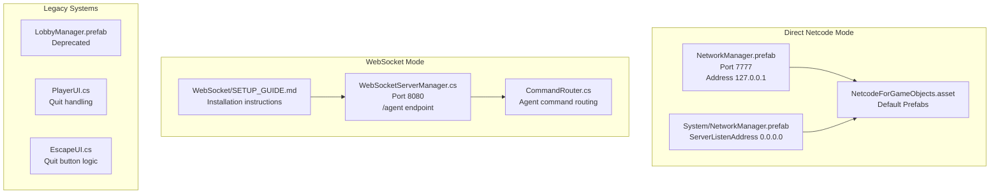
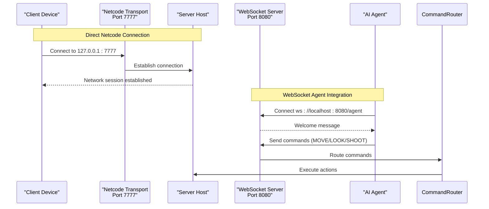
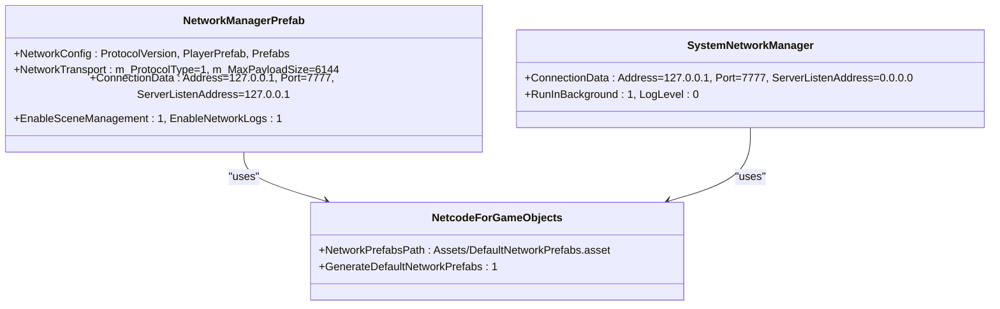
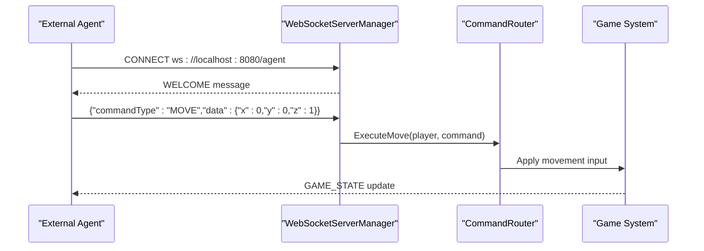
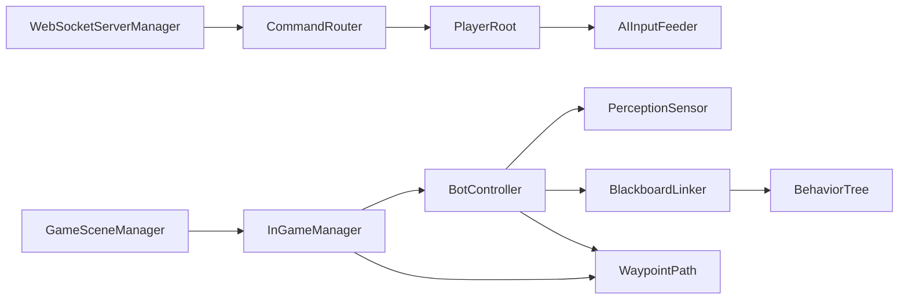

# Troubleshooting & Maintenance

<cite>
**Referenced Files in This Document**
- [DebugManager.cs](file://Assets/FPS-Game/Scripts/Debug/DebugManager.cs)
- [AIInputFeeder.cs](file://Assets/FPS-Game/Scripts/Bot/AIInputFeeder.cs)
- [WaypointPath.cs](file://Assets/FPS-Game/Scripts/Bot/WaypointPath.cs)
- [PerceptionSensor.cs](file://Assets/FPS-Game/Scripts/Bot/PerceptionSensor.cs)
- [BotController.cs](file://Assets/FPS-Game/Scripts/Bot/BotController.cs)
- [BlackboardLinker.cs](file://Assets/FPS-Game/Scripts/Bot/BlackboardLinker.cs)
- [BotTactics.cs](file://Assets/FPS-Game/Scripts/Bot/BotTactics.cs)
- [PlayerRoot.cs](file://Assets/FPS-Game/Scripts/Player/PlayerRoot.cs)
- [InGameManager.cs](file://Assets/FPS-Game/Scripts/System/InGameManager.cs)
- [GameSceneManager.cs](file://Assets/FPS-Game/Scripts/GameSceneManager.cs)
- [BehaviorTree.cs](file://Assets/Behavior%20Designer/Runtime/BehaviorTree.cs)
- [WebSocketServerManager.cs](file://Assets/FPS-Game/Scripts/System/WebSocketServerManager.cs)
- [WebSocket/README_WEBSOCKET_INSTALLATION.md](file://Assets/FPS-Game/Scripts/System/WebSocket/README_WEBSOCKET_INSTALLATION.md)
- [WebSocket/SETUP_GUIDE.md](file://Assets/FPS-Game/Scripts/System/WebSocket/SETUP_GUIDE.md)
- [CommandRouter.cs](file://Assets/FPS-Game/Scripts/System/CommandRouter.cs)
- [PlayerUI.cs](file://Assets/FPS-Game/Scripts/Player/PlayerUI.cs)
- [NetcodeForGameObjects.asset](file://ProjectSettings/NetcodeForGameObjects.asset)
- [NetworkManager.prefab](file://Assets/FPS-Game/Prefabs/NetworkManager.prefab)
- [System/NetworkManager.prefab](file://Assets/FPS-Game/Prefabs/System/NetworkManager.prefab)
</cite>

## Update Summary
**Changes Made**
- Completely rewritten networking troubleshooting procedures to focus on "Cannot connect to host" scenarios instead of "Cannot connect to lobby"
- Added comprehensive Netcode port 7777 firewall configuration guidance
- Updated IP connectivity verification procedures for direct connections
- Removed Unity Services and Lobby system troubleshooting in favor of direct networking validation
- Added WebSocket integration troubleshooting for AI agent scenarios
- Updated step-by-step resolution procedures to reflect new networking architecture

## Table of Contents
1. [Introduction](#introduction)
2. [Project Structure](#project-structure)
3. [Core Components](#core-components)
4. [Architecture Overview](#architecture-overview)
5. [Detailed Component Analysis](#detailed-component-analysis)
6. [Dependency Analysis](#dependency-analysis)
7. [Performance Considerations](#performance-considerations)
8. [Troubleshooting Guide](#troubleshooting-guide)
9. [Maintenance Procedures](#maintenance-procedures)
10. [Conclusion](#conclusion)

## Introduction
This document provides comprehensive troubleshooting and maintenance guidance for the project's networking infrastructure. The focus has shifted from Unity Gaming Services and Lobby system troubleshooting to direct networking connectivity issues, particularly "Cannot connect to host" scenarios. It addresses IP connectivity verification, Netcode port 7777 firewall configuration, and direct connection troubleshooting. The document covers AI behavior inconsistencies, performance bottlenecks, and asset loading errors, while providing systematic debugging approaches using the built-in debug system, log analysis, and network monitoring techniques.

## Project Structure
The project maintains a modular architecture with three primary networking modes:
- Direct Netcode connections using port 7777
- WebSocket integration for AI agent control
- Legacy lobby system (deprecated)

**Diagram sources**
- [NetworkManager.prefab:45-99](file://Assets/FPS-Game/Prefabs/NetworkManager.prefab#L45-L99)
- [System/NetworkManager.prefab:46-99](file://Assets/FPS-Game/Prefabs/System/NetworkManager.prefab#L46-L99)
- [WebSocketServerManager.cs:17-102](file://Assets/FPS-Game/Scripts/System/WebSocketServerManager.cs#L17-L102)
- [WebSocket/SETUP_GUIDE.md:1-51](file://Assets/FPS-Game/Scripts/System/WebSocket/SETUP_GUIDE.md#L1-L51)
- [PlayerUI.cs:128-170](file://Assets/FPS-Game/Scripts/Player/PlayerUI.cs#L128-L170)

**Section sources**
- [NetworkManager.prefab:45-99](file://Assets/FPS-Game/Prefabs/NetworkManager.prefab#L45-L99)
- [System/NetworkManager.prefab:46-99](file://Assets/FPS-Game/Prefabs/System/NetworkManager.prefab#L46-L99)
- [WebSocketServerManager.cs:17-102](file://Assets/FPS-Game/Scripts/System/WebSocketServerManager.cs#L17-L102)
- [WebSocket/SETUP_GUIDE.md:1-51](file://Assets/FPS-Game/Scripts/System/WebSocket/SETUP_GUIDE.md#L1-L51)
- [PlayerUI.cs:128-170](file://Assets/FPS-Game/Scripts/Player/PlayerUI.cs#L128-L170)

## Core Components
The networking system now centers around three key components:
- **Direct Netcode Connections**: Using Unity Netcode for GameObjects with configurable port 7777
- **WebSocket Integration**: For AI agent control with port 8080 and /agent endpoint
- **Legacy Support**: Minimal lobby system remnants for backward compatibility

Key responsibilities:
- NetworkManager.prefab: Primary Netcode configuration with port 7777 settings
- WebSocketServerManager: Bi-directional communication for AI agents
- CommandRouter: Translates agent commands to game actions
- NetcodeForGameObjects.asset: Default network prefab management

**Section sources**
- [NetworkManager.prefab:45-99](file://Assets/FPS-Game/Prefabs/NetworkManager.prefab#L45-L99)
- [WebSocketServerManager.cs:17-102](file://Assets/FPS-Game/Scripts/System/WebSocketServerManager.cs#L17-L102)
- [CommandRouter.cs:9-49](file://Assets/FPS-Game/Scripts/System/CommandRouter.cs#L9-L49)
- [NetcodeForGameObjects.asset:1-18](file://ProjectSettings/NetcodeForGameObjects.asset#L1-L18)

## Architecture Overview
The system now supports multiple networking architectures with clear separation of concerns:

**Diagram sources**
- [NetworkManager.prefab:92-95](file://Assets/FPS-Game/Prefabs/NetworkManager.prefab#L92-L95)
- [System/NetworkManager.prefab:92-95](file://Assets/FPS-Game/Prefabs/System/NetworkManager.prefab#L92-L95)
- [WebSocketServerManager.cs:71-95](file://Assets/FPS-Game/Scripts/System/WebSocketServerManager.cs#L71-L95)
- [CommandRouter.cs:14-49](file://Assets/FPS-Game/Scripts/System/CommandRouter.cs#L14-L49)

## Detailed Component Analysis

### Direct Netcode Connection Architecture
The primary networking mechanism uses Unity Netcode for GameObjects with configurable transport settings:

**Diagram sources**
- [NetworkManager.prefab:48-72](file://Assets/FPS-Game/Prefabs/NetworkManager.prefab#L48-L72)
- [System/NetworkManager.prefab:48-72](file://Assets/FPS-Game/Prefabs/System/NetworkManager.prefab#L48-L72)
- [NetcodeForGameObjects.asset:15-17](file://ProjectSettings/NetcodeForGameObjects.asset#L15-L17)

**Section sources**
- [NetworkManager.prefab:48-72](file://Assets/FPS-Game/Prefabs/NetworkManager.prefab#L48-L72)
- [System/NetworkManager.prefab:48-72](file://Assets/FPS-Game/Prefabs/System/NetworkManager.prefab#L48-L72)
- [NetcodeForGameObjects.asset:15-17](file://ProjectSettings/NetcodeForGameObjects.asset#L15-L17)

### WebSocket Integration for AI Agents
The WebSocket system provides bidirectional communication for AI agent control:

**Diagram sources**
- [WebSocketServerManager.cs:71-95](file://Assets/FPS-Game/Scripts/System/WebSocketServerManager.cs#L71-L95)
- [CommandRouter.cs:14-49](file://Assets/FPS-Game/Scripts/System/CommandRouter.cs#L14-L49)

**Section sources**
- [WebSocketServerManager.cs:71-95](file://Assets/FPS-Game/Scripts/System/WebSocketServerManager.cs#L71-L95)
- [CommandRouter.cs:14-49](file://Assets/FPS-Game/Scripts/System/CommandRouter.cs#L14-L49)

## Dependency Analysis
The networking system has evolved to minimize external dependencies:
- Direct Netcode connections: Pure Unity Netcode implementation
- WebSocket integration: websocket-sharp library for AI agent control
- Legacy lobby system: Minimal footprint, primarily for UI quit functionality

**Diagram sources**
- [PlayerRoot.cs:159-366](file://Assets/FPS-Game/Scripts/Player/PlayerRoot.cs#L159-L366)
- [BotController.cs:62-485](file://Assets/FPS-Game/Scripts/Bot/BotController.cs#L62-L485)
- [BlackboardLinker.cs:54-332](file://Assets/FPS-Game/Scripts/Bot/BlackboardLinker.cs#L54-L332)
- [BehaviorTree.cs:6-11](file://Assets/Behavior%20Designer/Runtime/BehaviorTree.cs#L6-L11)
- [WaypointPath.cs:10-71](file://Assets/FPS-Game/Scripts/Bot/WaypointPath.cs#L10-L71)
- [InGameManager.cs:66-139](file://Assets/FPS-Game/Scripts/System/InGameManager.cs#L66-L139)
- [GameSceneManager.cs:4-26](file://Assets/FPS-Game/Scripts/GameSceneManager.cs#L4-L26)
- [WebSocketServerManager.cs:17-102](file://Assets/FPS-Game/Scripts/System/WebSocketServerManager.cs#L17-L102)
- [CommandRouter.cs:9-49](file://Assets/FPS-Game/Scripts/System/CommandRouter.cs#L9-L49)

**Section sources**
- [PlayerRoot.cs:159-366](file://Assets/FPS-Game/Scripts/Player/PlayerRoot.cs#L159-L366)
- [BotController.cs:62-485](file://Assets/FPS-Game/Scripts/Bot/BotController.cs#L62-L485)
- [BlackboardLinker.cs:54-332](file://Assets/FPS-Game/Scripts/Bot/BlackboardLinker.cs#L54-L332)
- [BehaviorTree.cs:6-11](file://Assets/Behavior%20Designer/Runtime/BehaviorTree.cs#L6-L11)
- [WaypointPath.cs:10-71](file://Assets/FPS-Game/Scripts/Bot/WaypointPath.cs#L10-L71)
- [InGameManager.cs:66-139](file://Assets/FPS-Game/Scripts/System/InGameManager.cs#L66-L139)
- [GameSceneManager.cs:4-26](file://Assets/FPS-Game/Scripts/GameSceneManager.cs#L4-L26)
- [WebSocketServerManager.cs:17-102](file://Assets/FPS-Game/Scripts/System/WebSocketServerManager.cs#L17-L102)
- [CommandRouter.cs:9-49](file://Assets/FPS-Game/Scripts/System/CommandRouter.cs#L9-L49)

## Performance Considerations
- **Netcode Optimization**: Configure m_MaxPacketQueueSize and m_MaxPayloadSize appropriately for your environment
- **WebSocket Efficiency**: Adjust broadcastInterval (default 0.1s) based on agent requirements
- **Memory Management**: Monitor websocket-sharp library memory usage for long-running agent sessions
- **Logging Control**: Use EnableNetworkLogs judiciously to avoid performance impact during profiling

## Troubleshooting Guide

### Direct Netcode Connection Issues ("Cannot connect to host")

**Updated** Complete rewrite focusing on direct connection scenarios

Symptoms:
- Client cannot establish connection to server host
- Connection timeout errors during startup
- Port 7777 blocked by firewall or antivirus
- Incorrect IP address configuration

Resolution steps:
1. **Verify Netcode Configuration**:
   - Check NetworkManager.prefab ConnectionData.Address and Port settings
   - Ensure ServerListenAddress is configured correctly (127.0.0.1 for localhost, 0.0.0.0 for external access)
   - Confirm ProtocolType is set to TCP (value 1)

2. **Firewall and Security Software**:
   - Add exception for port 7777 in Windows Firewall
   - Temporarily disable antivirus firewall to test connectivity
   - Verify router port forwarding if connecting across networks

3. **IP Connectivity Verification**:
   - Test telnet 127.0.0.1 7777 from client machine
   - Use netstat -an | findstr 7777 to verify server listening
   - Check if multiple instances are using the same port

4. **Network Interface Binding**:
   - For external connections, set ServerListenAddress to 0.0.0.0
   - For localhost testing, use 127.0.0.1
   - Verify network adapter configuration

**Section sources**
- [NetworkManager.prefab:92-95](file://Assets/FPS-Game/Prefabs/NetworkManager.prefab#L92-L95)
- [System/NetworkManager.prefab:92-95](file://Assets/FPS-Game/Prefabs/System/NetworkManager.prefab#L92-L95)
- [NetcodeForGameObjects.asset:15-17](file://ProjectSettings/NetcodeForGameObjects.asset#L15-L17)

### WebSocket Integration Issues (AI Agent Control)

**New** Added comprehensive WebSocket troubleshooting

Symptoms:
- AI agents cannot connect to Unity game
- WebSocket server fails to start
- Port 8080 blocked by firewall
- Command routing failures

Resolution steps:
1. **Verify WebSocket Installation**:
   - Ensure websocket-sharp library is properly installed via Package Manager
   - Check that websocket-sharp.dll exists in Assets/Plugins/
   - Verify no compilation errors in WebSocket components

2. **Firewall Configuration**:
   - Add exception for port 8080 in Windows Firewall
   - Test connectivity using ws://localhost:8080/agent
   - Verify no security software blocking WebSocket connections

3. **Server Initialization**:
   - Confirm WebSocketServerManager is attached to InGameManager
   - Check port and endpoint configuration (default 8080, /agent)
   - Verify server starts successfully in Unity console

4. **Command Processing**:
   - Test basic agent commands (MOVE, LOOK, SHOOT)
   - Monitor CommandRouter execution logs
   - Verify agent session tracking and command routing

**Section sources**
- [WebSocketServerManager.cs:71-95](file://Assets/FPS-Game/Scripts/System/WebSocketServerManager.cs#L71-L95)
- [WebSocket/README_WEBSOCKET_INSTALLATION.md:49-55](file://Assets/FPS-Game/Scripts/System/WebSocket/README_WEBSOCKET_INSTALLATION.md#L49-L55)
- [WebSocket/SETUP_GUIDE.md:1-51](file://Assets/FPS-Game/Scripts/System/WebSocket/SETUP_GUIDE.md#L1-L51)
- [CommandRouter.cs:14-49](file://Assets/FPS-Game/Scripts/System/CommandRouter.cs#L14-L49)

### Legacy System Issues (Deprecated)

**Updated** Removed Unity Services and Lobby troubleshooting

Symptoms:
- References to LobbyManager still appear in code
- Quit game functionality issues
- UI elements referencing lobby system

Resolution steps:
1. **Verify System Cleanup**:
   - Confirm LobbyManager.prefab is no longer referenced
   - Check PlayerUI.cs and EscapeUI.cs for lobby-dependent code
   - Ensure all lobby-related functionality has been removed

2. **Quit Functionality Testing**:
   - Test quit button behavior in EscapeUI
   - Verify proper NetworkManager shutdown
   - Confirm application exits cleanly without lobby dependencies

**Section sources**
- [PlayerUI.cs:128-170](file://Assets/FPS-Game/Scripts/Player/PlayerUI.cs#L128-L170)
- [EscapeUI.cs:9-19](file://Assets/FPS-Game/Scripts/Player/PlayerCanvas/EscapeUI.cs#L9-L19)

### Networking Synchronization Issues
Symptoms:
- Clients desync from server state
- Inputs not applied consistently
- Scene transitions lose managers

Resolution steps:
1. Verify Netcode for GameObjects initialization:
   - Ensure NetworkManager prefab is present and initialized.
   - Confirm PlayerRoot inherits NetworkBehaviour and initializes subsystems via priority hooks.
2. Check scene transitions:
   - Use GameSceneManager.LoadScene to load scenes asynchronously and avoid reinitialization conflicts.
3. Validate RPC flows:
   - Confirm server-side RPCs are invoked only on the server host.
   - Ensure ClientRpc callbacks receive expected data and trigger UI updates safely.
4. Monitor connection stability:
   - Observe logs for warnings from InGameManager.PathFinding indicating path calculation failures.
   - Inspect NavMesh surfaces and avoid placing bots on invalid geometry.

**Section sources**
- [PlayerRoot.cs:202-366](file://Assets/FPS-Game/Scripts/Player/PlayerRoot.cs#L202-L366)
- [GameSceneManager.cs:20-26](file://Assets/FPS-Game/Scripts/GameSceneManager.cs#L20-L26)
- [InGameManager.cs:146-194](file://Assets/FPS-Game/Scripts/System/InGameManager.cs#L146-L194)
- [InGameManager.cs:202-231](file://Assets/FPS-Game/Scripts/System/InGameManager.cs#L202-L231)

### AI Behavior Anomalies
Symptoms:
- AI ignores player despite being visible
- AI does not patrol waypoints
- AI fails to start behaviors

Resolution steps:
1. Confirm PerceptionSensor:
   - Verify FOV/range and obstacle masks.
   - Check last-known position updates and OnPlayerLost triggers.
2. Validate BlackboardLinker:
   - Ensure BindToBehavior is called when switching behaviors.
   - Confirm BD variables are set for current behavior (idle/patrol/combat).
3. Inspect BotController:
   - Verify state transitions and StartBehavior/StopBehavior calls.
   - Ensure AIInputFeeder receives movement/look/attack signals.
4. Debug Behavior Designer:
   - Confirm BehaviorTree components are enabled and seeded.
   - Check GlobalVariables for required keys.

**Section sources**
- [PerceptionSensor.cs:64-107](file://Assets/FPS-Game/Scripts/Bot/PerceptionSensor.cs#L64-L107)
- [BlackboardLinker.cs:86-113](file://Assets/FPS-Game/Scripts/Bot/BlackboardLinker.cs#L86-L113)
- [BotController.cs:230-275](file://Assets/FPS-Game/Scripts/Bot/BotController.cs#L230-L275)
- [AIInputFeeder.cs:12-29](file://Assets/FPS-Game/Scripts/Bot/AIInputFeeder.cs#L12-L29)
- [BehaviorTree.cs:6-11](file://Assets/Behavior%20Designer/Runtime/BehaviorTree.cs#L6-L11)

### Performance Bottlenecks
Symptoms:
- Frame rate drops during AI scanning
- Excessive NavMesh calculations
- Overdraw in gizmos

Resolution steps:
1. Disable debug gizmos:
   - Turn off PerceptionSensor and BotTactics gizmo drawing in play mode.
2. Reduce perception sampling:
   - Increase sample intervals and adjust FOV/range thresholds.
3. Optimize pathfinding:
   - Reuse calculated paths and avoid per-frame recalculation.
   - Use InGameManager.PathFinding to compute movement vectors efficiently.
4. Profile Behavior Designer:
   - Minimize variable reads/writes per frame.
   - Batch BD updates in BlackboardLinker.

**Section sources**
- [PerceptionSensor.cs:296-324](file://Assets/FPS-Game/Scripts/Bot/PerceptionSensor.cs#L296-L324)
- [BotTactics.cs:368-456](file://Assets/FPS-Game/Scripts/Bot/BotTactics.cs#L368-L456)
- [InGameManager.cs:202-231](file://Assets/FPS-Game/Scripts/System/InGameManager.cs#L202-L231)
- [BlackboardLinker.cs:254-329](file://Assets/FPS-Game/Scripts/Bot/BlackboardLinker.cs#L254-L329)

### Asset Loading Errors
Symptoms:
- Missing prefabs or components after scene load
- NullReference exceptions in PlayerRoot subsystems

Resolution steps:
1. Verify Prefab references:
   - Ensure PlayerRoot references (e.g., WeaponHolder, PlayerModel) are assigned in prefabs.
2. Use child lookup:
   - Rely on SetBotController and FindChildWithTag to locate child components dynamically.
3. Check component priorities:
   - Ensure subsystems implement IInitAwake/IInitStart/IInitNetwork with appropriate priorities.
4. Validate scene loading:
   - Use GameSceneManager to avoid duplicate managers and ensure persistence.

**Section sources**
- [PlayerRoot.cs:247-296](file://Assets/FPS-Game/Scripts/Player/PlayerRoot.cs#L247-L296)
- [PlayerRoot.cs:298-339](file://Assets/FPS-Game/Scripts/Player/PlayerRoot.cs#L298-L339)
- [GameSceneManager.cs:8-18](file://Assets/FPS-Game/Scripts/GameSceneManager.cs#L8-L18)

### Step-by-Step Resolution Procedures

#### Direct Netcode Connection Failure
**Updated** Complete rewrite for host connection scenarios

1. **Verify Server Configuration**:
   - Check System/NetworkManager.prefab ServerListenAddress (should be 0.0.0.0 for external access)
   - Confirm Port is set to 7777 in both NetworkManager.prefab and System/NetworkManager.prefab
   - Verify ProtocolType is TCP (value 1)

2. **Firewall and Security Testing**:
   - Add Windows Firewall exception for port 7777
   - Temporarily disable antivirus firewall to test connectivity
   - Use telnet 127.0.0.1 7777 to verify port accessibility

3. **Network Interface Binding**:
   - For localhost testing: set Address to 127.0.0.1
   - For external connections: set Address to server's IP and ServerListenAddress to 0.0.0.0
   - Verify network adapter is functioning correctly

4. **Connection Verification**:
   - Monitor Unity console for "Connection established" messages
   - Check NetworkManager logs for successful client authentication
   - Verify scene transition completes without manager reinitialization

**Section sources**
- [System/NetworkManager.prefab:92-95](file://Assets/FPS-Game/Prefabs/System/NetworkManager.prefab#L92-L95)
- [NetworkManager.prefab:92-95](file://Assets/FPS-Game/Prefabs/NetworkManager.prefab#L92-L95)
- [NetcodeForGameObjects.asset:15-17](file://ProjectSettings/NetcodeForGameObjects.asset#L15-L17)

#### WebSocket Agent Connection Failure
**New** Comprehensive WebSocket troubleshooting procedure

1. **Library Installation Verification**:
   - Confirm websocket-sharp library installed via Package Manager
   - Check Assets/Plugins contains websocket-sharp.dll
   - Verify no compilation errors in WebSocket components

2. **Server Startup Testing**:
   - Check Unity console for "[WebSocketServer] Server started on ws://0.0.0.0:8080/agent"
   - Verify WebSocketServerManager component attached to InGameManager
   - Test manual server initialization if auto-start disabled

3. **Firewall Configuration**:
   - Add Windows Firewall exception for port 8080
   - Test connectivity using ws://localhost:8080/agent
   - Verify no security software blocking WebSocket connections

4. **Agent Communication Testing**:
   - Send basic commands (MOVE, LOOK, SHOOT) from agent
   - Monitor CommandRouter execution logs
   - Verify game state broadcasts to agents

**Section sources**
- [WebSocketServerManager.cs:71-95](file://Assets/FPS-Game/Scripts/System/WebSocketServerManager.cs#L71-L95)
- [WebSocket/README_WEBSOCKET_INSTALLATION.md:49-55](file://Assets/FPS-Game/Scripts/System/WebSocket/README_WEBSOCKET_INSTALLATION.md#L49-L55)
- [CommandRouter.cs:14-49](file://Assets/FPS-Game/Scripts/System/CommandRouter.cs#L14-L49)

#### Desynchronization Issues
1. Inspect movement inputs:
   - Verify AIInputFeeder receives OnMove/OnLook/OnAttack events.
2. Check Behavior Designer variables:
   - Ensure BlackboardLinker binds to active behavior and sets required variables.
3. Validate NavMesh path:
   - Use InGameManager.PathFinding to confirm movement direction computation.

**Section sources**
- [AIInputFeeder.cs:12-29](file://Assets/FPS-Game/Scripts/Bot/AIInputFeeder.cs#L12-L29)
- [BlackboardLinker.cs:86-113](file://Assets/FPS-Game/Scripts/Bot/BlackboardLinker.cs#L86-L113)
- [InGameManager.cs:202-231](file://Assets/FPS-Game/Scripts/System/InGameManager.cs#L202-L231)

#### AI Pathfinding Failures
1. Verify NavMesh surfaces:
   - Ensure NavMesh is baked and accessible for bot positions.
2. Check PathFinding inputs:
   - Confirm owner and target transforms are valid.
3. Review path corners:
   - Log warnings indicate insufficient corners; adjust target positions or NavMesh.

**Section sources**
- [InGameManager.cs:202-231](file://Assets/FPS-Game/Scripts/System/InGameManager.cs#L202-L231)

## Maintenance Procedures

### Project Cleanup
- Remove unused prefabs and assets from scenes.
- Delete obsolete Behavior Designer variables and unused tasks.
- Clean up orphaned components on PlayerRoot and BotController.
- **Updated**: Remove legacy lobby system references and dependencies.

### Dependency Updates
- Update Unity packages via Package Manager (URP, Netcode for GameObjects, websocket-sharp).
- Reimport assets after package updates to resolve missing references.
- **Updated**: Verify websocket-sharp library compatibility with Unity version.

### Performance Optimization
- Reduce gizmo rendering in play mode.
- Batch Behavior Designer variable updates in BlackboardLinker.
- Cache NavMesh paths and reuse movement vectors.
- **Updated**: Monitor WebSocket server performance for long-running agent sessions.

### Production Monitoring Strategies
- Enable structured logging for AI state transitions and perception events.
- Monitor RPC throughput and latency; alert on excessive packet loss.
- Track NavMesh bake quality and surface connectivity.
- **Updated**: Monitor WebSocket connection counts and command processing rates.

## Conclusion
This guide consolidates practical troubleshooting and maintenance practices for the project's networking infrastructure. The focus has shifted from Unity Gaming Services and Lobby system troubleshooting to direct networking connectivity issues, particularly "Cannot connect to host" scenarios. By leveraging Netcode port 7777 configuration, WebSocket integration for AI agents, and the debug system, teams can systematically diagnose and resolve connectivity issues while maintaining robust production workflows. Regular cleanup, dependency updates, and performance tuning ensure long-term project health, with special attention to firewall configuration and direct connection verification.